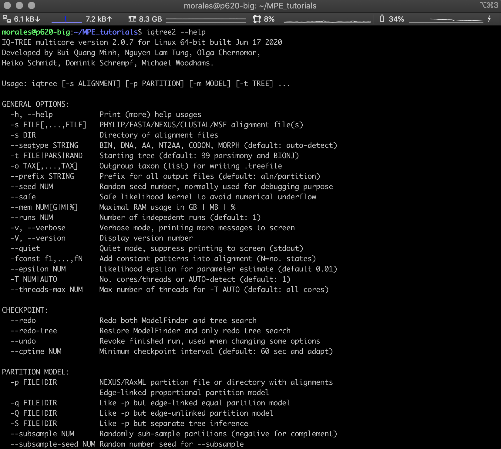
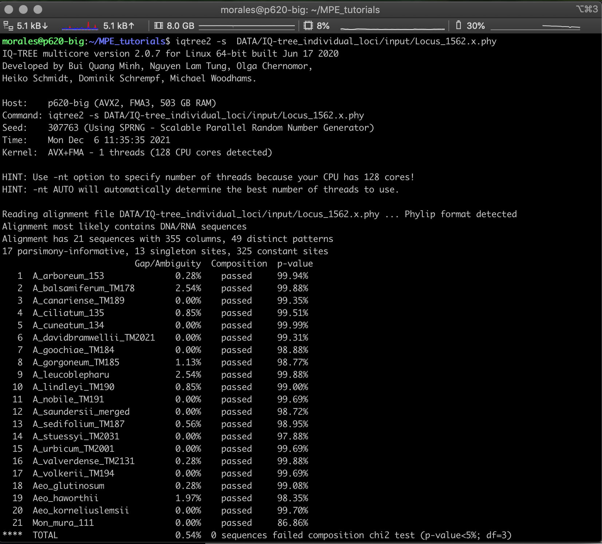
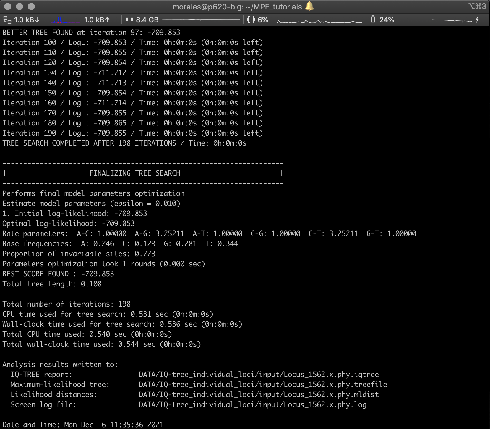

# MPE_gene_tree_estimation_tutorial

This repository contains the instructions and data for the ***Tree building and time divergence estimation*** section of the Molecular Phylogenetics and Evolution of Plants course.

## Preparation

### * Requirements (software)

* **IQ-TREE:** IQ-TREE v.2.0.7. Newer versions might be buggy, specially with ultrafast bootstrap annotation. You can find this version of IQ-TREE for Mac OS X, Linux, or Windows can be found on [https://github.com/Cibiv/IQ-TREE/releases](https://github.com/Cibiv/IQ-TREE/releases?page=1).

* **FigTree:** [FigTree](http://tree.bio.ed.ac.uk/software/figtree/) v1.4.4 will be used for tree visualization. Executables for Mac OS X, Linux, and Windows can be found on [https://github.com/rambaut/figtree/releases](https://github.com/rambaut/figtree/releases).

* **ASTRAL** [ASTRAL](https://github.com/smirarab/ASTRAL) v.5.7.1. This program is written in Java and it should be compatible with any OS. It can be found on [https://github.com/smirarab/ASTRAL](https://github.com/smirarab/ASTRAL)

* **BEAST2:** The BEAST2 package v.2.6.6. includes BEAUti, BEAST2, TreeAnnotator, and other tools (e.g., Densitree). The package can be found on the BEAST2 website [https://www.beast2.org](https://www.beast2.org). As all these programs are also written in Java and they all are compatible with any OS. Download the version that comes *with java*.

* **Tracer:** Tracer is also written in Java. The program can be found on [https://github.com/beast-dev/tracer/releases](https://github.com/beast-dev/tracer/releases).

### * Requirements (data)

* All data (e.g, DNA alignments), input files (e.g., XML for BEAST) and output files will be located in the **DATA** folder of this repository.

* **IQ-tree_individual_loci** This folder contains individual loci alignment files (*.phy) from ***ipyrad*** and output files of individual ML gene tree estimation with IQ-TREE.

* **IQ-tree_concatenated** This folder contains the concatenated alignment (*.fa) from all individual loci in folder ***IQ-tree_individual_loci*** and the output files from tree estimation with IQ-TREE.

* **ASTRAL** This folder contains the input file (e.g. all individual gene trees from ***IQ-tree_individual_loci*** in single file) and the output ASTRAL.

## Maximum-Likelihood Phylogenetic Inference

* Tutorial on phylogenetic inference with maximum likelihood with IQ-TREE

Maximum-likelihood phylogenetic inference aims to find the parameters of an evolutionary model that maximize the likelihood of observing the dataset at hand. The model parameters include the tree topology and its branch lengths but also all parameter of the substitution model (e.g., GTR) assumed in the inference. 

* To see the many options available in IQ-TREE you can type the following in the command line:

		iqtree2 --help

		
		
* IQ-TREE cand be started as easily as just providing the alignment name. We can try this with one of the individual alignments. IQ-TREE will run a default analyses (i.e. Model selection followed of ML inference using one CPU)

		iqtree2 -s  DATA/IQ-tree_individual_loci/input/Locus_1562.x.phy
		

		

* Scroll to the end of the IQ-TREE output. There, you'll find parameter estimates for the selected substitution model, the maximum-likelihood value (given as logarithm after "BEST SCORE FOUND"), information on the run time, and the names of output files. Write down the maximum-likelihood value.

* According to the IQ-TREE screen output, the best-scoring maximum-likelihood tree was written to file `Locus_1562.x.phy.treefile`:

* All output file names were automatically chosen based on the name of the input file. This be changed this using the `--prefix` option.

## Reading and visualizing tree files

Here we will explore how phylogenetic trees are encoded in Newick format, the format most commonly used in phylogenetic sofware, and we will visualize the maximum-likelihood phylogeny generated with IQ-TREE with the program [FigTree](http://tree.bio.ed.ac.uk/software/figtree/). For more detail about the newick format see [here](http://evolution.genetics.washington.edu/phylip/newicktree.html).

* Open the file [`Locus_1562.x.phy.treefile`](res/Locus_1562.x.phy.treefile) in a text editor, or on the command line using, for example, the `less` command:

		less DATA/IQ-tree_individual_loci/input/Locus_1562.x.phy.treefile
		
	You'll see a long string containing the taxon IDs, each of which is followed by a colon and a number, and together with these, the taxon IDs are embedded in parentheses.
		
		(A_arboreum_153:0.0000010000,(((((((A_balsamiferum_TM178:0.0000010000,A_leucoblepharu:0.0000010000):0.0030523931,(A_gorgoneum_TM185:0.0000010000,A_stuessyi_TM2031:0.0000010000):0.0028665085):0.0028569672,A_cuneatum_134:0.0057941060):0.0000010000,A_canariense_TM189:0.0028868572):0.0028790905,((((A_goochiae_TM184:0.0000010000,A_lindleyi_TM190:0.0000010000):0.0086830962,A_saundersii_merged:0.0029994261):0.0030109370,Mon_mura_111:0.0315882241):0.0030478381,A_sedifolium_TM187:0.0029232996):0.0151856647):0.0000010000,(((A_ciliatum_135:0.0000010000,Aeo_haworthii:0.0000010000):0.0000010000,(((A_nobile_TM191:0.0000000000,A_volkerii_TM194:0.0000000000):0.0000010000,A_urbicum_TM2001:0.0000010000):0.0000010000,A_valverdense_TM2131:0.0000010000):0.0000010000):0.0029245985,A_davidbramwellii_TM2021:0.0028736162):0.0029110197):0.0000010000,Aeo_glutinosum:0.0028595971):0.0086818059,Aeo_korneliuslemsii:0.0000010000);