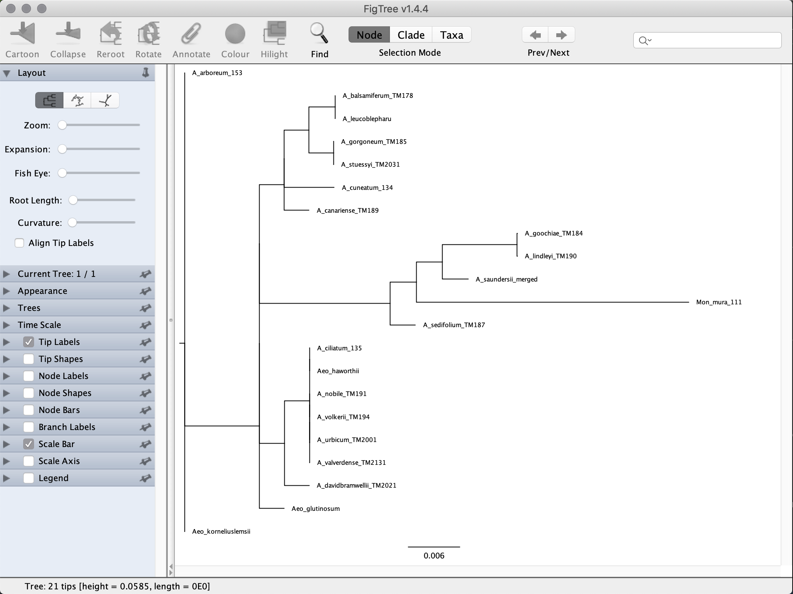
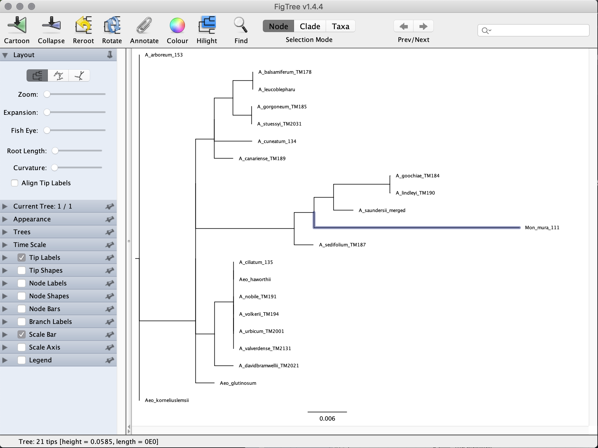
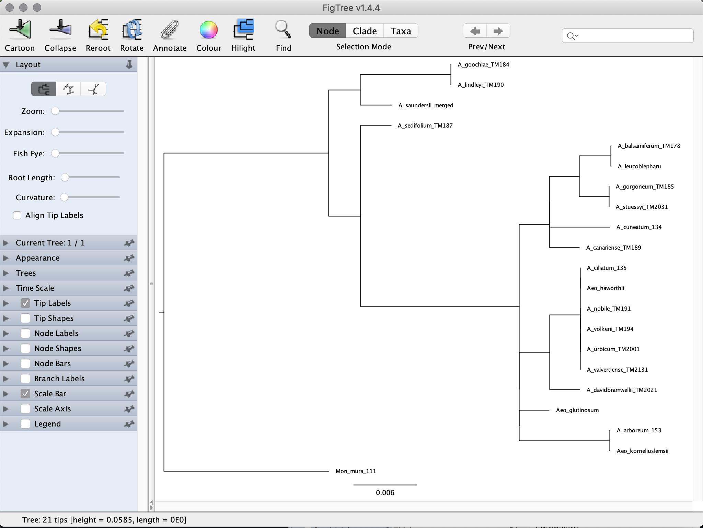
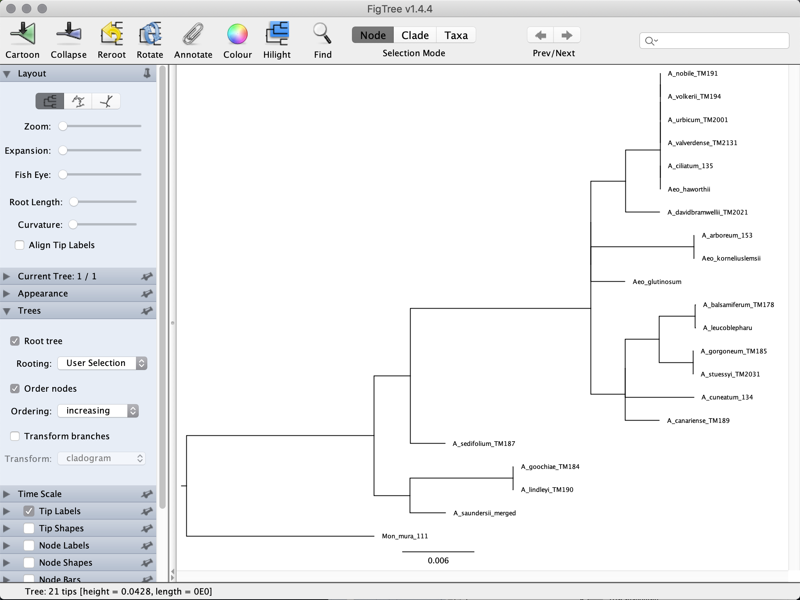
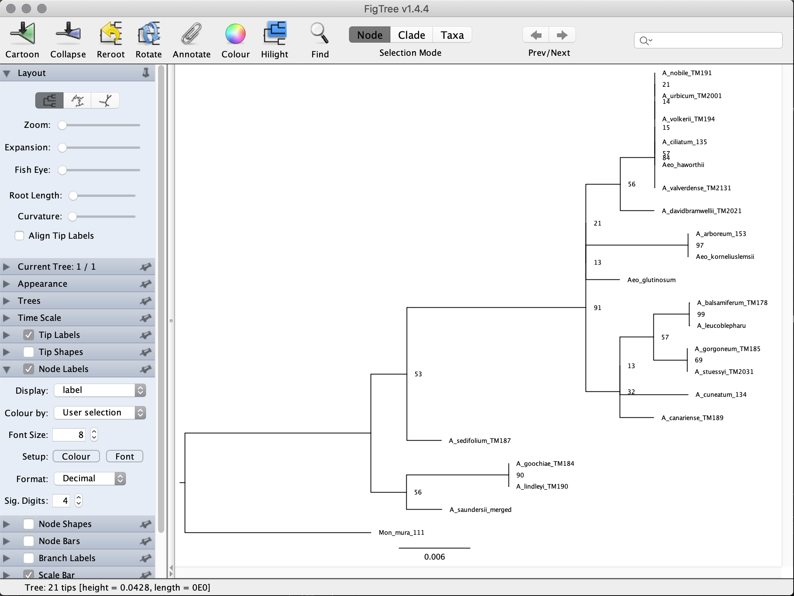

# MPE_gene_tree_estimation_tutorial

This repository contains the instructions and data for the ***Tree building and time divergence estimation*** section of the Molecular Phylogenetics and Evolution of Plants course.

## Preparation

### * Requirements (software)

* **IQ-TREE:** IQ-TREE v.2.0.7. Newer versions might be buggy, specially with ultrafast bootstrap annotation. You can find this version of IQ-TREE for Mac OS X, Linux, or Windows can be found on [https://github.com/Cibiv/IQ-TREE/releases](https://github.com/Cibiv/IQ-TREE/releases?page=1).

* **FigTree:** [FigTree](http://tree.bio.ed.ac.uk/software/figtree/) v1.4.4 will be used for tree visualization. Executables for Mac OS X, Linux, and Windows can be found on [https://github.com/rambaut/figtree/releases](https://github.com/rambaut/figtree/releases).

* **ASTRAL** [ASTRAL](https://github.com/smirarab/ASTRAL) v.5.7.1. This program is written in Java and it should be compatible with any OS. It can be found on [https://github.com/smirarab/ASTRAL](https://github.com/smirarab/ASTRAL)

* **BEAST2:** The BEAST2 package v.2.6.6. includes BEAUti, BEAST2, TreeAnnotator, and other tools (e.g., Densitree). The package can be found on the BEAST2 website [https://www.beast2.org](https://www.beast2.org). As all these programs are also written in Java and they all are compatible with any OS. Download the version that comes *with java*.

* **Tracer:** Tracer is also written in Java. The program can be found on [https://github.com/beast-dev/tracer/releases](https://github.com/beast-dev/tracer/releases).

### * Requirements (data)

* All data (e.g, DNA alignments), input files (e.g., XML for BEAST) and output files will be located in the **DATA** folder of this repository.

* **IQ-tree_individual_loci** This folder contains individual loci alignment files (*.phy) from ***ipyrad*** and output files of individual ML gene tree estimation with IQ-TREE.

* **IQ-tree_concatenated** This folder contains the concatenated alignment (*.fa) from all individual loci in folder ***IQ-tree_individual_loci*** and the output files from tree estimation with IQ-TREE.

* **ASTRAL** This folder contains the input file (e.g. all individual gene trees from ***IQ-tree_individual_loci*** in single file) and the output ASTRAL.

### Before you start

* You will need to clone this repository to get all the data on the local computer.

		git clone https://github.com/dfmoralesb/MPE_tutorials.git

## Maximum-Likelihood Phylogenetic Inference

* Tutorial on phylogenetic inference with maximum likelihood with IQ-TREE

	Maximum-likelihood phylogenetic inference aims to find the parameters of an evolutionary model that maximize the likelihood of observing the dataset at hand. The model parameters include the tree topology and its branch lengths but also all parameter of the substitution model (e.g., GTR) assumed in the inference. 

* To see the many options available in IQ-TREE you can type the following in the command line:

		iqtree2 --help

* You can scroll up and down to check all the available options. 

		
		
* IQ-TREE cand be started as easily as just providing the alignment name. We can try this with one of the individual alignments. IQ-TREE will run a default analyses (i.e. Model selection followed of ML inference using one CPU)

		iqtree2 -s DATA/IQ-tree_individual_loci/input/Locus_1562.x.phy 
		
	As you'll see, just providing the alignment name is sufficient to run a simple IQ-TREE analyses.

		

* Scroll to the end of the IQ-TREE output. There, you'll find parameter estimates for the selected substitution model, the maximum-likelihood value (given as logarithm after "BEST SCORE FOUND"), information on the run time, and the names of output files. Write down the maximum-likelihood value.

* According to the IQ-TREE screen output, the best-scoring maximum-likelihood tree was written to file `Locus_1562.x.phy.treefile`:

* All output file names were automatically chosen based on the name of the input file. This be changed this using the `--prefix` option.

## Reading and visualizing tree files

Here we will explore how phylogenetic trees are encoded in Newick format, the format most commonly used in phylogenetic sofware, and we will visualize the maximum-likelihood phylogeny generated with IQ-TREE with the program [FigTree](http://tree.bio.ed.ac.uk/software/figtree/). For more detail about the newick format see [here](http://evolution.genetics.washington.edu/phylip/newicktree.html).

* Open the file [`Locus_1562.x.phy.treefile`](res/Locus_1562.x.phy.treefile) in a text editor, or on the command line using, for example, the `less` command:

		less DATA/IQ-tree_individual_loci/input/Locus_1562.x.phy.treefile
		
	You'll see a long string containing the taxon IDs, each of which is followed by a colon and a number, and together with these, the taxon IDs are embedded in parentheses.
		
		(A_arboreum_153:0.0000010000,(((((((A_balsamiferum_TM178:0.0000010000,A_leucoblepharu:0.0000010000):0.0030523931,(A_gorgoneum_TM185:0.0000010000,A_stuessyi_TM2031:0.0000010000):0.0028665085):0.0028569672,A_cuneatum_134:0.0057941060):0.0000010000,A_canariense_TM189:0.0028868572):0.0028790905,((((A_goochiae_TM184:0.0000010000,A_lindleyi_TM190:0.0000010000):0.0086830962,A_saundersii_merged:0.0029994261):0.0030109370,Mon_mura_111:0.0315882241):0.0030478381,A_sedifolium_TM187:0.0029232996):0.0151856647):0.0000010000,(((A_ciliatum_135:0.0000010000,Aeo_haworthii:0.0000010000):0.0000010000,(((A_nobile_TM191:0.0000000000,A_volkerii_TM194:0.0000000000):0.0000010000,A_urbicum_TM2001:0.0000010000):0.0000010000,A_valverdense_TM2131:0.0000010000):0.0000010000):0.0029245985,A_davidbramwellii_TM2021:0.0028736162):0.0029110197):0.0000010000,Aeo_glutinosum:0.0028595971):0.0086818059,Aeo_korneliuslemsii:0.0000010000);
		
* Open FigTree, copy the above short part of the tree string, and paste it into the new FigTree window. You'll see a phylogeny as shown in the screenshot below.

* To correct the rooting of the phylogeny, we can specify an outgroup. In case we are going to use "Mon_mura_111" as root. Click on the branch leading to "Mon_mura_111", as shown in the next screenshot.

* Then, with that branch being selected, click on the "Reroot" icon with the yellow arrow in the menu bar. The phylogeny should then look as shown in the next screenshot.

* Finally, we could sort the taxa according to node order. To do so, click "Increasing node order" in FigTree's "Tree" menu. This should move "Mon_mura_111" to the bottom of the plot

## Assessing node support with bootstrapping

To identify which nodes in the phylogeny are more or less trustworthy, we will now perform a bootstrap analysis.

* To see again the available options in IQ-TREE type:

		iqtree2 --help

* Scroll towards the top of the help text, there you should find two sections titled "ULTRAFAST BOOTSTRAP/JACKKNIFE" and "NON-PARAMETRIC BOOTSTRAP/JACKKNIFE". In this occasion we are going to use the `-b` option to perform the 'standard' non-parametric bootstrap Felsenstein ([1986](https://doi.org/10.1111/j.1558-5646.1985.tb00420.x)). 

		 iqtree2 -s DATA/IQ-tree_individual_loci/input/Locus_1562.x.phy -b 200 --prefix DATA/IQ-tree_individual_loci/input/Locus_1562.x.bs
	
		
* This command will run the Replicates for bootstrap + ML tree + consensus tree. Note that we are using the `--prefix` option to rename the output files. Otherwise the file names would be the same as in the previous run and IQ-TREE will produced an error and will ask to rewrite those files. The prefix not only provides the name of the files but also the directory path for the location of the output files.

* Open file [`Locus_1562.x.bs.treefile`](Locus_1562.x.bs.treefile) in FigTree. You can use the less option as before and copy and paste the tree string on FigTree.

		less DATA/IQ-tree_individual_loci/input/Locus_1562.x.bs.treefile

* Once again root the tree with "Mon_mura_111" and sort the taxa with "Increasing node order". 

* To see node-support values based on bootstrapping, set a tick in the checkbox for "Node Labels", and select "label" from the "Display" drop-down menu, as shown in the below screenshot. 

* To estimate a coalescent-based species tree with ASTRAL, we need to infer the indvidual ML gene trees for each of the 2420 alignment in the folder `DATA/IQ-tree_individual_loc/input`. 

	You do not need to do this as all the output files are already located in `DATA/IQ-tree_individual_loc/output`. But you could do it with a bash loop like
	
	
		for i in $(ls *.phy)
		do
		iqtree2 -s $i -b 200
		done

###
* The analysis should a bit longer than the previous one. One way to speed things up is running IQ-TREE using multiple CPUs with the `-T` options. In this case I will use `-T 120`. If not sure about the number of CPUs available you can use `-T AUTO`

		iqtree2 -s DATA/IQ-tree_individual_loci/input/Locus_1562.x.phy -b 200 --prefix Locus_1562.x.bs -T 120
###
