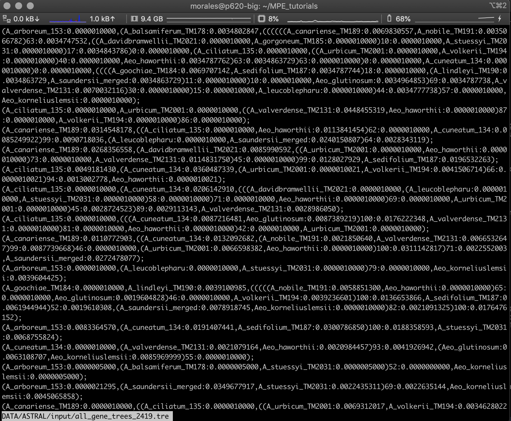

## Table of contents

* [Coalescent-based species tree inference with ASTRAL](#astral)
* [Running ASTRAL](#running)
* [Assessing node support with bootstrapping](#boot)
* [Inferring a concatenated ML tree](#concat)

## Coalescent-based species tree inference with ASTRAL

ASTRAL is a java program for estimating a species tree given a set of unrooted gene trees. ASTRAL is statistically consistent under multi-species coalescent model (and thus is useful for handling ILS).

* To see the many options available in ATRAL you can type the following in the command line:

		java -jar astral.5.7.8.jar

	The path where the *.jar file will depend of the local computer you are using. For example in my case is:

		java -jar ~/Apps/ASTRAL/Astral/astral.5.7.7.jar
		

## Running ASTRAL

* To run ASTRAL you need a single file with all the individual gene trees (one per line) in Newick format. In this case we need to put all 2419 gene trees (*.treefile files) from `DATA/IQ-tree_individual_loc/output`. To do this you can use the `cat` command like this:

		For i in $(ls DATA/IQ-tree_individual_loci/output/*.treefile)
		do
		cat $i > DATA/ASTRAL/input/all_gene_trees_2419.tre
		done
		
* This file was already provided in the `DATA/IQ-tree_individual_loc/output` directory.

* You can open the `all_gene_trees_2419.tre` file with the `less` command.

		less DATA/ASTRAL/input/all_gene_trees_2419.tre
		
	The file should like below. In each tree end with the `;` character. 

	
	

