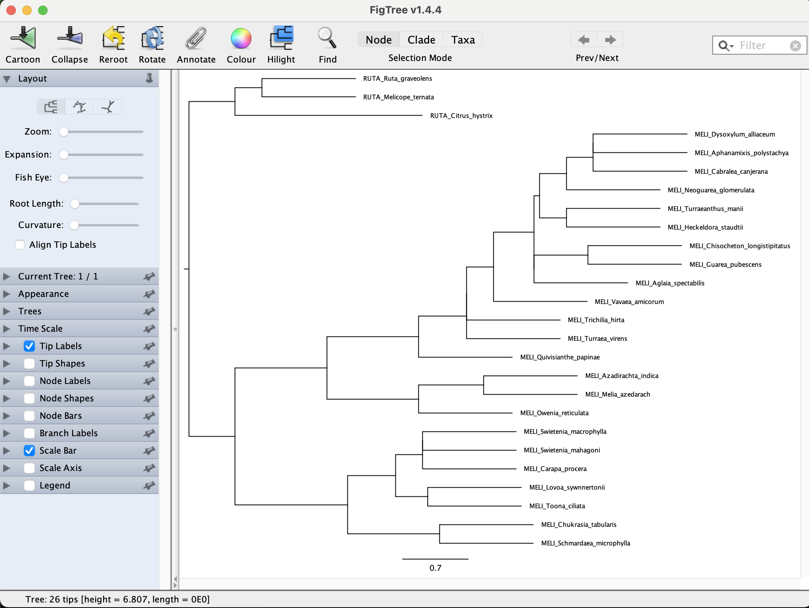

## Table of contents

* [ML inference of individual loci](#ML)
* [Coalescent-based species tree inference with ASTRAL](#astral)
* [Running ASTRAL](#running)
* [The ASTRAL Log information](#log)
* [Branch length and support](#support)
* [Reading and visualizing tree files](#figtree)

#### How to login to the workstation

	ssh -p 22110 USERNAME@10.153.134.10

### Every time you see `$USERNAME` in the example command, you need to replace it with your own [USERNAME](https://github.com/dfmoralesb/MPE_tutorials/blob/main/README.md) 

* To avoid having to change the `$USERNAME` for every command, you can set a variable to provide the name of it. ***Do this every time you connect to the workstation***

	For example, for me, Diego, my user name is `mpemaster`
	
		USERNAME=mpemaster

* To estimate a coalescent-based species tree with ASTRAL, we need to first infer the individual ML gene trees for each locus in the directory `/data_tmp/$USERNAME/data/06_species_tree/00_individual_loci`

		conda activate captus

		cd /data_tmp/$USERNAME/data/06_species_tree/00_individual_loci	
	
		for i in *.clipkit; do iqtree -s $i; done
		
	It should take a couple of minutes to infer all four trees. 

## Coalescent-based species tree inference with ASTRAL

ASTRAL program for estimating a species tree given a set of unrooted gene trees. ASTRAL is statistically consistent under the multi-species coalescent model (and thus is useful for handling ILS).

* To see the many options available in ASTRAL, you can type the following in the command line:

		/data_tmp/$USERNAME/apps/ASTER-Linux_old/bin/astral -h

		

## Running ASTRAL

* To run ASTRAL, you need a single file with all the individual gene trees (one per line) in Newick format. In this case, we need to put all four gene trees (*.treefile files) from `/data_tmp/$USERNAME/data/06_species_tree/00_individual_loci`. To do this, you can use the `cat` command like this:

	First, let's make a new directory where we will place the new astral input file.
	
		mkdir /data_tmp/$USERNAME/data/06_species_tree/01_astral
		
		cd /data_tmp/$USERNAME/data/06_species_tree/01_astral
		
		for i in /data_tmp/$USERNAME/data/06_species_tree/00_individual_loci/*.treefile; do cat $i >> meliaceae_4_gene_trees.tre; done
		
	You can verify that the file has the four trees by counting its lines.
	
		wc -l  meliaceae_4_gene_trees.tre
		
	The output should be 4
	
		4 meliaceae_4_gene_trees.tre
		
	You can also open the file with the command `cat`
	
		cat meliaceae_4_gene_trees
		
	The file should look like the lines below. Each tree ends with the `;` character.
	
		(RUTA_Citrus_hystrix:0.0835656868,((MELI_Azadirachta_indica:0.0374672542,MELI_Owenia_reticulata:0.0157468780):0.0285962983,(((MELI_Cabralea_canjerana:0.0000021269,MELI_Aglaia_spectabilis:0.0272804312):0.0089648001,MELI_Chisocheton_longistipitatus:0.0601047198):0.0109703880,(MELI_Vavaea_amicorum:0.0403882230,MELI_Quivisianthe_papinae:0.0602748637):0.0000010000):0.0096388111):0.0033915003,(((MELI_Schmardaea_microphylla:0.0430283366,MELI_Swietenia_macrophylla:0.0422843150):0.0004802036,MELI_Toona_ciliata:0.0321956757):0.0040772837,MELI_Lovoa_sywnnertonii:0.0145910722):0.0148901425);
		(RUTA_Citrus_hystrix:0.1584565410,(RUTA_Melicope_ternata:0.2651898507,RUTA_Ruta_graveolens:0.4093906277):0.0260760901,(((((MELI_Aglaia_spectabilis:0.0770012553,MELI_Dysoxylum_alliaceum:0.0375195596):0.0153077694,MELI_Cabralea_canjerana:0.0291996907):0.0018050631,(((MELI_Aphanamixis_polystachya:0.0565045029,MELI_Chisocheton_longistipitatus:0.0359065778):0.0016804008,(MELI_Heckeldora_staudtii:0.0497883139,MELI_Guarea_pubescens:0.0575936343):0.0024776985):0.0010051573,(MELI_Trichilia_hirta:0.0658230756,MELI_Turraea_virens:0.1285390727):0.0155774898):0.0050946256):0.0395465578,MELI_Quivisianthe_papinae:0.1520641633):0.0483593977,(((MELI_Toona_ciliata:0.0381258583,MELI_Lovoa_sywnnertonii:0.0694636002):0.0033692486,(MELI_Swietenia_macrophylla:0.0312362305,MELI_Swietenia_mahagoni:0.1029668314):0.0407022592):0.0411581809,(MELI_Chukrasia_tabularis:0.1058948108,MELI_Schmardaea_microphylla:0.0882770653):0.0264788493):0.0445313748):0.1598834165);
		(RUTA_Citrus_hystrix:0.1170893669,(RUTA_Melicope_ternata:0.1509423566,((((((((MELI_Aglaia_spectabilis:0.0370323722,(MELI_Chisocheton_longistipitatus:0.0394875844,MELI_Guarea_pubescens:0.0356918692):0.0031230903):0.0062550246,((((MELI_Aphanamixis_polystachya:0.0329304261,MELI_Dysoxylum_alliaceum:0.0453392397):0.0052110937,MELI_Cabralea_canjerana:0.0175765665):0.0087152408,MELI_Neoguarea_glomerulata:0.0566919275):0.0046520481,(MELI_Heckeldora_staudtii:0.0323079774,MELI_Turraeanthus_manii:0.0440946216):0.0025738638):0.0007205566):0.0054016545,MELI_Vavaea_amicorum:0.0620276487):0.0034390734,MELI_Trichilia_hirta:0.0730725398):0.0020173475,MELI_Turraea_virens:0.0924493491):0.0254640046,MELI_Quivisianthe_papinae:0.0676975019):0.0253035138,((MELI_Azadirachta_indica:0.0000012558,MELI_Melia_azedarach:0.0008874175):0.0187487396,MELI_Owenia_reticulata:0.0402184327):0.0567886878):0.0036383746,(((MELI_Carapa_procera:0.0371149101,MELI_Swietenia_macrophylla:0.0319646607):0.0216835821,(MELI_Lovoa_sywnnertonii:0.0738789630,MELI_Toona_ciliata:0.0551312118):0.0017075301):0.0064581470,(MELI_Chukrasia_tabularis:0.0473990839,MELI_Schmardaea_microphylla:0.0925950472):0.0139506692):0.0216806823):0.0752666895):0.0092826957,RUTA_Ruta_graveolens:0.2107983780);
		(RUTA_Citrus_hystrix:0.1308324361,(RUTA_Melicope_ternata:0.1118876324,RUTA_Ruta_graveolens:0.1883977338):0.0244604862,((((((MELI_Aglaia_spectabilis:0.0776746853,MELI_Vavaea_amicorum:0.0772094663):0.0030251704,MELI_Turraea_virens:0.0994840611):0.0018440015,(MELI_Cabralea_canjerana:0.0273301945,MELI_Quivisianthe_papinae:0.1166569720):0.0297243216):0.0048959298,(MELI_Aphanamixis_polystachya:0.0493491358,MELI_Chisocheton_longistipitatus:0.0471398111):0.0137173751):0.0505568677,((MELI_Azadirachta_indica:0.0000016544,MELI_Melia_azedarach:0.0000016544):0.0456343543,MELI_Owenia_reticulata:0.0369215517):0.0716872341):0.0136091249,((MELI_Toona_ciliata:0.0597434991,MELI_Swietenia_macrophylla:0.0813375148):0.0078745146,(MELI_Chukrasia_tabularis:0.0483582819,MELI_Schmardaea_microphylla:0.1489065341):0.0723267769):0.0215131794):0.0701172642);
		
		
	
* To run ASTRAL, you just need to provide the gene trees file with the `-i` option and the output file name with the `-o` file. 

		/data_tmp/$USERNAME/apps/ASTER-Linux_old/bin/astral -i meliaceae_4_gene_trees.tre -o meliaceae_4_gene_trees.ASTRAL.tre

## The ASTRAL Log information

* It is recommended to save the [`stderr`](https://en.wikipedia.org/wiki/Standard_streams) to a log file to check that everything ran OK. You can do this using the `tee` command to print the `stderr` to the screen and also redirect it to a file.

		/data_tmp/$USERNAME/apps/ASTER-Linux_old/bin/astral -i meliaceae_4_gene_trees.tre -o meliaceae_4_gene_trees.ASTRAL.tre 2> >(tee -a ASTRAL.log >&2)	
		
		
Here is some of the important information captured in the log:

		less ASTRAL.log

You should see (along with other information)

		Accurate Species TRee ALgorithm (wASTRAL-unweighted)
		Version: v1.15.2.4
		#Genetrees: 4
		#Species: 26
		#Rounds: 4
		#Samples: 4
		#Threads: 1
		#NNI moves:1/67

## Branch length and support

* ASTRAL measures branch length in coalescent units and has a fast way of measuring support without bootstrapping. The support measure is called *Local Posterior Probability (LPP)*. Detail about the algorithms to compute branch lengths and support and the meaning of support outputted is further described in [this paper](http://mbe.oxfordjournals.org/content/early/2016/05/12/molbev.msw079.short?rss=1).

* Some points have to be emphasized:

	ASTRAL only estimates branch lengths for internal branches.
	Branch lengths are in coalescent units and are a direct measure of the amount of discordance in the gene trees. As such, they are prone to underestimation because of statistical noise in gene tree estimation. 
	!!!The newest versions of ASTRAL (>=1.19) can estimate branch length in substitution per site!!! 

## [Reading and visualizing tree files](#figtree)

* Open the file `meliaceae_4_gene_trees.ASTRAL.tre` in a text editor or on the command line using, for example, the `cat` command:

		cat meliaceae_4_gene_trees.ASTRAL.tre
		
	ASTRAL also uses the Newick format, so you will see a long string containing the taxon IDs, each of which is followed by a colon and a number, and together with these, the taxon IDs are embedded in parentheses.
		
		(((((((((((((MELI_Dysoxylum_alliaceum,MELI_Aphanamixis_polystachya)0.425841:0.000000,MELI_Cabralea_canjerana)0.666667:0.287682,MELI_Neoguarea_glomerulata)0.666667:0.287682,(MELI_Turraeanthus_manii,MELI_Heckeldora_staudtii)0.666667:0.287682)0.500325:0.057158,((MELI_Chisocheton_longistipitatus,MELI_Guarea_pubescens)0.825438:0.575364,MELI_Aglaia_spectabilis)0.249163:0.000000)0.782360:0.433190,MELI_Vavaea_amicorum)0.666667:0.287682,MELI_Trichilia_hirta)0.416667:0.000000,MELI_Turraea_virens)0.824039:0.510826,MELI_Quivisianthe_papinae)0.952381:0.980829,((MELI_Azadirachta_indica,MELI_Melia_azedarach)0.866667:0.693147,MELI_Owenia_reticulata)0.952381:0.980829)0.952381:0.980829,((((MELI_Swietenia_macrophylla,MELI_Swietenia_mahagoni)0.333333:0.000000,MELI_Carapa_procera)0.666667:0.287682,(MELI_Lovoa_sywnnertonii,MELI_Toona_ciliata)0.713915:0.344840)0.840580:0.510826,(MELI_Chukrasia_tabularis,MELI_Schmardaea_microphylla)0.952381:0.980829)0.983740:1.203973)0.952381:0.980829,(RUTA_Ruta_graveolens,RUTA_Melicope_ternata)0.666667:0.287682),RUTA_Citrus_hystrix);		

* Open FigTree, copy the above tree string, and paste it into the new FigTree window. You'll see a phylogeny, as shown in the screenshot below.

* To correct the rooting of the phylogeny, we can specify an outgroup. In this case, we are going to use Rutaceae as the root. Click on the branch leading to all Rutaceae samples, as shown in the next screenshot.

* With that branch selected, click on the "Reroot" icon with the yellow arrow in the menu bar. The phylogeny should then look as shown in the next screenshot.

* We could sort the taxa according to node order. To do so, click "Increasing node order" in FigTree's "Tree" menu. This should move all Rutaceae to the bottom of the plot

* To see node-support values based on LPP, set a tick in the checkbox for "Node Labels", and select "label" from the "Display" drop-down menu, as shown in the screenshot below. 

* These are just quick examples. Now, we need to deal with all the phylogenomic data in the next tutorial.

	

