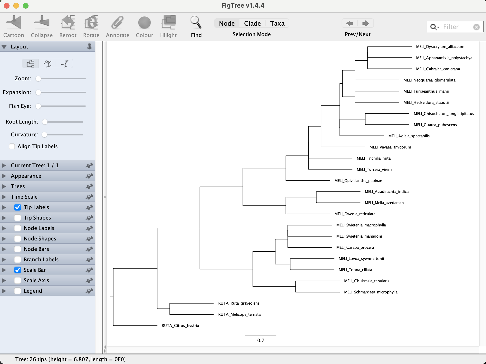
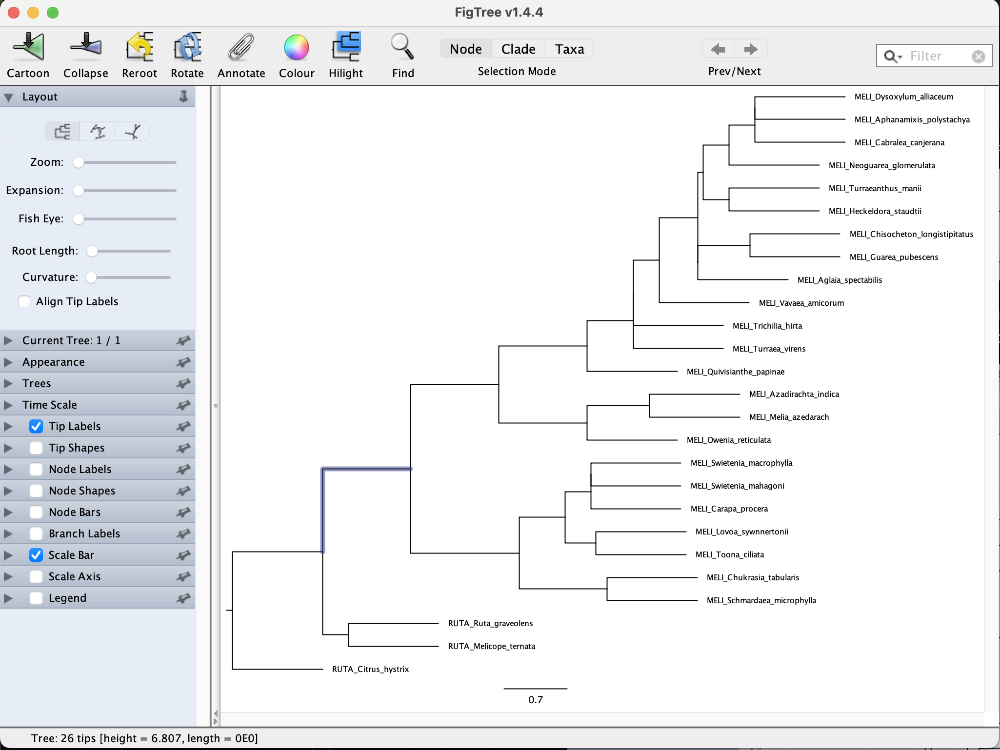
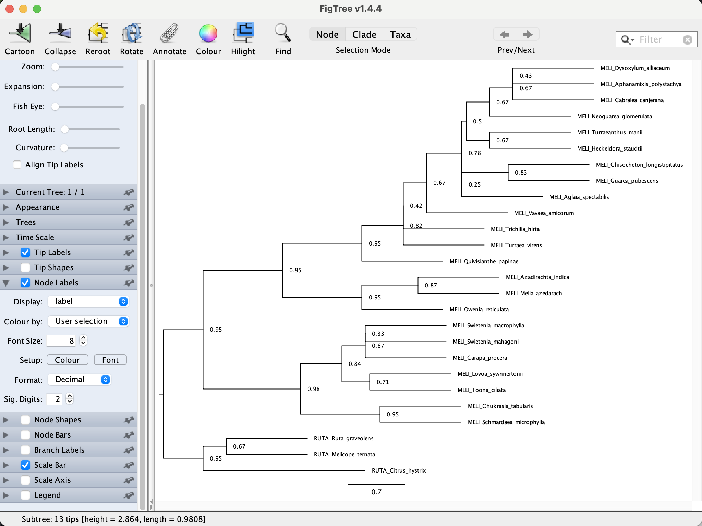

## Table of contents

* [ML inference of individual loci](#ML)
* [Coalescent-based species tree inference with ASTRAL](#astral)
* [Running ASTRAL](#running)
* [The ASTRAL Log information](#log)
* [Branch length and support](#support)
* [Reading and visualizing tree files](#figtree)

* To estimate a coalescent-based species tree with ASTRAL, we need to first infer the indvidual ML gene trees for each of locu in the directory `/data_tmp/mpemaster/data/06_species_tree/00_individual_loci`

		conda activate captus

		cd /data_tmp/mpemaster/data/06_species_tree/00_individual_loci	
	
		for i in *.clipkit; do iqtree -s $i; done
		
	It should a couple of minutes to infer all four trees 

## Coalescent-based species tree inference with ASTRAL

ASTRAL program for estimating a species tree given a set of unrooted gene trees. ASTRAL is statistically consistent under multi-species coalescent model (and thus is useful for handling ILS).

* To see the many options available in ASTRAL you can type the following in the command line:

		/data_tmp/mpemaster/apps/ASTER-Linux_old/bin/astral -h

		

## Running ASTRAL

* To run ASTRAL you need a single file with all the individual gene trees (one per line) in Newick format. In this case we need to put all 4 gene trees (*.treefile files) from `/data_tmp/mpemaster/data/06_species_tree/00_individual_loci`. To do this you can use the `cat` command like this:

	First let make a new directory where we will place the new astral input file
	
		mkdir /data_tmp/mpemaster/data/06_species_tree/01_astral
		
		cd /data_tmp/mpemaster/data/06_species_tree/01_astral
		
		for i in /data_tmp/mpemaster/data/06_species_tree/00_individual_loci/*.treefile; do cat $i >> meliaceae_4_gene_trees.tre; done
		
	You can verify that the file has the four trees by counting its lines
	
		wc -l meliaceae_4_gene_trees
		
	The output should be 4
	
		4 meliaceae_4_gene_trees.tre
		
	You can also open the file with the command `cat`
	
		cat meliaceae_4_gene_trees
		
	The file should look like below. In each tree ends with the `;` character.
	
		(RUTA_Citrus_hystrix:0.0835656868,((MELI_Azadirachta_indica:0.0374672542,MELI_Owenia_reticulata:0.0157468780):0.0285962983,(((MELI_Cabralea_canjerana:0.0000021269,MELI_Aglaia_spectabilis:0.0272804312):0.0089648001,MELI_Chisocheton_longistipitatus:0.0601047198):0.0109703880,(MELI_Vavaea_amicorum:0.0403882230,MELI_Quivisianthe_papinae:0.0602748637):0.0000010000):0.0096388111):0.0033915003,(((MELI_Schmardaea_microphylla:0.0430283366,MELI_Swietenia_macrophylla:0.0422843150):0.0004802036,MELI_Toona_ciliata:0.0321956757):0.0040772837,MELI_Lovoa_sywnnertonii:0.0145910722):0.0148901425);
		(RUTA_Citrus_hystrix:0.1584565410,(RUTA_Melicope_ternata:0.2651898507,RUTA_Ruta_graveolens:0.4093906277):0.0260760901,(((((MELI_Aglaia_spectabilis:0.0770012553,MELI_Dysoxylum_alliaceum:0.0375195596):0.0153077694,MELI_Cabralea_canjerana:0.0291996907):0.0018050631,(((MELI_Aphanamixis_polystachya:0.0565045029,MELI_Chisocheton_longistipitatus:0.0359065778):0.0016804008,(MELI_Heckeldora_staudtii:0.0497883139,MELI_Guarea_pubescens:0.0575936343):0.0024776985):0.0010051573,(MELI_Trichilia_hirta:0.0658230756,MELI_Turraea_virens:0.1285390727):0.0155774898):0.0050946256):0.0395465578,MELI_Quivisianthe_papinae:0.1520641633):0.0483593977,(((MELI_Toona_ciliata:0.0381258583,MELI_Lovoa_sywnnertonii:0.0694636002):0.0033692486,(MELI_Swietenia_macrophylla:0.0312362305,MELI_Swietenia_mahagoni:0.1029668314):0.0407022592):0.0411581809,(MELI_Chukrasia_tabularis:0.1058948108,MELI_Schmardaea_microphylla:0.0882770653):0.0264788493):0.0445313748):0.1598834165);
		(RUTA_Citrus_hystrix:0.1170893669,(RUTA_Melicope_ternata:0.1509423566,((((((((MELI_Aglaia_spectabilis:0.0370323722,(MELI_Chisocheton_longistipitatus:0.0394875844,MELI_Guarea_pubescens:0.0356918692):0.0031230903):0.0062550246,((((MELI_Aphanamixis_polystachya:0.0329304261,MELI_Dysoxylum_alliaceum:0.0453392397):0.0052110937,MELI_Cabralea_canjerana:0.0175765665):0.0087152408,MELI_Neoguarea_glomerulata:0.0566919275):0.0046520481,(MELI_Heckeldora_staudtii:0.0323079774,MELI_Turraeanthus_manii:0.0440946216):0.0025738638):0.0007205566):0.0054016545,MELI_Vavaea_amicorum:0.0620276487):0.0034390734,MELI_Trichilia_hirta:0.0730725398):0.0020173475,MELI_Turraea_virens:0.0924493491):0.0254640046,MELI_Quivisianthe_papinae:0.0676975019):0.0253035138,((MELI_Azadirachta_indica:0.0000012558,MELI_Melia_azedarach:0.0008874175):0.0187487396,MELI_Owenia_reticulata:0.0402184327):0.0567886878):0.0036383746,(((MELI_Carapa_procera:0.0371149101,MELI_Swietenia_macrophylla:0.0319646607):0.0216835821,(MELI_Lovoa_sywnnertonii:0.0738789630,MELI_Toona_ciliata:0.0551312118):0.0017075301):0.0064581470,(MELI_Chukrasia_tabularis:0.0473990839,MELI_Schmardaea_microphylla:0.0925950472):0.0139506692):0.0216806823):0.0752666895):0.0092826957,RUTA_Ruta_graveolens:0.2107983780);
		(RUTA_Citrus_hystrix:0.1308324361,(RUTA_Melicope_ternata:0.1118876324,RUTA_Ruta_graveolens:0.1883977338):0.0244604862,((((((MELI_Aglaia_spectabilis:0.0776746853,MELI_Vavaea_amicorum:0.0772094663):0.0030251704,MELI_Turraea_virens:0.0994840611):0.0018440015,(MELI_Cabralea_canjerana:0.0273301945,MELI_Quivisianthe_papinae:0.1166569720):0.0297243216):0.0048959298,(MELI_Aphanamixis_polystachya:0.0493491358,MELI_Chisocheton_longistipitatus:0.0471398111):0.0137173751):0.0505568677,((MELI_Azadirachta_indica:0.0000016544,MELI_Melia_azedarach:0.0000016544):0.0456343543,MELI_Owenia_reticulata:0.0369215517):0.0716872341):0.0136091249,((MELI_Toona_ciliata:0.0597434991,MELI_Swietenia_macrophylla:0.0813375148):0.0078745146,(MELI_Chukrasia_tabularis:0.0483582819,MELI_Schmardaea_microphylla:0.1489065341):0.0723267769):0.0215131794):0.0701172642);
		
		
	
* To run ASTRAL just need to provide the gene trees file with the `-i` option and the output file name with the `-o` file. 

		java -jar /home/morales/Apps/ASTRAL/astral.5.7.8.jar -i DATA/ASTRAL/input/all_gene_trees_2419.tre -o DATA/ASTRAL/output/ASTRAL_all_gene_trees_2419.tre

## The ASTRAL Log information

* It is recommend to save the ([`stderr`](https://en.wikipedia.org/wiki/Standard_streams), to a log file to check that everything ran OK. You can do this using the `tee` command to print the `stderr` to screen and also redirecting it to a file.

		java -jar /home/morales/Apps/ASTRAL/astral.5.7.8.jar -i DATA/ASTRAL/input/all_gene_trees_2419.tre -o DATA/ASTRAL/output/ASTRAL_all_gene_trees_2419.tre 2> >(tee -a DATA/ASTRAL/output/ASTRAL.log >&2)	
		
		
Here are some of the important information captured in the log:

* Number of taxa, and their names.
* Number of genes trees. 
* Version of ASTRAL used in your analysis.
* The normalized quartet score (proportion of input gene tree quartet trees satisfied by the species tree). This is a number between zero and one; the higher this number, the *less* discordant your gene trees are. 
* The final optimization score is similar to the above number, but is not normalized (the number of gene tree quartets satisfied by the species tree).
* Running time.
* More advanced info: the size of the search space in terms of the number of clusters and number of tripartitions (i.e., elements weighted).  

## Branch length and support

* ASTRAL measures branch length in coalescent units and also has a fast way of measuring support without a need for bootstrapping. The support measure is called *Local Posterior Probability (LPP)*. Detail about the algorithms to compute branch lengths and support and the meaning of support outputted is further described in [this paper](http://mbe.oxfordjournals.org/content/early/2016/05/12/molbev.msw079.short?rss=1).

Some points have to be emphasized:

* ASTRAL only estimates branch lengths for internal branches.
* Branch lengths are in coalescent units and are a direct measure of the amount of discordance in the gene trees. As such, they are prone to underestimation because of statistical noise in gene tree estimation.   

## [Reading and visualizing tree files](#figtree)

* Open the file `ASTRAL_all_gene_trees_2419.tre` in a text editor, or on the command line using, for example, the `less` command:

		less DATA/ASTRAL/output/ASTRAL_all_gene_trees_2419.tre
		
	ASTRAL also uses the Newick format, so you will see a long string containing the taxon IDs, each of which is followed by a colon and a number, and together with these, the taxon IDs are embedded in parentheses.
		
		(A_arboreum_153,(Aeo_korneliuslemsii,(A_balsamiferum_TM178,((A_gorgoneum_TM185,(A_stuessyi_TM2031,A_leucoblepharu)0.67:0.04140183420105119)1:0.2515003565922507,(((A_sedifolium_TM187,A_saundersii_merged)1:0.16294045620301306,(Mon_mura_111,(A_goochiae_TM184,A_lindleyi_TM190)1:1.4677740706543891)0.63:0.07067275703338496)1:0.5938435957339435,((Aeo_glutinosum,(A_canariense_TM189,A_cuneatum_134)0.95:0.09178105157440875)1:0.2798843477636087,(A_nobile_TM191,(A_valverdense_TM2131,((Aeo_haworthii,(A_urbicum_TM2001,(A_ciliatum_135,A_volkerii_TM194)1:0.09768764985752253)1:0.14800582754101912)1:0.13832617842998599,A_davidbramwellii_TM2021)1:0.16272862004839833)0.15:0.07428611918466975)1:0.2655371803121577)0:0.04748169986273744)1:0.3747948750498705)1:0.626671805099933)1:0.1858824808939674):0.0);
		
* Open FigTree, copy the above tree string, and paste it into the new FigTree window. You'll see a phylogeny as shown in the screenshot below.

* To correct the rooting of the phylogeny, we can specify an outgroup. In case we are going to use "Mon_mura_111" as root. Click on the branch leading to "Mon_mura_111", as shown in the next screenshot.

* Then, with that branch being selected, click on the "Reroot" icon with the yellow arrow in the menu bar. The phylogeny should then look as shown in the next screenshot.

* We could sort the taxa according to node order. To do so, click "Increasing node order" in FigTree's "Tree" menu. This should move "Mon_mura_111" to the bottom of the plot

* To see node-support values based on LPP, set a tick in the checkbox for "Node Labels", and select "label" from the "Display" drop-down menu, as shown in the below screenshot. 

	

