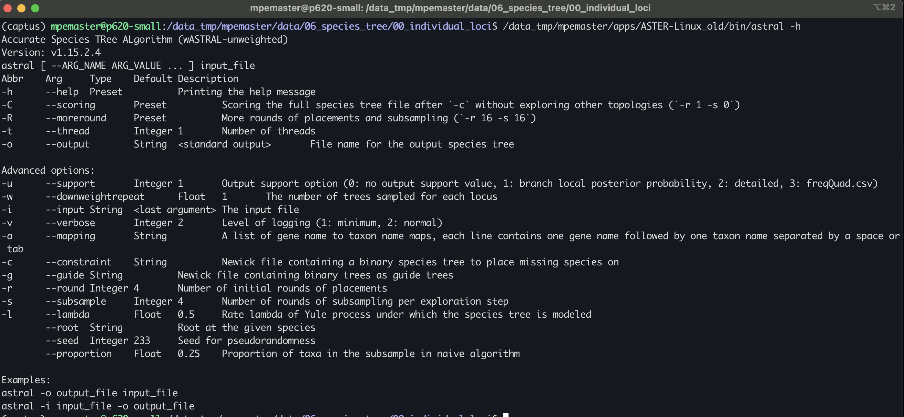
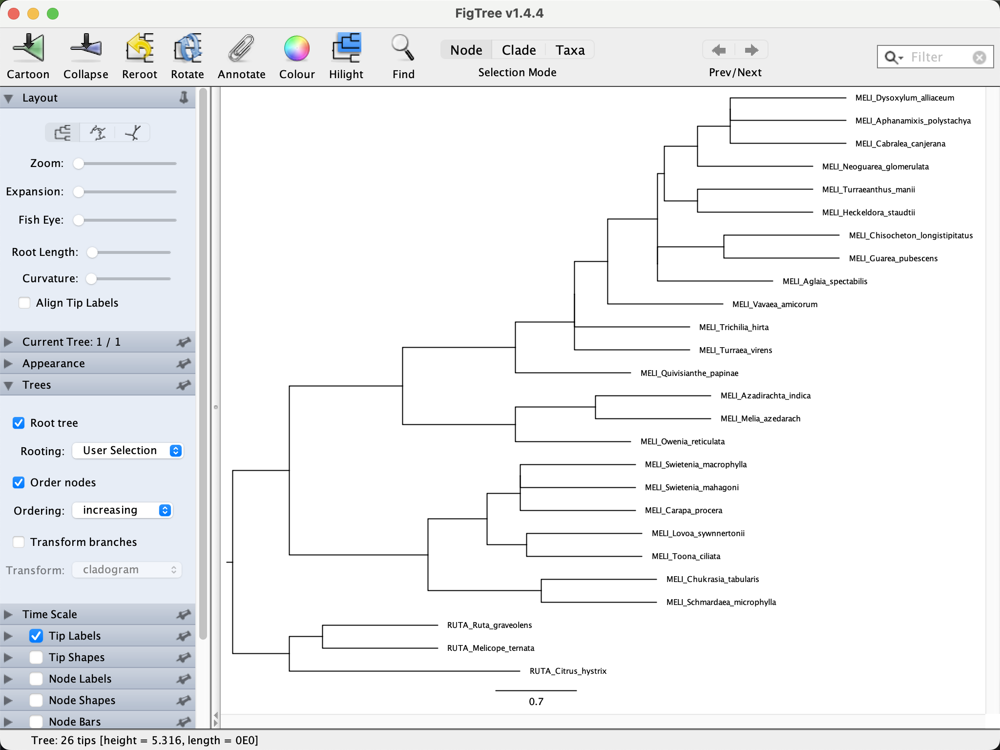

## Table of contents

* [ML inference of individual loci](#ML)
* [Coalescent-based species tree inference with ASTRAL](#astral)
* [Running ASTRAL](#running)
* [The ASTRAL Log information](#log)
* [Branch length and support](#support)
* [Reading and visualizing tree files](#figtree)

* To estimate a coalescent-based species tree with ASTRAL, we need to infer the indvidual ML gene trees for each of locu in the directory `/data_tmp/mpemaster/data/06_species_tree/00_individual_loci`

		cd /data_tmp/mpemaster/data/06_species_tree/00_individual_loci	
	
		for i in *.clipkit; do iqtree -s $i; done
		
	It should a couple of minutes to infer all four trees 

## Coalescent-based species tree inference with ASTRAL

ASTRAL is a java program for estimating a species tree given a set of unrooted gene trees. ASTRAL is statistically consistent under multi-species coalescent model (and thus is useful for handling ILS).

* To see the many options available in ASTRAL you can type the following in the command line:

		java -jar astral.5.7.8.jar

	The path where the *.jar file will depend of the local computer you are using. In this case you will need to type:

		java -jar /home/morales/Apps/ASTRAL/astral.5.7.8.jar
		

## Running ASTRAL

* To run ASTRAL you need a single file with all the individual gene trees (one per line) in Newick format. In this case we need to put all 2419 gene trees (*.treefile files) from `DATA/IQ-tree_individual_loc/output`. To do this you can use the `cat` command like this:

		For i in $(ls DATA/IQ-tree_individual_loci/output/*.treefile)
		do
		cat $i > DATA/ASTRAL/input/all_gene_trees_2419.tre
		done
		
* This file was already provided in the `DATA/IQ-tree_individual_loc/output` directory.

* You can open the `all_gene_trees_2419.tre` file with the `less` command.

		less DATA/ASTRAL/input/all_gene_trees_2419.tre
		
	The file should look like below. In each tree ends with the `;` character. 

	
* To run ASTRAL just need to provide the gene trees file with the `-i` option and the output file name with the `-o` file. 

		java -jar /home/morales/Apps/ASTRAL/astral.5.7.8.jar -i DATA/ASTRAL/input/all_gene_trees_2419.tre -o DATA/ASTRAL/output/ASTRAL_all_gene_trees_2419.tre

## The ASTRAL Log information

* It is recommend to save the ([`stderr`](https://en.wikipedia.org/wiki/Standard_streams), to a log file to check that everything ran OK. You can do this using the `tee` command to print the `stderr` to screen and also redirecting it to a file.

		java -jar /home/morales/Apps/ASTRAL/astral.5.7.8.jar -i DATA/ASTRAL/input/all_gene_trees_2419.tre -o DATA/ASTRAL/output/ASTRAL_all_gene_trees_2419.tre 2> >(tee -a DATA/ASTRAL/output/ASTRAL.log >&2)	
		
		
Here are some of the important information captured in the log:

* Number of taxa, and their names.
* Number of genes trees. 
* Version of ASTRAL used in your analysis.
* The normalized quartet score (proportion of input gene tree quartet trees satisfied by the species tree). This is a number between zero and one; the higher this number, the *less* discordant your gene trees are. 
* The final optimization score is similar to the above number, but is not normalized (the number of gene tree quartets satisfied by the species tree).
* Running time.
* More advanced info: the size of the search space in terms of the number of clusters and number of tripartitions (i.e., elements weighted).  

## Branch length and support

* ASTRAL measures branch length in coalescent units and also has a fast way of measuring support without a need for bootstrapping. The support measure is called *Local Posterior Probability (LPP)*. Detail about the algorithms to compute branch lengths and support and the meaning of support outputted is further described in [this paper](http://mbe.oxfordjournals.org/content/early/2016/05/12/molbev.msw079.short?rss=1).

Some points have to be emphasized:

* ASTRAL only estimates branch lengths for internal branches.
* Branch lengths are in coalescent units and are a direct measure of the amount of discordance in the gene trees. As such, they are prone to underestimation because of statistical noise in gene tree estimation.   

## [Reading and visualizing tree files](#figtree)

* Open the file `ASTRAL_all_gene_trees_2419.tre` in a text editor, or on the command line using, for example, the `less` command:

		less DATA/ASTRAL/output/ASTRAL_all_gene_trees_2419.tre
		
	ASTRAL also uses the Newick format, so you will see a long string containing the taxon IDs, each of which is followed by a colon and a number, and together with these, the taxon IDs are embedded in parentheses.
		
		(A_arboreum_153,(Aeo_korneliuslemsii,(A_balsamiferum_TM178,((A_gorgoneum_TM185,(A_stuessyi_TM2031,A_leucoblepharu)0.67:0.04140183420105119)1:0.2515003565922507,(((A_sedifolium_TM187,A_saundersii_merged)1:0.16294045620301306,(Mon_mura_111,(A_goochiae_TM184,A_lindleyi_TM190)1:1.4677740706543891)0.63:0.07067275703338496)1:0.5938435957339435,((Aeo_glutinosum,(A_canariense_TM189,A_cuneatum_134)0.95:0.09178105157440875)1:0.2798843477636087,(A_nobile_TM191,(A_valverdense_TM2131,((Aeo_haworthii,(A_urbicum_TM2001,(A_ciliatum_135,A_volkerii_TM194)1:0.09768764985752253)1:0.14800582754101912)1:0.13832617842998599,A_davidbramwellii_TM2021)1:0.16272862004839833)0.15:0.07428611918466975)1:0.2655371803121577)0:0.04748169986273744)1:0.3747948750498705)1:0.626671805099933)1:0.1858824808939674):0.0);
		
* Open FigTree, copy the above tree string, and paste it into the new FigTree window. You'll see a phylogeny as shown in the screenshot below.

* To correct the rooting of the phylogeny, we can specify an outgroup. In case we are going to use "Mon_mura_111" as root. Click on the branch leading to "Mon_mura_111", as shown in the next screenshot.

* Then, with that branch being selected, click on the "Reroot" icon with the yellow arrow in the menu bar. The phylogeny should then look as shown in the next screenshot.

* We could sort the taxa according to node order. To do so, click "Increasing node order" in FigTree's "Tree" menu. This should move "Mon_mura_111" to the bottom of the plot

* To see node-support values based on LPP, set a tick in the checkbox for "Node Labels", and select "label" from the "Display" drop-down menu, as shown in the below screenshot. 

	

