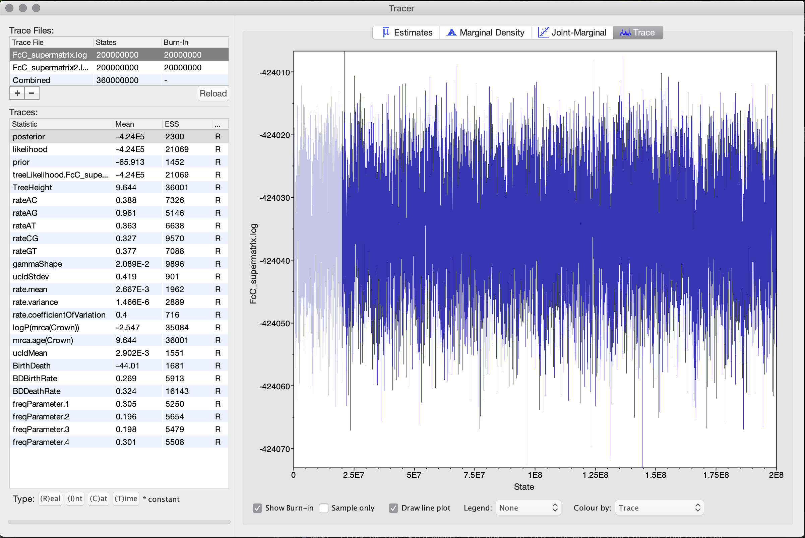
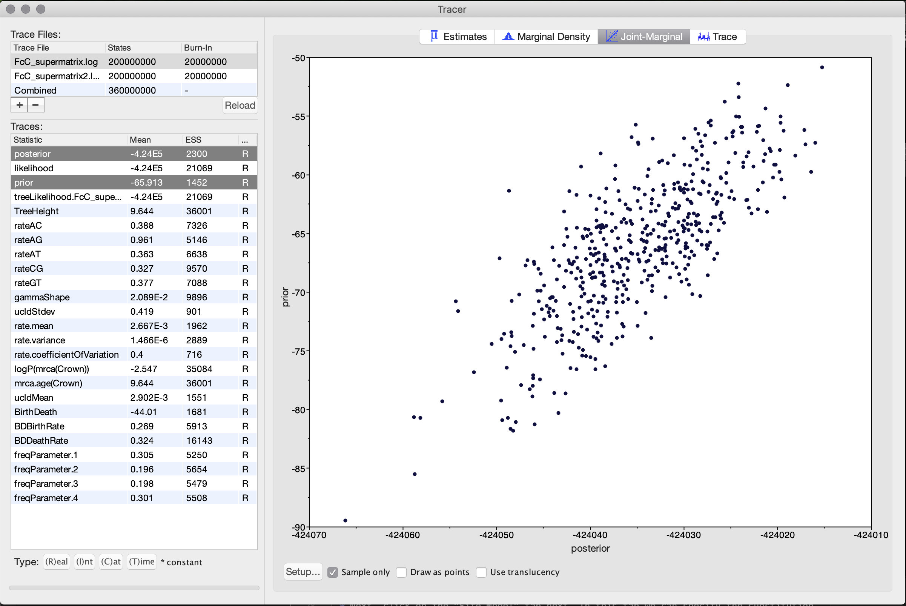
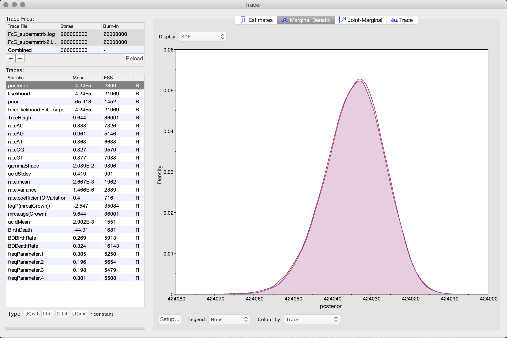
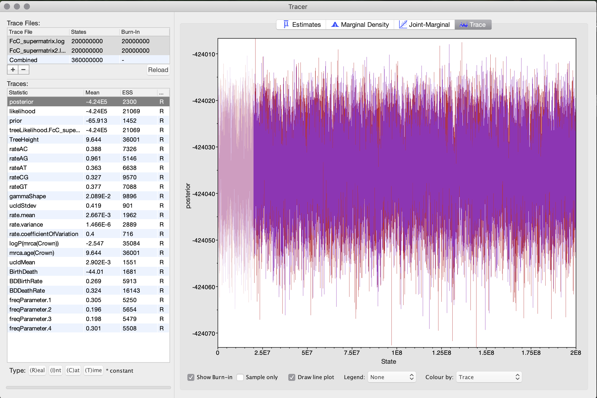
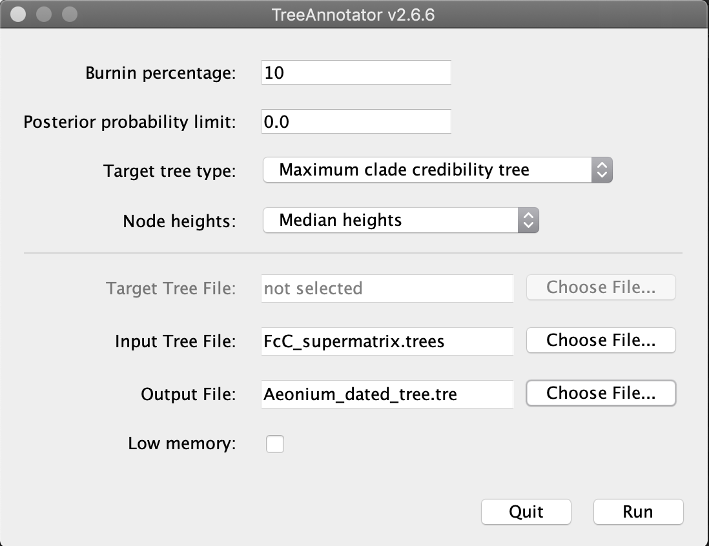

# Phylogenetic Divergence-Time Estimation

## Table of contents

* [Divergence time estimation with BEAST2](#beast)
* [Setting the XML file with BEAUti](#beaut)
* [Running BEAST](#beast)
* [Assessing MCMC stationarity with Tracer](#tracer)
* [Summarizing the posterior tree distribution](#treeannotator)

## Divergence time estimation with BEAST2

* Here we will infer ttime-calibrated phylogenies can be inferred with programs of the Bayesian software package [BEAST2](https://www.beast2.org) ([Bouckaert et al. 2014](http://journals.plos.org/ploscompbiol/article?id=10.1371/journal.pcbi.1003537)). The settings for the analysis will be done with the program BEAUti, the Bayesian analysis itself is going to be conducted with BEAST2, and a summary tree will be generated with the program TreeAnnotator. These three programs are part of the BEAST2 package. Finally, we explote the use of the program [Tracer](http://beast.community/tracer) ([Rambaut et al. 2018](https://academic.oup.com/sysbio/advance-article/doi/10.1093/sysbio/syy032/4989127)) to assess stationarity and convergence of the Bayesian analysis.

* If you are not familiar  with Bayesian analyses and Markov-Chain Monte Carlo methods in general, you can explore the many resources made available by BEAST2 authors. You can also explore the [BEAST2 website](https://www.beast2.org) and quickly browse through the [glossary of terms related to BEAST2 analyses](https://www.beast2.org/glossary/index.html). The BEAST2 website also provides a [wide range of tutorials and manuals](https://www.beast2.org/tutorials/index.html). Also, you can find comprehensive tutorials on the [Taming the BEAST](https://taming-the-beast.org) website, where you will also find information about the excellent [Taming-the-BEAST workshops](https://taming-the-beast.org/workshops/). 

* We will be using the same data set we used for the concatenated phylogeny with IQ-TREE. All input and out files will be located in the directory `DATA/BEAST`

## Setting the XML file with BEAUti

* The XML [Extensible Markup Language](https://www.w3.org/standards/xml/core) files contains the alignement, priors, and other setting to run the analyses on BEAST.

* Open the program BEAUti and import the alignment `FcC_supermatrix.nex`. To do so, click "Import Alignment" from the "File" menu and select the the file `DATA/BEAST/input/FcC_supermatrix.nex` The BEAUti window should then look as shown in the screenshot below. There you can see the number of taxa, alignment length, and any data partition. In this case we are not using any partion. 

* Next, click on the "Site Model" tab next. In this tab we can specify the substitution model. Now, click on the drop-down menu that currently says "JC69". Instead of the Jukes-Cantor model, use the GTR model. Also specify "4" in the field for the "Gamma Category Count" two lines above, to use a gamma model of rate variation with four rate categories. Finally, set a tick in the checkbox to the right of "Substitution Rate" so that this rate will be estimated.The BEAUti window should then look as shown in the screenshot below.

* Next, click on the "Clock Model" tab. From the drop-down menu that currently says "Strict Clock", choose "Relaxed Clock Log Normal" instead. This is the most commonly used relaxed clock model in which substitution rates of individual branches are drawn from a lognormal distribution. Also set a tick in the checkbox on the right side of the window. If this checkbox appears gray and you are unable to set it, you'll need to click on "Automatic set clock rate" in BEAUti's "Mode" menu. The mean and standard deviation of this lognormal distribution will be estimated as part of the MCMC search. The model is described in [Drummond et al. (2006)](http://journals.plos.org/plosbiology/article?id=10.1371/journal.pbio.0040088), there it is named the "UCLN" model. Ignore the additional options ("Number of Discrete Rates" etc.) that appear after selecting the model.

* Click on the "Priors" tab. From the drop-down menu at the very top of the window, select "Birth Death Model" instead of "Yule Model". By doing so we add a parameter to the model for the extinction rate. If we would choose the alternative Yule model ([Yule 1925](http://rstb.royalsocietypublishing.org/content/213/402-410/21?intcmp=trendmd)), we would assume that no extinction ever occurred. As this seems rather unrealistic, the birth-death model ([Gernhard 2008](https://www.sciencedirect.com/science/article/pii/S0022519308001811)) is in most cases the more appropriate choice. Nevertheless, results are in practice rather little affected by the choice of this prior.

* Most of the other items shown in the "Prior" panel correspond to prior densities placed on the parameters of the substitution models for the four partitions. You may keep the default priors for each of these parameters. However, to allow time calibration of the phylogeny, a prior density still needs to be specified for at least one divergence time, otherwise BEAST2 would have very little information (only from the priors on speciation and mutation rates) to estimate branch lengths according to an absolute time scale. But before prior densities can be placed on the divergence of certain clades, these clades must first be defined. This can be done at the bottom of the "Priors" tab. Thus, scroll down to the end of the list until you see the "+ Add Prior" button, as shown in the below screenshot.

* Click on the "+ Add Prior" button to open the "Taxon set editor" pop-up window. Select all taxa from the list on the left of that window, and click the double-right-arrow symbol (`>>`) to shift them to the right side of the window. This way, the ingroup, including all taxa, so that the divergence between the root and *Aeonium* can later be used for time calibration. Enter "Crown" for name at the top of the pop-up window as the "Taxon set label", as shown in the below screenshot. Then, click "OK".

* To time calibrate this divergence, click on the drop-down menu to the right of the button for "Crown.prior" that currently says "[none]". Then, click on the black triangle to the left of the button for "Crown.prior". Specify "11.62" as the value for "M" (that is the mean of the prior density) and "0.25" as the value for "S" (that is the standard deviation). Importantly, set a tick in the checkbox for "Mean in Real Space"; otherwise, the specified value for the mean will be considered to be in log space (meaning that its exponent would be used). In the plot to the right, you should then see that the density is centered around 11. The BEAUti window should then look as shown in the below screenshot.

* Continue to the "MCMC" tab, where you can specify the run length. This analysis will require a few hundred million iterations before the MCMC chain reaches full stationarity, which would take several days of run time. We run this in advance and output fill will be located at `DATA/BEAST/input/`. Type "200000000" in the field to the right of "Chain Length".

	Also change the names of the output files: Click on the triangle to the left of "tracelog" and specify "FcC_supermatrix.log" as the name of the log file, probably it will be filed automatically.In the next field for "Log Every", set the number to "5000" (instead of the default 1,000) so that only every 5,000th MCMC state is written to the log file. Click on the black triangle to the left of "screenlog" and use "5000" for Log Every". Then click on the black triangle to the left of "treelog". Specify leave 'File Name' as it is and again use "5000" as the number in the field for "Log Every". 
	
	

	

		
* When the window looks as in the above screenshots, click on "Save" in BEAUti's "File" menu, and name the resulting file in XML format `Aeonium_BEAST2.xml`.	

## Running BEAST

* Open the program BEAST2 and select the file [`Aeonium_BEAST2.xml` as input file, as shown in the screenshot below. When you click the "Run" button, BEAST2 will start the analysis. Running BEAST2 in this way is not convient as it usually takes several day, but it is helpful to see if the XML was correctly set up and BEAST starts without problem.

* Usually BEAST2 is run in a workstation or cluster using the command line like

		~/Apps/beast/bin/beast -threads 30 DATA/BEAST/input/Aeonium_BEAST2.xml
		
	If BEAST2 started to run correctly you will see something like this:

	
	

## Assessing MCMC stationarity with Tracer

*	In Bayesian analyses with the software BEAST2, it is rarely possible to tell *a priori* how many MCMC iterations will be required before the analysis can be considered complete. Instead, whether or not an analysis is complete is usually decided based on the inspection of the log file once BEAST2 has performed the specified number of MCMC iterations. There are various ways in which MCMC output can be used to assess whether or not an analysis can be considered complete, and in the context of phylogenetic analyses with BEAST2, the most commonly used diagnostic tools are those implemented in [Tracer](http://beast.community/tracer) ([Rambaut et al. 2018](https://academic.oup.com/sysbio/advance-article/doi/10.1093/sysbio/syy032/4989127)) or the R package [coda](https://cran.r-project.org/web/packages/coda/index.html) ([Plummer et al. 2006](https://cran.r-project.org/doc/Rnews/Rnews_2006-1.pdf#page=7)). Here, we are going to investigate run completeness with Tracer. Ideally, we should have conducted the same BEAST2 analysis multiple times; then, we could assess whether the replicate MCMC chains "converge" to the same posterior distribution, which would be a requirement for a complete MCMC analysis. I performed in advance two independent BEAST runs found in the directory `DATA/BEAST/input/`

In Tracer you can do the following:

1. Calculation of "effective sample sizes" (ESS). Because consecutive MCMC iterations are always highly correlated, the number of effectively independent samples obtained for each parameter is generally much lower than the total number of sampled states. Calculating ESS values for each parameter is a way to assess the number of independent samples that would be equivalent to the much larger number of auto-correlated samples drawn for these parameters. These ESS values are automatically calculated for each parameter by Tracer. As a rule of thumb, the ESS values of all model parameters, or at least of all parameters of interest, should be above 200.
2. Visual investigation of trace plots. The traces of all parameter estimates, or at least of those parameters with low ESS values should be visually inspected to assess MCMC stationarity. A good indicator of stationarity is when the trace plot has similarities to a "fuzzy caterpillar". 

Thus, both the calculation of ESS values as well as the visual inspection of trace plots should indicate stationarity of the MCMC chain; if this is not the case, the run should be resumed. For BEAST2 analyses, resuming a chain is possible with the "-resume" option when using BEAST2 on the command-line, or by selecting option "resume: appends log to existing files" in the drop-down menu at the top of the BEAST2 window when using the GUI version.

* Open files `FcC_supermatrix.log` and  `FcC_supermatrix2.log` in the program Tracer. The Tracer window should then look more or less as shown in the next screenshot

 In the top left part of the Tracer window, you'll see a list of the loaded log files. This part of the window also specifies the number of states found in this file, and the burn-in to be cut from the beginning of the MCMC chain.

	In the bottom left part of the Tracer window, you'll see statistics for the estimate of the posterior probability (just named "posterior"), the likelihood, and the prior probability (just named "prior"), as well as for the parameters estimated during the analysis (except the phylogeny, which also represents a set of parameters). The second column in this part shows the mean estimates for each parameter and their ESS values. 

	In the top right part of the Tracer window, you will see more detailed statistics for the parameter currently selected in the bottom left part of the window. Finally, in the bottom right, you will see a visualization of the samples taken during the MCMC search. By default, these are shown in the form of a histogram as in the above screenshot.

* With the posterior probability still being selected in the list at the bottom left, click on the tab for "Trace" (at the very top right). You will see how the posterior probability changed over the course of the MCMC. This trace plot should ideally have the form of a "fuzzy caterpillar",  as you can see in the next screenshot.

* Now, click on the prior probability in the list at the bottom left of the window. You'll note that the trace looks very similar to that of the posterior, which may not be surprising given that the posterior probability is a (normalized) product of the prior probability and the likelihood. Thus, the auto-correlation in the prior probability seems to drive the auto-correlation in the posterior probability. Another way to visualize this is to select both the posterior and the prior probability at the same time (you may have to shift-click to do so) and then click on the "Joint-Marginal" tab next to the "Trace" tab. You'll see once again that the two measures are strongly correlated as in the next screenshot.

* Now you can select both `FcC_supermatrix.log` and `FcC_supermatrix2.log` and while selection the posterior probability you can click on "Marginal Density" and see how the two runs we perform have the same posterior distribution. 

* You can do the same for the "Trace" and see how both "fuzzy caterpillars" overlap. These means that both runs converge and can be combined to summarizing the posterior tree distribution.

## Summarizing the posterior tree distribution

* To generate a phylogeny summarizing the information from the posterior tree distribution, open the program TreeAnnotator. Specify a burnin percentage of 10, in agreement with the trace plots that we inspected earlier in Tracer, which looked stationary after the first 10% of the chain. Leave the default options for "Posterior probability limit" and "Target tree type" to generate a "Maximum clade credibility tree" (this is the most commonly used type of summary tree for Bayesian analyses; described in [Heled and Bouckaert 2013](https://bmcevolbiol.biomedcentral.com/articles/10.1186/1471-2148-13-221)). However, as "Node heights", choose "Mean heights" rather than the default "Common Ancestor heights". As input file, select `FcC_supermatrix.trees` and specify `Aeonium_dated_tree.tre`  as the output file. When the window looks as shown in the next screenshot, click "Run".

 
* When TreeAnnotator has finished, cou can open the `Aeonium_dated_tree.tre` file with the command `less` or `cat`

		cat DATA/BEAST/output/Aeonium_dated_tree.tre

And it should look like this:

	

		#NEXUS
		
		Begin taxa;
			Dimensions ntax=21;
				Taxlabels
					A_arboreum_153
					A_balsamiferum_TM178
					A_canariense_TM189
					A_ciliatum_135
					A_cuneatum_134
					A_davidbramwellii_TM2021
					A_goochiae_TM184
					A_gorgoneum_TM185
					A_leucoblepharu
					A_lindleyi_TM190
					A_nobile_TM191
					A_saundersii_merged
					A_sedifolium_TM187
					A_stuessyi_TM2031
					A_urbicum_TM2001
					A_valverdense_TM2131
					A_volkerii_TM194
					Aeo_glutinosum
					Aeo_haworthii
					Aeo_korneliuslemsii
					Mon_mura_111
					;
		End;
		Begin trees;
			Translate
				   1 A_arboreum_153,
				   2 A_balsamiferum_TM178,
				   3 A_canariense_TM189,
				   4 A_ciliatum_135,
				   5 A_cuneatum_134,
				   6 A_davidbramwellii_TM2021,
				   7 A_goochiae_TM184,
				   8 A_gorgoneum_TM185,
				   9 A_leucoblepharu,
				  10 A_lindleyi_TM190,
				  11 A_nobile_TM191,
				  12 A_saundersii_merged,
				  13 A_sedifolium_TM187,
				  14 A_stuessyi_TM2031,
				  15 A_urbicum_TM2001,
				  16 A_valverdense_TM2131,
				  17 A_volkerii_TM194,
				  18 Aeo_glutinosum,
				  19 Aeo_haworthii,
				  20 Aeo_korneliuslemsii,
				  21 Mon_mura_111
		;
		tree TREE1 = (((((((1[&height=9.504725368008395E-16,height_95%_HPD={0.0,3.552713678800501E-15},height_median=8.881784197001252E-16,height_range={0.0,7.105427357601002E-15},length=0.4251032396290782,length_95%_HPD={0.12661492898477267,0.804191826978542},length_median=0.38574628787958076,length_range={0.06973812337422824,2.697508980441718},rate=0.00332252346457591,rate_95%_HPD={0.0010559563900808938,0.0063074808587201565},rate_median=0.0030499217756375027,rate_range={4.928323572202121E-4,0.01628008827076142}]:0.42510323962907787,20[&height=9.504725368008395E-16,height_95%_HPD={0.0,3.552713678800501E-15},height_median=8.881784197001252E-16,height_range={0.0,7.105427357601002E-15},length=0.4251032396290782,length_95%_HPD={0.12661492898477267,0.804191826978542},length_median=0.38574628787958076,length_range={0.06973812337422824,2.697508980441718},rate=0.0037176323716539986,rate_95%_HPD={0.0011124063038130062,0.006997294074494323},rate_median=0.003404084114577432,rate_range={5.74584056419058E-4,0.017325922544771322}]:0.42510323962907787)[&height=0.4251032396290788,height_95%_HPD={0.12661492898477267,0.804191826978542},height_median=0.38574628787958254,height_range={0.06973812337422913,2.697508980441725},length=0.2770428637007443,length_95%_HPD={0.06722457898029432,0.572062540497849},length_median=0.24402677624078528,length_range={0.03536693748700159,1.9661532212274029},posterior=1.0,rate=0.0035713227314327425,rate_95%_HPD={8.706140615103867E-4,0.0072367599961771865},rate_median=0.003183427290842406,rate_range={3.63940552771167E-4,0.02071495207467807}]:0.2770428637007398,2[&height=9.503861885197098E-16,height_95%_HPD={0.0,2.6645352591003757E-15},height_median=8.881784197001252E-16,height_range={0.0,7.105427357601002E-15},length=0.7021461033298175,length_95%_HPD={0.24863469723636733,1.3027600040979017},length_median=0.6450909344792883,length_range={0.1374378050713636,4.253808830882477},rate=0.0013587488507392355,rate_95%_HPD={4.409539103512718E-4,0.0025202751762179133},rate_median=0.0012546484901457028,rate_range={2.4059980303210238E-4,0.006714085490812122}]:0.7021461033298176)[&height=0.7021461033298186,height_95%_HPD={0.24863469723636733,1.3027600040979035},height_median=0.6450909344792901,height_range={0.1374378050713636,4.253808830882484},length=1.5238406509909934,length_95%_HPD={0.4579458924736466,2.8686610561506036},length_median=1.3848374510509522,length_range={0.22703815778679814,7.793100730973709},posterior=1.0,rate=0.004514137251643489,rate_95%_HPD={0.0013609163122688703,0.008442793148191862},rate_median=0.004141143308661717,rate_range={6.492635519681966E-4,0.022899934268678458}]:1.523840650991002,(8[&height=9.558508011683468E-16,height_95%_HPD={0.0,3.552713678800501E-15},height_median=8.881784197001252E-16,height_range={0.0,7.105427357601002E-15},length=0.37004948444347047,length_95%_HPD={0.11909068485518048,0.7055506642956537},length_median=0.3358562027161156,length_range={0.05846837067817745,2.1604769140839366},rate=0.0014842130897087264,rate_95%_HPD={4.275692094794096E-4,0.0028384070825734136},rate_median=0.0013520581685287085,rate_range={1.972157932647567E-4,0.008086555903952042}]:0.3700494844434704,(9[&height=9.539017971085621E-16,height_95%_HPD={0.0,3.552713678800501E-15},height_median=8.881784197001252E-16,height_range={0.0,1.0658141036401503E-14},length=0.12500088492955264,length_95%_HPD={0.033762950199272446,0.2477107434775192},length_median=0.11131420047723495,length_range={0.01188822053269778,0.9175602090751607},rate=0.003763277160108653,rate_95%_HPD={0.0010164793627926235,0.007388171463221609},rate_median=0.003390844187792446,rate_range={4.4443874954595164E-4,0.02677282287892562}]:0.12500088492955255,14[&height=9.539017971085621E-16,height_95%_HPD={0.0,3.552713678800501E-15},height_median=8.881784197001252E-16,height_range={0.0,1.0658141036401503E-14},length=0.12500088492955264,length_95%_HPD={0.033762950199272446,0.2477107434775192},length_median=0.11131420047723495,length_range={0.01188822053269778,0.9175602090751607},rate=0.0020629994788462403,rate_95%_HPD={5.265886397591967E-4,0.004104489768342412},rate_median=0.0018479981466655298,rate_range={1.972157932647567E-4,0.016745626671479965}]:0.12500088492955255)[&height=0.1250008849295535,height_95%_HPD={0.033762950199273334,0.24771074347752098},height_median=0.11131420047723672,height_range={0.01188822053269778,0.9175602090751607},length=0.2450485995139162,length_95%_HPD={0.05922123927566858,0.5035116300703057},length_median=0.21610236031261465,length_range={0.021700704639072477,1.6819058671153524},posterior=1.0,rate=0.003296964798189338,rate_95%_HPD={7.989957000001113E-4,0.006700044420662723},rate_median=0.002934566250140497,rate_range={3.768092074701564E-4,0.02141249314030313}]:0.24504859951391786)[&height=0.37004948444347135,height_95%_HPD={0.11909068485518137,0.7055506642956537},height_median=0.3358562027161174,height_range={0.05846837067817745,2.1604769140839366},length=1.8559372698773486,length_95%_HPD={0.654517401133698,3.4737540054907114},length_median=1.701612715547947,length_range={0.32043563182173695,9.12839163460671},posterior=1.0,rate=0.0012687328615208582,rate_95%_HPD={4.050707651522995E-4,0.002359279389142278},rate_median=0.0011671795271149346,rate_range={1.847458114321691E-4,0.006483008727910131}]:1.8559372698773493)[&height=2.2259867543208207,height_95%_HPD={0.7893636917191289,4.032226789198548},height_median=2.0512718310269342,height_range={0.38360454931874255,9.97335210577737},length=2.36299458145344,length_95%_HPD={0.7366914908140569,4.307392441506303},length_median=2.1943858730667305,length_range={0.22835526792395378,10.000607817558663},posterior=1.0,rate=0.0019364042268201383,rate_95%_HPD={6.36009993059356E-4,0.0036056234162895767},rate_median=0.0017628854480857216,rate_range={3.6646797859413453E-4,0.01343492424924888}]:2.362994581453451,(((3[&height=9.461304518068888E-16,height_95%_HPD={0.0,1.7763568394002505E-15},height_median=8.881784197001252E-16,height_range={0.0,7.105427357601002E-15},length=2.416023638196288,length_95%_HPD={0.8706651527022657,4.32135083316224},length_median=2.254330231090517,length_range={0.3816952761673855,11.501291326645639},rate=0.002883740600537985,rate_95%_HPD={0.0010459156649448983,0.005189367318552266},rate_median=0.0026648391985989004,rate_range={5.945228839125111E-4,0.015644783631205295}]:2.416023638196288,5[&height=9.461304518068888E-16,height_95%_HPD={0.0,1.7763568394002505E-15},height_median=8.881784197001252E-16,height_range={0.0,7.105427357601002E-15},length=2.416023638196288,length_95%_HPD={0.8706651527022657,4.32135083316224},length_median=2.254330231090517,length_range={0.3816952761673855,11.501291326645639},rate=0.0025812618743720974,rate_95%_HPD={9.126673573803678E-4,0.004608634447483435},rate_median=0.002388039929468003,rate_range={5.497093549018588E-4,0.01447275187295833}]:2.416023638196288)[&height=2.4160236381962887,height_95%_HPD={0.8706651527022675,4.321350833162242},height_median=2.254330231090517,height_range={0.3816952761673855,11.501291326645642},length=0.6174383840888149,length_95%_HPD={0.1297728660996773,1.3198156681393973},length_median=0.5356016084581805,length_range={0.06456317857142846,4.017331733963655},posterior=1.0,rate=0.002419681725787227,rate_95%_HPD={5.343531424378146E-4,0.0051243209838539245},rate_median=0.0021090810981000455,rate_range={3.274444591146774E-4,0.017689255177675858}]:0.6174383840888256,18[&height=9.428862235301586E-16,height_95%_HPD={0.0,1.7763568394002505E-15},height_median=8.881784197001252E-16,height_range={0.0,7.105427357601002E-15},length=3.0334620222851134,length_95%_HPD={1.1675071166387259,5.33431699448554},length_median=2.841779592860634,length_range={0.6309489712869008,13.197312378501554},rate=0.0027558304262663862,rate_95%_HPD={0.0010415746821480474,0.0048298779400260325},rate_median=0.0025709098454359553,rate_range={5.963245722623821E-4,0.010961186945805843}]:3.0334620222851134)[&height=3.0334620222851143,height_95%_HPD={1.1675071166387259,5.33431699448554},height_median=2.841779592860634,height_range={0.6309489712869016,13.197312378501557},length=0.8461956666354347,length_95%_HPD={0.1905243135281962,1.7612887102094135},length_median=0.7446921935515665,length_range={0.08598312338205538,6.429601392588303},posterior=1.0,rate=0.0023526870413876667,rate_95%_HPD={4.8315870182223837E-4,0.004841510491034001},rate_median=0.0020655249492772068,rate_range={2.2450069192608477E-4,0.013983969871895248}]:0.8461956666353649,((((((4[&height=9.443294733718978E-16,height_95%_HPD={0.0,3.552713678800501E-15},height_median=8.881784197001252E-16,height_range={0.0,7.105427357601002E-15},length=0.6167549682796661,length_95%_HPD={0.1867389738435863,1.1366514226196482},length_median=0.5657128082082501,length_range={0.11712870134085485,2.7271826739067606},rate=0.003153245654623115,rate_95%_HPD={0.001004437312408482,0.0058473753499552975},rate_median=0.00289547590311991,rate_range={5.344192534943299E-4,0.013960970243429568}]:0.6167549682796661,17[&height=9.443294733718978E-16,height_95%_HPD={0.0,3.552713678800501E-15},height_median=8.881784197001252E-16,height_range={0.0,7.105427357601002E-15},length=0.6167549682796661,length_95%_HPD={0.1867389738435863,1.1366514226196482},length_median=0.5657128082082501,length_range={0.11712870134085485,2.7271826739067606},rate=0.0036896849225135273,rate_95%_HPD={0.0012125356491656922,0.006891797750181508},rate_median=0.0033859783020718597,rate_range={6.951087952761285E-4,0.018056187194679545}]:0.6167549682796661)[&height=0.6167549682796671,height_95%_HPD={0.18673897384358717,1.1366514226196482},height_median=0.5657128082082519,height_range={0.11712870134085485,2.7271826739067606},length=0.3311072055579804,length_95%_HPD={0.07856874092077515,0.6764332642107913},length_median=0.29342859262520804,length_range={0.03661205591269834,3.155376030993553},posterior=1.0,rate=0.0031767185576721288,rate_95%_HPD={7.268643038373656E-4,0.006382227407065024},rate_median=0.002815592360404916,rate_range={2.5404588499438317E-4,0.019034868628888906}]:0.33110720555798956,15[&height=9.466855478998655E-16,height_95%_HPD={0.0,3.552713678800501E-15},height_median=8.881784197001252E-16,height_range={0.0,7.105427357601002E-15},length=0.9478621738376557,length_95%_HPD={0.3315407090252833,1.696144493191639},length_median=0.8782746304286295,length_range={0.16415608478120536,5.075483496121999},rate=0.003567956240300542,rate_95%_HPD={0.0012510881591309931,0.0063829405354792505},rate_median=0.003315053780831021,rate_range={5.973389728728563E-4,0.01711059093357253}]:0.9478621738376557)[&height=0.9478621738376567,height_95%_HPD={0.3315407090252833,1.6961444931916407},height_median=0.8782746304286313,height_range={0.16415608478120625,5.075483496122002},length=0.36343063904666023,length_95%_HPD={0.08904067682085337,0.7313315190570506},length_median=0.32274757901125284,length_range={0.04476745248895675,2.3800850877439625},posterior=1.0,rate=0.0035532407319406783,rate_95%_HPD={9.203523921365682E-4,0.0071373514561144675},rate_median=0.003173973220538466,rate_range={4.7143444405864366E-4,0.02159286955771376}]:0.36343063904665973,19[&height=9.472653149303077E-16,height_95%_HPD={0.0,3.552713678800501E-15},height_median=8.881784197001252E-16,height_range={0.0,7.105427357601002E-15},length=1.3112928128843162,length_95%_HPD={0.4791195656882685,2.3282985810962273},length_median=1.2213801006102205,length_range={0.2450104084831497,6.280081144910019},rate=0.0014100393984418631,rate_95%_HPD={4.7889122855372353E-4,0.0025203453057423765},rate_median=0.0013087418489158822,rate_range={2.5404588499438317E-4,0.006983090065786812}]:1.3112928128843155)[&height=1.3112928128843164,height_95%_HPD={0.4791195656882694,2.328298581096229},height_median=1.2213801006102205,height_range={0.2450104084831497,6.280081144910023},length=0.461190951884624,length_95%_HPD={0.10494575765155378,0.9260768991303099},length_median=0.41068230660701754,length_range={0.05503678182157845,2.596038941979881},posterior=1.0,rate=0.003149521610418992,rate_95%_HPD={7.768598462696622E-4,0.006345875121334987},rate_median=0.002797026160387636,rate_range={3.872592110249447E-4,0.01915774464519123}]:0.4611909518846169,6[&height=9.522488442983649E-16,height_95%_HPD={0.0,1.7763568394002505E-15},height_median=8.881784197001252E-16,height_range={0.0,7.105427357601002E-15},length=1.7724837647689327,length_95%_HPD={0.7020399186285617,3.139787193972129},length_median=1.6537357158195647,length_range={0.3711045143795051,7.836142167677373},rate=0.0030836720972402558,rate_95%_HPD={0.0011329203986230726,0.005366677133754392},rate_median=0.0028847168195945396,rate_range={6.559034233151169E-4,0.013153997911540838}]:1.7724837647689324)[&height=1.7724837647689333,height_95%_HPD={0.7020399186285626,3.139787193972129},height_median=1.6537357158195647,height_range={0.37110451437950687,7.836142167677377},length=0.6412657857577335,length_95%_HPD={0.1655360761135336,1.261125851988595},length_median=0.5765997169278654,length_range={0.075329755260932,4.136846277051719},posterior=1.0,rate=0.003490755853904322,rate_95%_HPD={9.26433702242441E-4,0.006889484037153988},rate_median=0.0031250406331996324,rate_range={5.456604067129517E-4,0.018458611622486198}]:0.6412657857577417,16[&height=9.501518146137865E-16,height_95%_HPD={0.0,1.7763568394002505E-15},height_median=8.881784197001252E-16,height_range={0.0,7.105427357601002E-15},length=2.413749550526675,length_95%_HPD={0.9317308130331687,4.194419985514912},length_median=2.255402565844264,length_range={0.529676294038183,10.295640288325599},rate=0.002372076693000772,rate_95%_HPD={8.80253106590146E-4,0.004087463539008955},rate_median=0.0022252410755769494,rate_range={5.475967552449465E-4,0.009504588164012189}]:2.413749550526674)[&height=2.413749550526675,height_95%_HPD={0.9317308130331696,4.194419985514914},height_median=2.255402565844264,height_range={0.529676294038183,10.295640288325602},length=0.5863756276388711,length_95%_HPD={0.14364703877894502,1.195881505967776},length_median=0.5192347702059816,length_range={0.06769136056433034,3.6345195247397566},posterior=1.0,rate=0.003124324876265989,rate_95%_HPD={7.319486621563621E-4,0.006357813330153673},rate_median=0.00276882976530756,rate_range={3.8828003707394956E-4,0.019904323624665723}]:0.5863756276388541,11[&height=9.448352275899432E-16,height_95%_HPD={0.0,1.7763568394002505E-15},height_median=8.881784197001252E-16,height_range={0.0,7.105427357601002E-15},length=3.000125178165528,length_95%_HPD={1.205289494539044,5.228348134711678},length_median=2.808600269357229,length_range={0.6751105898580358,12.041862853668388},rate=0.002830480938468277,rate_95%_HPD={0.001117789940798248,0.004919428144680345},rate_median=0.0026564704876435846,rate_range={6.680267984181958E-4,0.011251618053514986}]:3.0001251781655283)[&height=3.000125178165529,height_95%_HPD={1.2052894945390458,5.228348134711678},height_median=2.808600269357231,height_range={0.6751105898580358,12.041862853668391},length=0.8795325107549885,length_95%_HPD={0.21394521982829717,1.7242866519086473},length_median=0.7867410066176941,length_range={0.12429341119311932,4.817482048061624},posterior=1.0,rate=0.0036212307033865283,rate_95%_HPD={9.8347638265598E-4,0.007221784817825355},rate_median=0.003245730226461526,rate_range={5.08520275956935E-4,0.019731362600610747}]:0.8795325107549501)[&height=3.8796576889204792,height_95%_HPD={1.6018463545382575,6.756665907320737},height_median=3.642526641910491,height_range={0.8308299362442195,15.04601825689282},length=0.7093236468537464,length_95%_HPD={0.1568958575850039,1.4466340342357347},length_median=0.6258910018669273,length_range={0.07546392532784685,4.705731835938372},posterior=1.0,rate=0.0030766331178187114,rate_95%_HPD={6.871170002199916E-4,0.006259137430091123},rate_median=0.002708453460488969,rate_range={3.7590261457290413E-4,0.022639399008989695}]:0.7093236468537927)[&height=4.588981335774272,height_95%_HPD={1.8271203714822288,7.943315680625253},height_median=4.300881833102652,height_range={1.0338626086506704,16.54909360959549},length=1.5658830754273543,length_95%_HPD={0.3917265171238684,3.0894513365253093},length_median=1.4111971823266032,length_range={0.10529231705042008,7.652862175368703},posterior=1.0,rate=0.00320010705286424,rate_95%_HPD={7.901520878068406E-4,0.006455120484728961},rate_median=0.0028422200945070622,rate_range={2.8773849425782293E-4,0.023768889830499684}]:1.39633038947197,(12[&height=9.446625310276838E-16,height_95%_HPD={0.0,1.7763568394002505E-15},height_median=8.881784197001252E-16,height_range={0.0,7.105427357601002E-15},length=4.788358754444567,length_95%_HPD={1.7573314316439292,8.651277575884846},length_median=4.424526125493011,length_range={0.7321989284407286,18.707429229885427},rate=0.002652658095207001,rate_95%_HPD={9.232567741475748E-4,0.004702947574194157},rate_median=0.002479844903154447,rate_range={3.986632153070491E-4,0.01447275187295833}]:4.737919130368858,13[&height=9.446625310276838E-16,height_95%_HPD={0.0,1.7763568394002505E-15},height_median=8.881784197001252E-16,height_range={0.0,7.105427357601002E-15},length=4.787311723736236,length_95%_HPD={1.768162155449871,8.653717380336639},length_median=4.424526125493011,length_range={0.7321989284407286,18.428927823123068},rate=0.0028122878304436528,rate_95%_HPD={9.780567437307733E-4,0.0049876251205418195},rate_median=0.002628148117281364,rate_range={6.150300968421783E-4,0.016363686032918334}]:4.737919130368858)[&height=4.737919130368859,height_95%_HPD={1.7511530098830352,8.435707518602657},height_median=4.401837923006596,height_range={0.7321989284407286,18.42892782312307},length=1.402392731227756,length_95%_HPD={0.2717475281386683,2.955006471963242},length_median=1.2265151963859817,length_range={0.019492715846020303,10.306946576069057},posterior=0.9885558734479598,rate=0.0023899794889096384,rate_95%_HPD={4.826749906214104E-4,0.005021384415934712},rate_median=0.0020808238432573714,rate_range={2.911134440500778E-4,0.02677282287892562}]:1.2473925948773834)[&height=5.985311725246242,height_95%_HPD={2.531453111860536,10.280035703141976},height_median=5.646709760955368,height_range={1.3055805365498143,21.345249343219603},length=0.651295921970053,length_95%_HPD={0.08890516900941225,1.4180698727661305},length_median=0.5646220785347928,length_range={1.629721527898198E-4,4.020397168784999},posterior=0.9423071581344963,rate=0.0026559957154467686,rate_95%_HPD={6.105851423913188E-4,0.00548915185832348},rate_median=0.00234386465561732,rate_range={2.442989197112329E-4,0.02049804325251312}]:0.4347235305223709,(7[&height=9.44378815246829E-16,height_95%_HPD={0.0,1.7763568394002505E-15},height_median=8.881784197001252E-16,height_range={0.0,7.105427357601002E-15},length=2.458180148489297,length_95%_HPD={0.7366095328887443,4.628435435078714},length_median=2.251642543467245,length_range={0.3867837195794186,14.229579803640021},rate=0.002711059156956151,rate_95%_HPD={8.241936337366806E-4,0.0051486620649202385},rate_median=0.002462211266412057,rate_range={3.931694117304461E-4,0.01535401087717327}]:2.458180148489297,10[&height=9.44378815246829E-16,height_95%_HPD={0.0,1.7763568394002505E-15},height_median=8.881784197001252E-16,height_range={0.0,7.105427357601002E-15},length=2.458180148489297,length_95%_HPD={0.7366095328887443,4.628435435078714},length_median=2.251642543467245,length_range={0.3867837195794186,14.229579803640021},rate=0.0025830422650561465,rate_95%_HPD={7.893176619242643E-4,0.004910644934953024},rate_median=0.0023456865378075767,rate_range={3.8112644669533857E-4,0.014926951955810824}]:2.458180148489297)[&height=2.458180148489298,height_95%_HPD={0.7366095328887443,4.628435435078714},height_median=2.2516425434672467,height_range={0.3867837195794195,14.229579803640021},length=4.257672382149407,length_95%_HPD={1.5532717762240855,7.610578107656437},length_median=3.9727223429034764,length_range={0.6388712364721476,15.90826351538383},posterior=1.0,rate=0.0022427646930205125,rate_95%_HPD={7.792482519508539E-4,0.00413657294513972},rate_median=0.002064860996645444,rate_range={2.138233363695869E-4,0.011729166137177238}]:3.961855107279315)[&height=6.420035255768613,height_95%_HPD={2.7303535094276032,10.660239713194903},height_median=6.089418560545292,height_range={1.487266505147403,21.23016312629403},length=3.2227248000044355,length_95%_HPD={0.0030240147413973517,6.02108515427818},length_median=3.1109936968301706,length_range={3.088168340426023E-4,12.092771089133272},posterior=0.8709480292214106,rate=0.0029740125529060632,rate_95%_HPD={7.016803469411365E-4,0.005814457715744451},rate_median=0.0027011719129272885,rate_range={3.492806388147926E-4,0.01590068955124123}]:3.2241985476923807,21[&height=9.4539032368292E-16,height_95%_HPD={0.0,1.7763568394002505E-15},height_median=8.881784197001252E-16,height_range={0.0,7.105427357601002E-15},length=9.491476602753547,length_95%_HPD={5.034407173363817,14.49560102742213},length_median=9.195696256417223,length_range={2.9785199838626357,26.26852687290308},rate=0.0035006406420520423,rate_95%_HPD={0.0012789344281931435,0.005895728808383489},rate_median=0.0033220204850077234,rate_range={5.894890517867445E-4,0.013977536528743017}]:9.644233803460992)[&height=9.644233803460994,height_95%_HPD={5.38213711199649,14.718409191655518},height_median=9.340018977498218,height_range={3.138961571170051,26.26852687290308},length=0.0,posterior=1.0,rate=1.0]:0.0;
		End;
		
				
		
* You can open `Aeonium_dated_tree.tre` in FigTree or copy and paste it directly. To see the support values for each node, set a tick next to "Node Labels" in the menu on the left, and click on the triangle next to it. Then choose "posterior" from the drop-down menu to the right of "Display". The posterior node support values represent our confidence that a given node is monophyletic, under the assumption that the employed model is correct. 

* To add a time scale to the phylogeny, set a tick next to "Scale Axis" in the menu on the left. Also click the triangle next to it, remove the tick next to "Show grid" in the newly opened menu field, but set a tick next to "Reverse axis" instead. The result is shown in the next screenshot.

* To also see the confidence intervals for the age estimates, click on the triangle next to "Node Bars" in the menu on the left. Also set a tick in the checkbox for "Node Bars". Choose the first item from the drop-down menu for "Display", the "height_95%_HPD" ("HPD" = "highest posterior density"; this is the most common measure of the confidence interval in a Bayesian analysis). You should then see blue bars on each node, these indicate the age range within which the node lies with 95% certainty. The phylogeny should then look as shown below.

* You can also show the ages by selecting "height" for "Node Labels" .

* Or the ranges of "HPD" by selection  "height_95%_HDP" for "Node Labels" .

	
		
		
		
		
		