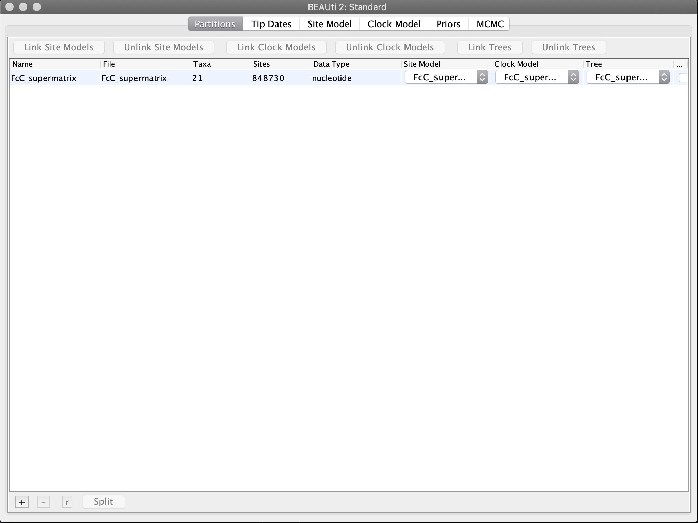
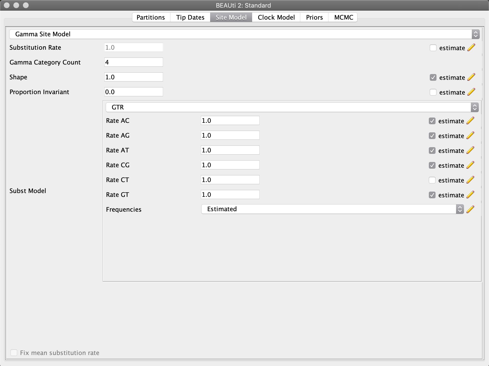
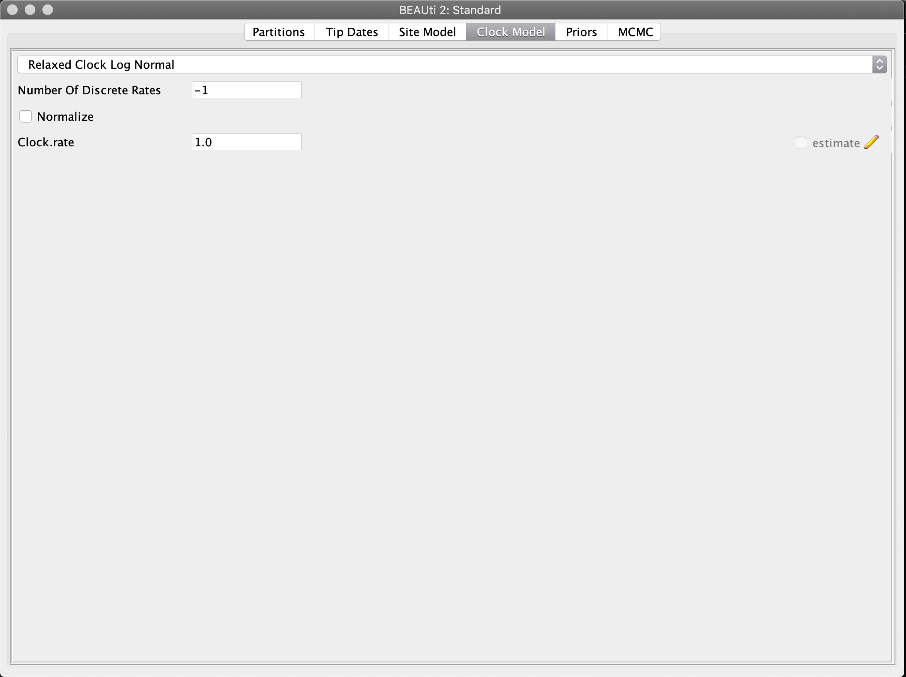
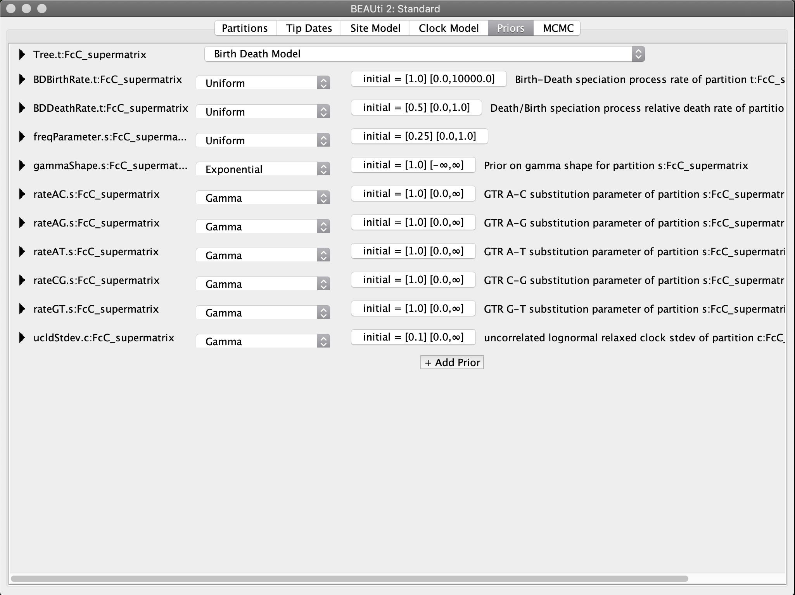
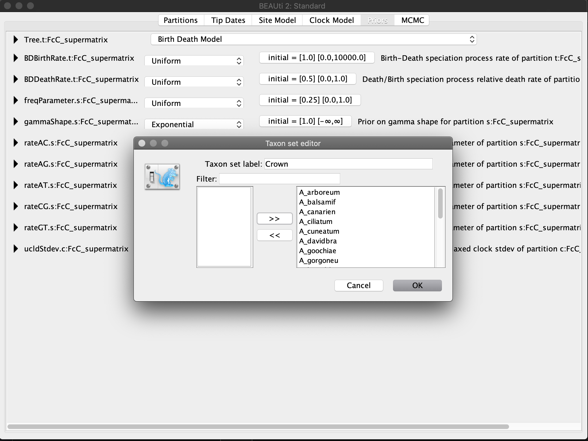

# Phylogenetic Divergence-Time Estimation

## Table of contents

* [Divergence time estimation with BEAST2](#beast)
* [Running ASTRAL](#running)
* [The ASTRAL Log information](#log)
* [Branch length and support](#support)
* [Reading and visualizing tree files](#figtree)

## Divergence time estimation with BEAST2

* Here we will infer ttime-calibrated phylogenies can be inferred with programs of the Bayesian software package [BEAST2](https://www.beast2.org) ([Bouckaert et al. 2014](http://journals.plos.org/ploscompbiol/article?id=10.1371/journal.pcbi.1003537)). The settings for the analysis will be done with the program BEAUti, the Bayesian analysis itself is going to be conducted with BEAST2, and a summary tree will be generated with the program TreeAnnotator. These three programs are part of the BEAST2 package. Finally, we explote the use of the program [Tracer](http://beast.community/tracer) ([Rambaut et al. 2018](https://academic.oup.com/sysbio/advance-article/doi/10.1093/sysbio/syy032/4989127)) to assess stationarity and convergence of the Bayesian analysis.

* If you are not familiar  with Bayesian analyses and Markov-Chain Monte Carlo methods in general, you can explore the many resources made available by BEAST2 authors. You can also explore the [BEAST2 website](https://www.beast2.org) and quickly browse through the [glossary of terms related to BEAST2 analyses](https://www.beast2.org/glossary/index.html). The BEAST2 website also provides a [wide range of tutorials and manuals](https://www.beast2.org/tutorials/index.html). Also, you can find comprehensive tutorials on the [Taming the BEAST](https://taming-the-beast.org) website, where you will also find information about the excellent [Taming-the-BEAST workshops](https://taming-the-beast.org/workshops/). 

* We will be using the same data set we used for the concatenated phylogeny with IQ-TREE. All input and out files will be located in the directory `DATA/BEAST`

## Setting the XML file with BEAUti

* The XML [Extensible Markup Language](https://www.w3.org/standards/xml/core) files contains the alignement, priors, and other setting to run the analyses on BEAST.

* Open the program BEAUti and import the alignment `FcC_supermatrix.nex`. To do so, click "Import Alignment" from the "File" menu and select the the file `DATA/BEAST/input/FcC_supermatrix.nex` The BEAUti window should then look as shown in the screenshot below. There you can see the number of taxa, alignment length, and any data partition. In this case we are not using any partion. 

* Next, click on the "Site Model" tab next. In this tab we can specify the substitution model. Now, click on the drop-down menu that currently says "JC69". Instead of the Jukes-Cantor model, use the GTR model. Also specify "4" in the field for the "Gamma Category Count" two lines above, to use a gamma model of rate variation with four rate categories. The BEAUti window should then look as shown in the screenshot below.

* Next, click on the "Clock Model" tab. From the drop-down menu that currently says "Strict Clock", choose "Relaxed Clock Log Normal" instead. This is the most commonly used relaxed clock model in which substitution rates of individual branches are drawn from a lognormal distribution. Also set a tick in the checkbox on the right side of the window. If this checkbox appears gray and you are unable to set it, you'll need to click on "Automatic set clock rate" in BEAUti's "Mode" menu. The mean and standard deviation of this lognormal distribution will be estimated as part of the MCMC search. The model is described in [Drummond et al. (2006)](http://journals.plos.org/plosbiology/article?id=10.1371/journal.pbio.0040088), there it is named the "UCLN" model. Ignore the additional options ("Number of Discrete Rates" etc.) that appear after selecting the model.

* Click on the "Priors" tab. From the drop-down menu at the very top of the window, select "Birth Death Model" instead of "Yule Model". By doing so we add a parameter to the model for the extinction rate. If we would choose the alternative Yule model ([Yule 1925](http://rstb.royalsocietypublishing.org/content/213/402-410/21?intcmp=trendmd)), we would assume that no extinction ever occurred. As this seems rather unrealistic, the birth-death model ([Gernhard 2008](https://www.sciencedirect.com/science/article/pii/S0022519308001811)) is in most cases the more appropriate choice. Nevertheless, results are in practice rather little affected by the choice of this prior.

* Most of the other items shown in the "Prior" panel correspond to prior densities placed on the parameters of the substitution models for the four partitions. You may keep the default priors for each of these parameters. However, to allow time calibration of the phylogeny, a prior density still needs to be specified for at least one divergence time, otherwise BEAST2 would have very little information (only from the priors on speciation and mutation rates) to estimate branch lengths according to an absolute time scale. But before prior densities can be placed on the divergence of certain clades, these clades must first be defined. This can be done at the bottom of the "Priors" tab. Thus, scroll down to the end of the list until you see the "+ Add Prior" button, as shown in the below screenshot.

* Click on the "+ Add Prior" button to open the "Taxon set editor" pop-up window. Select all taxa from the list on the left of that window, and click the double-right-arrow symbol (`>>`) to shift them to the right side of the window. This way, the ingroup, including all taxa, so that the divergence between the root and Aeonium can later be used for time calibration. Enter "Crown" or "Root" name at the top of the pop-up window as the "Taxon set label", as shown in the below screenshot. Then, click "OK".

