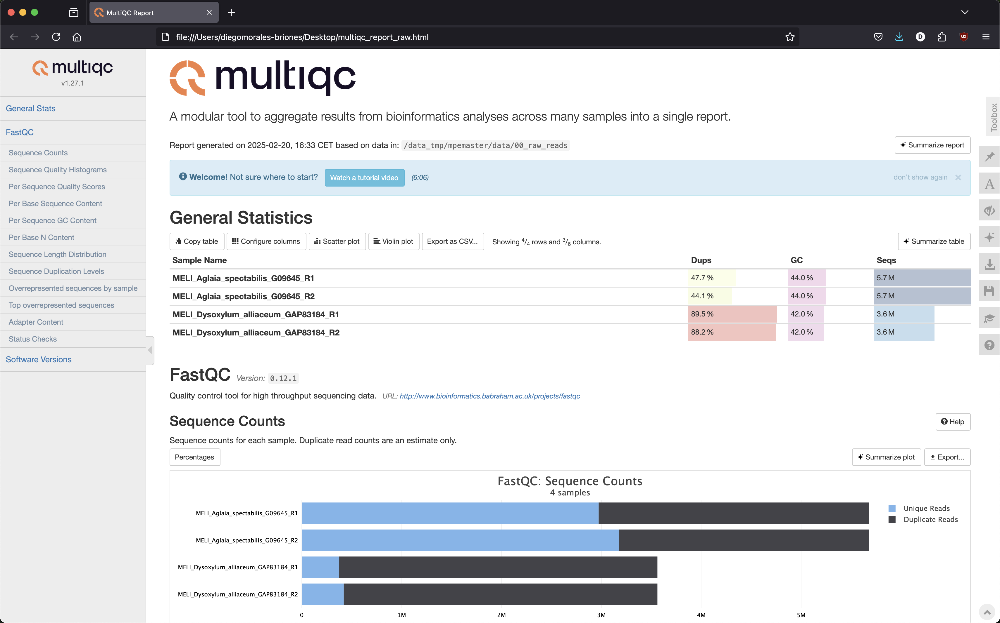
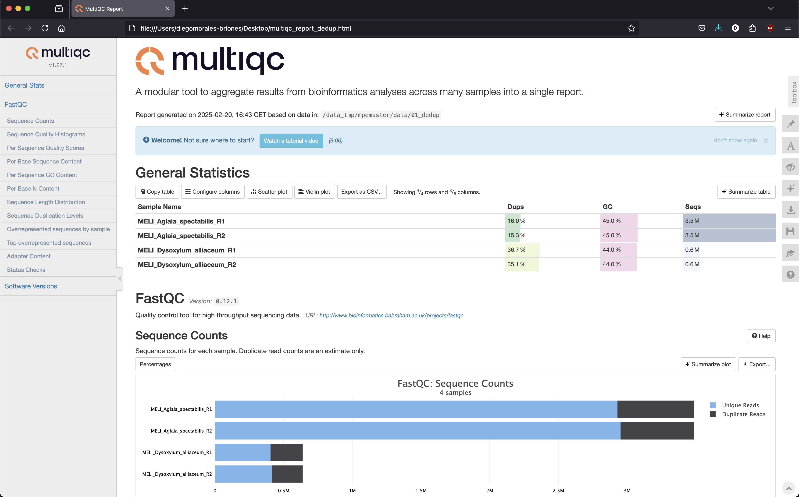

## Table of contents

* [Clean - adaptor removal and cleaning of low quality read](#clean)
* [Assemble - assembly of reads](#assemble)
* [Extract - identification of target regions](#extract)
* [Align - individual loci alignment and cleaning](#align)

We are going to use CAPTUS to do each of this steps. The advantage of this kind of pipelines is that with a few commands you can automate the process of all your samples at one while keping a nice file structure and order.

For a details guide of CAPTUS please see [here](https://edgardomortiz.github.io/captus.docs/assembly/index.html)

## Clean - adaptor removal and cleaning of low quality read

This command will perform adaptor trimming followed by quality trimming using `bbduk.sh` from the BBTools suite. Once the cleaning is completed, FastQC is run on the raw and cleaned reads and a HTML report is generated summarizing the results from all the samples.

This part of `captus` will do exactly what we did before but for all samples at the time

Fist make sure to load the `captus` environment

	conda activate captus
	
Then let's make and move to a new directory where we will put all the `captus` output directories

	mkdir /data_tmp/[username]/data/03_captus
	
	cd  /data_tmp/[username]/data/03_captus
	
Now we are going to "copy" the deduplicated reads to a new directory using symbolic links

	mkdir /data_tmp/mpemaster/data/03_captus/00_dedup_reads
	
	cd /data_tmp/mpemaster/data/03_captus/00_dedup_reads
	
	for i in /data_tmp/mpemaster/data/01_dedup/*.dedup.fastq.gz; do ln -s $i .; done
	
To run the fist module of `captus` do

	cd /data_tmp/mpemaster/data/03_captus/

	captus clean -r 00_dedup_reads --trimq 20 --maq 20 --qc_program fastqc --threads 4 --concurrent 2

You will see something like this

	Starting Captus-assembly: CLEAN (2025-02-21 10:14:07)
	    Welcome to the read cleaning step of Captus-assembly. In this step, Captus will perform adaptor trimming and quality
	filtering/trimming on your input reads using bbduk.sh from BBTools.
	    Since you provided a directory name, Captus will look in that location for all the FASTQ files that contain the string _R1 in their
	names and match them with their respective _R2 pairs. If the _R2 can not be found, the sample is treated as single-end. Sample names are
	derived from the text found before the _R1 string.
	    Since you provided a directory name, Captus will look in that location for all the FASTQ files that contain the string _R1 in their
	names and match them with their respective _R2 pairs. If the _R2 can not be found, the sample is treated as single-end. Sample names are
	derived from the text found before the _R1 string.
	    For more information, please see https://github.com/edgardomortiz/Captus
	
	       Captus version: v1.1.1
	              Command: /home/mpemaster/miniconda3/envs/captus/bin/captus clean -r 00_dedup_reads --trimq 20 --maq 20 --qc_program fastqc --threads 4 --concurrent 2
	             Max. RAM: 174.3GB (out of 176.1GB)
	         Max. Threads: 4 (out of 64)
	
	         Dependencies:
	              BBTools: v38.84 OK
	                Falco: not used
	               FastQC: v0.12.1 OK
	
	     Python libraries:
	                numpy: v1.23.5 OK
	               pandas: v2.2.2 OK
	               plotly: v6.0.0 OK
	
	     Output directory: /data_tmp/mpemaster/data/03_captus/01_clean_reads
	                       Output directory successfully created
	
Once is finished you will see a directory call `01_clean_reads` If you make a `ls` of the files in this directory you will see 

	00_adaptors_trimmed  captus-clean_report.html                    MELI_Dysoxylum_alliaceum.cleaning.log
	01_qc_stats_before   MELI_Aglaia_spectabilis.cleaning.log        MELI_Dysoxylum_alliaceum.cleaning.stats.txt
	02_qc_stats_after    MELI_Aglaia_spectabilis.cleaning.stats.txt  MELI_Dysoxylum_alliaceum_R1.dedup.fastq.gz
	03_qc_extras         MELI_Aglaia_spectabilis_R1.dedup.fastq.gz   MELI_Dysoxylum_alliaceum_R2.dedup.fastq.gz
	captus-clean.log     MELI_Aglaia_spectabilis_R2.dedup.fastq.gz

Now you can copy the the `captus-clean_report.html` file to you laptop to see it

	scp -P 22110 [username]@10.153.134.10:/data_tmp/[username]/data/03_captus/01_clean_reads/captus-clean_report.html .

Open the `html` file in your internet browser and you should see something like this

To see an example of raw data go to

	cd /data_tmp/[username]/data/00_raw_reads
	ls
	
You will see files FASTQ for two species: <em>Aglaia_spectabilis</em> and <em>Dysoxylum_alliaceum</em>

	MELI_Aglaia_spectabilis_G09645_R1.fastq.gz  MELI_Dysoxylum_alliaceum_GAP83184_R1.fastq.gz
	MELI_Aglaia_spectabilis_G09645_R2.fastq.gz  MELI_Dysoxylum_alliaceum_GAP83184_R2.fastq.gz

There are two file per each species corresponding to the left and right reads as this is paired-end data

A FASTQ file has four line-separated fields per sequence. To see the sequence files do

	zless MELI_Aglaia_spectabilis_G09645_R1.fastq.gz

You will see this

	@A00119:588:HVWJMDRXY:2:2101:4182:1000 1:N:0:TCAGGCTT+TTCATGCG
	TTGCGAAGCCGAGCACCTCCCTTACACAACCCTCGACCTCCCAGTAACCACCACCGAGCTCAGAGCCGTTGGTAGTCGCCGAAAAATGCCGCACCAACACCGTGAAGCTCGGCTTCTTCTTCCCGTCGATTCGCCGTCCTCAAAGCCATT
	+
	FFFFFFFFFFF,FFFF:FFFF:FFFFFFFFFFFFFFFFFFFFFFFFFF:FFFFFFFFFFFF:,FFFFFFFFFFFFFFFFFFFFFFF,:FFFFFFFFFFFFFFFFFFFFFF:FFFFFFFFF:FFFF:FFF:::FFFFFFFFF:F,FFF::,

Line 1 begins with a '@' character and is followed by a sequence identifier and an optional description from the sequencing machine
Line 2 is the sequence
Line 3 begins with a '+' character. Usually the only character in the line.
Line 4 encodes the quality values (in ASCII encoding) for the sequence in Line 2, and must contain the same number of symbols as letters in the sequence.

The quality goes from 0 to 40

| ! | " | # | $ | % | & | ' | ( | ) | * | + | , | - | . | / | 0 | 1 | 2 | 3 | 4 | 5 | 6 | 7 | 8 | 9 | : | ; | < | = | > | ? | @ | A | B | C | D | E | F | G | H | I | 
| - | - | - | - | - | - | - | - | - | - | - | - | - | - | - | - | - | - | - | - | - | - | - | - | - | - | - | - | - | - | - | - | - | - | - | - | - | - | - | - | - |
| 0 | 1 | 2 | 3 | 4 | 5 | 6 | 7 | 8 | 9 | 10 | 11 | 12 | 13 | 14 | 15 | 16 | 17 | 18 | 19 | 20 | 21 | 22 | 23 | 24 | 25 | 26 | 27 | 28 | 29 | 30 | 31 | 32 | 33 | 34 | 35 | 36 | 37 | 38 | 39 | 40 |

If you check the other file for the same sample 

	zless MELI_Aglaia_spectabilis_G09645_R1.fastq.gz
	
You can see that line 1 is identical except for the number of the read
	
	@A00119:588:HVWJMDRXY:2:2101:4182:1000 2:N:0:TCAGGCTT+TTCATGCG
	TGAAGACGAGGAAGAGGAGGAGGAGGATAGTCTGTTAGCGGTGGTTGTGGCCCCTGAATGTCATTGAGGACGGCGAATCGACGGGAAGAAGAAGCCGAGCTTCACGGTGTTGGTGCGGCATTTTTCGGCGACTACCAACGGCTCTGAGCT
	+
	FF:FF:FFF,,:,:FF:FF,:FFF,,F,FFF:FFF:FF,FFFFF:FFFFF:F:F:,:F:,,FFF:,FF:F:,F::FFFF,FFF,FFFFFF:FFFFF:FFFFFF::,,:FF,:FFFFFFFFF:FFFF,:FFFF:F::F:F:FFF:F:F,FF

Now we are going to do quality control of the sequencing data with `fastqc`

First load the conda environment call `captus` in there we will have most of the tools we need for QC and assembly

	conda activate captus
	
Now you can run `fastqc` in one of the files

	fastqc MELI_Aglaia_spectabilis_G09645_R1.fastq.gz
	
You will see the on the screen the progress

	Started analysis of MELI_Aglaia_spectabilis_G09645_R1.fastq.gz
	Approx 5% complete for MELI_Aglaia_spectabilis_G09645_R1.fastq.gz
	Approx 10% complete for MELI_Aglaia_spectabilis_G09645_R1.fastq.gz
	...
	
One FastQC is done you will have two new files for that sequence file:

	MELI_Aglaia_spectabilis_G09645_R1_fastqc.html
	MELI_Aglaia_spectabilis_G09645_R1_fastqc.zip

The first is a `html` report that you download and open locally in your internet browser and the second is a `zip` contining the stat files that we will use later.

To copy the `html` file to your laptop do

	scp -P 22110 [username]@10.153.134.10:/data_tmp/mpemaster/data/00_raw_reads/MELI_Aglaia_spectabilis_G09645_R1_fastqc.html .
	
Open the `html` file in your internet browser and you should see something like this

Now we will go over the main parts of the report. If you want to watch a detail tutorial go [here](https://www.youtube.com/watch?v=bz93ReOv87Y)

Now you need to run `fastqc` for the remaning files

	fastqc MELI_Aglaia_spectabilis_G09645_R2.fastq.gz MELI_Dysoxylum_alliaceum_GAP83184_R1.fastq.gz MELI_Dysoxylum_alliaceum_GAP83184_R2.fastq.gz -t 3
	
TIP: You can also run as many files you need at the same time with the wildcard `*` and `t` equivalent to the number of files to run in one in an individual processor (Do not do this during the course; it's just an example)

	echo fastqc * -t #

Once `fastqc` is finished we can run `multiqc` to summarized all individual report in a single one

	multiqc --filename multiqc_report_raw .
	
You will see this

	/// MultiQC 🔍 v1.27.1

       file_search | Search path: /data_tmp/mpemaster/data/00_raw_reads
         searching | ━━━━━━━━━━━━━━━━━━━━━━━━━━━━━━━━━━━━━━━━ 100% 15/15
            fastqc | Found 4 reports
     write_results | Data        : multiqc_report_raw_data
     write_results | Report      : multiqc_report_raw.html
           multiqc | MultiQC complete

One is done you will see file called `multiqc_report.html` You need to download to your laptop as before

	scp -P 22110 [username]@10.153.134.10:/data_tmp/mpemaster/data/00_raw_reads/multiqc_report_raw.html .
	
Open the `html` file in your internet browser and you should see something like this

## Deduplication of raw reads

The process of deduplication aims to remove PCR duplicates generated during library preparation and hybridization steps. While this deduplicated reads doesn't really affect the assembly process, removing them will help to speed up the assembly process and avoid skews on the coverage calculation during assembly

We are going to to deduplicate the reads with the tool `clumpify.sh` of `BBmap`

First let create a new directory were to place the deduplicated reads

	mkdir /data_tmp/mpemaster/data/01_dedup

To deduplicate the first pair of reads do

	clumpify.sh in1=MELI_Aglaia_spectabilis_G09645_R1.fastq.gz in2=MELI_Aglaia_spectabilis_G09645_R2.fastq.gz out1=/data_tmp/mpemaster/data/01_dedup/MELI_Aglaia_spectabilis_R1.dedup.fastq.gz out2=/data_tmp/mpemaster/data/01_dedup/MELI_Aglaia_spectabilis_R2.dedup.fastq.gz ziplevel=9 dedupe=t
	
You will see something like this

	java -ea -Xmx199355m -Xms199355m -cp /home/mpemaster/miniconda3/envs/captus/opt/bbmap-38.84-0/current/ clump.Clumpify in1=MELI_Aglaia_spectabilis_G09645_R1.fastq.gz in2=MELI_Aglaia_spectabilis_G09645_R2.fastq.gz out1=/data_tmp/mpemaster/data/01_dedup/MELI_Aglaia_spectabilis_R1.dedup.fastq.gz out2=/data_tmp/mpemaster/data/01_dedup/MELI_Aglaia_spectabilis_R2.dedup.fastq.gz ziplevel=9 dedupe=t
	Executing clump.Clumpify [in1=MELI_Aglaia_spectabilis_G09645_R1.fastq.gz, in2=MELI_Aglaia_spectabilis_G09645_R2.fastq.gz, out1=/data_tmp/mpemaster/data/01_dedup/MELI_Aglaia_spectabilis_R1.dedup.fastq.gz, out2=/data_tmp/mpemaster/data/01_dedup/MELI_Aglaia_spectabilis_R2.dedup.fastq.gz, ziplevel=9, dedupe=t]
	Version 38.84
	
	Read Estimate:          51540788
	Memory Estimate:        39322 MB
	Memory Available:       163436 MB
	Set groups to 1
	Executing clump.KmerSort1 [in1=MELI_Aglaia_spectabilis_G09645_R1.fastq.gz, in2=MELI_Aglaia_spectabilis_G09645_R2.fastq.gz, out1=/data_tmp/mpemaster/data/01_dedup/MELI_Aglaia_spectabilis_R1.dedup.fastq.gz, out2=/data_tmp/mpemaster/data/01_dedup/MELI_Aglaia_spectabilis_R2.dedup.fastq.gz, groups=1, ecco=false, rename=false, shortname=f, unpair=false, repair=false, namesort=false, ow=true, ziplevel=9, dedupe=t]

Run `clumpy` for the other pair as well

	clumpify.sh in1=MELI_Dysoxylum_alliaceum_GAP83184_R1.fastq.gz in2=MELI_Dysoxylum_alliaceum_GAP83184_R2.fastq.gz out1=/data_tmp/mpemaster/data/01_dedup/MELI_Dysoxylum_alliaceum_R1.dedup.fastq.gz out2=/data_tmp/mpemaster/data/01_dedup/MELI_Dysoxylum_alliaceum_R2.dedup.fastq.gz ziplevel=9 dedupe=t
	
Now we are going to run `fastq` and `multiqc` on the deduplicated read to see do they look now

	cd /data_tmp/mpemaster/data/01_dedup #to move to the directory where the deduplicated reads are
	fastqc *dedup.fastq.gz -t 4
	multiqc --filename multiqc_report_dedup . 
	
Copy the report of the deduplicated read so we can comprate with the raw one

	scp -P 22110 [username]@10.153.134.10:/data_tmp/mpemaster/data/01_dedup/multiqc_report_dedup.html .

Open the `html` file in your internet browser

## Adaptor removal and cleaning of low quality read

We are going to remove illumina sequencing adaptor and low quality reads using `bbduk`

First we are going to remove the adaptors

	bbduk.sh in=MELI_Aglaia_spectabilis_R1.dedup.fastq.gz in2=MELI_Aglaia_spectabilis_R2.dedup.fastq.gz out=MELI_Aglaia_spectabilis_R1.adapt.fastq.gz out2=MELI_Aglaia_spectabilis_R2.adapt.fastq.gz ref=/data_tmp/mpemaster/data/others/adapters.fa

You should start seeing this

	java -ea -Xmx102106m -Xms102106m -cp /home/mpemaster/miniconda3/envs/captus/opt/bbmap-38.84-0/current/ jgi.BBDuk in=MELI_Aglaia_spectabilis_R1.dedup.fastq.gz in2=MELI_Aglaia_spectabilis_R2.dedup.fastq.gz out=MELI_Aglaia_spectabilis_R1.adapt.fastq.gz out2=MELI_Aglaia_spectabilis_R2.adapt.fastq.gz ref=/data_tmp/mpemaster/data/others/adapters.fa
	Executing jgi.BBDuk [in=MELI_Aglaia_spectabilis_R1.dedup.fastq.gz, in2=MELI_Aglaia_spectabilis_R2.dedup.fastq.gz, out=MELI_Aglaia_spectabilis_R1.adapt.fastq.gz, out2=MELI_Aglaia_spectabilis_R2.adapt.fastq.gz, ref=/data_tmp/mpemaster/data/others/adapters.fa]
	Version 38.84
	
	0.035 seconds.
	Initial:
	Memory: max=107072m, total=107072m, free=106988m, used=84m
	
	Added 797 kmers; time: 	0.013 seconds.
	Memory: max=107072m, total=107072m, free=106854m, used=218m

Once is done you can run `bbduk` for the other pair of files

	bbduk.sh in=MELI_Dysoxylum_alliaceum_R1.dedup.fastq.gz in2=MELI_Dysoxylum_alliaceum_R2.dedup.fastq.gz out=MELI_Dysoxylum_alliaceum_R1.adapt.fastq.gz out2=MELI_Dysoxylum_alliaceum_R2.adapt.fastq.gz ref=/data_tmp/mpemaster/data/others/adapters.fa

Now let's create a new directory were we will place final clean files

	mkdir /data_tmp/mpemaster/data/02_clean

Run `bbduk` to remove low quality reads

	bbduk.sh in=MELI_Aglaia_spectabilis_R1.adapt.fastq.gz in2=MELI_Aglaia_spectabilis_R2.adapt.fastq.gz out1=/data_tmp/mpemaster/data/02_clean/MELI_Aglaia_spectabilis_R1.clean.fastq.gz out2=/data_tmp/mpemaster/data/02_clean/MELI_Aglaia_spectabilis_R2.clean.fastq.gz qtrim=rl trimq=20 minavgquality=20

You should see this

	java -ea -Xmx102100m -Xms102100m -cp /home/mpemaster/miniconda3/envs/captus/opt/bbmap-38.84-0/current/ jgi.BBDuk in=MELI_Aglaia_spectabilis_R1.adapt.fastq.gz in2=MELI_Aglaia_spectabilis_R2.adapt.fastq.gz out1=/data_tmp/mpemaster/data/02_clean/MELI_Aglaia_spectabilis_R1.clean.fastq.gz out2=/data_tmp/mpemaster/data/02_clean/MELI_Aglaia_spectabilis_R2.clean.fastq.gz qtrim=rl trimq=20 minavgquality=20
	Executing jgi.BBDuk [in=MELI_Aglaia_spectabilis_R1.adapt.fastq.gz, in2=MELI_Aglaia_spectabilis_R2.adapt.fastq.gz, out1=/data_tmp/mpemaster/data/02_clean/MELI_Aglaia_spectabilis_R1.clean.fastq.gz, out2=/data_tmp/mpemaster/data/02_clean/MELI_Aglaia_spectabilis_R2.clean.fastq.gz, qtrim=rl, trimq=20, minavgquality=20]
	Version 38.84
	
	0.033 seconds.
	Initial:
	Memory: max=107072m, total=107072m, free=106988m, used=84m
	

Now run `bbduk` for the other sample

	bbduk.sh in=MELI_Dysoxylum_alliaceum_R1.adapt.fastq.gz in2=MELI_Dysoxylum_alliaceum_R2.adapt.fastq.gz out1=/data_tmp/mpemaster/data/02_clean/MELI_Dysoxylum_alliaceum_R1.clean.fastq.gz out2=/data_tmp/mpemaster/data/02_clean/MELI_Dysoxylum_alliaceum_R2.clean.fastq.gz qtrim=rl trimq=20 minavgquality=20

Finally let's create a report for the final clean read so we can compare it with the raw reads

	cd /data_tmp/mpemaster/data/02_clean
	fastqc * -t 4
	multiqc --filename multiqc_report_clean .
	
Copy the report to your laptop and open in the browser

	scp -P 22110 mpemaster@10.153.134.10:/data_tmp/mpemaster/data/02_clean/multiqc_report_clean.html .

Now these reads are ready for assembly!!!

