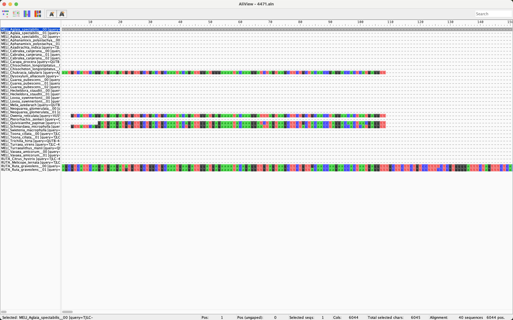
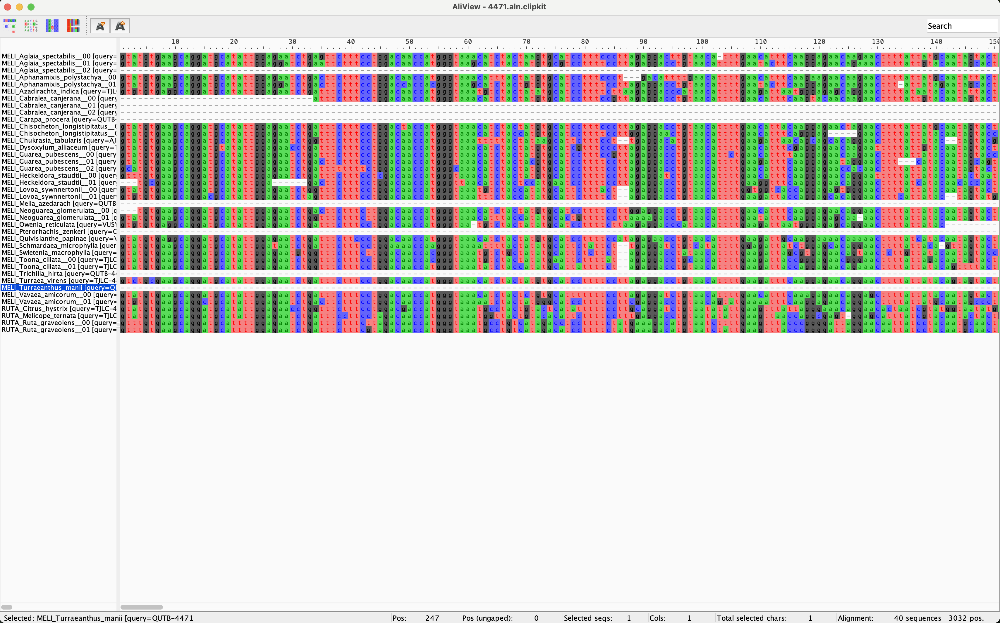

## Table of contents

* [Clean - adaptor removal and cleaning of low quality read](#clean)
* [Assemble - assembly of reads](#assemble)
* [Extract - identification of target regions](#extract)
* [Align - individual loci alignment and cleaning](#align)

We are going to use `CAPTUS` to do each of these parts. The advantage of this kind of pipelines is that with a few commands you can automate the process of all your samples at one while keping a nice file structure and order.

For a details guide of `CAPTUS` please see [here](https://edgardomortiz.github.io/captus.docs/assembly/index.html)

* Every time you see `[username]` in the command example you need to replace it with you own [username](https://github.com/dfmoralesb/MPE_tutorials/blob/main/README.md) 

## Clean - adaptor removal and cleaning of low quality read

This command will perform adaptor trimming followed by quality trimming using `bbduk.sh` from the BBTools suite. Once the cleaning is completed, FastQC is run on the raw and cleaned reads and a HTML report is generated summarizing the results from all the samples.

This part of `captus` will do exactly what we did before but for all samples at the time

Fist make sure to load the `captus` environment

	conda activate captus
	
Then let's make and move to a new directory where we will put all the `captus` output directories

	mkdir /data_tmp/[username]/data/03_captus
	
	cd  /data_tmp/[username]/data/03_captus
	
Now we are going to "copy" the deduplicated reads to a new directory using symbolic links

	mkdir /data_tmp/[username]/data/03_captus/00_dedup_reads
	
	cd /data_tmp/[username]/data/03_captus/00_dedup_reads
	
	for i in /data_tmp/[username]/data/01_dedup/*.dedup.fastq.gz; do ln -s $i .; done
	
To run the first module of `captus` do

	cd /data_tmp/[username]/data/03_captus/

	captus clean -r 00_dedup_reads --trimq 20 --maq 20 --qc_program fastqc --threads 4 --concurrent 2

You will start seing something like this

	Starting Captus-assembly: CLEAN (2025-02-21 10:14:07)
	    Welcome to the read cleaning step of Captus-assembly. In this step, Captus will perform adaptor trimming and quality
	filtering/trimming on your input reads using bbduk.sh from BBTools.
	    Since you provided a directory name, Captus will look in that location for all the FASTQ files that contain the string _R1 in their
	names and match them with their respective _R2 pairs. If the _R2 can not be found, the sample is treated as single-end. Sample names are
	derived from the text found before the _R1 string.
	    Since you provided a directory name, Captus will look in that location for all the FASTQ files that contain the string _R1 in their
	names and match them with their respective _R2 pairs. If the _R2 can not be found, the sample is treated as single-end. Sample names are
	derived from the text found before the _R1 string.
	    For more information, please see https://github.com/edgardomortiz/Captus
	
	       Captus version: v1.1.1
	              Command: /home/[username]/miniconda3/envs/captus/bin/captus clean -r 00_dedup_reads --trimq 20 --maq 20 --qc_program fastqc --threads 4 --concurrent 2
	             Max. RAM: 174.3GB (out of 176.1GB)
	         Max. Threads: 4 (out of 64)
	
	         Dependencies:
	              BBTools: v38.84 OK
	                Falco: not used
	               FastQC: v0.12.1 OK
	
	     Python libraries:
	                numpy: v1.23.5 OK
	               pandas: v2.2.2 OK
	               plotly: v6.0.0 OK
	
	     Output directory: /data_tmp/[username]/data/03_captus/01_clean_reads
	                       Output directory successfully created

It should take a couple of minutes to finish
	
Once `captus` is finished you will see a directory called `01_clean_reads` Make a list of file and directories there

	cd 01_clean_reads
	
	ls

You should see something like this

	00_adaptors_trimmed  captus-clean_report.html                    MELI_Dysoxylum_alliaceum.cleaning.log
	01_qc_stats_before   MELI_Aglaia_spectabilis.cleaning.log        MELI_Dysoxylum_alliaceum.cleaning.stats.txt
	02_qc_stats_after    MELI_Aglaia_spectabilis.cleaning.stats.txt  MELI_Dysoxylum_alliaceum_R1.dedup.fastq.gz
	03_qc_extras         MELI_Aglaia_spectabilis_R1.dedup.fastq.gz   MELI_Dysoxylum_alliaceum_R2.dedup.fastq.gz
	captus-clean.log     MELI_Aglaia_spectabilis_R2.dedup.fastq.gz

Now you can copy the the `captus-clean_report.html` file to you laptop to see it

#### THE FOLLOWING LINE NEEDS TO BE TYPE IN WINDOW IN YOUR LOCAL COMPUTER, NOT WHILE YOU ARE CONNECTED TO THE WORKSTATION. JUST OPEN A NEW TERMINAL WINDOW

	scp -P 22110 [username]@10.153.134.10:/data_tmp/[username]/data/03_captus/01_clean_reads/captus-clean_report.html .

Open the `html` file in your internet browser and you should see something like this

#### All the screen output that you saw during the execution of `captus` is in the log file `captus-clean.log` This is very important as it contains all the information related to the parameter of the run and any possible errors. This is the case for all four modules of `CAPTUS`

In case you want to create a similar report we did before with `multiqc` you can do it with

	cd 02_qc_stats_after
	
	multiqc --filename multiqc_report_clean_captus .
	
Copy the `html` report to you computer and open it in the browser. You can compare this report with the one we did in the NGS tutorial

#### THE FOLLOWING LINE NEEDS TO BE TYPE IN WINDOW IN YOUR LOCAL COMPUTER, NOT WHILE YOU ARE CONNECTED TO THE WORKSTATION. JUST OPEN A NEW TERMINAL WINDOW

 	scp -P 22110 [username]@10.153.134.10:/data_tmp/[username]/data/03_captus/01_clean_reads/02_qc_stats_after/multiqc_report_clean_captus.html .

To see the `mulitqc` report for all 30 samples go to and copy the file to your laptop

	cd /data_tmp/[username]/output/all_samples_reports
	
#### THE FOLLOWING LINE NEEDS TO BE TYPE IN WINDOW IN YOUR LOCAL COMPUTER, NOT WHILE YOU ARE CONNECTED TO THE WORKSTATION. JUST OPEN A NEW TERMINAL WINDOW

	scp -P 22110 [username]@10.153.134.10://data_tmp/[mpeusername]/output/all_samples_reports/multiqc_report_all_samples_clean.html .

The `captus` report and log for all samples is also available at `/data_tmp/[username]/output/all_samples_reports` if you are interested seing them they are `captus-clean_report_all_samples.html` and `captus-clean_all_samples.log`

## Assemble - assembly of reads

Using the cleaned reads produced by the previous step, `CAPTUS` will perform de novo assembly using `MEGAHIT`.  An HTML report summarizing several assembly statistics is also produced after this step.

To run the first module of `captus` do

	cd /data_tmp/[username]/data/03_captus/

	captus assemble -r 01_clean_reads --min_count 10 --min_contig_len 300 --threads 4 --concurrent 2 --disable_mapping --min_contig_depth 0
	
Then you should start seing this

	Starting Captus-assembly: ASSEMBLE (2025-02-21 11:10:03)
	   Welcome to the de novo assembly step of Captus-assembly. In this step, Captus will use MEGAHIT to assemble your input reads. It is
	lso possible to subsample a number of reads using reformat.sh from BBTools prior to assembly, this is useful while performing tests or
	hen including samples with considerably higher sequencing depth in a dataset.
	   Since you provided a directory name, Captus will look in that location for all the FASTQ files that contain the string '_R1' in their
	ames and match them with their respective '_R2' pairs. If the '_R2' can not be found, the sample is treated as single-end. Sample names
	re derived from the text found before the '_R1' string.The full set of reads per sample will be assembled, no subsampling will be
	erformed.
	   For more information, please see https://github.com/edgardomortiz/Captus
	
	      Captus version: v1.1.1
	             Command: /home/[username]/miniconda3/envs/captus/bin/captus assemble -r 01_clean_reads --min_count 10 --min_contig_len 300 --threads 4 --concurrent 2 --disable_mapping --min_contig_depth 0
	            Max. RAM: 249.0GB (out of 251.5GB)
	        Max. Threads: 4 (out of 64)
	
	        Dependencies:
	             MEGAHIT: v1.2.9 OK
	     megahit_toolkit: v1.2.9 OK
	             BBTools: not used
	              Salmon: not used
	
	    Python libraries:
	               numpy: v1.23.5 OK
	              pandas: v2.2.2 OK
	              plotly: v6.0.0 OK
	
	    Output directory: /data_tmp/[username]/data/03_captus/02_assemblies
	                      Output directory successfully created
	
The assembly of this two samples should take 20 minutes

Once is finished you will see a directory called `02_assemblies` Move to that directory and make a list

	cd 02_assemblies
	ls
	
You should see

	captus-assemble_assembly_stats.tsv  captus-assemble_length_stats.tsv  captus-assemble_report.html          MELI_Dysoxylum_alliaceum__captus-asm
	captus-assemble_depth_stats.tsv     captus-assemble.log               MELI_Aglaia_spectabilis__captus-asm

Now copy the assemble report to you laptop

#### THE FOLLOWING LINE NEEDS TO BE TYPE IN WINDOW IN YOUR LOCAL COMPUTER, NOT WHILE YOU ARE CONNECTED TO THE WORKSTATION. JUST OPEN A NEW TERMINAL WINDOW

 	scp -P 22110 [username]@10.153.134.10:/data_tmp/[username]/data/03_captus/02_assemblies/captus-assemble_report.html .

Open it on your browser and you should see this

To see the actual output of `captus` you can go one of the samples directories and see the assembly `FASTA` file

	cd MELI_Aglaia_spectabilis__captus-asm/01_assembly
	
	less assembly.fasta
	
And you should see something like this

	>NODE_0_length_332_cov_1.0000_k_159_flag_0
	TTCGACAACATAACGGCCTAAAAGTCATACCCCCGGAATCATCTCGATCCCAATTTCCATCCTGCAAGGGCAATTTTGCA
	CAAATACACTCCAAATCAAAAATTCCCAATTTCGAATTCGGATCCTAGGATTCACTATTTATCCGAACCCTAATTCCCCA
	AATTCATCCACCAATCCTCACAATTTCAACCCCAATTCAACAATTATACACTCAATTAAATCAAACACCATTCAATTTAA
	TCAATTTCAACCAAATTAATCACGGAACCCTAAATTCCCAAAAATCCGAAATTCTCCCAATTGTCAAATTCATCAATTCT
	CTAAAATTCATC
	>NODE_9093_length_638_cov_1.0000_k_159_flag_1
	CTGTTGACTCTAGATTTGCTATTACTTTGGTAGTAAATGAACGAAGAAAATACCGTAGATTTCTAGATGGGTTGAGACCA
	GCGATTAAGTCACGATTGTCCATGCTGAAGTTGGTAGTATATTCGGATTTGGTAGACCGAGCAGTAATCGTAGAAAGGGA
	TGTAGAGGAGGCTCAAAAAGCTCGGGATCAATTCAATCGAAGAAGAGCTAGTCGGGGCCAGGGGAGAAGTAATGAGAATC
	GATGGCATAATTCGGGATAACAAAGAACTGGCGATGGTAAGAATCAGAGAGGAGGAGGACAAGGGGGTTTTCAGTGATCA
	ATGGGTGTAGACAGATTCAGACCACAAATGTAGAAACCCTACAGCCAATGCGAACATTATAGGAAATTTCATTTTGGGAA
	GTGTTATAAGTTATCGCAGAACTGCTTCTCCTGTGGAAAGGTGGGACACTTAGCTAATAAGTGTCAGGATAGGAGAGGTA
	TTACCCCAGAACAAGAAACAAAAAGTGGAAGGATGTGTGTGTGCCCTTACAAAACAGGATGCACAAGCAACAAACGAAGT
	GGCATCAGGTACTTTAACTCTTTTTAATAAGAAAGTTAAAGTACTATTTGATCCTGGTGCTACACATTCATATCGTCT
	>NODE_1_length_462_cov_1.0000_k_159_flag_1
	CATTCACTTTCTTCCACCATTCACATGTTCAACAATGCAATTAATTGCTTTTTTACTTTTTAGGAAATGTCACCAATGCA
	TGAAGACTTGTAAGACATGTCTAGCATATTAGGAGTAGGTTTATTTATTGCACTTGAAGACTTTGGAAGACAATGTCCAA
	CGTTCACTGTTCATTGCTACAGTGCAACGGATATATTTGCTTTCCATCTTGTATATATTCTGTAATCTACACCAAATGAA
	ACACAACAACTTGTTATCTTTTTAATTCTCTTCTTCTTCTTCTCTCTTCTTGCTGAAATCAAAATAATGCACCGAGCACA
	TTTATGAGATTGATGAATCATGTTTTGCGTGCATACATAGGTAGGTTTGTTGTTGTTTACTTTGATGATATTCTCATTTA
	TAGCAAAAACTTGGATGATCATGTTGTGCATTTAAATTCAGTTTTGGATGTGCTTAGACAAG
	>NODE_13639_length_835_cov_19.0000_k_159_flag_1
	TTGCGAAGCAAATCAAGCTATTAAAGCCCAAACTAGTACAAGTAGCTATATCAAATACTGTATTTAACCAACATCAAATG
	TTTCAATAGTGACTTCCAAGATCATCGGAGTCATTCTAGCATGGAAAAAATTCTTTAATTTCCATCACAAAGAAATAAAA
	GGGAAATTTATGAAGAAGAAATTCTATTAATTCAGAAAAGGAAAAAGGAAAACAGATGATAGATAAGAAGAATGCAGATC
	TTCTGTAGCATTATAGTCAACCACCTTAGCTGAAGTATCTATTACAAGAAACCTACCAAGCATGTTTGAGACATGATGGA
	CAACTACAAGTTTCGTCTTCCTCGAAATTGTTTCCTTCAACTTGTCCACGTCTGGAATTTCATCATCATTTAAATCCAAA
	AACTTCAAAATGATACCGGTCTTTTGAGCTACAAGTTGCCAGGGCACAAGAGCACTGTGATGTTCAGCAACTGTGAGTAT
	GATCTGCAAGAAAAATAATGTCATGCAACACCTTGAACTGTATATGTAGAATAACTGTAAGAGCCACACTCAGGGTCCAT
	TGTAAGAACACTATTAAACAGAAATAATTGAGTCACGTAAATATTGAAGTGGATATGGGATTAAATATAAACATAAACAG
	AGATTCAATTTCTACCAAGCGTTGACAAAAAATTGTAAAAGGGAAGCATTTAAATCTTGTGAGAACAGGATAAGCAAGTA
	GCAAAGATATGTTCTTTAAAATATCAGAATGGATTGTTCCATTGTTCTGCTGTTCCAGACCTATAAAACCCTATTTTGAG
	TGATTTTATAAAAAATAGAAAGATGGACAAGTCGT
	
Where `>NODE_0_length_332_cov_1.0000_k_159_flag_0` is the fasta header (Always starting with the `>` character). Name of the sequence and any other information.

And `TTCGACAACATAACGGCCTAAAAGTCATACCCCCGGAATCATCTCGATCCCAATTTCCATCCTGCAAGGGCAATTTTGCA...` is the actual sequence

To see the `captus` report `captus-assemble_report_all_samples.html` and log `captus-assemble_all_samples.log` for all 30 samples go to 

	cd /data_tmp/[username]/output/all_samples_reports
	
You can copy the report to you laptop to see it
	
#### THE FOLLOWING LINE NEEDS TO BE TYPE IN WINDOW IN YOUR LOCAL COMPUTER, NOT WHILE YOU ARE CONNECTED TO THE WORKSTATION. JUST OPEN A NEW TERMINAL WINDOW

	scp -P 22110 [username]@10.153.134.10://data_tmp/[mpeusername]/output/all_samples_reports/captus-assemble_report_all_samples.html .

## Extract - identification of target regions

During this step `CAPTUS` will search the assemblies produced by the previous step for the loci contained in the provided reference target sequence datasetsets (aminoacids or nucleotides) and then extract them. Proteins can be provided in either aminoacid or nucleotide, these are searched and extracted using `Scipio`  Like in the previous steps, `CAPTUS` will produce an HTML report summarizing the marker recovery statistics across all samples and extracted markers.

To run the extract module do

	cd /data_tmp/[username]/data/03_captus/
	
	captus extract -a 02_assemblies -n Angiosperms353 --nuc_min_identity 65 --nuc_min_coverage 50 --threads 4 --concurrent 2 --ignore_depth

Then you should start seeing this 

	Starting Captus-assembly: EXTRACT (2025-02-21 12:20:30)
	    Welcome to the marker extraction step of Captus-assembly. In this step, Captus will use Scipio to search within your FASTA assemblies
	and recover any set of reference proteins provided through '--nuc_refs', '--ptd_refs', and/or '--mit_refs'. Captus includes some
	reference protein sets to work with Plants like the 'Angiosperms353' protein set for nuclear genes, and two organellar protein reference
	sets 'SeedPlantsPTD' for plastids, and 'SeedPlantsMIT' for mitochondria.
	    If you have references that are not proteins (e.g. non-coding regions, gene sequences including introns, full mRNAs, etc.) You can
	provide these miscellaneous DNA references with '--dna_refs' and Captus will use BLAT to find and extract matches in your assemblies.
	    Finally, if you want to explore the usefulness of the contigs that were not hit by any protein or other DNA references after the
	Captus' extraction process, or simply if you do not have reference sets to test, you can try the option '--cluster_leftovers' to attempt
	sequence clustering across samples in order to discover homologous markers.
	    For more information, please see https://github.com/edgardomortiz/Captus
	
	           Captus version: v1.1.1
	                  Command: /home/[username]/miniconda3/envs/captus/bin/captus extract -a 02_assemblies -n Angiosperms353 --nuc_min_identity 65 --nuc_min_coverage 50 --threads 4 --concurrent 2 --ignore_depth
	                 Max. RAM: 249.0GB (out of 251.5GB)
	             Max. Threads: 4 (out of 64)
	
	             Dependencies:
	                Scipio   : v1.4.1 OK
	                ├─BioPerl: v1.7.8 OK
	                └─YAML   : v1.30 OK
	                BLAT     : v37x1 OK
	                MMseqs2  : not used
	                MAFFT    : not used
	
	         Python libraries:
	                    numpy: v1.23.5 OK
	                   pandas: v2.2.2 OK
	                   plotly: v6.0.0 OK
	
	    Captus assemblies dir: /data_tmp/[username]/data/03_captus/02_assemblies
	                           VALID Captus assemblies directory with 2 samples and 2 'assembly.fasta' files
	
	   Total assemblies found: 2
	
	         Output directory: /data_tmp/[username]/data/03_captus/03_extractions
	                           Output directory successfully created

It should take 10 minutes to complete

Once is finished you will see a directory called `03_extractions` Move to that directory and make a list

	cd 03_extractions
	ls
	
You should see

	captus-extract.log        captus-extract_report.html  MELI_Aglaia_spectabilis__captus-ext
	captus-extract_refs.json  captus-extract_stats.tsv    MELI_Dysoxylum_alliaceum__captus-ext

Now copy the assemble report to you laptop

#### THE FOLLOWING LINE NEEDS TO BE TYPE IN WINDOW IN YOUR LOCAL COMPUTER, NOT WHILE YOU ARE CONNECTED TO THE WORKSTATION. JUST OPEN A NEW TERMINAL WINDOW

 	scp -P 22110 [username]@10.153.134.10:/data_tmp/[username]/data/03_captus/03_extractions/captus-extract_report.html .

Open it on your browser and you should see this

To see the actual output of `captus` you can go one of the samples directories and see the assembly `FASTA` file

	cd MELI_Aglaia_spectabilis__captus-ext/01_coding_NUC
	
	less NUC_coding_NT.fna
	
And you should see something like this

	>MELI_Aglaia_spectabilis__4471__00 [query=TJLC-4471] [hit=00] [wscore=0.737] [cover=99.55] [ident=87.00] [score=0.737] [length=672]
	GTATGTGAAGCAGGATGCATATTGGAGAATCTGAGTTCTTTCCTGGACAACCATGGATTTATTATGCCACTGGACTTAGGTGCAAAAGGAAGCTGCCAAATTGGTGGAAATGTTTCAACTAATGCTGGTGGTTTGCGCCTTGTTCGTTATGGTTCACTACATGGGAATATACTTGGTATTGAAGCTGTTTTAGCAAATGGTAATGTGCTTGAAATGCTTGGGACCTTACGTAAAGATAATACTGGGTATGAATTAAAGCATTTGTTTATAGGAAGTGAAGGATCATTGGGAATTGTTACAAAAGTTTCGATTCTTACCCCTCCAAAACTTTCTTCTGTAAATTTAGCTTTTCTTGCATGCAGCGATTATTTCGGCTGTCAGAAACTTCTGCTGGAAGCAAAGAGGAAACTTGGGGAGATTCTATCAGCATTTGAGTTTTTGGATAACCAGTCAATGGATTTGGTTTTAAACCATTTGGATGGTGCTAGGAATCCGCTACCCTCCTCAAAGAACAACTTCTTTGTTTTGATTGAGACAACAGGCAGTGATGAATCTTCTGACAAAGAGAAGCTTGAGGCCTTCCTTCTTCAATCAATGGATGGTGGATTGATTTCTGATGATGTTATTGCACAAGACTTAAATCAAGTTTCGTCATTCTGGCAAATACGTGAG
	>MELI_Aglaia_spectabilis__4471__01 [query=TJLC-4471] [hit=01] [wscore=0.386] [cover=83.04] [ident=77.96] [score=0.464] [length=561]
	GTATGTGAAGCAGGATGCATATTGGAGGATCTGAATTCTTTCCTGGACAACCATGGATTTATTGTGCCACTGGAGTTAGGTGCAAAAACAATCTGCCAAATTGGTGGAAATGTCTCAACCAATGTTGGTAGTTTGCCCCTTGTTCGTTATGGTTTACTACATGGCAATATACTTGGCGAGGAAGCTGTTTTAGCAAATGGTAATGTGCTTGACATGCTTGGGACTTTACGCAAAGATACCACTGGGTATGAGTAAAAGCATTTGTTTATAGGAAGTGAAAGATCCTAGGGCATTTTAACCAAAGTTTCGATAATGACCCCTCCAAAACTTTCTTCTGTAAATTTAGCTTTTCTTGCATGCAGGGATTATTTCAGCTGTCAAAAACTTCTGCTGGAAGTAAAGAGGAAACCTGGGGAGATTCTATCAGCATTTGAGGTTTTGGATAACCAGACTAAGGATTTGGTGAATTATTTGGATGGTGTTAGGAATCGATTACCTTCCTCAATGCACAACTTCTATGTTTTGATTGAGACAGCGGGCAGTGATGAATCTTTTGACAAG
	>MELI_Aglaia_spectabilis__4471__02 [query=TJLC-4471] [hit=02] [wscore=0.366] [cover=72.77] [ident=85.28] [score=0.513] [length=492] [frameshifts=383,384]
	GAAGCTGTTTTAGTAAATGGTAATGTGCTTGTCATGCTTGGGACTTTACGTAAAGATAATACTGGGTATGAATTAAAGCATTTGGTTATAGGAAGTGAAGGATCCTTGGGAATTGTAACCAAAGTTTCGATACTTACCCCTCCAAAACTTTCTTCCGTAAATTTAGCTTTCCTTGCATGCAGCGATTATTTCAGCTGTCAGAAGCTTCTGCTGGAAGCAAAGAGGAAACTTGGGGAGATTCTATCGGCATTTTAGCTTTCGGATAACTTGTCAATGGGTTTGGTTTTAAACCGTTTGGATGGTGTTAGGAATCCGTTACCTTCCTCAATGAACAACTTCTATGTTTTGATTGAGACAACGGGCAGTGATGAATCTTTTGACTNNGGTAAGCTTGAGGCCTTCCTTCTTCAATCTATGGAGGGTGGATTGATTTCTGATGGTGTTATTGCACAAGACATAAATCAAGCTTCGTCATTCTGGCGAATACGTGAG
	>MELI_Aglaia_spectabilis__4527__00 [query=TIUZ-4527] [hit=00] [wscore=0.782] [cover=99.77] [ident=89.24] [score=0.783] [length=1311]
	GAGAGGGTGGTTGTGTTGGTTATTGGAGGAGGGGGAAGGGAACATGCACTTTGCTATGCTTTGAAGCGATCTCCCTCTTGTGATGCTGTATTTTGTGCTCCTGGCAATGCCGGGATATCCAGCTCAGGGGATGCAACCTGTATCTCGGACTTAGACATTTTAGATGGGGAGGCTGTGATTGCCTTCTGCTGCAAGTGGGGTGTGGGACTAGTTGTTGTGGGACCAGAGGCTCCTCTTGTATCGGGTCTTGCCAACAAACTAGTAAAAGCTGGAATTCCTACTTTTGGCCCGTCTTCAGAAGCTGCTGCTCTGGAAGGTTCTAAGAACTTTATGAAGAATTTATGTGACAAATACAGCATTCCTACTGCTAAGTATAAAACGTTTACAGATCCATCTGCGGCAAAGCAATATATTCAAGAGCAAGGAGCACCTATTGTCGTCAAAGCAGATGGCTTGGCTGCTGGAAAAGGAGTTATTGTTGCTATGACATTGGAGGAAGCATATGAAGCCGTTGATTCAATGCTGGTCAAAAATACTTTTGGTTCTGCAGGGAGCTGTGTTGTTATTGAAGAATTTCTTGAAGGTGAAGAAGCTTCATTTTTTGCCCTTGTGGATGGAGAGAATGCCATACCTCTAGAATCTGCCCAGGACCATAAACGAGTAGGTGATGGTGATACGGGGCCCAACACTGGTGGGATGGGGGCATACTCTCCAGCACCTGTCTTAACAAGAGATCTTCAGTCTTTGGTCATGGAATCCATAATTCTCCCCACAGTGAAAGGAATGTCCGAAGAAGGATGCAGGTTTGTTGGGGTCTTATATGCTGGGCTCATGATTGAGAAGAAGTCTGGCTTGCCTAAACTAATTGAGTACAATGTTCGATTTGGAGATCCAGAGTGTCAGGTCTTGATGGTGAGGTTGGAGTCTGATCTGGCACAAGTTCTACTTGCAGCTTGTCGAGGAGAGCTAACTGGGGTAACATTAAACTGGTCCACGGGGTCTGCCATGGTGGTAGTAATGGCAAGCAGGGGATACCCAGGATCCTATGAGAAAGGTGGTGTGATACAGAACCTTGAAGAAGCAGAACAAGTTGCGCCATCTGTTAAAATATTTCATGCTGGGACTGCACTTGACTCAGATGGCTACTTCATTGCCACCGGAGGCCGTGTTCTTGGGGTTACTGCAAAGGGAAACGATCTTCAAGAGGCACGAGATAGAGCTTATCAAGCAGTAGAGGAAATTAACTGGCCAGGAGGATTCTATCGGTGTGATATCGGATGGAGAGCACTTCCCATAAAACAATTTGCTACG
	>MELI_Aglaia_spectabilis__4527__01 [query=TIUZ-4527] [hit=01] [wscore=0.755] [cover=99.77] [ident=87.87] [score=0.756] [length=1311]
	GAGAGGGTGGTTGTGTTGGTTATTGGTGGAGGGGGAAGGGAACATGCACTTTGCTATGGTTTGAAGCGATCTCCCACATGTGATGCTGTATTTTGTGCCCCTGGTAATGCTGGGATATCCAGCTCAGGGGATGCAACCTGTATTTCGGACTTAGACATTTTAGATGGGGAGGCTGTGATTGCCTTCTGCCGCAAGTGGGGTGTGGGACTAGTTGTTGTGGGACCAGAGGCTCCTCTTGTATCAGGTCTTGCCAACAAACTAGTAAAAGCTGGAATTCCTACTTTTGGCCCATCTTCAGAAGCTTCAGCTCTGGAAGGTTCTAAGAACTTTATGAAGAATTTATGTGACAAATATGGCATTCCTACTGCTAAGTATAAAACATTTACAGATCCATCTGCTGCAAAGCAATATATTCAAGATCAAGGAGTACCTATTGTTGTAAAAGCAGATGGATTGGCTGCTGGAAAAGGAGTCATTGTTGCTATGACAATGGAGGAAGCATATGAAGCTGTTGATTTGATGCTTGTCAAAAATGCTTTTGGTTCTGCAGGGGGACGTGTTGTTATTGAAGAATTTCTTGAAGGTGAAGAAGCTTCTTTCTTTGCCCTGGTGGATGGAGAGAATGCCATACCTCTTGAATCTGCCCAGGACCATAAACGAGTAGGTGATGGTGATAAGGGGCCCAACACTGGTGGGATGGGGGCATACTCTCCCGCACCTGTCTTAACGAAAGAACTTCAATCTTTGGTCATGGAATCTATAATTCTCCCCACAGTGAAAGGAATGTCTGCTGAAGGATGTAGGTTTGTTGGGGTCTTGTATGCTGGGCTCATGATTGAGAAGAAGTCTGGTTTACCTAAACTAATTGAGTACAATGTTCGATTTGGAGATCCTGAGTGTCAGGTCTTGATGGTGAGGTTGGAGTCTGATCTGGCACAAGTTCTACTTGCAGCTTGTCGAAGAGAGCTATCTGGGGTAACATTAAACTGGTCCCCGGGGTCTGCCATGGTGGTAGTAATGGCTAGTAAGGGATACCCAGGATCCTACAAGAAAGGCAGTGTGATATGGAACCTTGAAGCAGCAGAACAAGTCGCTCCATCTGTTAAAATATTTCATGCTGGAACTGCATTTGACTCAGATGGAAACTTCATTGCCACCGGGGGCCGTGTTCTTGGGCTTACTGCAAAGGGAAACAATCTTCAGGAGGCACGAGATAGAGCTTATCAAGCATTAGAGGAAATTAAGTGGCCTGGAGGATTCTATCGGCGTGATATTGGATGGAGAGCACTTCCCCAAAAACAATTTGCTACA
	>MELI_Aglaia_spectabilis__4691__00 [query=THHD-4691] [hit=00] [wscore=0.720] [cover=86.26] [ident=91.72] [score=0.720] [length=471]
	CAGAGACTACCTCCACTTTCAACAGAACCCAACCGATGTGAGCGTGCCTATGTTGGTAACACGATTGGCCAAGCAAATGGTGTTTACGACAAGCCAATTGATCTCCGCTTCTGCGATTACTCAAACGATCAATCCAACCTGAAGGGGAAATCCCTTGCAGCTGCACTCATGTCGGAAGCCAAATTTGACGGTGCTGACATGTCAGAAGTGGTAATGTCAAAGGCTTATGCCGTGGGAGCAAGCTTCAAGGGTACAAACTTCTCAAATGCTGTTTTAGATCGTGTGAATTTTGCAAAAGCAAATCTTCAAGGAGCTGTGTTTAAGAATACAGTACTCTCAGGCTCCACTTTCAATGAAGCTCAACTACAAGATGCAGTATTCGAGGACACAATTATTGGCTACATTGATCTTCAGAAGCTTTGCACAAATACCACCATCAATCCTGAAGGAAGAGCTGAATTGGGATGCCGA
	>MELI_Aglaia_spectabilis__4691__01 [query=THHD-4691] [hit=01] [wscore=0.590] [cover=86.26] [ident=85.99] [score=0.621] [length=471] [frameshifts=294,426]
	CAGAGACTGCCTCGACTTTCAGCAGAACCCAACATATGTGAGTGCGCCTATGTTGGTAACACAATCGGCCAAGCAAATGGCGTTTATGACAAGCCTATTGATCTCTGCTTATGCAGTTACTCAAACGATCAATCCAACCTTAAGGGGAAATCTCTTGCAGCTGCACTCATGTTTGAAGCCAAGTTCAATGGCGCAGATGTATCAGAAGTGGTAATGTCAAAGGCTTATGCCGTGGGAGCAAGCTTCAGGGGTGCAAACTTCTCAAATGCTGTTTTAGATCGCGTGAATTTTGANAAAAGCAATCTTCAAGGAGCTGTGTTCAAGAACACCGTACTTTCAGGCTCTACTTTCAATGAAGCTCAACTGCAAGATGCAGTGTTCGAGGACACAATTATCGGCTACATTGATCTTCAGAAGCTTTGCCANAATACCACCATCAGTCCTGAAGGAAGAGCTGAATTGGGATGCCGA
	>MELI_Aglaia_spectabilis__4724__00 [query=UHJR-4724] [hit=00] [wscore=0.801] [cover=100.00] [ident=90.05] [score=0.801] [length=582]
	GATGCTCTAGCTACAACCATTTCCTGTCGGAAGGCAACATTCTACAGCCGTTCAAGGTCATCACTGTGGACAAAGGGAGAGACTTCCCAGAATTTCATCAACGTTCAGGACATCTATCTTGATTGTGATCGTGACTCTATAATATACCTTGGAAAGCCTGATGGGCCCACTTGCCACACCGGGTCAGAAACTTGCTACTATACATCAGTTTTTGATGCGCTAAACGAACAGCAGGTTTGTAGCTTCAGAAATAAGTTGGCAATGACAACGTTGTACTCATTAGAGTCTACAATTTCTCAAAGGAAAGCAGAATTAGCAGCATTAGAAAATGGGAAACCTTCTTGGACTAAACGATTATTACTAGATGGCAACTTGCTGTGCTCAAAAATTCGAGAAGAAGCAGATGAGCTATGTCGAACACTAGAGGAGAACGAGGATTATTCTTGTACTGTGTCAGAGATGGCTGATGTGTTGTATCATTCAATGGTTTTGCTGGCACTCAAGGATGTAAAAGCAGAAGAAGTGCTAGAAGTTCTGCGAAAGAGGTTTTCACAATCAGGTATCGAAGAAAAGAAAAGTCGT

To see the `captus` report `captus-extract_report_all_samples.html` and log `captus-align_all_samples.log` for all 30 samples go to 

	cd /data_tmp/[username]/output/all_samples_reports
	
Again copy the report to your laptop to open it	
	
#### THE FOLLOWING LINE NEEDS TO BE TYPE IN WINDOW IN YOUR LOCAL COMPUTER, NOT WHILE YOU ARE CONNECTED TO THE WORKSTATION. JUST OPEN A NEW TERMINAL WINDOW

	scp -P 22110 [username]@10.153.134.10://data_tmp/[mpeusername]/output/all_samples_reports/captus-extract_report_all_samples.html .

## Align - individual loci alignment and cleaning

In this step `CAPTUS` will process the results from the extract command. First, it will collect all the markers across samples and create a separate `FASTA` file per locus. Then, the reference sequences used for extraction will be added to their corresponding `FASTA` loci file to aid as an alignment guide. This is followed by alignment using MAFFT. `CAPTUS` extracts all the copies (hits) of a loci that are found in the assembly and ranks them by their similarity to the reference sequence After that the references used for guiding the alignment are removed. Finally, the alignments are trimmed using the recently published package `ClipKIT`. As in previous steps, `CAPTUS` will summarize the alignment statistics of all the markers (e.g. length, mean pairwise identity, missingness, number of informative sites, etc.) and produce an HTML report.

#### Before we run `CAPTUS` for aligning we are going to do an example alignment and cleaning for one locus so you understand what is `CAPTUS` doing

The example fasta file `4471.fna` is on `/data_tmp/[username]/data/04_individual_aln`

	cd /data_tmp/[username]/data/04_individual_aln
	
	less 4471.fna
	
You will see 

	>MELI_Aglaia_spectabilis__00 [query=TJLC-4471] [hit=00] [wscore=0.737] [cover=99.55] [ident=87.00] [score=0.737] [length=2992]
	GTATGTGAAGCAGGATGCATATTGGAGAATCTGAGTTCTTTCCTGGACAACCATGGgtaaacatctactaagtgcatcctttcccttagaggacttgtaacatttgaacatttcaaggagaacaagaacttttattatgcaatagtactagaatttgattctggtcttaaagcaaattttactttgtcattgagaaatgacaacaaacatctactgattgttgagaaaattaatatttctcgcttgaattattttttatgtggccgtgcatctttttagtttaattttaggtctgtttttgacgtaaccattcttgtcttattaaagttaattgttcctctgtccagATTTATTATGCCACTGGACTTAGGTGCAAAAGGAAGCTGCCAAATTGGTGGAAATGTTTCAACTAATGCTGGTGGTTTGCGCCTTGTTCGTTATGGTTCACTACATGGGAATATACTTGgtgaggattgttattactcatcaaactttgatgtctagtggactggacaattaatttcttatattatgcttaattttcagcctgcctttctgcttttttttgtctctctcaaatatttgttgattcactttctttgtcccttttttttttgtccataacctcctttatctcttctcatctcacagGTATTGAAGCTGTTTTAGCAAATGGTAATGTGCTTGAAATGCTTGGGACCTTACGTAAAGATAATACTGGGTATGAATTAAAGCATTTGTTTATAGgtatgctcttgctctatgttgtatggacatttttgacataagcataaattagtaaagggatcaatttagtgtatttgtgctcttcttgatgtagGAAGTGAAGGATCATTGGGAATTGTTACAAAAGTTTCGATTCTTACCCCTCCAAAACTTTCTTCTGTAAATTTAGCTTTTCTTGCATGCAGCGATTATTTCGGCTGTCAGgtatgaccagtttcctctccctcagttttttttatctcttagcatacaattttattaaatcaatccatcataatgtatgattagctttagtgtttatctttctcttgttattatcatcttttgaatgttttgttgcacttggtctggtggcagtattttaggtctactttgatcagcttgagatgtgatatgaatgcttgattctttatgttggcctttatgtatcacttcatggcctgttttgatcagttcaaggttctatatgattccttgattctctgtgatggcttttttatacatcacaccatgaatcactcaagcaggaaactggactttaggtgataccttgcattcatgcactttgaggttttgagcacaaatttcaaacaagatatatagtcacttaacaattttttataatttactaaattttgtcacattataagtttcctgtgtatattgttgatagcctgaagttgagttacaacatgttcgtgtaatttctttttctaatccttctctccataatttcttagtttcctttagcaaaaattgtatcttttcctccttaccttgattctgctatgtttatcagAAACTTCTGCTGGAAGCAAAGAGGAAACTTGGGGAGATTCTATCAGCATTTGAGTTTTTGGATAACCAGTCAATGGATTTGgtgagcttttgtcgtaggttatattcttattcttgcctgttgacgtcatgcatcactcagaaattgcagttacactaaaacgtagttattaactccttgataaatttgatgcgaacttttctttctcaagacattataaagcacaatttggccttaagtcttatcacaatttcttaaccttatgaatgaacaaaacatctcaagatgtctttggaatatcttcaagactctaatttgagggtggcataatacattaagaggattcctggattatctgactaatataatctatgatggtcaacttgagtgtactatttatgaaatatctgatgaagttgttatgtgtttctacgaagatttttaaattgttaggcattgacatcctgtaatcctgttttgagttcagttgtgtggctgtatactttacgtgtaattgcatcattcttcataatgggcaggaaaggttggaacatctgtgatatcatcattgttatgataaatgtcttgtataccttttgactggactaagttgcaagtatactttctttctcatgaaataagaccattttttagaggtctccctgttatttgttcctttagaagattttacagttgcttatatttttaacattctgttccatttttggaatgtaatcattggattttatgtgttagGTTTTAAACCATTTGGATGGTGCTAGGAATCCGCTACCCTCCTCAAAGAACAACTTCTTTGTTTTGATTGAGACAACAGGCAGTGATGAATCTTCTGACAAgtaacaattaccatcatcccattgtttatctcaagtttaagttctgattgcaaactgaaggatctttattcaaggttaaattaagattgcaaacggaaggagaaagtgatcgatattttacatttctcttgttttcctttaaatttacttaaaaatacagaataccgctatagattccctgatttctctacatgtttagaatccaatcgattatgaaactaggatatgtttctgaatgaagatctttagccatttctgttctttaggttgtttccaaaaatttgacaacattttcaatttttgtttaccattttatggatacaaattgagttcttcatgcatctttctaatctatcatcacctgatgagttgcatattttgctgatcttttctgtgatgtatttagcttcttgaattttcttcttcttggctaacatgtatatgtgctaagattctgctatacaatattaatgtcttcagAGAGAAGCTTGAGGCCTTCCTTCTTCAATCAATGGATGGTGGATTGATTTCTGATGATGTTATTGCACAAGACTTAAATCAAGTTTCGTCATTCTGGCAAATACGTGAG
	>MELI_Aglaia_spectabilis__01 [query=TJLC-4471] [hit=01] [wscore=0.386] [cover=83.04] [ident=77.96] [score=0.464] [length=1896]
	GTATGTGAAGCAGGATGCATATTGGAGGATCTGAATTCTTTCCTGGACAACCATGGgtaagcatctactatgtgcgtccttttccttagaggacctgtaacattttgaatacttcaaggagaacagaaacttttattgtacaatagcactagaatttgattctggtcttatggcaattttactttctgtcattaagaaagaagtgcaaacatctattaattgttgagaaatgtgagattgtttttctttcttcaattattttttatgtggctgtgcatcattttagtttattgtttaggtctgtattggaaataaaaattattgtcttattaaagcaaatttttcctctgtccagATTTATTGTGCCACTGGAGTTAGGTGCAAAAACAATCTGCCAAATTGGTGGAAATGTCTCAACCAATGTTGGTAGTTTGCCCCTTGTTCGTTATGGTTTACTACATGGCAATATACTTGGCGAGgattgctattactcatcaaactttgatgtctggtggactggccaattgatctcttatattgtactcaattttcagttttgtctttctgcttctttttgtctctctcatatatttgttgattctctttcttttttctttcttttctttttcttttttccataaatttctttatctcttctcatctcaagGAAGCTGTTTTAGCAAATGGTAATGTGCTTGACATGCTTGGGACTTTACGCAAAGATACCACTGGGTATGAGTAAAAGCATTTGTTTATAGgtatgttcttactctacattgtatggtcatttttgacataagcataatttattaaagggatcaattcaatgtatttgtgctcttcttgatgtagGAAGTGAAAGATCCTAGGGCATTTTAACCAAAGTTTCGATAATGACCCCTCCAAAACTTTCTTCTGTAAATTTAGCTTTTCTTGCATGCAGGGATTATTTCAGCTGTCAAgtatgaccagtttcctctccctcaatattttttttttctcttagcatacagttttactaaatcaattcatcataatgtaatgattagctctattgttttatctttctcttgttactatcatcttttgaatggtttgtttcacttagtccagtggctgttgttaaggtcgactttgatcagtttgagatgtgatatgaatgcttgattctttatattggcttttgtgtattacactatggcctactttgatcagttcgagattcgatgtgcttcttccttc--------------------------------------------------ctgttgaccctactttgatcagttcgagattcgatgtgcttgattgattatccgtgatggcttttgtacatcacaccatgaaccagtcaagcagaaaactggattttaggtgatatcttgcatgcgtacactttgagatttttgtcacaaatttcaaaccatatatatatatatattttcactctacaatttttataatttactaaaactttgcaccattataagtctcctatgtttattattgaaatgctcaagttgagttagtacttattcttgtagtttcctttactaatcctttgttccataatttcttagtttcctgtagcagaaattgcaacttttcctccttatcttgattctgctacgtttttcagAAACTTCTGCTGGAAGTAAAGAGGAAACCTGGGGAGATTCTATCAGCATTTGAGGTTTTGGATAACCAGACTAAGGATTTGGTG--------------------------------------------------AATTATTTGGATGGTGTTAGGAATCGATTACCTTCCTCAATGCACAACTTCTATGTTTTGATTGAGACAGCGGGCAGTGATGAATCTTTTGACAAG
	>MELI_Aglaia_spectabilis__02 [query=TJLC-4471] [hit=02] [wscore=0.366] [cover=72.77] [ident=85.28] [score=0.513] [length=2420] [frameshifts=1827,1828]
	GAAGCTGTTTTAGTAAATGGTAATGTGCTTGTCATGCTTGGGACTTTACGTAAAGATAATACTGGGTATGAATTAAAGCATTTGGTTATAGgtatgttctttctctgcgttgtaaggaagtttttgacataagcataaattaataaagggatcaattcagtgtatttgggctctttttgatgtagGAAGTGAAGGATCCTTGGGAATTGTAACCAAAGTTTCGATACTTACCCCTCCAAAACTTTCTTCCGTAAATTTAGCTTTCCTTGCATGCAGCGATTATTTCAGCTGTCAGttatgaccagtttcctctcccttagttttttttttgtcttagcatacaattttactaaatcaatccatcataatgtattaatagctttattgttttatctttctcttgataccatcatcttttgaatgtgttgttgcacttggtctggtggcagtagtttagatctactttgatcagttcgagatgtgatatgaatgcttgattctttatgttggcctttgtgtatcacagcatggccgactttgatcggttcaagattctctatgactgcttgattctcagtgatggcttttgtacatcacatcacgaatcactcaagcaggaaactggactttaggtgacgtcttgcattcatacaatttgaggttttcatcacaaatatcaaacaatatatattgtcacttcgcaactggacttcaggtgatatcttgcattcatacaccttgaggttttcatcacaaatttcaaacaatatatatggtcacttgacaattttttataatttactaaaatttgcaccattataattttcctgtgtatattgttgaaaacctgaagttgagtttgaatttattcttgtaatttccttttccagtccttcgttctataatttcttagtttcctttagcaaaaattgcaccttttcctccttatcttgattctcgtgtgtttatcagAAGCTTCTGCTGGAAGCAAAGAGGAAACTTGGGGAGATTCTATCGGCATTTTAGCTTTCGGATAACTTGTCAATGGGTTTGatgagcttttgtaatagcttatattcttattcttgactgttgacattatgcgtcacttagaaattgcagttacgctaaaacgtagttatgaactcctttacaaatttgaagcgaactttctcactcaagacattataaaccttaatttggccttaaatcttatcacaatttcctaaccttatgaatgaaaaaaacatctcaagacatctttggaatatcttcatgactctaatttgaggtggcataatacattaagaggcttcctggataatctgactaatataatctatgacggtcaacttgaatgtactctttatgaaatatctgatgaagtttttaatgtgtttctatgaagacttttaaattgctcggcgttgacatcctataatcctgttttgagttcagttgtgtggctgtatgctttacatgtaattgccgttattcttcataatcagcaggaaaggttgaaacttctgtgatatcatcattgttacgattattatcttatactttttgattggactaagttgcaagtatactttctttctcgtgaaataagaacttcttttagagatcatcctgttatttgttgcttcagaaggttacgtagttgcatatagttttgatattctcttccatttttggaatgtaatcactggattttatgtgtcagGTTTTAAACCGTTTGGATGGTGTTAGGAATCCGTTACCTTCCTCAATGAACAACTTCTATGTTTTGATTGAGACAACGGGCAGTGATGAATCTTTTGACTNNGGTaacaattgccttcatgccattatttttcagacgtttaagttctgattgcgaattgaaggatcttcattccagtttaaattaagattgcaaactgaaggagaaagtgattgatattttacatttttcttgctttcctttaaatttacataaaaaatacagaatacagcgataagttccccgatttctctgcatgtttagaatccaaccgattatgaaactaggatatgctcctgaatgaaaatctttagccgtttctattttttaggttgtttccaaacatttgacaacattttttaatttttgtttaccattttatgaatacaaattgagttcttcatgcatctttctaatctatcatcacctgatgagatgcatattttgctgatcttttctgcgatgtatttagcttcgtgaattttcttcttcttggctaacatgaatatgtgctaagattctgctatacaatattgatgtctttagagagAAGCTTGAGGCCTTCCTTCTTCAATCTATGGAGGGTGGATTGATTTCTGATGGTGTTATTGCACAAGACATAAATCAAGCTTCGTCATTCTGGCGAATACGTGAG
	...

To count the number of sequences you can do

	grep ">" 4471.fna | wc -l
	
You should see

	40
	
Now cp the `FASTA` file on your laptop and visualize it on `AliView`

#### THE FOLLOWING LINE NEEDS TO BE TYPE IN WINDOW IN YOUR LOCAL COMPUTER, NOT WHILE YOU ARE CONNECTED TO THE WORKSTATION. JUST OPEN A NEW TERMINAL WINDOW

	scp -P 22110 [username]@10.153.134.10:/data_tmp/[username]/data/04_individual_aln/4471.fna .
	
Open `AliView` on you laptop and drag the 4471.fna file. You should see the following
	

Now we are going to align this gene with `MAFFT`

In the workstation make sure you are in `/data_tmp/[username]/data/04_individual_aln`

	cd /data_tmp/[username]/data/04_individual_aln
	
Then to run `MAFFT` type

	mafft --auto --thread 4 4471.fna > 4471.aln
	
You will see 

	nthread = 4
	nthreadpair = 4
	nthreadtb = 4
	ppenalty_ex = 0
	stacksize: 8192 kb
	generating a scoring matrix for nucleotide (dist=200) ... done
	Gap Penalty = -1.53, +0.00, +0.00
	
	
	
	Making a distance matrix ..
	
	There are 13 ambiguous characters.
	    1 / 40 (thread    0)
	done.
	
	Constructing a UPGMA tree (efffree=0) ...
	   30 / 40
	done.
	
	Progressive alignment 1/2...

The alignment should be done in a few seconds and the output file is `4471.aln`

Copy the alignment to your laptop and open it in `AliView` as we did before

#### THE FOLLOWING LINE NEEDS TO BE TYPE IN WINDOW IN YOUR LOCAL COMPUTER, NOT WHILE YOU ARE CONNECTED TO THE WORKSTATION. JUST OPEN A NEW TERMINAL WINDOW

	scp -P 22110 [username]@10.153.134.10:/data_tmp/[username]/data/04_individual_aln/4471.aln .
	
You should see 

#### What is the size of the alignment? 

Now we are going to clean (mask) the alignment based on the percentage of samples per column with `ClipKit`

	clipkit -m gappy --gaps 0.7 4471.aln

	You will see 
	
	-------------
	| Arguments |
	-------------
	Input file: 4471.aln (format: fasta)
	Output file: 4471.aln.clipkit (format: fasta)
	Sequence type: Nucleotides
	Gaps threshold: 0.7
	Trimming mode: gappy
	Create complementary output: False
	Create log file: False
	
	...
	
	---------------------
	| Output Statistics |
	---------------------
	Number of sites kept: 3032
	Number of sites trimmed: 3012
	
	Percentage of alignment trimmed: 49.835%
	
	Execution time: 0.331s

The output file will be called `4471.aln.clipkit`

Copy the alignment to your laptop and open it in `AliView` as we did before

#### THE FOLLOWING LINE NEEDS TO BE TYPE IN WINDOW IN YOUR LOCAL COMPUTER, NOT WHILE YOU ARE CONNECTED TO THE WORKSTATION. JUST OPEN A NEW TERMINAL WINDOW

	scp -P 22110 [username]@10.153.134.10:/data_tmp/[username]/data/04_individual_aln/4471.aln.clipkit .
	
You should see 

Now we can run `CAPTUS` on all out samples

Move to the `CAPTUS` directory and run the following command

	cd  /data_tmp/[username]/data/03_captus

	captus align -e 03_extractions -m NUC -f GE --max_paralogs 5 --min_samples 2 --align_method mafft_auto --filter_method none --clipkit_method gappy --clipkit_gaps 0.9 --threads 4 --concurrent 30

You will start seeing this 

	arting Captus-assembly: ALIGN (2025-02-21 14:38:24)
	  Welcome to the alignment step of Captus-assembly. In this step, Captus will collect all the extracted markers across all samples in '03_extractions' and group them by marker. Then Captus
	ll align each marker using MAFFT or MUSCLE. If given, the reference loci are also included as alignment guides and removed after alignment
	  For more information, please see https://github.com/edgardomortiz/Captus
	
	          Captus version: v1.1.1
	                 Command: /home/[username]/miniconda3/envs/captus/bin/captus align -e 03_extractions -m NUC -f GE --max_paralogs 5 --min_samples 2 --align_method mafft_auto --filter_method none --clipkit_method gappy --clipkit_gaps 0.9 --threads 4 --concurrent 30
	                Max. RAM: 249.0GB (out of 251.5GB)
	            Max. Threads: 4 (out of 64)
	
	            Dependencies:
	                   MAFFT: v7.525 OK
	                  MUSCLE: not used
	                 ClipKIT: v1.4.1 OK
	
	        Python libraries:
	                   numpy: v1.23.5 OK
	                  pandas: v2.2.2 OK
	                  plotly: v6.0.0 OK
	
	        Output directory: /data_tmp/[username]/data/03_captus/04_alignments
	                          Output directory successfully created
	

The whole process will take a couple of minutes

The output directory `04_alignments` will have many other directories where all the alignments will be located. It will also contain the report and log files.

	ls 04_alignments
	
You should see

	01_unaligned  02_untrimmed  03_trimmed  captus-align_alignments.tsv  captus-align_astral-pro.tsv  captus-align.log  captus-align_report.html  captus-align_samples.tsv

Copy the report to your laptop to open it	
	
#### THE FOLLOWING LINE NEEDS TO BE TYPE IN WINDOW IN YOUR LOCAL COMPUTER, NOT WHILE YOU ARE CONNECTED TO THE WORKSTATION. JUST OPEN A NEW TERMINAL WINDOW

	scp -P 22110 [username]@10.153.134.10:/data_tmp/[mpeusername]/data/03_captus/04_alignments/captus-align_report.html .

The directory with the files that we are interested in is `03_trimmed/01_unfiltered_w_refs/01_coding_NUC/03_genes`

This directory will contain the `FASTA` files for the clean alignments with out the reference and up to 5 gene copies per samples. In this case all this alignments will have only two samples because is just the test data.

The directory that have the equivalent files but with all 30 samples is `data_tmp/[username]/output/03_captus/04_alignments/03_trimmed/04_unfiltered/01_coding_NUC/03_genes` We will use these files for the next steps.

To see the report `captus-align_report_all_samples.html` and log `captus-align_all_samples.log` of the alignment step or all 30 samples to to

	cd /data_tmp/[username]/output/all_samples_reports
	
Again copy the report to your laptop to open it	
	
#### THE FOLLOWING LINE NEEDS TO BE TYPE IN WINDOW IN YOUR LOCAL COMPUTER, NOT WHILE YOU ARE CONNECTED TO THE WORKSTATION. JUST OPEN A NEW TERMINAL WINDOW

	scp -P 22110 [username]@10.153.134.10://data_tmp/[mpeusername]/output/all_samples_reports/captus-align_report_all_samples.html .

