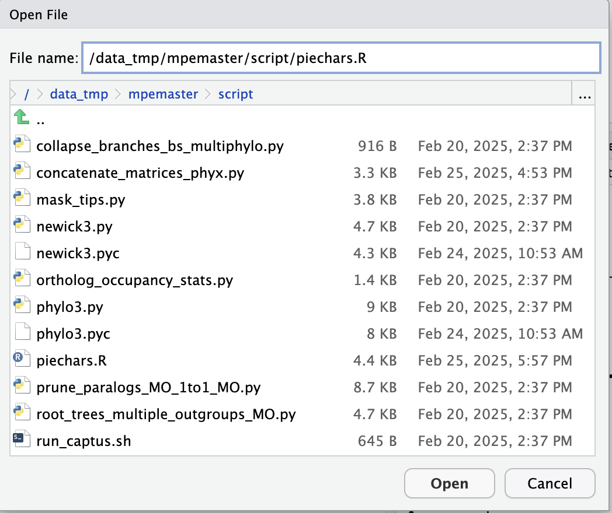
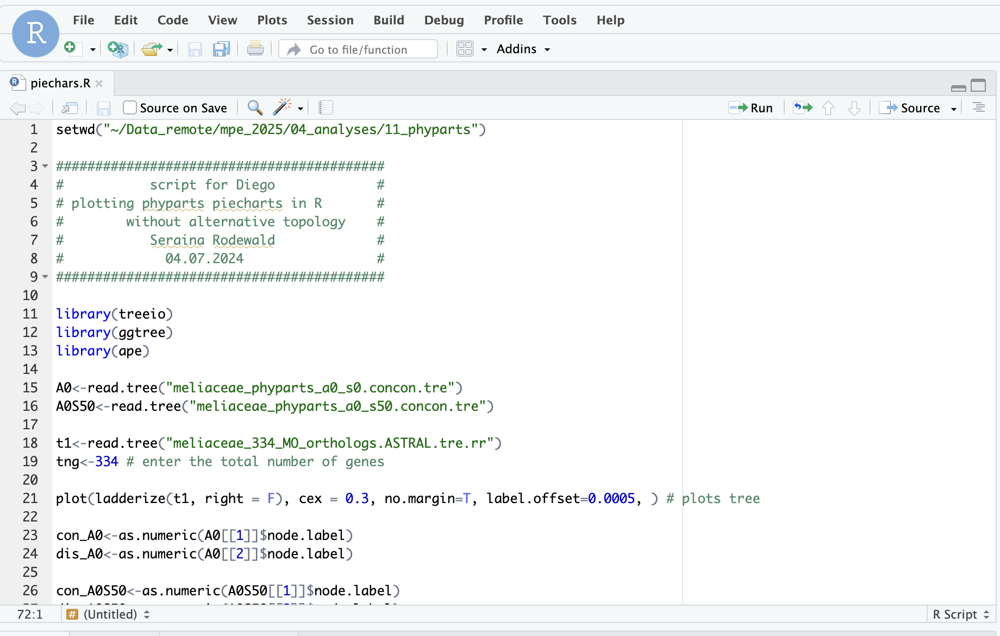
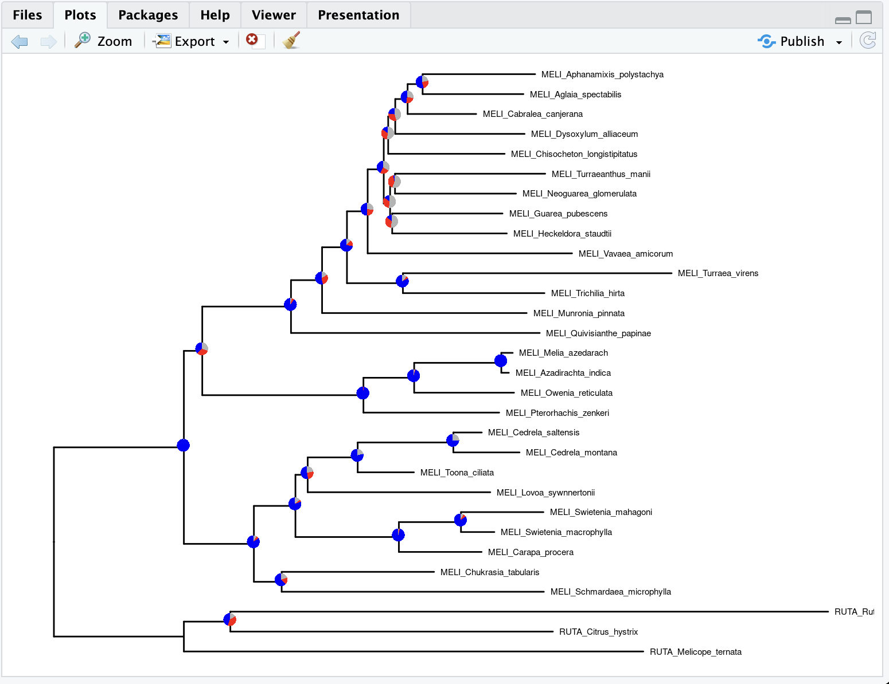
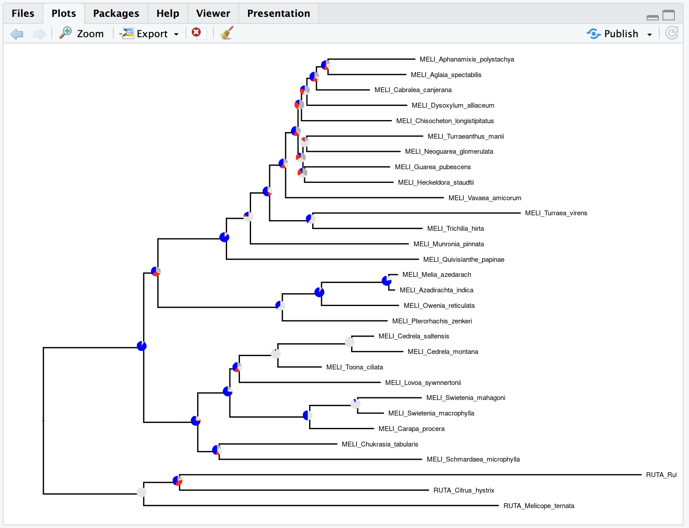
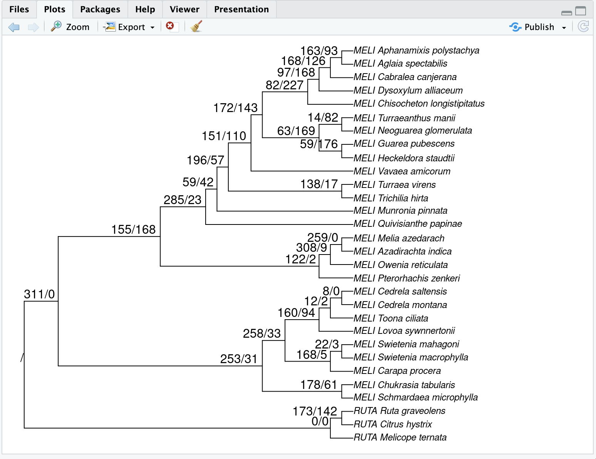
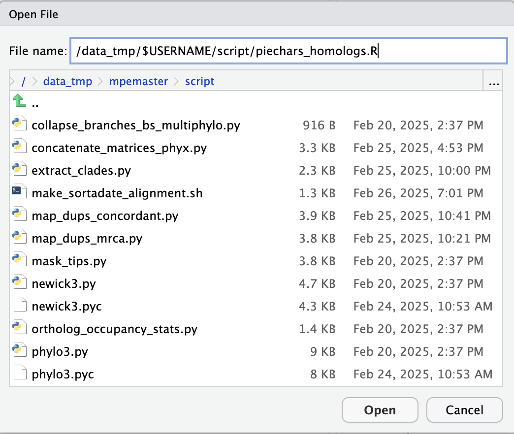
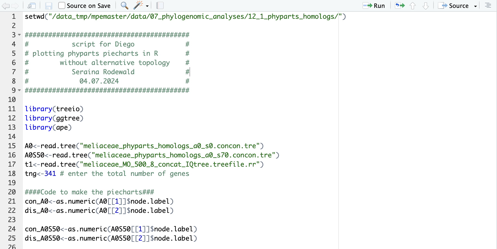
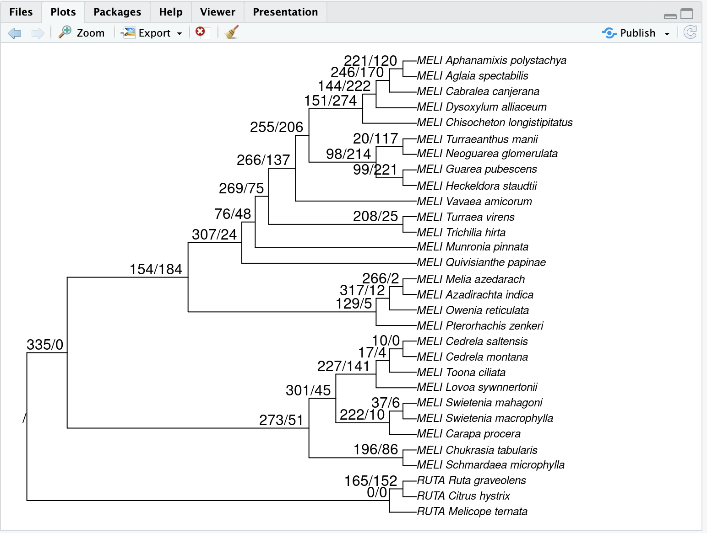

## Table of contents

* [Concordance factors](#cf)
* [Quartet Sampling](#qs)
* [Conflict analysis with Phyparts](#phyparts)

#### How to login to the workstation

	ssh -p 22110 USERNAME@10.153.134.10

### Every time you see `$USERNAME` in the example command, you need to replace it with your own [USERNAME](https://github.com/dfmoralesb/MPE_tutorials/blob/main/README.md) 

* To avoid having to change the `$USERNAME` for every command, you can set a variable to provide the name of it. ***Do this every time you connect to the workstation***

	For example, for me, Diego, my user name is `mpemaster`
	
		USERNAME=mpemaster

## Concordance factors - alternative (complemental) node support values 

* When working with phylogenomic data sets, it is pretty common for traditional node support values like Bootstrap to be always high. This is due to the large amount of data available that makes even known incorrect topologies have high support, making these support measures inappropriate for large data sets. We want to understand the variation in the underlying data. There are several alternatives and more appropriate node support measures that quantify genealogical concordance, like [Concordance factors in IQ-Tree](http://www.iqtree.org/doc/Concordance-Factor). For a nice explanation of how to interpret concordance factors, see [here](https://www.robertlanfear.com/blog/files/concordance_factors.html)

* IQ-Tree can calculate two kinds of concordance factors. The gene concordance factor (gCF) and the site concordance factor (sCF). For every branch of a reference tree, gCF is defined as the percentage of “decisive” gene trees containing that branch. IQ-tree can calculate the gCF while accounting for missing data. sCF is the percentage of "decisive" alignment sites supporting a branch in the reference tree. sCF is a novel measure useful when individual gene alignments are relatively uninformative, such that gene trees are uncertain. gCF and sCF complement classical measures of branch support (e.g., bootstrap) in phylogenetics by providing a full description of underlying disagreement among loci and sites. 

* To calculate concordance factors, you need a reference tree (e.g., a concatenated tree or coalescent-based tree; it could be any tree, for that matter) and the individual ortholog gene trees (gCF) and the concatenated ortholog alignment (sCF)

	Load the conda environment 
	
		conda activate captus
	
	Make a new directory where we will run IQ-tree
	
		cd /data_tmp/$USERNAME/data/07_phylogenomic_analyses
	
		mkdir 11_concordance_factors
		
		cd 11_concordance_factors
		
	Now, we can run IQ-tree to get the gCF and sCF using the concatenated tree as a reference tree. Remember from the previous tutorial that the tree should be located in `/data_tmp/$USERNAME/output/04_analyses/10_iqtree_concatenated` The gene trees will be the same input trees file we used for ASTRAL in the previous tutorial located in `/data_tmp/$USERNAME/data/07_phylogenomic_analyses/07_astral` use the non-collapse one `meliaceae_334_MO_orthologs.tre` And the concatenated alignment is located in `/data_tmp/$USERNAME/data/07_phylogenomic_analyses/08_concatenated_aln`
	
		iqtree -te /data_tmp/$USERNAME/output/04_analyses/10_iqtree_concatenated/meliaceae_MO_500_8_concat_IQtree.treefile --gcf /data_tmp/$USERNAME/data/07_phylogenomic_analyses/07_astral/meliaceae_334_MO_orthologs.tre --scf 1000 -T 4 -s /data_tmp/$USERNAME/data/07_phylogenomic_analyses/08_concatenated_aln/meliaceae_MO_500_8_concat.fa --prefix meliaceae_MO_500_8_concat_IQtree

		
	You should start seeing.
	
	
		IQ-TREE multicore version 2.4.0 for Linux x86 64-bit built Feb 12 2025
		Developed by Bui Quang Minh, Nguyen Lam Tung, Olga Chernomor, Heiko Schmidt,
		Dominik Schrempf, Michael Woodhams, Ly Trong Nhan, Thomas Wong
		
		Host:    p620-small (AVX2, FMA3, 251 GB RAM)
		Command: iqtree -te /data_tmp/$USERNAME/output/04_analyses/10_iqtree_concatenated/meliaceae_MO_500_8_concat_IQtree.treefile --gcf /data_tmp/$USERNAME/data/07_phylogenomic_analyses/07_astral/meliaceae_334_MO_orthologs.tre --scf 1000 -T 4 -s /data_tmp/$USERNAME/data/07_phylogenomic_analyses/08_concatenated_aln/meliaceae_MO_500_8_concat.fa --prefix meliaceae_MO_500_8_concat_IQtree
		Seed:    147240 (Using SPRNG - Scalable Parallel Random Number Generator)
		Time:    Tue Feb 25 16:03:17 2025
		Kernel:  AVX+FMA - 4 threads (64 CPU cores detected)
		...
	
	It should take 2 to 3 minutes to complete the run
	
	The file you can plot in Figtree is `meliaceae_MO_500_8_concat_IQtree.cf.tree`
	
		cat meliaceae_MO_500_8_concat_IQtree.cf.tree
		
		(RUTA_Citrus_hystrix:0.1203095997,(RUTA_Melicope_ternata:0.1713673116,(((((((((((MELI_Aglaia_spectabilis:0.0375885764,MELI_Aphanamixis_polystachya:0.0419670632)100/64/43.2:0.0056021936,MELI_Cabralea_canjerana:0.0255826820)100/57.1/50.1:0.0046142662,MELI_Dysoxylum_alliaceum:0.0482585193)100/40.8/40.7:0.0026290050,MELI_Chisocheton_longistipitatus:0.0434381144)100/26/37.5:0.0016593652,((MELI_Heckeldora_staudtii:0.0427502585,MELI_Guarea_pubescens:0.0411445158)88/14.9/37.4:0.0007827064,(MELI_Neoguarea_glomerulata:0.0451238849,MELI_Turraeanthus_manii:0.0560241287)97/14.7/29.7:0.0018363755)100/31.8/37.3:0.0023701151)100/48.6/46.7:0.0060012439,MELI_Vavaea_amicorum:0.0762391468)100/55.6/43.6:0.0077188462,(MELI_Trichilia_hirta:0.0527954546,MELI_Turraea_virens:0.1002290411)100/89/52.7:0.0208684956)100/47.6/42.4:0.0092840998,MELI_Munronia_pinnata:0.0763143712)100/70.1/44.6:0.0115924912,MELI_Quivisianthe_papinae:0.0927838334)100/93/59.1:0.0330980586,(((MELI_Azadirachta_indica:0.0028085964,MELI_Melia_azedarach:0.0042547263)100/100/96.8:0.0325065738,MELI_Owenia_reticulata:0.0372445257)100/92.7/64.4:0.0189203949,MELI_Pterorhachis_zenkeri:0.0506308134)100/98.4/73.8:0.0601215172)100/45.3/34.9:0.0068608865,((((MELI_Toona_ciliata:0.0209736796,(MELI_Cedrela_montana:0.0246820354,MELI_Cedrela_saltensis:0.0106038088)100/100/76.9:0.0356809672)100/81.8/71.3:0.0186519042,MELI_Lovoa_sywnnertonii:0.0681119901)100/61.3/39.2:0.0045679476,((MELI_Swietenia_macrophylla:0.0124428947,MELI_Swietenia_mahagoni:0.0307433133)100/93.3/92.1:0.0231644117,MELI_Carapa_procera:0.0308532123)100/98.2/78.5:0.0385898559)100/88.6/53.3:0.0154981841,(MELI_Schmardaea_microphylla:0.0977996692,MELI_Chukrasia_tabularis:0.0568456093)100/74.5/41.9:0.0103559063)100/89.7/55.5:0.0261171806)100/100/70.1:0.0969635918)100/54.9/36.8:0.0173378156,RUTA_Ruta_graveolens:0.2229865468);

	

	The node has three values: the ultrafast bootstrap from the original tree inference, the gCF, and the sCF.
		
		
	gCF ranges from 0%, no gene trees support that node, to 100%, all gene trees support that node.
	
	In principle, sCF values can range from 0% (no sites are concordant with the focal branch) to 100% (all sites are concordant with the focal branch). In practice, however, empirical sCF values are rarely lower than 33%. This is due to an important underlying difference in the way that the two values are calculated. The sCF is calculated from quartets, so a single site can only support one of three topologies. Because of this, if there is no consistent information in an alignment (e.g., if a long alignment were generated at random), we expect a roughly equal proportion of sites supporting each of the three trees, leading to an sCF value of ∼33%. 

	What patterns do you see?

## Quartet Sampling (QS)- distinguishing weakly supported branches from conflict

* QS assesses the confidence, consistency, and informativeness of each internal branch by the relative frequency of the three possible quartet topologies at each node. QS estimates branch support and conflict by sampling quartets from the species tree and the corresponding concatenated alignment and calculating the proportion of the three possible topologies at each node. As a result, it simultaneously evaluates the consistency of information (Quartet Concordance, QC), the presence of secondary evolutionary histories (Quartet Differential, QD), and the amount of information (Quartet Informativeness, QI) of internal nodes. For more details, see [here](https://github.com/FePhyFoFum/quartetsampling)

* To run QS, you need a ***rooted*** reference tree and a concatenated alignment. In this case, we are going to use the output of IQ-tree, the same for the concordance factors
	
	To see the options for QS, do
	
		conda deactivate
		
		python3 /data_tmp/$USERNAME/apps/quartetsampling/pysrc/quartet_sampling.py -h
		
	And you should see a long list of options. Re
	
		usage: quartet_sampling.py [-h] --tree TREE --align ALIGN --reps REPS --threads THREADS [--lnlike LNLIKE] [--result-prefix RESULT_PREFIX]
                           [--data-type {nuc,amino,cat}] [--min-overlap MIN_OVERLAP] [--results-dir RESULTS_DIR] [--verbout] [--partitions PARTITIONS]
                           [--genetrees GENETREES] [--temp-dir TEMP_DIR] [--retain-temp] [--clade CLADE] [--start-node-number START_NODE_NUMBER]
                           [--stop-node-number STOP_NODE_NUMBER] [--engine {raxml-ng,raxml,paup,iqtree}] [--engine-exec ENGINE_EXEC]
                           [--engine-model ENGINE_MODEL] [--ignore-errors] [--low-mem] [--max-random-sample-proportion MAX_RANDOM_SAMPLE_PROPORTION]
                           [--calc-qdstats] [--verbose] [--version]

		quartet_samping.py: Quartet Sampling method for phylogenetic branch support evaluation <http://www.github.com/FePhyFoFum/quartetsampling>

		optional arguments:
 		 -h, --help            show this help message and exit
  		--tree TREE           The input tree in Newick (parenthetical) format. (default: None)
  		...
	
	This is the command I used to run QS. You don't need to run this.
	
		#python3 quartet_sampling.py --tree meliaceae_334_MO_orthologs.ASTRAL.tre.rr --align meliaceae_MO_500_8_concat.fa --genetrees meliaceae_MO_500_8_concat.model --reps 1000 --engine-exec iqtree --threads 120
	
	
	Quartet sampling can take several hours to run, so I have done this in advance. You can see the output files here: `/data_tmp/$USERNAME/output/04_analyses/12_QS`

	
	Where `--tree meliaceae_334_MO_orthologs.ASTRAL.tre.rr` is the rooted concatenated tree. `--align meliaceae_MO_500_8_concat.phy` is the concatenated alignment in PHYLIP format. This is the same alignment we used before but in a different format. The `concatenate_matrices_phyx.py` we have used in the previous tutorial produces this file as well as the FASTA one.  `meliaceae_MO_500_8_concat.model` is the model partition. `--reps 1000` is the number of quartet repetitions. `--engine-exec raxml-ng` is the software to calculate the likelihood score of each quartet. It used `raxml-ng`, which is another software to estimate ML trees. It could be `iqtree` as well.
	
	See the files in the output directory
	
		ls /data_tmp/$USERNAME/output/04_analyses/12_QS
		
	You should see 
	
		plot_qs_pies.r              RESULT.labeled.tre.qc   RESULT.no_partition.labeled.tre          RESULT.no_partition.labeled.tre.qi   run_qs.sh
		plot_qs.r                   RESULT.labeled.tre.qd   RESULT.no_partition.labeled.tre.figtree  RESULT.no_partition.node.counts.csv
		RESULT.labeled.tre          RESULT.labeled.tre.qi   RESULT.no_partition.labeled.tre.freq     RESULT.no_partition.node.scores.csv
		RESULT.labeled.tre.figtree  RESULT.node.counts.csv  RESULT.no_partition.labeled.tre.qc       RESULT.no_partition.run.stats
		RESULT.labeled.tre.freq     RESULT.node.scores.csv  RESULT.no_partition.labeled.tre.qd       RESULT.run.stats
		
	The main output is the file `RESULT.no_partition.labeled.tre.figtree`, which you can plot in Figtree.
	
		cat RESULT.no_partition.labeled.tre.figtree
		
	You should see	
	
		#NEXUS
		begin trees;

		tree tree1 = [&R] ((((((((((((MELI_Aphanamixis_polystachya[&qf=0.8197424892703863]:0.031112,MELI_Aglaia_spectabilis[&qf=0.8261494252873564]:0.027253)[&label=QS11,freq=0.96,qc=0.77,qd=0,qi=1,reps=27,score=0.77/0/1]:0.006567,MELI_Cabralea_canjerana[&qf=0.8365921787709497]:0.017127)[&label=QS10,freq=0.96,qc=0.82,qd=1,qi=0.98,reps=52,score=0.82/1/0.98]:0.006012,MELI_Dysoxylum_alliaceum[&qf=0.8061497326203209]:0.039957)[&label=QS9,freq=0.99,qc=0.89,qd=0,qi=0.92,reps=75,score=0.89/0/0.92]:0.004466,MELI_Chisocheton_longistipitatus[&qf=0.80927291886196]:0.037703)[&label=QS8,freq=0.93,qc=0.74,qd=0.84,qi=0.86,reps=3.4e+02,score=0.74/0.84/0.86]:0.000447,(((MELI_Guarea_pubescens[&qf=0.7359781121751026]:0.030915,MELI_Neoguarea_glomerulata[&qf=0.7747252747252747]:0.038397)[&label=QS14,freq=0.13,qc=-0.49,qd=0.1,qi=0.85,reps=27,score=-0.49/0.1/0.85]:0.003389,MELI_Heckeldora_staudtii[&qf=0.7549407114624506]:0.029846)[&label=QS13,freq=0.77,qc=0.39,qd=0.6,qi=0.86,reps=51,score=0.39/0.6/0.86]:0.000475,MELI_Turraeanthus_manii[&qf=0.6828478964401294]:0.039533)[&label=QS12,freq=0.52,qc=0.33,qd=0.033,qi=0.81,reps=3.1e+02,score=0.33/0.033/0.81]:0.00336)[&label=QS7,freq=0.96,qc=0.84,qd=0.46,qi=0.88,reps=4e+02,score=0.84/0.46/0.88]:0.004959,MELI_Vavaea_amicorum[&qf=0.8864668483197093]:0.065824)[&label=QS6,freq=1,qc=0.97,qd=0,qi=0.98,reps=3.1e+02,score=0.97/0/0.98]:0.009747,(MELI_Turraea_virens[&qf=0.9209580838323354]:0.086027,MELI_Trichilia_hirta[&qf=0.9193154034229829]:0.045675)[&label=QS15,freq=1,qc=1,qd=NA,qi=0.97,reps=1.8e+02,score=1/NA/0.97]:0.00781)[&label=QS5,freq=1,qc=0.97,qd=0,qi=1,reps=2.8e+02,score=0.97/0/1]:0.026474,MELI_Munronia_pinnata[&qf=0.8589108910891089]:0.057026)[&label=QS4,freq=0.9,qc=0.52,qd=0,qi=0.91,reps=1.8e+02,score=0.52/0/0.91]:0.01377,MELI_Quivisianthe_papinae[&qf=0.9378283712784589]:0.079811)[&label=QS3,freq=1,qc=1,qd=NA,qi=1,reps=6.2e+02,score=1/NA/1]:0.017442,(((MELI_Azadirachta_indica[&qf=0.8329571106094809]:0.001287,MELI_Melia_azedarach[&qf=0.803448275862069]:0.001092)[&label=QS18,freq=1,qc=1,qd=NA,qi=1,reps=27,score=1/NA/1]:0.030035,MELI_Owenia_reticulata[&qf=0.8683914510686164]:0.025845)[&label=QS17,freq=1,qc=1,qd=NA,qi=0.96,reps=52,score=1/NA/0.96]:0.0148,MELI_Pterorhachis_zenkeri[&qf=0.7899581589958159]:0.032183)[&label=QS16,freq=1,qc=1,qd=NA,qi=1,reps=4.9e+02,score=1/NA/1]:0.050009)[&label=QS2,freq=0.45,qc=0.035,qd=0.84,qi=0.87,reps=1e+03,score=0.035/0.84/0.87]:0.004354,(((((MELI_Cedrela_saltensis[&qf=0.680628272251309]:0.006613,MELI_Cedrela_montana[&qf=0.6666666666666666]:0.006687)[&label=QS23,freq=1,qc=1,qd=NA,qi=1,reps=27,score=1/NA/1]:0.041995,MELI_Toona_ciliata[&qf=0.9070588235294118]:0.009955)[&label=QS22,freq=1,qc=1,qd=NA,qi=1,reps=52,score=1/NA/1]:0.018474,MELI_Lovoa_sywnnertonii[&qf=0.780564263322884]:0.062248)[&label=QS21,freq=0.44,qc=0.069,qd=0.57,qi=0.77,reps=2e+02,score=0.069/0.57/0.77]:0.004825,((MELI_Swietenia_mahagoni[&qf=0.7602339181286549]:0.007311,MELI_Swietenia_macrophylla[&qf=0.8383838383838383]:0.000437)[&label=QS25,freq=1,qc=1,qd=NA,qi=1,reps=27,score=1/NA/1]:0.02008,MELI_Carapa_procera[&qf=0.9183884297520661]:0.022098)[&label=QS24,freq=1,qc=1,qd=NA,qi=1,reps=1.8e+02,score=1/NA/1]:0.022709)[&label=QS20,freq=1,qc=1,qd=NA,qi=1,reps=4.9e+02,score=1/NA/1]:0.013087,(MELI_Chukrasia_tabularis[&qf=0.9379715004191115]:0.046801,MELI_Schmardaea_microphylla[&qf=0.9327659574468085]:0.089206)[&label=QS26,freq=0.96,qc=0.75,qd=0,qi=0.85,reps=1.4e+02,score=0.75/0/0.85]:0.008203)[&label=QS19,freq=1,qc=1,qd=NA,qi=0.99,reps=7.5e+02,score=1/NA/0.99]:0.021747)[&label=QS1,freq=1,qc=1,qd=NA,qi=1,reps=3.2e+02,score=1/NA/1]:0.0478435,(RUTA_Melicope_ternata[&qf=0.8565815324165029]:0.157873,(RUTA_Citrus_hystrix[&qf=0.8163771712158809]:0.118032,RUTA_Ruta_graveolens[&qf=0.7888146911519198]:0.214916)[&label=QS28,freq=1,qc=1,qd=NA,qi=0.96,reps=27,score=1/NA/0.96]:0.005799)[&label=QS27,freq=1,qc=1,qd=NA,qi=1,reps=3.2e+02,score=1/NA/1]:0.0478435):0.0;

		end;

		begin figtree;

		set appearance.backgroundColour=#-1;
		set appearance.branchColorAttribute="freq";
		set appearance.branchLineWidth=1.0;
		set appearance.foregroundColour=#-16777216;
		set appearance.selectionColour=#-2144520576;
		set branchLabels.displayAttribute="Branch times";
		set branchLabels.fontName="sansserif";
		set branchLabels.fontSize=8;
		set branchLabels.fontStyle=0;
		set branchLabels.isShown=false;
		set branchLabels.significantDigits=4;
		set layout.expansion=0;
		set layout.layoutType="RECTILINEAR";
		set layout.zoom=0;
		set nodeBars.barWidth=4.0;
		set nodeLabels.displayAttribute="label";
		set nodeLabels.fontName="sansserif";
		set nodeLabels.fontSize=8;
		set nodeLabels.fontStyle=0;
		set nodeLabels.isShown=false;
		set nodeLabels.significantDigits=4;
		set polarLayout.alignTipLabels=false;
		set polarLayout.angularRange=0;
		set polarLayout.rootAngle=0;
		set polarLayout.rootLength=100;
		set polarLayout.showRoot=true;
		set radialLayout.spread=0.0;
		set rectilinearLayout.alignTipLabels=false;
		set rectilinearLayout.curvature=0;
		set rectilinearLayout.rootLength=100;
		set scale.offsetAge=0.0;
		set scale.rootAge=1.0;
		set scale.scaleFactor=1.0;
		set scale.scaleRoot=false;
		set scaleAxis.automaticScale=true;
		set scaleAxis.fontSize=8.0;
		set scaleAxis.isShown=false;
		set scaleAxis.lineWidth=1.0;
		set scaleAxis.majorTicks=1.0;
		set scaleAxis.origin=0.0;
		set scaleAxis.reverseAxis=false;
		set scaleAxis.showGrid=true;
		set scaleAxis.significantDigits=4;
		set scaleBar.automaticScale=true;
		set scaleBar.fontSize=10.0;
		set scaleBar.isShown=true;
		set scaleBar.lineWidth=1.0;
		set scaleBar.scaleRange=0.0;
		set scaleBar.significantDigits=4;
		set tipLabels.displayAttribute="Names";
		set tipLabels.fontName="sansserif";
		set tipLabels.fontSize=8;
		set tipLabels.fontStyle=0;
		set tipLabels.isShown=true;
		set tipLabels.significantDigits=4;
		set trees.order=true;
		set trees.orderType="decreasing";
		set trees.rooting=false;
		set trees.rootingType="User Selection";
		set trees.transform=false;
		set trees.transformType="cladogram";
		end;

	Plot the tree on Figtree as we have done before. For the node label, choose `score`. Play around. You can also transform the branches so it is easier to see. For this, go to the tab "Trees" -> "Transform Branches" and select "Cladogram".

	You should see this
	
	

	
* Here is a guide on how to interpret the scores
	
	

	
	What can you tell from the QS scores and how they compare with the CFs?
	

## Conflict analysis with Phyparts

* Phyparts calculates the number of conflicting/concordant bipartitions of the gene tree with respect to a reference tree (e.g., a concatenated or coalescent-based tree). This is a relatively simple mapping analysis intended to allow for the exploration of large datasets. For details on how the mapping works, see [here](https://bitbucket.org/blackrim/phyparts/wiki/Mapping_concordance_and_conflict)

* Phyparts assume rooted gene trees and a rooted reference tree. So we are going to root all these trees

	First, let's make a new directory for Phyparts

		cd /data_tmp/$USERNAME/data/07_phylogenomic_analyses

		mkdir 12_phyparts
		
	Now, let's make a directory for the rooted gene trees
	
		cd 12_phyparts
		
		mkdir 00_rooted_gene_trees
		
	The gene tree we are going to root is the ortholog gene tree. The same we used for ASTRAL. If you remember from the previous tutorial, the files are located here: `/data_tmp/$USERNAME/output/04_analyses/05_MO_fasta_files`
	
	The script to root multiple gene trees at once is `root_trees_multiple_outgroups_MO.py`
	
		deactivate conda
	
		python /data_tmp/$USERNAME/script/root_trees_multiple_outgroups_MO.py
		
	You should see
	
		Usage:
		python root_trees_mulitple_outgroup_MO.py inDIR tree_file_ending outDIR outgroup_list
		
	We need to provide the directory where the gene tree files are, the extension of the files, the output directory, and the list of outgroups (the same we use to run TreeShrink)
	
	Let's root the trees
	
		python /data_tmp/$USERNAME/script/root_trees_multiple_outgroups_MO.py /data_tmp/$USERNAME/output/04_analyses/05_MO_fasta_files treefile 00_rooted_gene_trees /data_tmp/$USERNAME/data/07_phylogenomic_analyses/outgroup_list.txt

	It should take seconds to run
	
	Now, check the output files
	
		ls 00_rooted_gene_trees/
		
	You should see
	
		4471.reroot  5162.reroot  5366.reroot  5594.reroot  5842.reroot  5949.reroot  6119.reroot  6373.reroot  6487.reroot  6639.reroot  6864.reroot  7067.reroot
		4527.reroot  5163.reroot  5398.reroot  5596.reroot  5843.reroot  5950.reroot  6128.reroot  6376.reroot  6488.reroot  6641.reroot  6865.reroot  7111.reroot
		4691.reroot  5168.reroot  5404.reroot  5599.reroot  5849.reroot  5958.reroot  6130.reroot  6378.reroot  6492.reroot  6649.reroot  6875.reroot  ...
		
	Now, we can root the concatenated tree. The same from the previous tutorial `/data_tmp/$USERNAME/output/04_analyses/10_iqtree_concatenated/meliaceae_MO_500_8_concat_IQtree.treefile`
	
	For this, we can use the program `pxrr` from `Phyx`
	
	Type `pxrr -h` to see what are the needed arguments
	
		pxrr -h
		
	You should see
	
		Reroot (or unroot) a tree file and produce a newick.
		This will take a newick- or nexus-formatted tree from a file or STDIN.
		Output is written in newick format.
		
		Usage: pxrr [OPTIONS]...
		
		Options:
		 -t, --treef=FILE     input tree file, STDIN otherwise
		 -g, --outgroups=CSL  outgroup sep by commas (NO SPACES!)
		 -f, --namesf=FILE    outgroups in a file (each on a line)
		 -r, --ranked         turn on ordering of outgroups. will root on first one present
		 -u, --unroot         unroot the tree
		 -s, --silent         do not error if outgroup(s) not found
		 -o, --outf=FILE      output tree file, STOUT otherwise
		 -h, --help           display this help and exit
		 -V, --version        display version and exit
		 -C, --citation       display phyx citation and exit
		
		Report bugs to: <https://github.com/FePhyFoFum/phyx/issues>
		phyx home page: <https://github.com/FePhyFoFum/phyx>
		
	Now, we can root the tree
	
		pxrr -t /data_tmp/$USERNAME/output/04_analyses/10_iqtree_concatenated/meliaceae_MO_500_8_concat_IQtree.treefile -f /data_tmp/$USERNAME/data/07_phylogenomic_analyses/outgroup_list.txt -o meliaceae_MO_500_8_concat_IQtree.treefile.rr
		
	If you plot the output tree `meliaceae_MO_500_8_concat_IQtree.treefile.rr` in FigTree, you should see that it is rooted already.
	
		cat meliaceae_MO_500_8_concat_IQtree.treefile.rr
		
	It should look like this:
		
		((((((((((((MELI_Aglaia_spectabilis:0.0375885764,MELI_Aphanamixis_polystachya:0.0419670632)100:0.0056021936,MELI_Cabralea_canjerana:0.025582682)100:0.0046142662,MELI_Dysoxylum_alliaceum:0.0482585193)100:0.002629005,MELI_Chisocheton_longistipitatus:0.0434381144)100:0.0016593652,((MELI_Heckeldora_staudtii:0.0427502585,MELI_Guarea_pubescens:0.0411445158)88:0.0007827064,(MELI_Neoguarea_glomerulata:0.0451238849,MELI_Turraeanthus_manii:0.0560241287)97:0.0018363755)100:0.0023701151)100:0.0060012439,MELI_Vavaea_amicorum:0.0762391468)100:0.0077188462,(MELI_Trichilia_hirta:0.0527954546,MELI_Turraea_virens:0.1002290411)100:0.0208684956)100:0.0092840998,MELI_Munronia_pinnata:0.0763143712)100:0.0115924912,MELI_Quivisianthe_papinae:0.0927838334)100:0.0330980586,(((MELI_Azadirachta_indica:0.0028085964,MELI_Melia_azedarach:0.0042547263)100:0.0325065738,MELI_Owenia_reticulata:0.0372445257)100:0.0189203949,MELI_Pterorhachis_zenkeri:0.0506308134)100:0.0601215172)100:0.0068608865,((((MELI_Toona_ciliata:0.0209736796,(MELI_Cedrela_montana:0.0246820354,MELI_Cedrela_saltensis:0.0106038088)100:0.0356809672)100:0.0186519042,MELI_Lovoa_sywnnertonii:0.0681119901)100:0.0045679476,((MELI_Swietenia_macrophylla:0.0124428947,MELI_Swietenia_mahagoni:0.0307433133)100:0.0231644117,MELI_Carapa_procera:0.0308532123)100:0.0385898559)100:0.0154981841,(MELI_Schmardaea_microphylla:0.0977996692,MELI_Chukrasia_tabularis:0.0568456093)100:0.0103559063)100:0.0261171806)100:0.0484817959,(RUTA_Melicope_ternata:0.1713673116,(RUTA_Citrus_hystrix:0.1203095997,RUTA_Ruta_graveolens:0.2229865468)100:0.0173378156)100:0.0484817959);
		
	

	
* Now we have the input needed for phyparts

	To see the options for phyparts, do
	
		java -jar /data_tmp/$USERNAME/apps/phyparts/target/phyparts-0.0.1-SNAPSHOT-jar-with-dependencies.jar -h
		
	You should see
	
		usage: phyparts
		 -a,--analysis <arg>   what kind of analysis (0 - concon, 1 - fullconcon,
		                       2 - duplications)
		 -d,--dtree <arg>      directory of trees (for deconstruct)
		 -h,--help             show help
		 -i,--ignore <arg>     comma separated list of things to ignore
		 -m,--mtree <arg>      mapping tree (for mapping)
		 -o,--outpr <arg>      prepend output files with this
		 -s,--support <arg>    support cutoff (only keep things with greater
		                       support than the one specified)
		 -v,--verbose          include verbose output
		 -x,--secret <arg>
		 -y,--secret2
	
	First, we are going to run a simple analysis of concordance, taking in consideration all nodes in the input gene trees `-a 0`
	
		java -jar /data_tmp/$USERNAME/apps/phyparts/target/phyparts-0.0.1-SNAPSHOT-jar-with-dependencies.jar -a 0 -d 00_rooted_gene_trees -m meliaceae_MO_500_8_concat_IQtree.treefile.rr -o meliaceae_phyparts_a0

	Running this should take a few seconds, and you will see 
	
		Read 334 trees
		Finished initializing deconstructor
		
		Finished calculating clades
		Total number of clades: 5869
		Average number of clades/tree: 17.57185628742515
		Total number of unique clades: 5383
		tree:1 / 334
		tree:2 / 334
		...
		
	Now we are going to do a similar analysis `-a 0`, but this time, we are going to exclude the nodes that have low bootstrap support (e.g., =< 70%) with the option `-s`
	
		java -jar /data_tmp/$USERNAME/apps/phyparts/target/phyparts-0.0.1-SNAPSHOT-jar-with-dependencies.jar -a 0 -d 00_rooted_gene_trees -m meliaceae_MO_500_8_concat_IQtree.treefile.rr -o meliaceae_phyparts_a0_s70 -s 70

	As before, it should take seconds to run, and you should do the following. 

	
		Mapping tree:meliaceae_MO_500_8_concat_IQtree.treefile.rr
		Read 334 trees
		Finished initializing deconstructor
		Finished calculating clades
		Total number of clades: 4409
		Average number of clades/tree: 13.20059880239521
		Total number of unique clades: 3996
		tree:1 / 334
		tree:2 / 334
		...
	
	What difference do you see?
	

* Let's plot the result of phyparts in R. We are going to plot the number of concordant, discordant, uninformative, and missing as piecharts

	Open RStudio, your internet browser, again by typing `10.153.134.10:8787` and log in with your workstation credentials.
	
	In RStudio, go to the tab "File" then "Open File..." and in "File name:" paste `/data_tmp/$USERNAME/script/piechars.R` and click "Open"
	
	

	
	You should see this
	
	

	
	Now you are going to replace in the first line of the script `/data_tmp/mpemaster/data/07_phylogenomic_analyses/12_phyparts` for `mpemaster` for your own USERNAME

	Then you will see
	
		A0<-read.tree("meliaceae_phyparts_a0.concon.tre")
		A0S50<-read.tree("meliaceae_phyparts_a0_s70.concon.tre")
		t1<-read.tree("meliaceae_MO_500_8_concat_IQtree.treefile.rr")
		tng<-334
		
	The above lines are loading the output files of the phypart analyses that have the number of concordant and discordant trees and the reference tree. The next line provides the number of gene trees you mapped.
	
	The next block, from lines 20 to 65, calculates the proportion of concordant, discordant, uninformative, and missing data. You can just run that code.
	
	Then, starting in Line 69, you will see two options for plotting the pie charts in the tree
	
* `proportional` The pie charts will be proportional only to the number of informing gene trees - it does not take into consideration the missing data
	
	Run those three lines of code, and you should see
	
	

	
	Click on Zoom if you want to make the image larger.
	
	Blue = concordant

	Red = disordant
	
	Dark grey = uninformative (BS < 70)

	If you want to save the images, click on "Export" -> "Save as PDF" and provide a name (e.g., porportional.pdf). Choose "Landscape" and a size of 10 by 12. The files will be saved in `/data_tmp/$USERNAME/data/07_phylogenomic_analyses/12_phyparts`
	
	You can copy those files to your laptop as we did for the HTML reports in the first tutorial
	
			scp -P 22110 USERNAME@10.153.134.10:/data_tmp/$USERNAME/data/07_phylogenomic_analyses/12_phyparts/porportional.pdf ~/Desktop

	
* `total including missing genes` The pie charts will include missing data and are proportional to the total number of trees - 334
	
	Run those three lines of code, and you should see
	
	

	
	Click on Zoom if you want to make the image larger.

	Blue = concordant
	
	Red = disordant
	
	Dark grey = uninformative (BS < 70)
	
	Light grey = missing
	
	You can save this plot as well with another name and download it to your laptop.
	
	#### What is the difference between the two plots? How does this compare to the CF and QS?
	
* Plot concordant/discordant gene trees numbers

	To plot the number of concordant and discordant gene trees for each node, run code lines 83 to 86
	
	You should see
	
	

	
	As before, you can save and download the plot.
	
### Phyparts with homolog trees

* Phyparts can also be done using homologs trees. This could be useful if you decided not to get orthologs or to verify or compare the number of trees mapped for a specific taxon that seem to have lot's of missing on the ortholog mapping from the previous step.
	
	
	First, let's make a new directory for Phyparts with homologs

		cd /data_tmp/$USERNAME/data/07_phylogenomic_analyses

		mkdir 12_1_phyparts_homologs
		
	Now, let's make a directory for the rooted gene trees
	
		cd 12_1_phyparts_homologs
		
		mkdir 00_rooted_homologs
	
	
	The gene tree we are going to root are the homologs  tree. The same we used for ASTRAL-Pro. If you remember from the previous tutorial, the files are located here: `/data_tmp/$USERNAME/output/04_analyses/07_final_homologs`
	
	The script to root multiple gene trees at once is same one as before `root_trees_multiple_outgroups_MO.py`
	
		deactivate conda
	
		python /data_tmp/$USERNAME/script/root_trees_multiple_outgroups_MO.py
		
	You should see
	
		Usage:
		python root_trees_mulitple_outgroup_MO.py inDIR tree_file_ending outDIR outgroup_list
		
	We need to provide the directory where the gene tree files are, the extension of the files, the output directory, and the list of outgroups (the same we use to run TreeShrink)
	
	Let's root the trees
	
		python /data_tmp/$USERNAME/script/root_trees_multiple_outgroups_MO.py /data_tmp/$USERNAME/output/04_analyses/07_final_homologs treefile 00_rooted_homologs /data_tmp/$USERNAME/data/07_phylogenomic_analyses/outgroup_list.txt

	It should take seconds to run
	
	Now, check the output files
	
		ls 00_rooted_homologs/
		
	You should see
	
		4471.reroot  5162.reroot  5366.reroot  5594.reroot  5842.reroot  5949.reroot  6119.reroot  6373.reroot  6487.reroot  6639.reroot  6864.reroot  7067.reroot
		4527.reroot  5163.reroot  5398.reroot  5596.reroot  5843.reroot  5950.reroot  6128.reroot  6376.reroot  6488.reroot  6641.reroot  6865.reroot  7111.reroot
		4691.reroot  5168.reroot  5404.reroot  5599.reroot  5849.reroot  5958.reroot  6130.reroot  6378.reroot  6492.reroot  6649.reroot  6875.reroot  ...

	Now, we just copy the same *rooted* species tree we got from the previous Phyparts run
	
		cp /data_tmp/$USERNAME/data/07_phylogenomic_analyses/12_phyparts/meliaceae_MO_500_8_concat_IQtree.treefile.rr .
		
	Now, we can run Phyparts as before, first with no support threshold and then with 70% bootstrap support.
	
		java -jar /data_tmp/$USERNAME/apps/phyparts/target/phyparts-0.0.1-SNAPSHOT-jar-with-dependencies.jar -a 0 -d 00_rooted_homologs/ -m meliaceae_MO_500_8_concat_IQtree.treefile.rr -o meliaceae_phyparts_homologs_a0_s0
		
	You should see 
	
		Mapping tree:meliaceae_MO_500_8_concat_IQtree.treefile.rr
		Read 341 trees
		Finished initializing deconstructor
		Finished calculating clades
		Total number of clades: 9621
		Average number of clades/tree: 28.21407624633431
		Total number of unique clades: 7063
		tree:1 / 341
		tree:2 / 341
 		...
	Can you notice the difference in the number of clades between the orthologs and homologs?
 
 
 		java -jar /data_tmp/$USERNAME/apps/phyparts/target/phyparts-0.0.1-SNAPSHOT-jar-with-dependencies.jar -a 0 -d 00_rooted_homologs/ -m meliaceae_MO_500_8_concat_IQtree.treefile.rr -o meliaceae_phyparts_homologs_a0_s70 -s 70
 		 		
	You should see
	
		Mapping tree:meliaceae_MO_500_8_concat_IQtree.treefile.rr
		Read 341 trees
		Finished initializing deconstructor
		Finished calculating clades
		Total number of clades: 7300
		Average number of clades/tree: 21.407624633431084
		Total number of unique clades: 5143
		tree:1 / 341
		tree:2 / 341
		...

* Let's plot the result of phyparts in R. We are going to plot the number of concordant, discordant, uninformative, and missing as piecharts

	Open RStudio, your internet browser, again by typing `10.153.134.10:8787` and log in with your workstation credentials.
	
	In RStudio, go to the tab "File" then "Open File..." and in "File name:" paste `/data_tmp/$USERNAME/script/piechars_homologs.R` and click "Open". Make sure to use  your username
	
	

	
	You should see this
	
	

	
	Now you are going to replace in the first line of the script `/data_tmp/mpemaster/data/07_phylogenomic_analyses/12_phyparts` for `mpemaster` for your own USERNAME and `12_phyparts` with `12_1_phyparts_homologs/`

	Then you will see
	
		A0<-read.tree("meliaceae_phyparts_homologs_a0_s0.concon.tre)
		A0S50<-read.tree("meliaceae_phyparts_homologs_a0_s70.concon.tre")
		t1<-read.tree("meliaceae_MO_500_8_concat_IQtree.treefile.rrr")
		tng<-341
		
	The above lines are loading the output files of the phypart analyses that have the number of concordant and discordant trees and the reference tree. The next line provides the number of gene trees you mapped.
	
	The next block, from lines 20 to 65, calculates the proportion of concordant, discordant, uninformative, and missing data. You can just run that code.
	
	Then, starting in Line 69, you will see two options for plotting the pie charts in the tree
	
* `proportional` The pie charts will be proportional only to the number of informing gene trees - it does not take into consideration the missing data
	
	Run those three lines of code, and you should see
	
	

	
	Click on Zoom if you want to make the image larger.
	
	Blue = concordant

	Red = disordant
	
	Dark grey = uninformative (BS < 70)

	If you want to save the images, click on "Export" -> "Save as PDF" and provide a name (e.g., porportional.pdf). Choose "Landscape" and a size of 10 by 12. The files will be saved in `/data_tmp/$USERNAME/data/07_phylogenomic_analyses/12_phyparts`
	
	You can copy those files to your laptop as we did for the HTML reports in the first tutorial
	
			scp -P 22110 USERNAME@10.153.134.10:/data_tmp/$USERNAME/data/07_phylogenomic_analyses/12_phyparts/porportional.pdf ~/Desktop
	
	
	#### Because we map homolog trees you only need to plot the `proportional` piecharts
	
* Plot concordant/discordant gene trees numbers

	To plot the number of concordant and discordant gene trees for each node, run code lines 79 to 82
	
	You should see
	
	

	
	As before, you can save and download the plot.

	

	
* If you are interested in plotting the main alternative topology, see instructions [here](https://bitbucket.org/yanglab/conflict-analysis/src/master/) and the scripts [here](https://bitbucket.org/dfmoralesb/target_enrichment_orthology/src/master/)	
	

	

	
	
	
	

	
	
	
	

	
	
	
	
	
	
	