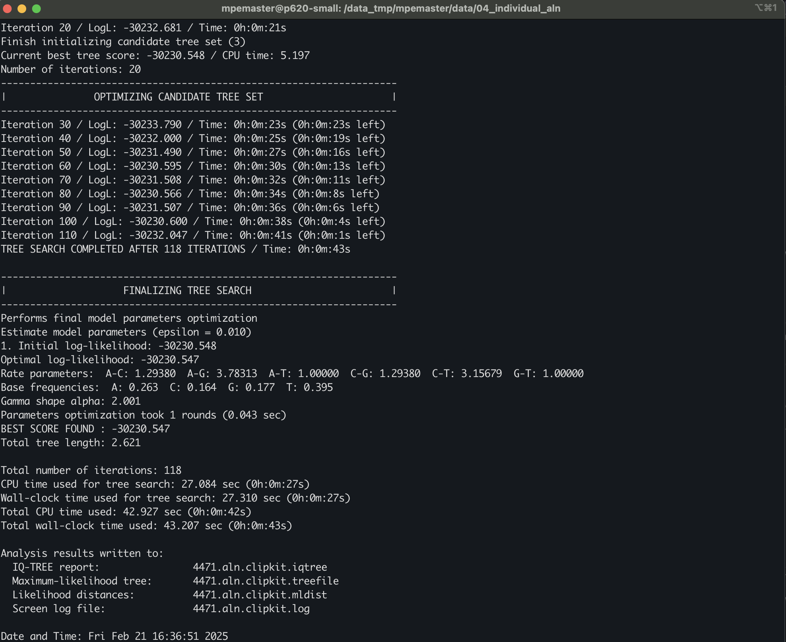

## Table of contents

* [Maximum-likelihood phylogenetic inference with IQ-TREE](#iqtree)
* [Reading and visualizing tree files](#figtree)
* [Assessing node support with bootstrapping](#boot)
* [Inferring a concatenated ML tree](#concat)

#### How to login to the workstation

	ssh -p 22110 USERNAME@xx.xxx.xxx.xx

### Every time you see `$USERNAME` in the example command, you need to replace it with your own [USERNAME](https://github.com/dfmoralesb/MPE_tutorials/blob/main/README.md) 

* To avoid having to change the `$USERNAME` for every command, you can set a variable to provide the name of it. ***Do this every time you connect to the workstation***

	For example, for me, Diego, my user name is `mpemaster`
	
		USERNAME=mpemaster

Make sure to activate the `CONDA` environment

	conda activate captus

## Maximum-likelihood phylogenetic inference with IQ-TREE

Maximum-likelihood phylogenetic inference aims to find the parameters of an evolutionary model that maximizes the likelihood of observing the dataset at hand. The model parameters include the tree topology and its branch lengths, as well as all parameters of the substitution model (e.g., GTR) assumed in the inference. 

* To see the many options available in IQ-TREE, you can type the following in the command line:

		iqtree --help

* You can scroll up and down to check all the available options. 

		
		
* IQ-TREE can be started just by providing the alignment name. We can try this with one of the individual alignments. IQ-TREE will run a default analysis (i.e., Model selection followed by ML inference using one CPU)

		cd /data_tmp/$USERNAME/data/04_individual_aln

		iqtree -s 4471.aln.clipkit 
		
	As you'll see, providing the alignment name is sufficient to run a simple IQ-TREE analysis, which should take a minute.
	
	

		

* Scroll back in the IQ-TREE output. Which one was the Best-fit model? 

* Scroll to the end, and there, you'll find parameter estimates for the selected substitution model, the maximum-likelihood value (given as a logarithm after "BEST SCORE FOUND"), information on the run time, and the names of output files.

* According to the IQ-TREE screen output, the best-scoring maximum-likelihood tree was written to the file `4471.aln.clipkit.treefile`

	

* The name of the output file was automatically chosen based on the name of the input file. This can be changed using the `--prefix` option.

* All input and inference parameters can be found in the files `4471.aln.clipkit.log` and `4471.aln.clipkit.iqtree`

## Reading and visualizing tree files

Here, we will explore how phylogenetic trees are encoded in Newick format, the most commonly used format in phylogenetic software. We will visualize the maximum-likelihood phylogeny generated with IQ-TREE with the program [FigTree](http://tree.bio.ed.ac.uk/software/figtree/). For more details about the Newick format, see [here](https://phylipweb.github.io/phylip/newicktree.html).

* Open the file `4471.aln.clipkit.treefile` in a text editor or on the command line using, for example, the `cat` command:

		less 4471.aln.clipkit.treefile
		
	You'll see a long string containing the taxon IDs, each followed by a colon and a number. The taxon IDs are embedded in parentheses.
		
		(MELI_Aglaia_spectabilis__00:0.0380179390,(((((((((((MELI_Aglaia_spectabilis__01:0.0506739175,MELI_Aphanamixis_polystachya__01:0.0535434293):0.0009582787,MELI_Cabralea_canjerana__02:0.0140979167):0.0148666359,(MELI_Guarea_pubescens__01:0.0393937815,MELI_Heckeldora_staudtii__01:0.0480125875):0.0064761451):0.0012831257,MELI_Vavaea_amicorum__01:0.0825715324):0.0169487786,(((((MELI_Azadirachta_indica:0.0004927154,MELI_Melia_azedarach:0.0020470950):0.0287155251,MELI_Owenia_reticulata:0.0313943437):0.0190395806,MELI_Pterorhachis_zenkeri:0.0425344882):0.0463844845,((((MELI_Carapa_procera:0.0243152104,MELI_Swietenia_macrophylla:0.0331743798):0.0364456250,(MELI_Lovoa_sywnnertonii__00:0.0534910638,MELI_Toona_ciliata__00:0.0222303545):0.0112998021):0.0146482776,((MELI_Chukrasia_tabularis:0.0603985313,MELI_Schmardaea_microphylla:0.0932356732):0.0059751090,(MELI_Lovoa_sywnnertonii__01:0.0715604163,MELI_Toona_ciliata__01:0.0270178220):0.0144402397):0.0049209856):0.0162916902,((RUTA_Citrus_hystrix:0.0955127303,(RUTA_Ruta_graveolens__00:0.0155031330,RUTA_Ruta_graveolens__01:0.0242888190):0.1909844938):0.0167509809,RUTA_Melicope_ternata:0.1640001395):0.1252373604):0.0051787758):0.0337809330,MELI_Quivisianthe_papinae:0.0833022953):0.0114346424):0.0016806024,(MELI_Trichilia_hirta:0.0527888671,MELI_Turraea_virens:0.0849778741):0.0198736252):0.0117351016,(((MELI_Aglaia_spectabilis__02:0.0392266628,MELI_Cabralea_canjerana__01:0.0213777247):0.0096306741,(MELI_Chisocheton_longistipitatus__01:0.0385910779,(MELI_Guarea_pubescens__02:0.0440549647,(MELI_Heckeldora_staudtii__00:0.0340058439,(MELI_Neoguarea_glomerulata__00:0.0617785610,MELI_Turraeanthus_manii:0.0430127959):0.0016654293):0.0005171647):0.0020616325):0.0010408630):0.0030760053,MELI_Vavaea_amicorum__00:0.0684560127):0.0027216237):0.0060321840,MELI_Guarea_pubescens__00:0.0535230595):0.0008256918,MELI_Neoguarea_glomerulata__01:0.0498438147):0.0017009200,MELI_Dysoxylum_alliaceum:0.0457100313):0.0021620938,(MELI_Aphanamixis_polystachya__00:0.0498633453,MELI_Chisocheton_longistipitatus__00:0.0379487095):0.0092600438):0.0086872234,MELI_Cabralea_canjerana__00:0.0201619645);
		
* Open FigTree, copy the above tree string, and paste it into a new FigTree window. You'll see a phylogeny, as shown in the screenshot below.

* To correct the rooting of the phylogeny, we can specify an outgroup. In this case, we are going to use the samples of Rutaceae. Click on the branch leading to "RUTA_Citrus_hystrix, RUTA_Ruta_graveolens, and RUTA_Melicope_ternata", as shown in the next screenshot.

* Then, with that branch selected, click on the "Reroot" icon with the yellow arrow in the menu bar. The phylogeny should then look as shown in the next screenshot.

* Finally, we could sort the taxa according to node order. To do so, select "Order nodes" -> "increasing" in FigTree's "Tree" menu. This should move Rutaceae to the bottom of the plot

* If instead, you use "Order nodes" -> "decreasing," then Rutaceae would be on the top of the plot. Both phylogenies are exactly the same; the relationships do not change. How you order the nodes is a matter of preference.

## Assessing node support with bootstrapping

We will now perform a bootstrap analysis to identify which nodes in the phylogeny are more or less trustworthy.

* To see the available options in IQ-TREE again, type:

		iqtree --help

* Scroll towards the top of the help text; there, you should find two sections titled "ULTRAFAST BOOTSTRAP/JACKKNIFE" and "NON-PARAMETRIC BOOTSTRAP/JACKKNIFE". In this occasion, we are going to use the `-B` option to perform [Ultrafast Bootstrap](https://academic.oup.com/mbe/article/35/2/518/4565479), which is a significantly fast implementation of the standard non-parametric bootstrap [Felsenstein, 1986](https://doi.org/10.1111/j.1558-5646.1985.tb00420.x). IQ-TREE recommends a minimum of 1,000 replicates, but IQ-TREE will automatically reduce this number if it detects that the resulting node-support values are stable after a lower number of replicates.

		 iqtree  -s 4471.aln.clipkit -B 1000 --prefix 4471.aln.clipkit.bootstrap -T 4
	
		
* This command will run the 1000 replicates for the ultrafast bootstrap + ML tree + consensus tree. Note that we are using the `--prefix` option to rename the output files. Otherwise, the file names would be the same as in the previous run, and IQ-TREE will produce an error and will ask to rewrite those files. The prefix not only provides the name of the files but also the directory path for the location of the output files.

	The analysis should be done in a minute or so.

* Open file `4471.aln.clipkit.bootstrap.treefile` in FigTree. You can use the `cat` command as before and copy and paste the tree string on FigTree.

		cat 4471.aln.clipkit.bootstrap.treefile
		
	It should look like this:		
		
		(MELI_Aglaia_spectabilis__00:0.0380191497,(((((((((((MELI_Aglaia_spectabilis__01:0.0506752054,MELI_Aphanamixis_polystachya__01:0.0535450023)89:0.0009585045,MELI_Cabralea_canjerana__02:0.0140978502)100:0.0148672057,(MELI_Guarea_pubescens__01:0.0393964385,MELI_Heckeldora_staudtii__01:0.0480148296)97:0.0064759238)79:0.0012827492,MELI_Vavaea_amicorum__01:0.0825759821)100:0.0169494621,(((((MELI_Azadirachta_indica:0.0004927390,MELI_Melia_azedarach:0.0020471203)100:0.0287150227,MELI_Owenia_reticulata:0.0313953162)100:0.0190407336,MELI_Pterorhachis_zenkeri:0.0425364445)100:0.0463861504,((((MELI_Carapa_procera:0.0243155357,MELI_Swietenia_macrophylla:0.0331749157)100:0.0364473094,(MELI_Lovoa_sywnnertonii__00:0.0534921501,MELI_Toona_ciliata__00:0.0222309475)100:0.0112997555)100:0.0146492009,((MELI_Chukrasia_tabularis:0.0604013008,MELI_Schmardaea_microphylla:0.0932412654)89:0.0059747898,(MELI_Lovoa_sywnnertonii__01:0.0715635995,MELI_Toona_ciliata__01:0.0270192067)99:0.0144402359)98:0.0049197057)100:0.0162920912,((RUTA_Citrus_hystrix:0.0955186534,(RUTA_Ruta_graveolens__00:0.0155041122,RUTA_Ruta_graveolens__01:0.0242876157)100:0.1910002272)93:0.0167476141,RUTA_Melicope_ternata:0.1640168719)100:0.1252496621)94:0.0051790366)100:0.0337816812,MELI_Quivisianthe_papinae:0.0833058020)100:0.0114346130)70:0.0016805028,(MELI_Trichilia_hirta:0.0527898689,MELI_Turraea_virens:0.0849819570)100:0.0198736602)100:0.0117354579,(((MELI_Aglaia_spectabilis__02:0.0392278898,MELI_Cabralea_canjerana__01:0.0213782169)100:0.0096307368,(MELI_Chisocheton_longistipitatus__01:0.0385930601,(MELI_Guarea_pubescens__02:0.0440566759,(MELI_Heckeldora_staudtii__00:0.0340066527,(MELI_Neoguarea_glomerulata__00:0.0617810110,MELI_Turraeanthus_manii:0.0430148729)47:0.0016660968)53:0.0005168096)56:0.0020618474)69:0.0010400015)93:0.0030760948,MELI_Vavaea_amicorum__00:0.0684575517)96:0.0027216476)100:0.0060321857,MELI_Guarea_pubescens__00:0.0535240875)80:0.0008254210,MELI_Neoguarea_glomerulata__01:0.0498460103)85:0.0017009147,MELI_Dysoxylum_alliaceum:0.0457119769)89:0.0021621374,(MELI_Aphanamixis_polystachya__00:0.0498655165,MELI_Chisocheton_longistipitatus__00:0.0379500863)48:0.0092601942)55:0.0086864611,MELI_Cabralea_canjerana__00:0.0201624965);

* Open the file or copy and paste it into FigTree. Root the tree with Rutaceae and sort the nodes as before. 

* To see node-support values based on bootstrapping, set a tick in the checkbox for "Node Labels", and select "label" from the "Display" drop-down menu, as shown in the below screenshot. 

## Inferring a concatenated ML tree

* Here, we are going to infer an ML tree with an IQ-tree using a concatenated alignment of the four loci. The input data is located in `/data_tmp/$USERNAME/data/05_concatenated_aln`.

		cd /data_tmp/$USERNAME/data/05_concatenated_aln

* You can see the size of the concatenated matrix by typing.

		pxlssq -s meliaceae_4_loci_concat.fa
		
* You will see the below lines on the screen.

		File type: fasta
		Number of sequences: 26
		Is aligned: true
		Sequence length: 10172
		--------- Nucl TABLE ----------
		Nucl        Total   Proportion
		   A        35374     0.133753
		   C        22638     0.085597
		   G        28479     0.107682
		   T        48785     0.184462
		   -       129194     0.488498
		   ?            2  7.56224e-06
		 G+C        51117     0.193279
		--------- Nucl TABLE ----------

		
* In this case, we are going to use a Partitioned maximum-likelihood inference. This means that we are going to split the alignment by loci and allow IQ-TREE to determine the ideal partitioning scheme itself. For this new need, a 'partition' file and the option `-p` The partition file is located in the same directory as the alignment. 

	You can see the contents of the partition file by
	
		cat meliaceae_4_loci_concat.model

	
The partition file specifies the kind of partition `DNA` a unique name of each partition (e.g., `4744.ortho.aln.clipkit;` this is just the name of the original alignment file), and the size of each partition (i.e., the range of each partition in the alignment).

* To tell IQ-TREE to determine the ideal partitioning scheme itself, we need to use the options `-m MFP --merge`. This tells IQ-TREE to perform model selection on each partition and combine similar partitions to find the best scheme. This uses the implementation of Kalyaanamoorthy et al., ([2017](http://dx.doi.org/10.1038/nmeth.4285))

* As in the individual gene tree, we are going to use an ultrafast bootstrap procedure with the `-B` option. 

		conda activate captus

		iqtree  -m MFP --merge -s meliaceae_4_loci_concat.fa -T 4 -B 1000 -p meliaceae_4_loci_concat.model --prefix meliaceae_4_loci_concat_iqtree

* Running this analysis should take longer than the previous analyses of one individual locus. One way to speed things up is by running IQ-TREE using multiple CPUs with the `-T` options. In this case, I will use `-T 2`. If you are not sure about the number of CPUs available, you can use `-T AUTO`

	The	run should take a couple of minutes
	
* To see the partition scheme and the best model of sequence evolution for each partition, open the file `meliaceae_4_loci_concat_iqtree.best_model.nex`

		cat meliaceae_4_loci_concat_iqtree.best_model.nex	

* Open the file `meliaceae_4_loci_concat_iqtree.treefile`

		cat meliaceae_4_loci_concat_iqtree.treefile

	It should look like this:		
		
		(RUTA_Citrus_hystrix:0.1333404082,((((MELI_Azadirachta_indica:0.0000022820,MELI_Melia_azedarach:0.0004332840)100:0.0352537630,MELI_Owenia_reticulata:0.0413693884)100:0.0714575929,(((((((MELI_Cabralea_canjerana:0.0280129490,(MELI_Dysoxylum_alliaceum:0.0467548646,MELI_Aphanamixis_polystachya:0.0463757195)69:0.0030437320)77:0.0065826003,MELI_Aglaia_spectabilis:0.0635843138)34:0.0020324749,MELI_Neoguarea_glomerulata:0.0662157360)38:0.0012302635,((MELI_Chisocheton_longistipitatus:0.0411742915,MELI_Guarea_pubescens:0.0405347424)98:0.0095659467,(MELI_Heckeldora_staudtii:0.0366329562,MELI_Turraeanthus_manii:0.0504721312)87:0.0028414441)42:0.0024614463)93:0.0048368051,MELI_Vavaea_amicorum:0.0767470383)55:0.0018879009,(MELI_Trichilia_hirta:0.0668925848,MELI_Turraea_virens:0.1012232421)65:0.0050327162)100:0.0297518086,MELI_Quivisianthe_papinae:0.1047196761)100:0.0310412939)94:0.0053706439,((MELI_Schmardaea_microphylla:0.1092039329,MELI_Chukrasia_tabularis:0.0640774861)100:0.0345984637,(((MELI_Swietenia_macrophylla:0.0288958230,MELI_Swietenia_mahagoni:0.0782094318)74:0.0090088279,MELI_Carapa_procera:0.0431718394)77:0.0268052469,(MELI_Toona_ciliata:0.0482342386,MELI_Lovoa_sywnnertonii:0.0662410364)85:0.0023999508)79:0.0177278780)100:0.0294898744)100:0.0968946248,(RUTA_Melicope_ternata:0.1768482942,RUTA_Ruta_graveolens:0.2584680576)77:0.0134061709);	

* Open the file in FigTree, root tit with Rutaceae, sort the taxa with "Increasing node order," and display the node support. You can see how the branch lengths and bootstrap support differ from a single-locus tree. 

