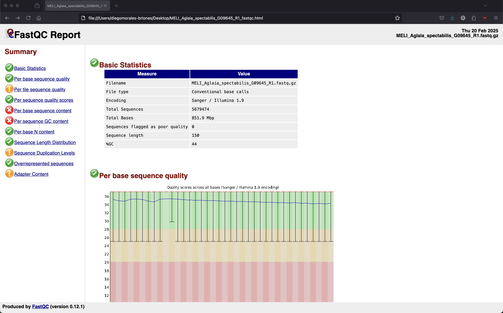
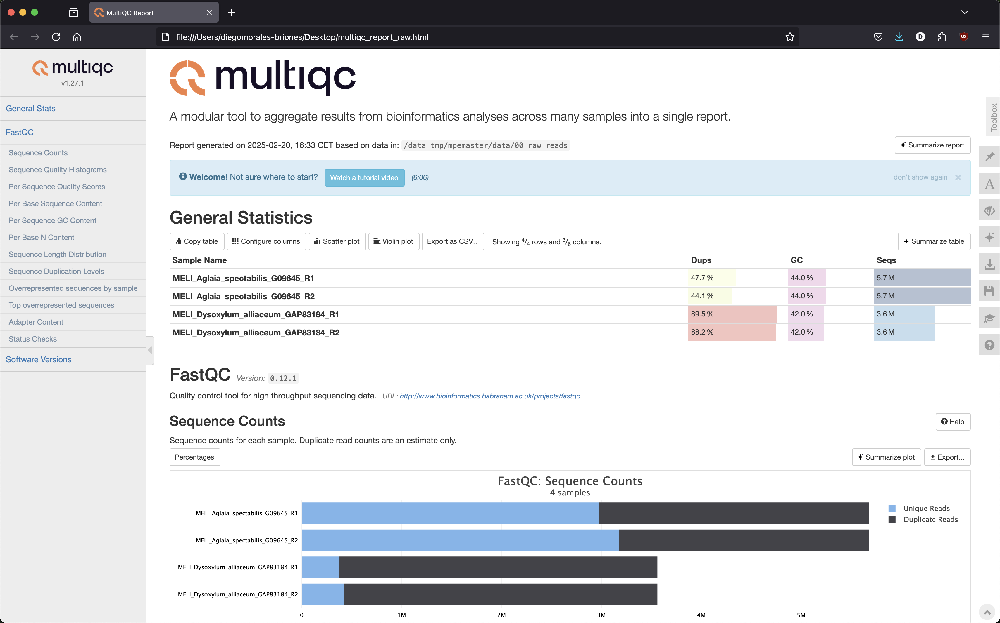
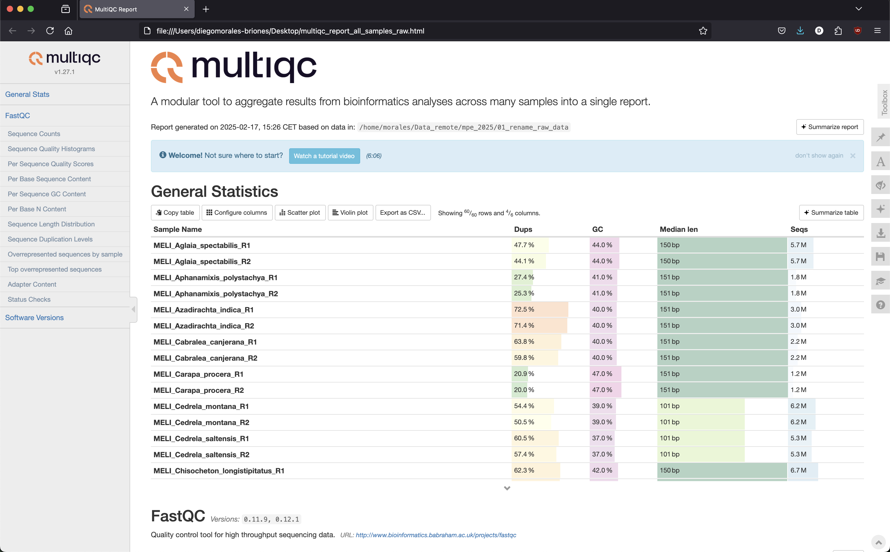
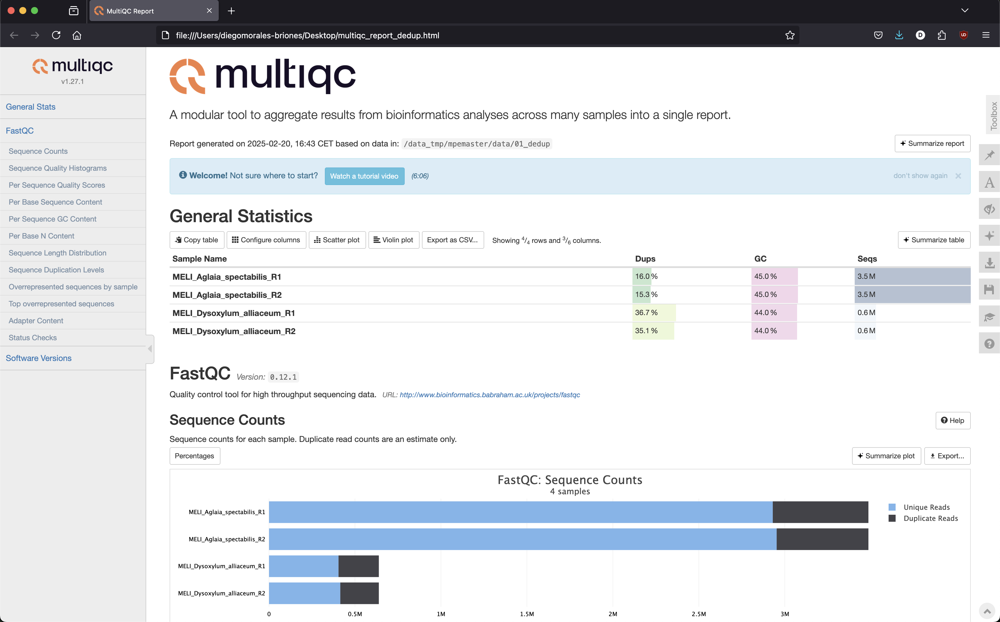
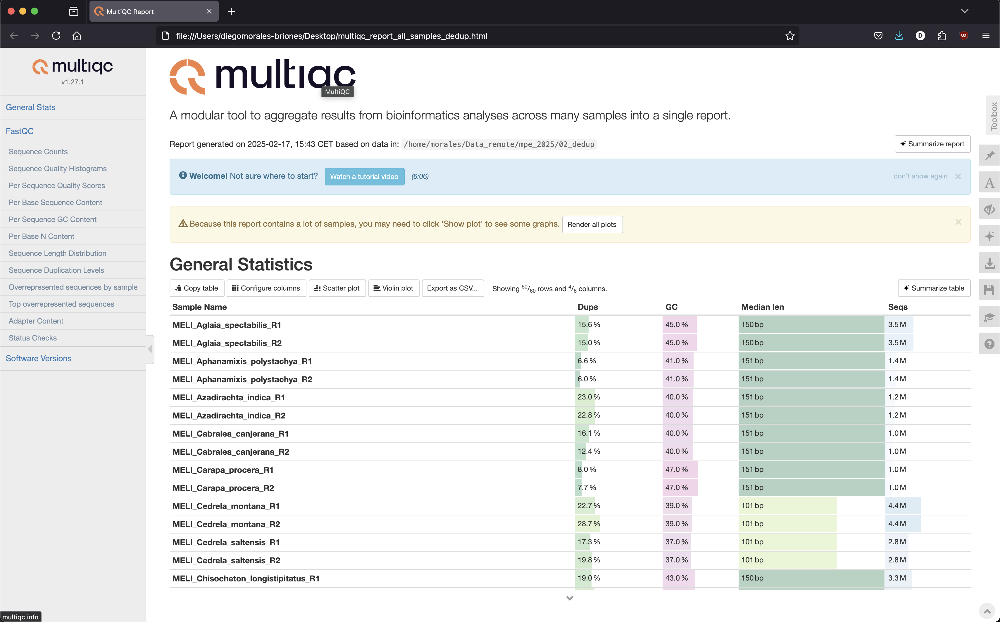
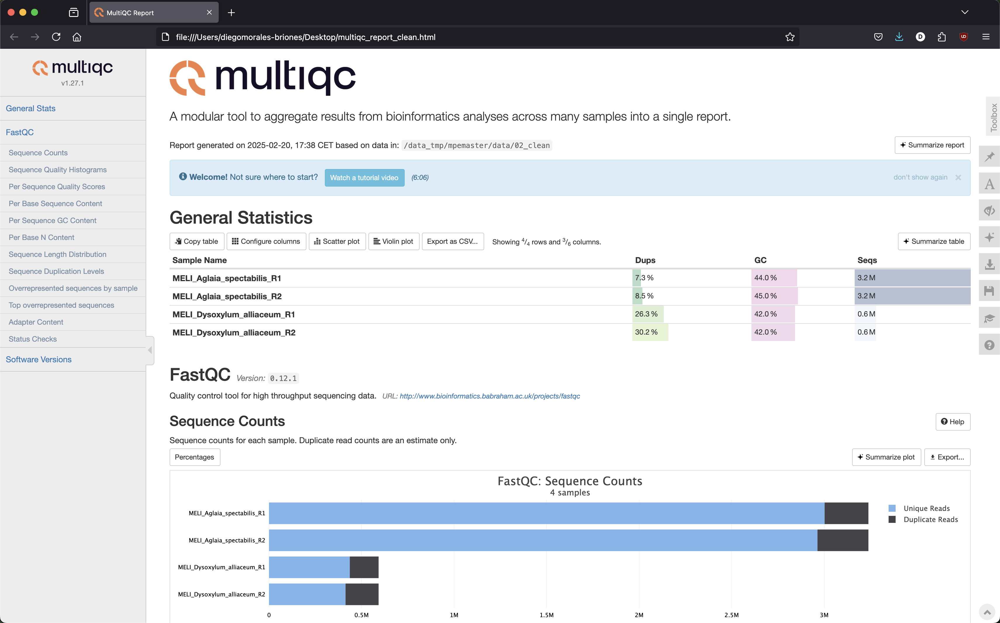

## Table of contents

* [FASTQ files](#fastq)
* [QC of FASTQ files](#qc)
* [Deduplication](#dedup)
* [Adaptor removal and cleaning of low-quality read](#adaptor)

#### How to login to the workstation

	ssh -p 22110 USERNAME@xx.xxx.xxx.xx

### Every time you see `$USERNAME` in the example command, you need to replace it with your own [USERNAME](https://github.com/dfmoralesb/MPE_tutorials/blob/main/README.md) 

* To avoid having to change the `$USERNAME` for every command, you can set a variable to provide the name of it. ***Do this every time you connect to the workstation***

	For example, for me, Diego, my user name is `mpemaster` 
	
		USERNAME=mpemaster

## NGS data - FASTQ files

* To see an example of raw data, go to

		cd /data_tmp/$USERNAME/data/00_raw_reads
		ls
	
	You will see files FASTQ for two species: <em>Aglaia_spectabilis</em> and <em>Dysoxylum_alliaceum</em>

		MELI_Aglaia_spectabilis_G09645_R1.fastq.gz  MELI_Dysoxylum_alliaceum_GAP83184_R1.fastq.gz
		MELI_Aglaia_spectabilis_G09645_R2.fastq.gz  MELI_Dysoxylum_alliaceum_GAP83184_R2.fastq.gz

	There are two files per species corresponding to the left and right reads, as this is paired-end data

* A FASTQ file has four line-separated fields per sequence. To see the sequence files, do

		zless MELI_Aglaia_spectabilis_G09645_R1.fastq.gz

	You will see this

		@A00119:588:HVWJMDRXY:2:2101:4182:1000 1:N:0:TCAGGCTT+TTCATGCG
		TTGCGAAGCCGAGCACCTCCCTTACACAACCCTCGACCTCCCAGTAACCACCACCGAGCTCAGAGCCGTTGGTAGTCGCCGAAAAATGCCGCACCAACACCGTGAAGCTCGGCTTCTTCTTCCCGTCGATTCGCCGTCCTCAAAGCCATT
		+
		FFFFFFFFFFF,FFFF:FFFF:FFFFFFFFFFFFFFFFFFFFFFFFFF:FFFFFFFFFFFF:,FFFFFFFFFFFFFFFFFFFFFFF,:FFFFFFFFFFFFFFFFFFFFFF:FFFFFFFFF:FFFF:FFF:::FFFFFFFFF:F,FFF::,

Line 1 begins with a '@' character and is followed by a sequence identifier and an optional description from the sequencing machine.
Line 2 is the sequence.
Line 3 begins with a '+' character. Usually, the only character in the line.
Line 4 encodes the quality values (in ASCII encoding) for the sequence in Line 2 and must contain the same number of symbols as letters.

* The quality goes from 0 to 40

| ! | " | # | $ | % | & | ' | ( | ) | * | + | , | - | . | / | 0 | 1 | 2 | 3 | 4 | 5 | 6 | 7 | 8 | 9 | : | ; | < | = | > | ? | @ | A | B | C | D | E | F | G | H | I | 
| - | - | - | - | - | - | - | - | - | - | - | - | - | - | - | - | - | - | - | - | - | - | - | - | - | - | - | - | - | - | - | - | - | - | - | - | - | - | - | - | - |
| 0 | 1 | 2 | 3 | 4 | 5 | 6 | 7 | 8 | 9 | 10 | 11 | 12 | 13 | 14 | 15 | 16 | 17 | 18 | 19 | 20 | 21 | 22 | 23 | 24 | 25 | 26 | 27 | 28 | 29 | 30 | 31 | 32 | 33 | 34 | 35 | 36 | 37 | 38 | 39 | 40 |

* If you check the other file for the same sample 

		zless MELI_Aglaia_spectabilis_G09645_R1.fastq.gz
	
	You can see that line 1 is identical except for the number of the read.
	
		@A00119:588:HVWJMDRXY:2:2101:4182:1000 2:N:0:TCAGGCTT+TTCATGCG
		TGAAGACGAGGAAGAGGAGGAGGAGGATAGTCTGTTAGCGGTGGTTGTGGCCCCTGAATGTCATTGAGGACGGCGAATCGACGGGAAGAAGAAGCCGAGCTTCACGGTGTTGGTGCGGCATTTTTCGGCGACTACCAACGGCTCTGAGCT
		+
		FF:FF:FFF,,:,:FF:FF,:FFF,,F,FFF:FFF:FF,FFFFF:FFFFF:F:F:,:F:,,FFF:,FF:F:,F::FFFF,FFF,FFFFFF:FFFFF:FFFFFF::,,:FF,:FFFFFFFFF:FFFF,:FFFF:F::F:F:FFF:F:F,FF

## NGS data - QC

* Now we are going to do quality control of the sequencing data with `fastqc`

* First, load the conda environment called `captus` in there; we will have most of the tools we need for QC and assembly.

		conda activate captus
	
* Now you can run `fastqc` in one of the files.

	 	fastqc MELI_Aglaia_spectabilis_G09645_R1.fastq.gz
	
	You will see the progress on the screen.

		Started analysis of MELI_Aglaia_spectabilis_G09645_R1.fastq.gz
		Approx 5% complete for MELI_Aglaia_spectabilis_G09645_R1.fastq.gz
		Approx 10% complete for MELI_Aglaia_spectabilis_G09645_R1.fastq.gz
		...
	
* Once FastQC is done, you will have two new files for that sequence file:

		MELI_Aglaia_spectabilis_G09645_R1_fastqc.html
		MELI_Aglaia_spectabilis_G09645_R1_fastqc.zip

* The first is an `HTML` report that you download and open locally in your internet browser, and the second is a `zip` containing the stats files that we will use later.

* To copy the `html` file to your laptop, do

#### THIS NEEDS TO BE TYPED IN A WINDOW ON YOUR LOCAL COMPUTER, NOT WHILE YOU ARE CONNECTED TO THE WORKSTATION. JUST OPEN A NEW TERMINAL WINDOW.

	scp -P 22110 USERNAME@xx.xxx.xxx.xx:/data_tmp/$USERNAME/data/00_raw_reads/MELI_Aglaia_spectabilis_G09645_R1_fastqc.html ~/Desktop
	
* Open the `html` file in your internet browser, and you should see something like this

* Now, we will go over the main parts of the report. If you want to watch a detailed tutorial, go [here](https://www.youtube.com/watch?v=bz93ReOv87Y)

* Now you need to run `fastqc` for the remaining files

		fastqc MELI_Aglaia_spectabilis_G09645_R2.fastq.gz MELI_Dysoxylum_alliaceum_GAP83184_R1.fastq.gz MELI_Dysoxylum_alliaceum_GAP83184_R2.fastq.gz -t 3
	
* TIP: You can also run as many files as you need at the same time with the wildcard `*` and `t` equivalent to the number of files to run in one in an individual processor (Do not do this during the course; it's just an example)

		echo fastqc * -t #

* Once `fastqc` is finished, we can run `multiqc` to summarize all individual reports in a single one. If you want to watch a detailed tutorial, go [here](https://www.youtube.com/watch?v=qPbIlO_KWN0)

		multiqc --filename multiqc_report_raw .
	
	You will see this

		/// MultiQC 🔍 v1.27.1
	
    	file_search | Search path: /data_tmp/$USERNAME/data/00_raw_reads
    		searching | ━━━━━━━━━━━━━━━━━━━━━━━━━━━━━━━━━━━━━━━━ 100% 15/15
    		fastqc | Found 4 reports
    		write_results | Data        : multiqc_report_raw_data
    		write_results | Report      : multiqc_report_raw.html
    		multiqc | MultiQC complete

* Once it is done, you will see a file called `multiqc_report.html` You need to download it to your laptop as you did before.

#### THIS NEEDS TO BE TYPED IN A WINDOW ON YOUR LOCAL COMPUTER, NOT WHILE YOU ARE CONNECTED TO THE WORKSTATION. JUST OPEN A NEW TERMINAL WINDOW.

	scp -P 22110 USERNAME@xx.xxx.xxx.xx:/data_tmp/$USERNAME/data/00_raw_reads/multiqc_report_raw.html ~/Desktop
	
* Open the `html` file in your internet browser, and you should see something like the picture below. If you want to watch a detailed tutorial, go [here](https://www.youtube.com/watch?v=qPbIlO_KWN0)

* To see the report `multiqc_report_all_samples_raw.html` for all 30 samples, go to 

		cd /data_tmp/$USERNAME/output/all_samples_reports
	
#### There you can find the report for this and future steps for all samples.

	scp -P 22110 USERNAME@xx.xxx.xxx.xx:/data_tmp/$USERNAME/output/all_samples_reports/multiqc_report_all_samples_raw.html ~/Desktop

## Deduplication of raw reads

* The deduplication process aims to remove PCR duplicates generated during library preparation and hybridization steps. While these deduplicated reads don't affect the assembly process, removing them will help to speed up the assembly process and avoid skews on the coverage calculation during assembly.

* We are going to deduplicate the reads with the tool `clumpify.sh` of `BBmap`

* First, let's create a new directory where to place the deduplicated reads.

		mkdir /data_tmp/$USERNAME/data/01_dedup
	
* Now, let's move back to the folder with the raw data.

		cd /data_tmp/$USERNAME/data/00_raw_reads

* To deduplicate the first pair of reads, do

		clumpify.sh in1=MELI_Aglaia_spectabilis_G09645_R1.fastq.gz in2=MELI_Aglaia_spectabilis_G09645_R2.fastq.gz out1=/data_tmp/$USERNAME/data/01_dedup/MELI_Aglaia_spectabilis_R1.dedup.fastq.gz out2=/data_tmp/$USERNAME/data/01_dedup/MELI_Aglaia_spectabilis_R2.dedup.fastq.gz ziplevel=9 dedupe=t
	
	You will see something like this

		java -ea -Xmx199355m -Xms199355m -cp /home/$USERNAME/miniconda3/envs/captus/opt/bbmap-38.84-0/current/ clump.Clumpify in1=MELI_Aglaia_spectabilis_G09645_R1.fastq.gz in2=MELI_Aglaia_spectabilis_G09645_R2.fastq.gz out1=/data_tmp/$USERNAME/data/01_dedup/MELI_Aglaia_spectabilis_R1.dedup.fastq.gz out2=/data_tmp/$USERNAME/data/01_dedup/MELI_Aglaia_spectabilis_R2.dedup.fastq.gz ziplevel=9 dedupe=t
		Executing clump.Clumpify [in1=MELI_Aglaia_spectabilis_G09645_R1.fastq.gz, in2=MELI_Aglaia_spectabilis_G09645_R2.fastq.gz, out1=/data_tmp/$USERNAME/data/01_dedup/MELI_Aglaia_spectabilis_R1.dedup.fastq.gz, out2=/data_tmp/$USERNAME/data/01_dedup/MELI_Aglaia_spectabilis_R2.dedup.fastq.gz, ziplevel=9, dedupe=t]
		Version 38.84
		
		Read Estimate:          51540788
		Memory Estimate:        39322 MB
		Memory Available:       163436 MB
		Set groups to 1
		Executing clump.KmerSort1 [in1=MELI_Aglaia_spectabilis_G09645_R1.fastq.gz, in2=MELI_Aglaia_spectabilis_G09645_R2.fastq.gz, out1=/data_tmp/$USERNAME/data/01_dedup/MELI_Aglaia_spectabilis_R1.dedup.fastq.gz, out2=/data_tmp/$USERNAME/data/01_dedup/MELI_Aglaia_spectabilis_R2.dedup.fastq.gz, groups=1, ecco=false, rename=false, shortname=f, unpair=false, repair=false, namesort=false, ow=true, ziplevel=9, dedupe=t]
	
* Run `clumpy` for the other pair as well

		clumpify.sh in1=MELI_Dysoxylum_alliaceum_GAP83184_R1.fastq.gz in2=MELI_Dysoxylum_alliaceum_GAP83184_R2.fastq.gz out1=/data_tmp/$USERNAME/data/01_dedup/MELI_Dysoxylum_alliaceum_R1.dedup.fastq.gz out2=/data_tmp/$USERNAME/data/01_dedup/MELI_Dysoxylum_alliaceum_R2.dedup.fastq.gz ziplevel=9 dedupe=t
	
* Now we are going to run `fastq` and `multiqc` on the deduplicated read to see do they look now

		cd /data_tmp/$USERNAME/data/01_dedup #to move to the directory where the deduplicated reads are
		fastqc *dedup.fastq.gz -t 4
		multiqc --filename multiqc_report_dedup . 
	
* Copy the report of the deduplicated read so we can compare it with the raw one

#### THIS NEEDS TO BE TYPED IN A WINDOW ON YOUR LOCAL COMPUTER, NOT WHILE YOU ARE CONNECTED TO THE WORKSTATION. JUST OPEN A NEW TERMINAL WINDOW.

	scp -P 22110 USERNAME@xx.xxx.xxx.xx:/data_tmp/$USERNAME/data/01_dedup/multiqc_report_dedup.html .

* Open the `html` file in your internet browser

* To see the report `multiqc_report_all_samples_dedup.html` for all 30 samples, go to 

		cd /data_tmp/$USERNAME/output/all_samples_reports
	
#### THIS NEEDS TO BE TYPED IN A WINDOW ON YOUR LOCAL COMPUTER, NOT WHILE YOU ARE CONNECTED TO THE WORKSTATION. JUST OPEN A NEW TERMINAL WINDOW.
	
	scp -P 22110 USERNAME@xx.xxx.xxx.xx:/data_tmp/$USERNAME/output/all_samples_reports/multiqc_report_all_samples_dedup.html ~/Desktop

## Adaptor removal and cleaning of low-quality read

* We are going to remove the Illumina sequencing adaptor and low-quality reads using `bbduk`

* Move back to the directory where the deduplicated reads are

		/data_tmp/$USERNAME/data/01_dedup

* First, we are going to remove the adaptors

		bbduk.sh in=MELI_Aglaia_spectabilis_R1.dedup.fastq.gz in2=MELI_Aglaia_spectabilis_R2.dedup.fastq.gz out=MELI_Aglaia_spectabilis_R1.adapt.fastq.gz out2=MELI_Aglaia_spectabilis_R2.adapt.fastq.gz ref=/data_tmp/$USERNAME/data/others/adapters.fa

	You should start seeing this

		java -ea -Xmx102106m -Xms102106m -cp /home/$USERNAME/miniconda3/envs/captus/opt/bbmap-38.84-0/current/ jgi.BBDuk in=MELI_Aglaia_spectabilis_R1.dedup.fastq.gz in2=MELI_Aglaia_spectabilis_R2.dedup.fastq.gz out=MELI_Aglaia_spectabilis_R1.adapt.fastq.gz out2=MELI_Aglaia_spectabilis_R2.adapt.fastq.gz ref=/data_tmp/$USERNAME/data/others/adapters.fa
		Executing jgi.BBDuk [in=MELI_Aglaia_spectabilis_R1.dedup.fastq.gz, in2=MELI_Aglaia_spectabilis_R2.dedup.fastq.gz, out=MELI_Aglaia_spectabilis_R1.adapt.fastq.gz, out2=MELI_Aglaia_spectabilis_R2.adapt.fastq.gz, ref=/data_tmp/$USERNAME/data/others/adapters.fa]
		Version 38.84
		
		0.035 seconds.
		Initial:
		Memory: max=107072m, total=107072m, free=106988m, used=84m
		
		Added 797 kmers; time: 	0.013 seconds.
		Memory: max=107072m, total=107072m, free=106854m, used=218m

* Once it is done, you can run `bbduk` for the other pair of files

		bbduk.sh in=MELI_Dysoxylum_alliaceum_R1.dedup.fastq.gz in2=MELI_Dysoxylum_alliaceum_R2.dedup.fastq.gz out=MELI_Dysoxylum_alliaceum_R1.adapt.fastq.gz out2=MELI_Dysoxylum_alliaceum_R2.adapt.fastq.gz ref=/data_tmp/$USERNAME/data/others/adapters.fa

* Now, let's create a new directory where we will place the final clean files

		mkdir /data_tmp/$USERNAME/data/02_clean

* Run `bbduk` to remove low-quality reads

		bbduk.sh in=MELI_Aglaia_spectabilis_R1.adapt.fastq.gz in2=MELI_Aglaia_spectabilis_R2.adapt.fastq.gz out1=/data_tmp/$USERNAME/data/02_clean/MELI_Aglaia_spectabilis_R1.clean.fastq.gz out2=/data_tmp/$USERNAME/data/02_clean/MELI_Aglaia_spectabilis_R2.clean.fastq.gz qtrim=rl trimq=20 minavgquality=20

	You should see this

		java -ea -Xmx102100m -Xms102100m -cp /home/$USERNAME/miniconda3/envs/captus/opt/bbmap-38.84-0/current/ jgi.BBDuk in=MELI_Aglaia_spectabilis_R1.adapt.fastq.gz in2=MELI_Aglaia_spectabilis_R2.adapt.fastq.gz out1=/data_tmp/$USERNAME/data/02_clean/MELI_Aglaia_spectabilis_R1.clean.fastq.gz out2=/data_tmp/$USERNAME/data/02_clean/MELI_Aglaia_spectabilis_R2.clean.fastq.gz qtrim=rl trimq=20 minavgquality=20
		Executing jgi.BBDuk [in=MELI_Aglaia_spectabilis_R1.adapt.fastq.gz, in2=MELI_Aglaia_spectabilis_R2.adapt.fastq.gz, out1=/data_tmp/$USERNAME/data/02_clean/MELI_Aglaia_spectabilis_R1.clean.fastq.gz, out2=/data_tmp/$USERNAME/data/02_clean/MELI_Aglaia_spectabilis_R2.clean.fastq.gz, qtrim=rl, trimq=20, minavgquality=20]
		Version 38.84
		
		0.033 seconds.
		Initial:
		Memory: max=107072m, total=107072m, free=106988m, used=84m
	

* Now run `bbduk` for the other sample

		bbduk.sh in=MELI_Dysoxylum_alliaceum_R1.adapt.fastq.gz in2=MELI_Dysoxylum_alliaceum_R2.adapt.fastq.gz out1=/data_tmp/$USERNAME/data/02_clean/MELI_Dysoxylum_alliaceum_R1.clean.fastq.gz out2=/data_tmp/$USERNAME/data/02_clean/MELI_Dysoxylum_alliaceum_R2.clean.fastq.gz qtrim=rl trimq=20 minavgquality=20

* Finally, let's create a report for the final clean read so we can compare it with the raw reads

		cd /data_tmp/$USERNAME/data/02_clean
		fastqc * -t 4
		multiqc --filename multiqc_report_clean .
		
* Copy the report to your laptop and open it in the browser

#### THIS NEEDS TO BE TYPED IN A WINDOW ON YOUR LOCAL COMPUTER, NOT WHILE YOU ARE CONNECTED TO THE WORKSTATION. JUST OPEN A NEW TERMINAL WINDOW.

	scp -P 22110 $USERNAME@xx.xxx.xxx.xx:/data_tmp/$USERNAME/data/02_clean/multiqc_report_clean.html ~/Desktop

#### These reads are ready for assembly!!!

* We will see the report of the clean reads of all 30 samples in the next tutorial.

