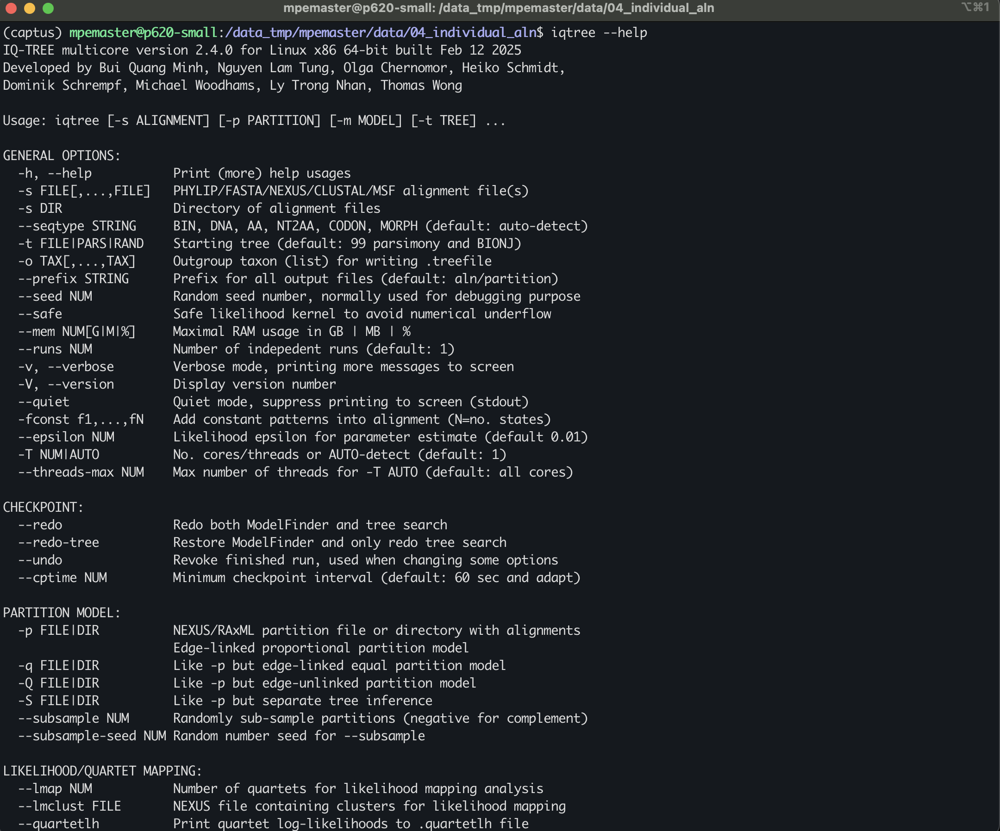
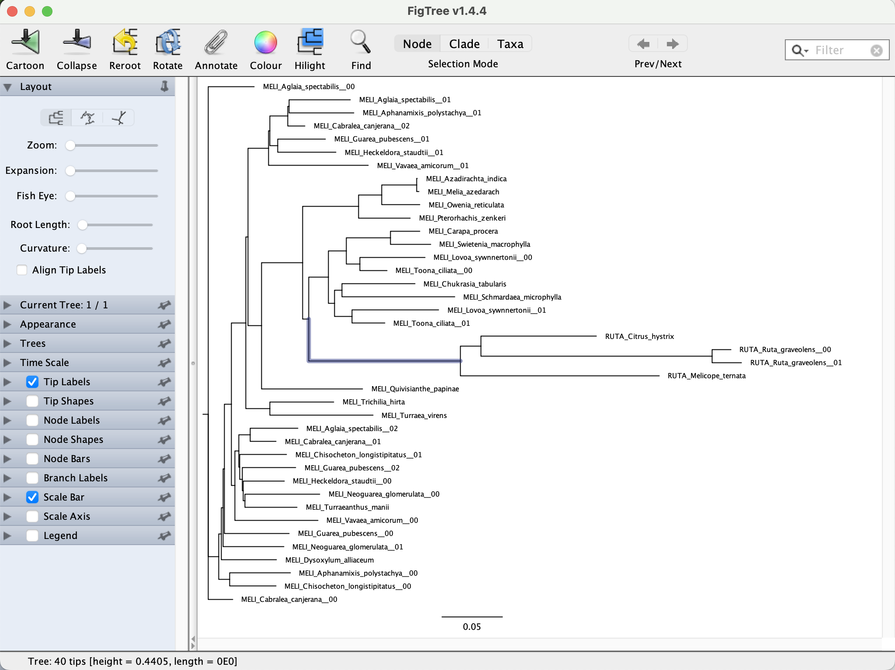
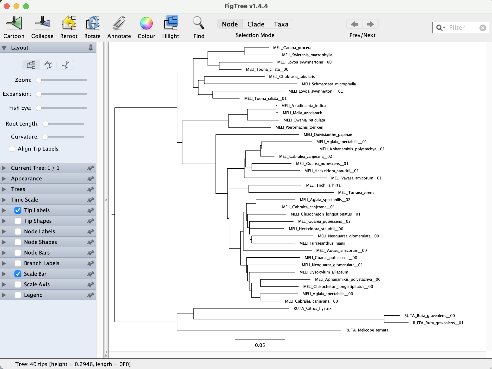
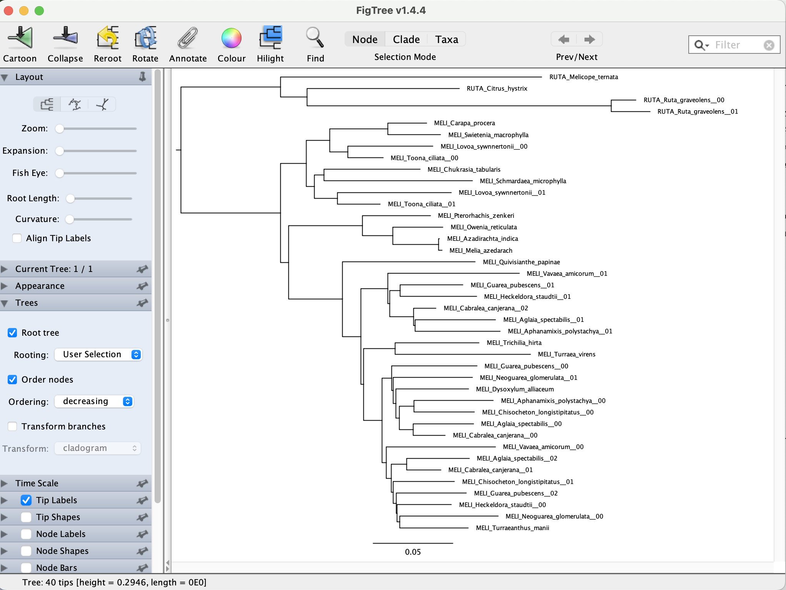
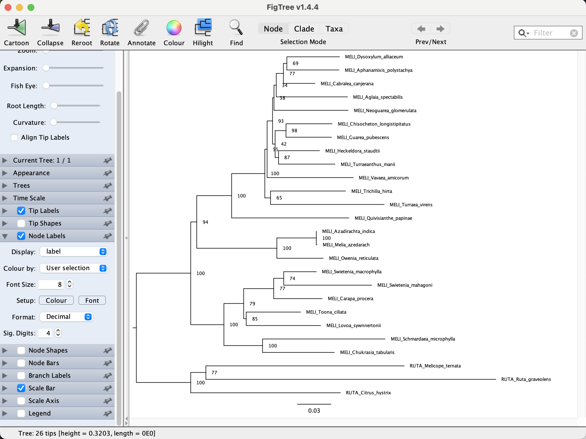

## Table of contents

* [FASTQ files](#fastq)
* [QC of FASTQ files](#qc)
* [Assessing node support with bootstrapping](#boot)
* [Inferring a concatenated ML tree](#concat)
* [Alternative node support values - Concordance factors](#concordance)

## NGS data - FASTQ files

To see an example of raw data go to

	cd /data_tmp/[username]/data/00_raw_reads
	ls
	
You will see files FASTQ for two species: <em>Aglaia_spectabilis</em> and <em>Dysoxylum_alliaceum</em>

	MELI_Aglaia_spectabilis_G09645_R1.fastq.gz  MELI_Dysoxylum_alliaceum_GAP83184_R1.fastq.gz
	MELI_Aglaia_spectabilis_G09645_R2.fastq.gz  MELI_Dysoxylum_alliaceum_GAP83184_R2.fastq.gz

There are two file per each species corresponding to the left and right reads as this is paired-end data

A FASTQ file has four line-separated fields per sequence. To see the sequence files do

	zless MELI_Aglaia_spectabilis_G09645_R1.fastq.gz

You will see this

	@A00119:588:HVWJMDRXY:2:2101:4182:1000 1:N:0:TCAGGCTT+TTCATGCG
	TTGCGAAGCCGAGCACCTCCCTTACACAACCCTCGACCTCCCAGTAACCACCACCGAGCTCAGAGCCGTTGGTAGTCGCCGAAAAATGCCGCACCAACACCGTGAAGCTCGGCTTCTTCTTCCCGTCGATTCGCCGTCCTCAAAGCCATT
	+
	FFFFFFFFFFF,FFFF:FFFF:FFFFFFFFFFFFFFFFFFFFFFFFFF:FFFFFFFFFFFF:,FFFFFFFFFFFFFFFFFFFFFFF,:FFFFFFFFFFFFFFFFFFFFFF:FFFFFFFFF:FFFF:FFF:::FFFFFFFFF:F,FFF::,

Line 1 begins with a '@' character and is followed by a sequence identifier and an optional description from the sequencing machine
Line 2 is the sequence
Line 3 begins with a '+' character. Usually the only character in the line.
Line 4 encodes the quality values (in ASCII encoding) for the sequence in Line 2, and must contain the same number of symbols as letters in the sequence.

The quality goes from 0 to 40

| ! | " | # | $ | % | & | ' | ( | ) | * | + | , | - | . | / | 0 | 1 | 2 | 3 | 4 | 5 | 6 | 7 | 8 | 9 | : | ; | < | = | > | ? | @ | A | B | C | D | E | F | G | H | I | 
| - | - | - | - | - | - | - | - | - | - | - | - | - | - | - | - | - | - | - | - | - | - | - | - | - | - | - | - | - | - | - | - | - | - | - | - | - | - | - | - | - |
| 0 | 1 | 2 | 3 | 4 | 5 | 6 | 7 | 8 | 9 | 10 | 11 | 12 | 13 | 14 | 15 | 16 | 17 | 18 | 19 | 20 | 21 | 22 | 23 | 24 | 25 | 26 | 27 | 28 | 29 | 30 | 31 | 32 | 33 | 34 | 35 | 36 | 37 | 38 | 39 | 40 |

If you check the other file for the same sample 

	zless MELI_Aglaia_spectabilis_G09645_R1.fastq.gz
	
You can see that line 1 is identical except for the number of the read
	
	@A00119:588:HVWJMDRXY:2:2101:4182:1000 2:N:0:TCAGGCTT+TTCATGCG
	TGAAGACGAGGAAGAGGAGGAGGAGGATAGTCTGTTAGCGGTGGTTGTGGCCCCTGAATGTCATTGAGGACGGCGAATCGACGGGAAGAAGAAGCCGAGCTTCACGGTGTTGGTGCGGCATTTTTCGGCGACTACCAACGGCTCTGAGCT
	+
	FF:FF:FFF,,:,:FF:FF,:FFF,,F,FFF:FFF:FF,FFFFF:FFFFF:F:F:,:F:,,FFF:,FF:F:,F::FFFF,FFF,FFFFFF:FFFFF:FFFFFF::,,:FF,:FFFFFFFFF:FFFF,:FFFF:F::F:F:FFF:F:F,FF

Now we are going to do quality control of the sequencing data with `fastqc`

First load the conda environment call `captus` in there we will have most of the tools we need for QC and assembly

	conda activate captus
	
Now you can run `fastqc` in one of the files

	fastqc MELI_Aglaia_spectabilis_G09645_R1.fastq.gz
	
You will see the on the screen the progress

	Started analysis of MELI_Aglaia_spectabilis_G09645_R1.fastq.gz
	Approx 5% complete for MELI_Aglaia_spectabilis_G09645_R1.fastq.gz
	Approx 10% complete for MELI_Aglaia_spectabilis_G09645_R1.fastq.gz
	...
	
One FastQC is done you will have two new files for that sequence file:

	MELI_Aglaia_spectabilis_G09645_R1_fastqc.html
	MELI_Aglaia_spectabilis_G09645_R1_fastqc.zip

The first is a `html` report that you download and open locally in your internet browser and the second is a `zip` contining the stat files that we will use later.

To copy the `html` file to your laptop do

	scp -P 22110 [username]@10.153.134.10:/data_tmp/mpemaster/data/00_raw_reads/MELI_Aglaia_spectabilis_G09645_R1_fastqc.html .
	
Open the `html` file in your internet browser and you should see something like this

Now we will go over the main parts of the report. If you want to watch a detail tutorial go [here](https://www.youtube.com/watch?v=bz93ReOv87Y)

Now you need to run `fastqc` for the remaning files

	fastqc MELI_Aglaia_spectabilis_G09645_R2.fastq.gz MELI_Dysoxylum_alliaceum_GAP83184_R1.fastq.gz MELI_Dysoxylum_alliaceum_GAP83184_R2.fastq.gz -t 3
	
TIP: You can also run as many files you need at the same time with the wildcard `*` and `t` equivalent to the number of files to run in one in an individual processor (Do not do this during the course; it's just an example)

	echo fastqc * -t #

Once `fastqc` is finished we can run `multiqc` to summarized all individual report in a single one

	mulitqc .
	
You will see this

	/// MultiQC 🔍 v1.27.1

       file_search | Search path: /data_tmp/mpemaster/data/00_raw_reads
         searching | ━━━━━━━━━━━━━━━━━━━━━━━━━━━━━━━━━━━━━━━━ 100% 12/12
            fastqc | Found 4 reports
     write_results | Data        : multiqc_data
     write_results | Report      : multiqc_report.html
           multiqc | MultiQC complete

One is done you will see file called `multiqc_report.html` You need to download to your laptop as before

	scp -P 22110 [username]@10.153.134.10:/data_tmp/mpemaster/data/00_raw_reads/multiqc_report.html .
	
Open the `html` file in your internet browser and you should see something like this

Maximum-likelihood phylogenetic inference aims to find the parameters of an evolutionary model that maximize the likelihood of observing the dataset at hand. The model parameters include the tree topology and its branch lengths but also all parameter of the substitution model (e.g., GTR) assumed in the inference. 

* To see the many options available in IQ-TREE you can type the following in the command line:

		/home/morales/Apps/iqtree-2.0.7-Linux/bin/iqtree2 --help

* You can scroll up and down to check all the available options. 

		
		
* IQ-TREE can be started just by providing the alignment name. We can try this with one of the individual alignments. IQ-TREE will run a default analyses (i.e. Model selection followed of ML inference using one CPU)

		/home/morales/Apps/iqtree-2.0.7-Linux/bin/iqtree2 -s DATA/IQ-tree_individual_loci/input/Locus_1562.x.phy 
		
	As you'll see, just providing the alignment name is sufficient to run a simple IQ-TREE analyses.

		

* Scroll to the end of the IQ-TREE output. There, you'll find parameter estimates for the selected substitution model, the maximum-likelihood value (given as logarithm after "BEST SCORE FOUND"), information on the run time, and the names of output files.

* According to the IQ-TREE screen output, the best-scoring maximum-likelihood tree was written to file `Locus_1562.x.phy.treefile`:

* All output file names were automatically chosen based on the name of the input file. This be changed this using the `--prefix` option.

## Reading and visualizing tree files

Here we will explore how phylogenetic trees are encoded in Newick format, the most commonly used format in phylogenetic sofware, and we will visualize the maximum-likelihood phylogeny generated with IQ-TREE with the program [FigTree](http://tree.bio.ed.ac.uk/software/figtree/). For more detail about the newick format see [here](http://evolution.genetics.washington.edu/phylip/newicktree.html).

* Open the file `Locus_1562.x.phy.treefile` in a text editor, or on the command line using, for example, the `less` command:

		less DATA/IQ-tree_individual_loci/input/Locus_1562.x.phy.treefile
		
	You'll see a long string containing the taxon IDs, each of which is followed by a colon and a number, and together with these, the taxon IDs are embedded in parentheses.
		
		(A_arboreum_153:0.0000010000,(((((((A_balsamiferum_TM178:0.0000010000,A_leucoblepharu:0.0000010000):0.0030523931,(A_gorgoneum_TM185:0.0000010000,A_stuessyi_TM2031:0.0000010000):0.0028665085):0.0028569672,A_cuneatum_134:0.0057941060):0.0000010000,A_canariense_TM189:0.0028868572):0.0028790905,((((A_goochiae_TM184:0.0000010000,A_lindleyi_TM190:0.0000010000):0.0086830962,A_saundersii_merged:0.0029994261):0.0030109370,Mon_mura_111:0.0315882241):0.0030478381,A_sedifolium_TM187:0.0029232996):0.0151856647):0.0000010000,(((A_ciliatum_135:0.0000010000,Aeo_haworthii:0.0000010000):0.0000010000,(((A_nobile_TM191:0.0000000000,A_volkerii_TM194:0.0000000000):0.0000010000,A_urbicum_TM2001:0.0000010000):0.0000010000,A_valverdense_TM2131:0.0000010000):0.0000010000):0.0029245985,A_davidbramwellii_TM2021:0.0028736162):0.0029110197):0.0000010000,Aeo_glutinosum:0.0028595971):0.0086818059,Aeo_korneliuslemsii:0.0000010000);
		
* Open FigTree, copy the above tree string and paste it into a new FigTree window. You'll see a phylogeny as shown in the screenshot below.

* To correct the rooting of the phylogeny, we can specify an outgroup. In case we are going to use "Mon_mura_111" as root. Click on the branch leading to "Mon_mura_111", as shown in the next screenshot.

* Then, with that branch being selected, click on the "Reroot" icon with the yellow arrow in the menu bar. The phylogeny should then look as shown in the next screenshot.

* Finally, we could sort the taxa according to node order. To do so, click "Increasing node order" in FigTree's "Tree" menu. This should move "Mon_mura_111" to the bottom of the plot

## Assessing node support with bootstrapping

To identify which nodes in the phylogeny are more or less trustworthy, we will now perform a bootstrap analysis.

* To see again the available options in IQ-TREE type:

		/home/morales/Apps/iqtree-2.0.7-Linux/bin/iqtree2 --help

* Scroll towards the top of the help text, there you should find two sections titled "ULTRAFAST BOOTSTRAP/JACKKNIFE" and "NON-PARAMETRIC BOOTSTRAP/JACKKNIFE". In this occasion we are going to use the `-b` option to perform the standard non-parametric bootstrap Felsenstein ([1986](https://doi.org/10.1111/j.1558-5646.1985.tb00420.x)). 

		 /home/morales/Apps/iqtree-2.0.7-Linux/bin/iqtree2  -s DATA/IQ-tree_individual_loci/input/Locus_1562.x.phy -b 200 --prefix DATA/IQ-tree_individual_loci/input/Locus_1562.x.bs
	
		
* This command will run the Replicates for bootstrap + ML tree + consensus tree. Note that we are using the `--prefix` option to rename the output files. Otherwise the file names would be the same as in the previous run and IQ-TREE will produced an error and will ask to rewrite those files. The prefix not only provides the name of the files but also the directory path for the location of the output files.

* Open file `Locus_1562.x.bs.treefile` in FigTree. You can use the `less` command as before and copy and paste the tree string on FigTree.

		less DATA/IQ-tree_individual_loci/input/Locus_1562.x.bs.treefile
		
	It should look like this:		
		
		(A_arboreum_153:0.0000010000,(((((((A_balsamiferum_TM178:0.0000010000,A_leucoblepharu:0.0000010000)99:0.0030520595,(A_gorgoneum_TM185:0.0000010000,A_stuessyi_TM2031:0.0000010000)69:0.0028660844)57:0.0028566025,A_cuneatum_134:0.0057936629)13:0.0000010000,A_canariense_TM189:0.0028860818)32:0.0028788372,((((A_goochiae_TM184:0.0000010000,A_lindleyi_TM190:0.0000010000)90:0.0086815307,A_saundersii_merged:0.0029990833)56:0.0030101098,Mon_mura_111:0.0315848208)53:0.0030486613,A_sedifolium_TM187:0.0029239609)91:0.0151842687)21:0.0000010000,((((A_ciliatum_135:0.0000010000,Aeo_haworthii:0.0000010000)57:0.0000010000,((A_nobile_TM191:0.0000010000,A_urbicum_TM2001:0.0000010000)21:0.0000010000,A_volkerii_TM194:0.0000010000)14:0.0000010000)15:0.0000010000,A_valverdense_TM2131:0.0000010000)84:0.0029242856,A_davidbramwellii_TM2021:0.0028736910)56:0.0029108013)13:0.0000010000,Aeo_glutinosum:0.0028585680)97:0.0086808756,Aeo_korneliuslemsii:0.0000010000);

* Open the file or copy and paste in FigTree. Root the tree with "Mon_mura_111" and sort the taxa with "Increasing node order". 

* To see node-support values based on bootstrapping, set a tick in the checkbox for "Node Labels", and select "label" from the "Display" drop-down menu, as shown in the below screenshot. 

* To estimate a coalescent-based species tree with ASTRAL, we need to infer the indvidual ML gene trees for each of the 2420 alignments in the folder `DATA/IQ-tree_individual_loc/input`. 

	You do not need to do this as all the output files are already located in `DATA/IQ-tree_individual_loc/output`. But you could do it with a bash loop like:
	
	
		for i in $(ls *.phy)
		do
		iqtree2 -s $i -b 200
		done

## Inferring a concatenated ML tree

Here we are going to infer a ML tree with IQ-tree using a concatenated alignment of the 2419 loci. The input data is located in `DATA/IQ-tree_concatenated/input`.

* You can see the size of the concatenated matrix by typing.

		head -n 1 DATA/IQ-tree_concatenated/input/concatenated_2419_loci.phy
		
* You will see printed on the screen the below line. That means that the alignment contains 21 taxa and 848730 aligned columns.

		21 848730
		
* In this case we are going to use do a Partitioned maximum-likelihood inference. This means that we are going to split the alignment by loci and allow IQ-TREE to determine the ideal partitioning scheme itself. For this new need a 'partion' file and the option `q`. The partion file is located in the same directory as the alignment. 

You can see the beginning (head) of the file by typing.

		 head DATA/IQ-tree_concatenated/input/concatenated_aln.model
		 
And also can see the end (tail) 

		tail DATA/IQ-tree_concatenated/input/concatenated_aln.model

	
The partition file specifies the kind of partition `DNA` a unique name of each partion (e.g. `fasta_files/Locus_597.x.phy.fa;` this is just the name of the original alignment file) and the size of each partition (i.e. the range of the each partion in the alignment).

* To tell IQ-TREE to determine the ideal partitioning scheme itself, we need to use the options `-m MFP --merge`. This tells IQ-TREE to perform model selection on each partition and combine similar partiton to find the best scheme. This uses the implementation of Kalyaanamoorthy et al. ([2017](http://dx.doi.org/10.1038/nmeth.4285))

* In this occasion we are going to use ultrafast bootstrap procedure with the `-B` option. IQ-TREE recommends a a minimum of 1,000 replicates, but IQ-TREE will automatically reduce this number if it detects that the resulting node-support values are stable also after a lower number of replicates. See Hoang et al. ([2017](https://academic.oup.com/mbe/article/35/2/518/4565479)) for more details. 

		/home/morales/Apps/iqtree-2.0.7-Linux/bin/iqtree2  -m MFP --merge -s concatenated_2419_loci.fa -T 120 -B 1000 -q concatenated_aln.model --prefix DATA/IQ-tree_concatenated/output/IQtree2_concatenated_2419_loci

* Running this analysis should be considerabl longer than the previous analysis of one individual locus. One way to speed things up is running IQ-TREE using multiple CPUs with the `-T` options. In this case, I will use `-T 120`. If not sure about the number of CPUs available you can use `-T AUTO`

* You do not need to run this as it will take too much time. The output files for this analyses are located at `DATA/IQ-tree_concatenated/output`.

* Open the file `IQtree2_concatenated_2419_loci.treefile`

		less DATA/IQ-tree_concatenated/output/IQtree2_concatenated_2419_loci.treefile

	It should look like this:		
		
		(A_arboreum_153:0.0014849078,(A_balsamiferum_TM178:0.0011535530,(((((A_cuneatum_134:0.0065514518,A_canariense_TM189:0.0072583511)100:0.0015530642,Aeo_glutinosum:0.0090574484)100:0.0023872758,(((((A_ciliatum_135:0.0026558778,A_volkerii_TM194:0.0024888707)100:0.0009839747,A_urbicum_TM2001:0.0042130349)100:0.0012161129,Aeo_haworthii:0.0022985151)100:0.0014098253,A_davidbramwellii_TM2021:0.0056304679)100:0.0023965907,(A_valverdense_TM2131:0.0052622481,A_nobile_TM191:0.0082347492)100:0.0020565574)100:0.0032489645)87:0.0016314676,(((A_goochiae_TM184:0.0064710978,A_lindleyi_TM190:0.0061792425)100:0.0097779590,Mon_mura_111:0.0434930391)84:0.0012266869,(A_saundersii_merged:0.0128397974,A_sedifolium_TM187:0.0140337688)100:0.0025872713)100:0.0048456363)100:0.0053188993,((A_stuessyi_TM2031:0.0005572773,A_leucoblepharu:0.0009037328)99:0.0006215380,A_gorgoneum_TM185:0.0010816831)100:0.0022975052)100:0.0054524452)100:0.0008226453,Aeo_korneliuslemsii:0.0019086054);
	
* Open the file in FigTree, root tit with "Mon_mura_111", sort the taxa with "Increasing node order" and display the node support. You can see how the brach lengths and bootstrap support differ from a single-locus tree. 

## Alternative node support values - Concordance factors

* When working with phylogenomic data sets, it is pretty common that tradicional node support values like bootstrap to be always high. This is due to the large amount of data available that make even known incorrect topologies to have high support, making this support measures inappropriate for large data sets. Now there are several alternative and more appropriate node support measures that quantify for genealogical concordance like [Concordance factors in IQ-Tree](http://www.iqtree.org/doc/Concordance-Factor).

* To calculate concordance factors in IQ-Tree you need the concatenated alignment and the inferred tree. You can run IQ-Tree like:

		/home/morales/Apps/iqtree-2.0.7-Linux/bin/iqtree2 -t DATA/IQ-tree_concatenated/output/IQtree2_concatenated_2419_loci.iqtree -s DATA/IQ-tree_concatenated/input/concatenated_2419_loci.phy --scf 100 --prefix DATA/IQ-tree_concatenated/output/sCF_concord -T 8
		
To open the file

	less DATA/IQ-tree_concatenated/output/sCF_concord.cf.tree
		
* Open the file `sCF_concord.cf.tree` in Figtree, rooted and display the "Node labels"

* In principle, sCF values can range from 0% (no sites are concordant with the focal branch) to 100% (all sites are concordant with the focal branch). In practice however, empirical sCF values are rarely lower than 33%. This is due to an important underlying difference in the way that the two values are calculated. The sCF is calculated from quartets, so a single site can only support one of three topologies. Because of this, if there is no consistent information in an alignment (e.g., if a long alignment were generated at random) we expect a roughly equal proportion of sites supporting each of the three trees, leading to an sCF value of ∼33%. 

