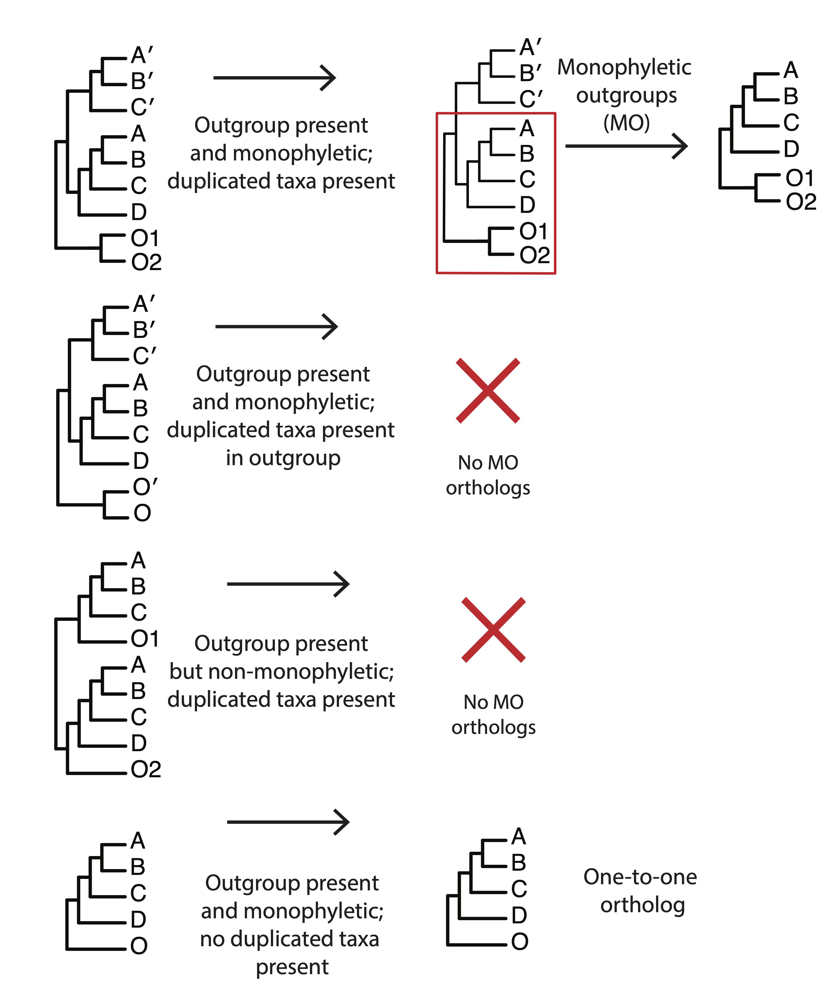

## Table of contents

* [Phylogenomics workflow](#phylo)
* [Loci assembly, Paralog assembly, and alignment](#assembly)
* [Tip Masking](#masking)
* [Remove spurious tips](#ts)
* [Orthology inference](#ortho)
* [Species tree inference](#sptree)
* [Species tree inference from homologs](homolog)

#### How to login to the workstation

	ssh -p 22110 USERNAME@10.153.134.10

### Every time you see `$USERNAME` in the example command, you need to replace it with your own [USERNAME](https://github.com/dfmoralesb/MPE_tutorials/blob/main/README.md) 

* To avoid having to change the `$USERNAME` for every command, you can set a variable to provide the name of it. ***Do this every time you connect to the workstation***

	For example, for me, Diego, my user name is `mpemaster`
	
		USERNAME=mpemaster

## Phylogenomics workflow with a focus on tree-based orthology inference

* For more detail on the phylogenomics workflow that we will follow, see [here](https://doi.org/10.1093/sysbio/syab032)

	But in general, it consists of the following steps.
	
	

## Loci assembly, Paralog assembly, and alignment

* We previously learned how to use Captus to assemble, extract, and align the loci.

	We have already seen the Captus reports for all those steps for the full 30-taxa data set.
	
	I just want to point out the last command for Captus (align)

		#captus align -e 03_extraction/ -m NUC -f GE --max_paralogs 5 --min_samples 4 --align_method mafft_auto --outgroup RUTA_Citrus_hystrix,RUTA_Melicope_ternata,RUTA_Ruta_graveolens --filter_method none --clipkit_method gappy --clipkit_gaps 0.9 --threads 90 --concurrent 30

	Here, I want you to point attention to the flag `--max_paralogs 5`, meaning that the loci that we will work with have up to 5 copies per sample. This is the part referred to as `Paralog assessment` in the workflow. Other assembly pipelines required additional steps to identify and collect gene copies. With Captus, it is as simple as using one flag to collect them.
	
* The final output of Captus for all 30 species and 353 genes is located in the directory `/data_tmp/$USERNAME/output/03_captus/04_alignments/03_trimmed/04_unfiltered/01_coding_NUC/03_genes`

		cd /data_tmp/$USERNAME/output/03_captus/04_alignments/03_trimmed/04_unfiltered/01_coding_NUC/03_genes
		
	You can see all files with the command `ls`
	
		4471.fna  5034.fna  5280.fna  5426.fna  5594.fna  5791.fna  5913.fna  5981.fna  6119.fna  6298.fna  6412.fna  6506.fna  6639.fna  6797.fna  6958.fna  7241.fna
		4527.fna  5038.fna  5296.fna  5427.fna  5596.fna  5802.fna  5918.fna  5990.fna  6128.fna  6299.fna  6420.fna  6507.fna  6641.fna  6825.fna  6961.fna  7273.fna
		4691.fna  5064.fna  5299.fna  5428.fna  5599.fna  5815.fna  5919.fna  6000.fna  6130.fna  6303.fna  6432.fna  6526.fna  6649.fna  6848.fna  6962.fna  ...

	You can count how many loci were able to collect by counting the number of fasta files.
	
	
		ls *.fna | wc -l
		
	You will see that we have `348` files.
	
* We can explore one of the fasta files to see if there are samples that have multiple copies. For example:

		grep ">" 4471.fna | sort
	
	Then you should see
	
		>MELI_Aglaia_spectabilis__00 [query=TJLC-4471] [hit=00] [wscore=0.737] [cover=99.55] [ident=87.00] [score=0.737] [length=2992]
		>MELI_Aglaia_spectabilis__01 [query=TJLC-4471] [hit=01] [wscore=0.386] [cover=83.04] [ident=77.96] [score=0.464] [length=1896]
		>MELI_Aglaia_spectabilis__02 [query=TJLC-4471] [hit=02] [wscore=0.366] [cover=72.77] [ident=85.28] [score=0.513] [length=2420] [frameshifts=1827,1828]
		>MELI_Aphanamixis_polystachya__00 [query=TJLC-4471] [hit=00] [wscore=0.792] [cover=99.11] [ident=90.09] [score=0.795] [length=2453]
		>MELI_Aphanamixis_polystachya__01 [query=TJLC-4471] [hit=01] [wscore=0.387] [cover=83.48] [ident=77.54] [score=0.460] [length=2144]
		>MELI_Azadirachta_indica [query=TJLC-4471] [hit=00] [wscore=0.843] [cover=99.55] [ident=92.38] [score=0.844] [length=3199]
		>MELI_Cabralea_canjerana__00 [query=QUTB-4471] [hit=00] [wscore=0.762] [cover=99.53] [ident=88.26] [score=0.762] [length=3050]
		>MELI_Cabralea_canjerana__01 [query=QUTB-4471] [hit=01] [wscore=0.378] [cover=76.64] [ident=82.93] [score=0.505] [length=2474] [frameshifts=1073,1074]
		>MELI_Cabralea_canjerana__02 [query=QUTB-4471] [hit=02] [wscore=0.286] [cover=63.55] [ident=85.29] [score=0.449] [length=1283]
		>MELI_Chisocheton_longistipitatus__00 [query=TJLC-4471] [hit=00] [wscore=0.780] [cover=99.55] [ident=89.24] [score=0.781] [length=2784]
		>MELI_Chisocheton_longistipitatus__01 [query=TJLC-4471] [hit=01] [wscore=0.752] [cover=99.55] [ident=87.89] [score=0.754] [length=2962]
		>MELI_Chukrasia_tabularis [query=AJFN-4471] [hit=00] [wscore=0.674] [cover=94.54] [ident=85.78] [score=0.676] [length=2064]
		>MELI_Dysoxylum_alliaceum [query=TJLC-4471] [hit=00] [wscore=0.695] [cover=84.82] [ident=91.05] [score=0.696] [length=1828]
		>MELI_Guarea_pubescens__00 [query=TJLC-4471] [hit=00] [wscore=0.766] [cover=100.00] [ident=88.39] [score=0.768] [length=2999]
		>MELI_Guarea_pubescens__01 [query=TJLC-4471] [hit=01] [wscore=0.662] [cover=99.55] [ident=84.30] [score=0.683] [length=3221] [frameshifts=371]
		>MELI_Guarea_pubescens__02 [query=TJLC-4471] [hit=02] [wscore=0.305] [cover=68.75] [ident=83.12] [score=0.455] [length=1394] [frameshifts=726,727]
		>MELI_Heckeldora_staudtii__00 [query=TJLC-4471] [hit=00] [wscore=0.794] [cover=100.00] [ident=89.73] [score=0.795] [length=3057]
		>MELI_Heckeldora_staudtii__01 [query=TJLC-4471] [hit=01] [wscore=0.288] [cover=68.30] [ident=81.70] [score=0.433] [length=1449] [frameshifts=615]
		>MELI_Lovoa_sywnnertonii__00 [query=TJLC-4471] [hit=00] [wscore=0.812] [cover=100.00] [ident=90.62] [score=0.812] [length=2784]
		>MELI_Lovoa_sywnnertonii__01 [query=TJLC-4471] [hit=01] [wscore=0.461] [cover=83.48] [ident=83.96] [score=0.567] [length=2351] [frameshifts=890]
		>MELI_Melia_azedarach [query=QUTB-4471] [hit=00] [wscore=0.815] [cover=95.79] [ident=92.68] [score=0.818] [length=2224]
		>MELI_Neoguarea_glomerulata__00 [query=TJLC-4471] [hit=00] [wscore=0.633] [cover=83.04] [ident=88.17] [score=0.634] [length=2132]
		>MELI_Neoguarea_glomerulata__01 [query=TJLC-4471] [hit=01] [wscore=0.443] [cover=68.75] [ident=88.96] [score=0.536] [length=1943]
		>MELI_Owenia_reticulata [query=VUSY-4471] [hit=00] [wscore=0.764] [cover=93.84] [ident=90.73] [score=0.764] [length=3302]
		>MELI_Quivisianthe_papinae [query=VFFP-4471] [hit=00] [wscore=0.755] [cover=88.25] [ident=92.81] [score=0.756] [length=3792]
		>MELI_Schmardaea_microphylla [query=VUSY-4471] [hit=00] [wscore=0.754] [cover=93.84] [ident=90.35] [score=0.757] [length=3063]
		>MELI_Swietenia_macrophylla [query=TJLC-4471] [hit=00] [wscore=0.790] [cover=99.55] [ident=89.69] [score=0.790] [length=2585]
		>MELI_Toona_ciliata__00 [query=TJLC-4471] [hit=00] [wscore=0.848] [cover=100.00] [ident=92.41] [score=0.848] [length=2823]
		>MELI_Toona_ciliata__01 [query=TJLC-4471] [hit=01] [wscore=0.840] [cover=99.55] [ident=92.38] [score=0.844] [length=2579]
		>MELI_Trichilia_hirta [query=QUTB-4471] [hit=00] [wscore=0.779] [cover=95.79] [ident=90.73] [score=0.780] [length=2346]
		>MELI_Turraea_virens [query=TJLC-4471] [hit=00] [wscore=0.790] [cover=99.55] [ident=89.69] [score=0.790] [length=2795]
		>MELI_Vavaea_amicorum__00 [query=TJLC-4471] [hit=00] [wscore=0.772] [cover=99.55] [ident=88.79] [score=0.772] [length=3097]
		>MELI_Vavaea_amicorum__01 [query=TJLC-4471] [hit=01] [wscore=0.515] [cover=95.54] [ident=80.37] [score=0.580] [length=1944] [frameshifts=54,1592,1877,1878]
		>RUTA_Citrus_hystrix [query=TJLC-4471] [hit=00] [wscore=0.772] [cover=99.55] [ident=88.79] [score=0.772] [length=3359]
		>RUTA_Melicope_ternata [query=TJLC-4471] [hit=00] [wscore=0.647] [cover=83.48] [ident=88.77] [score=0.647] [length=2166]
		>RUTA_Ruta_graveolens__00 [query=VFFP-4471] [hit=00] [wscore=0.786] [cover=99.68] [ident=89.49] [score=0.787] [length=3298]
		>RUTA_Ruta_graveolens__01 [query=VFFP-4471] [hit=01] [wscore=0.779] [cover=99.68] [ident=89.17] [score=0.781] [length=3048]

## Homolog tree inference

* Now, we are going to infer ML homolog trees. Here, we refer to homolog trees, the gene trees that have all gene copies.

* To use the scripts for the phylogenomics workflow, the fasta headers must be modified to include an `@` symbol to identify paralogs of the same sample.

	This means that instead of having the long fasta headers you see above, we want something that looks like this:
	
		>MELI_Aglaia_spectabilis@pg_00
		>MELI_Aglaia_spectabilis@pg_01
		>MELI_Aglaia_spectabilis@pg_02
		>MELI_Aphanamixis_polystachya@pg_00
		>MELI_Aphanamixis_polystachya@pg_01
		>MELI_Azadirachta_indica@pg_uq
		>MELI_Cabralea_canjerana@pg_00
		>MELI_Cabralea_canjerana@pg_01
		>MELI_Cabralea_canjerana@pg_02
		>MELI_Chisocheton_longistipitatus@pg_00
		>MELI_Chisocheton_longistipitatus@pg_01
		>MELI_Chukrasia_tabularis@pg_uq
		>MELI_Dysoxylum_alliaceum@pg_uq
		>MELI_Guarea_pubescens@pg_00
		>MELI_Guarea_pubescens@pg_01
		>MELI_Guarea_pubescens@pg_02
		>MELI_Heckeldora_staudtii@pg_00
		>MELI_Heckeldora_staudtii@pg_01
		>MELI_Lovoa_sywnnertonii@pg_00
		>MELI_Lovoa_sywnnertonii@pg_01
		>MELI_Melia_azedarach@pg_uq
		>MELI_Neoguarea_glomerulata@pg_00
		>MELI_Neoguarea_glomerulata@pg_01
		>MELI_Owenia_reticulata@pg_uq
		>MELI_Quivisianthe_papinae@pg_uq
		>MELI_Schmardaea_microphylla@pg_uq
		>MELI_Swietenia_macrophylla@pg_uq
		>MELI_Toona_ciliata@pg_00
		>MELI_Toona_ciliata@pg_01
		>MELI_Trichilia_hirta@pg_uq
		>MELI_Turraea_virens@pg_uq
		>MELI_Vavaea_amicorum@pg_00
		>MELI_Vavaea_amicorum@pg_01
		>RUTA_Citrus_hystrix@pg_uq
		>RUTA_Melicope_ternata@pg_uq
		>RUTA_Ruta_graveolens@pg_00
		>RUTA_Ruta_graveolens@pg_01

* First, we are going to make a copy of the alignments to a new directory so we can reformat them

		
		cd /data_tmp/$USERNAME/data/07_phylogenomic_analyses/
		
		mkdir 01_clean_alignments

		cp /data_tmp/$USERNAME/output/03_captus/04_alignments/03_trimmed/04_unfiltered/01_coding_NUC/03_genes/*.fna /data_tmp/$USERNAME/data/07_phylogenomic_analyses/01_clean_alignments
		
	
* Now move to the new directory where the copy of the fasta files are located and use `ls` to make sure they are there
	
	
		cd /data_tmp/$USERNAME/data/07_phylogenomic_analyses/01_clean_alignments
		
		ls
		
* Now we can format them using the following loop
	
	
		for i in $(ls *.fna); do
		sed -i -E 's/(>.+)(__)([[:digit:]]+)( .+)/\1@pg_\3/' $i
		sed -i -E 's/(>.+)( \[query=.+)/\1@pg_uq/' $i
		done
		
	After it is done, you can verify if the format is correct.
	
		grep ">" 4471.fna
		
* Now, all these alignments are ready for ML tree inference

	Because of time restrictions, we are not going to run all `348` trees. I ran this previously. As we learned before, I use IQ-Tree for this. I ran the following command for each tree so that you know what I did.
	
	
		iqtree -m MFP -s [alignment] -T 4 --seqtype DNA #Do not run this
	
	
	The output of IQ-tree can be found here `/data_tmp/$USERNAME/output/04_analyses/00_iqtree`
	
	
		cd /data_tmp/$USERNAME/output/04_analyses/00_iqtree
		
		ls
		
	You can see all the `*.treefile` files
	
	
* Unfortunately, IQ-tree now dislikes the `@` symbol in the taxa label and replaces it with an `underscore`, so we need to add the `@` back to each tree.
	
	Check one tree to see this.
	
		(RUTA_Citrus_hystrix_pg_uq:0.0967470193,(RUTA_Melicope_ternata_pg_uq:0.1621729005,(((((((((((MELI_Aglaia_spectabilis_pg_00:0.0379882798,MELI_Cabralea_canjerana_pg_00:0.0199533071):0.0085782116,(MELI_Chisocheton_longistipitatus_pg_00:0.0379882310,MELI_Aphanamixis_polystachya_pg_00:0.0494920662):0.0092253339):0.0021483280,MELI_Dysoxylum_alliaceum_pg_uq:0.0471504315):0.0015887986,MELI_Neoguarea_glomerulata_pg_01:0.0547080994):0.0008844444,MELI_Guarea_pubescens_pg_00:0.0533609950):0.0063054953,(((MELI_Aglaia_spectabilis_pg_02:0.0388463469,MELI_Cabralea_canjerana_pg_01:0.0216316868):0.0101132600,(MELI_Chisocheton_longistipitatus_pg_01:0.0387180305,((MELI_Heckeldora_staudtii_pg_00:0.0335110710,MELI_Neoguarea_glomerulata_pg_00:0.0618294687):0.0012785897,MELI_Guarea_pubescens_pg_02:0.0446490573):0.0018537144):0.0008490844):0.0027375406,MELI_Vavaea_amicorum_pg_00:0.0681955907):0.0029342096):0.0119221091,(MELI_Trichilia_hirta_pg_uq:0.0535061946,MELI_Turraea_virens_pg_uq:0.0851368654):0.0201718173):0.0016617099,((((MELI_Aglaia_spectabilis_pg_01:0.0519234782,MELI_Aphanamixis_polystachya_pg_01:0.0540052513):0.0009267065,MELI_Cabralea_canjerana_pg_02:0.0149007675):0.0150915790,(MELI_Guarea_pubescens_pg_01:0.0394354788,MELI_Heckeldora_staudtii_pg_01:0.0487069879):0.0065479564):0.0014578384,MELI_Vavaea_amicorum_pg_01:0.0835631202):0.0168885015):0.0115562485,MELI_Quivisianthe_papinae_pg_uq:0.0811917761):0.0341719786,((MELI_Azadirachta_indica_pg_uq:0.0004945456,MELI_Melia_azedarach_pg_uq:0.0015084365):0.0294961855,MELI_Owenia_reticulata_pg_uq:0.0294422745):0.0650087238):0.0047714922,((MELI_Swietenia_macrophylla_pg_uq:0.0692218925,(MELI_Toona_ciliata_pg_00:0.0225271377,MELI_Lovoa_sywnnertonii_pg_00:0.0531688410):0.0110747809):0.0144563047,((MELI_Toona_ciliata_pg_01:0.0268624674,MELI_Lovoa_sywnnertonii_pg_01:0.0711210879):0.0140801051,(MELI_Schmardaea_microphylla_pg_uq:0.0915458593,MELI_Chukrasia_tabularis_pg_uq:0.0562293914):0.0059356522):0.0049522269):0.0154278084):0.1260643977):0.0171517151,(RUTA_Ruta_graveolens_pg_00:0.0160212743,RUTA_Ruta_graveolens_pg_01:0.0230618982):0.1840426818);
	
	
	
* To reformat the tree files, we first are going to make a copy of all the `*.treefile` in a new directory
	
	
		mkdir /data_tmp/$USERNAME/data/07_phylogenomic_analyses/02_raw_homolog_trees
		
		cp /data_tmp/$USERNAME/output/04_analyses/00_iqtree/*.treefile /data_tmp/$USERNAME/data/07_phylogenomic_analyses/02_raw_homolog_trees
		
		
	Make a list to see the files
	
		cd /data_tmp/$USERNAME/data/07_phylogenomic_analyses/02_raw_homolog_trees
	
		ls
		
* Now that we have the tree files in the directory, we can format them with the following loop
	
	
		for i in $(ls *.treefile)
		do
		perl -p -i -e "s/_pg/\@pg/g" $i
		done

	You can check one file to verify that the species contains the `@` symbol
	
	 	cat 4471.iqtree.treefile
	 	
	You should see
	
		(RUTA_Citrus_hystrix@pg_uq:0.0967470193,(RUTA_Melicope_ternata@pg_uq:0.1621729005,(((((((((((MELI_Aglaia_spectabilis@pg_00:0.0379882798,MELI_Cabralea_canjerana@pg_00:0.0199533071):0.0085782116,(MELI_Chisocheton_longistipitatus@pg_00:0.0379882310,MELI_Aphanamixis_polystachya@pg_00:0.0494920662):0.0092253339):0.0021483280,MELI_Dysoxylum_alliaceum@pg_uq:0.0471504315):0.0015887986,MELI_Neoguarea_glomerulata@pg_01:0.0547080994):0.0008844444,MELI_Guarea_pubescens@pg_00:0.0533609950):0.0063054953,(((MELI_Aglaia_spectabilis@pg_02:0.0388463469,MELI_Cabralea_canjerana@pg_01:0.0216316868):0.0101132600,(MELI_Chisocheton_longistipitatus@pg_01:0.0387180305,((MELI_Heckeldora_staudtii@pg_00:0.0335110710,MELI_Neoguarea_glomerulata@pg_00:0.0618294687):0.0012785897,MELI_Guarea_pubescens@pg_02:0.0446490573):0.0018537144):0.0008490844):0.0027375406,MELI_Vavaea_amicorum@pg_00:0.0681955907):0.0029342096):0.0119221091,(MELI_Trichilia_hirta@pg_uq:0.0535061946,MELI_Turraea_virens@pg_uq:0.0851368654):0.0201718173):0.0016617099,((((MELI_Aglaia_spectabilis@pg_01:0.0519234782,MELI_Aphanamixis_polystachya@pg_01:0.0540052513):0.0009267065,MELI_Cabralea_canjerana@pg_02:0.0149007675):0.0150915790,(MELI_Guarea_pubescens@pg_01:0.0394354788,MELI_Heckeldora_staudtii@pg_01:0.0487069879):0.0065479564):0.0014578384,MELI_Vavaea_amicorum@pg_01:0.0835631202):0.0168885015):0.0115562485,MELI_Quivisianthe_papinae@pg_uq:0.0811917761):0.0341719786,((MELI_Azadirachta_indica@pg_uq:0.0004945456,MELI_Melia_azedarach@pg_uq:0.0015084365):0.0294961855,MELI_Owenia_reticulata@pg_uq:0.0294422745):0.0650087238):0.0047714922,((MELI_Swietenia_macrophylla@pg_uq:0.0692218925,(MELI_Toona_ciliata@pg_00:0.0225271377,MELI_Lovoa_sywnnertonii@pg_00:0.0531688410):0.0110747809):0.0144563047,((MELI_Toona_ciliata@pg_01:0.0268624674,MELI_Lovoa_sywnnertonii@pg_01:0.0711210879):0.0140801051,(MELI_Schmardaea_microphylla@pg_uq:0.0915458593,MELI_Chukrasia_tabularis@pg_uq:0.0562293914):0.0059356522):0.0049522269):0.0154278084):0.1260643977):0.0171517151,(RUTA_Ruta_graveolens@pg_00:0.0160212743,RUTA_Ruta_graveolens@pg_01:0.0230618982):0.1840426818);
	
	

## Prune clades and paraphyletic grades of the same species

* In this step, we are going to mask clades and paraphyletic grades that belonged to the same taxon by keeping only the tip with the highest number of characters in the trimmed alignment

	First, we are going to make a new directory called `03_masked`
	
		cd /data_tmp/$USERNAME/data/07_phylogenomic_analyses
		
		mkdir 03_masked
		
* Now make sure that you are NOT in the Conda environment
	
	
		conda deactivate
		
	You should not see any conda environment name before your account name
	
		$USERNAME@p620-small:/data_tmp/$USERNAME/data/07_phylogenomic_analyses
		
	If you still see a Conda environment:
	
		(captus) $USERNAME@p620-small:/data_tmp/$USERNAME/data/07_phylogenomic_analyses
		
	or
	
		(base) $USERNAME@p620-small:/data_tmp/$USERNAME/data/07_phylogenomic_analyses
		
	Run the below command until you don't see any environment
	
		conda deactivate
		
* Let's run the command to prune clade and paraphyletic grades of the same species

		python /data_tmp/$USERNAME/script/mask_tips.py
		
	If you run this command, you will see all the input arguments you need to provide. ####All Python scripts we will use today will work the same way 
	
	The output should be
	
		Usage:
		python mask_tips.py treDIR tree_file_ending aln-clnDIR aln_cln_file_ending mask_paraphyletic(y/n) outDIR
		
	This script requires an input directory with the tree files, the file extension for the tree files, whether or not you want to remove paraphyletic grades, and an output directory.
	
	Make sure you are in the correct directory.
	
		cd /data_tmp/$USERNAME/data/07_phylogenomic_analyses
		
	Then
	
		python /data_tmp/$USERNAME/script/mask_tips.py 02_raw_homolog_trees/ treefile 01_clean_alignments/ fna y 03_masked/
		
	This should be done in seconds.
	
	You can check the output by making a list.
	
		cd 03_masked/
		
		ls
		
	Notice that the extension of the output files is `mm`
	
		4471.iqtree.treefile.mm  5355.iqtree.treefile.mm  5840.iqtree.treefile.mm  6110.iqtree.treefile.mm  6460.iqtree.treefile.mm  6859.iqtree.treefile.mm
		4527.iqtree.treefile.mm  5357.iqtree.treefile.mm  5841.iqtree.treefile.mm  6114.iqtree.treefile.mm  6462.iqtree.treefile.mm  6860.iqtree.treefile.mm
		4691.iqtree.treefile.mm  5366.iqtree.treefile.mm  5842.iqtree.treefile.mm  6119.iqtree.treefile.mm  6483.iqtree.treefile.mm  ...

	
* Now let's compare one original homolog vs a masked one
	
	Open, plot, root, and order the nodes in Figtree of one of the original homologs trees.
	
		cat /data_tmp/$USERNAME/data/07_phylogenomic_analyses/02_raw_homolog_trees/4471.iqtree.treefile
		
	

	Open, plot, root, and order the nodes in Figtree in the same homolog tree but masked.
	
		
		cat /data_tmp/$USERNAME/data/07_phylogenomic_analyses/03_masked/4471.iqtree.treefile.mm
	
	
	

	
#### Can you see any difference between the trees?

## Remove spurious tips

* Outlier tips with unusually long branches are detected and removed by maximally reducing the tree diameter with TreeShrink. For details on TreeShrink see [here](https://doi.org/10.1186/s12864-018-4620-2) and [here](https://github.com/uym2/TreeShrink)

* We are going to use the output of the previous step for part

		cd /data_tmp/$USERNAME/data/07_phylogenomic_analyses
		
		python /data_tmp/$USERNAME/script/tree_shrink_1.3.9_wrapper.py
		
	You should see
	
		Usage:
		python tree_shrink_wrapper.py inDIR tree_file_ending quantile outDIR exceptions(optional)

	The outgroup list, `outgroup_list.txt`,  is located in `/data_tmp/$USERNAME/data/07_phylogenomic_analyses`
	
	You can read the file to see the list.
	
		cat /data_tmp/$USERNAME/data/07_phylogenomic_analyses/outgroup_list.txt
		
	You should see
	
		RUTA_Citrus_hystrix
		RUTA_Melicope_ternata
		RUTA_Ruta_graveolens
		
* Now, let's make a new directory for the output of TreeShrink
	
	
		mkdir /data_tmp/$USERNAME/data/07_phylogenomic_analyses/04_ts

* With this, you can now run TreeShrink on all the masked gene trees
	
		python /data_tmp/$USERNAME/script/tree_shrink_1.3.9_wrapper.py 03_masked/ mm 0.05 04_ts/ outgroup_list.txt
			
	You should start seeing something like this.
	
	
		Output files written to /data_tmp/$USERNAME/data/07_phylogenomic_analyses/04_ts/5562.iqtree.treefile.mm.ts_dir with prefix /data_tmp/$USERNAME/data/07_phylogenomic_analyses/04_ts/5562.iqtree.treefile.
		['RUTA_Citrus_hystrix@pg_uq', 'RUTA_Melicope_ternata@pg_uq', 'RUTA_Ruta_graveolens@pg_00']
		run_treeshrink.py -t /data_tmp/$USERNAME/data/07_phylogenomic_analyses/03_masked/6909.iqtree.treefile.mm -c -m per-gene -q 0.05 -o /data_tmp/$USERNAME/data/07_phylogenomic_analyses/04_ts/6909.iqtree.treefile.mm.ts_dir -O /data_tmp/$USERNAME/data/07_phylogenomic_analyses/04_ts/6909.iqtree.treefile -x /data_tmp/$USERNAME/data/07_phylogenomic_analyses/04_ts/6909.iqtree.treefile.mm.exceptions.ext
		Launching TREESHRINK version 1.3.9
		TREESHRINK was called as follow
		/usr/local/bin/run_treeshrink.py -t /data_tmp/$USERNAME/data/07_phylogenomic_analyses/03_masked/6909.iqtree.treefile.mm -c -m per-gene -q 0.05 -o /data_tmp/$USERNAME/data/07_phylogenomic_analyses/04_ts/6909.iqtree.treefile.mm.ts_dir -O /data_tmp/$USERNAME/data/07_phylogenomic_analyses/04_ts/6909.iqtree.treefile -x /data_tmp/$USERNAME/data/07_phylogenomic_analyses/04_ts/6909.iqtree.treefile.mm.exceptions.ext
		Testing R and BMS installation ...
		Solving k-shrink with k = 6
		Writing output ...

	It should take 3 to 4 minutes to complete
	
	It outputs the tips that were trimmed in the file .txt and the trimmed trees in the file ``*.ts`. You would need to test different quantiles to see which one better fits your data. Make sure you open the tree file to check whether TreeShrink removes your outgroups. This is often the case, so we can provide a list of outgroups to prevent them from being removed.

	Make a list of the output directory to verify it worked
	
		ls 04_ts/
		
	You should see
	
		4471.iqtree.treefile.mm.tr.ts  5434.iqtree.treefile.mm.tr.ts  5940.iqtree.treefile.mm.tr.ts  6384.iqtree.treefile.mm.tr.ts  6779.iqtree.treefile.mm.tr.ts
		4471.iqtree.treefile.txt       5434.iqtree.treefile.txt       5940.iqtree.treefile.txt       6384.iqtree.treefile.txt       6779.iqtree.treefile.txt
		4527.iqtree.treefile.mm.tr.ts  5449.iqtree.treefile.mm.tr.ts  5941.iqtree.treefile.mm.tr.ts  6387.iqtree.treefile.mm.tr.ts  ...

	
* Now let's compare one masked tree vs. one with the spurious tip removed
	
	Open, plot, root, and order the nodes in Figtree of one masked tree.
	
		cat /data_tmp/$USERNAME/data/07_phylogenomic_analyses/03_masked/6498.iqtree.treefile.mm
		
	

	Open, plot, root, and order the nodes in Figtree of the same tree but cleaned with TreeShrink.
	
		cat /data_tmp/$USERNAME/data/07_phylogenomic_analyses/04_ts/6498.iqtree.treefile.mm.tr.ts
	
	

	
	#### Can you see any difference between the trees?

## Orthology inference

* We are going to prune orthologs using the tree-based method called Monophyletic Outgroup (MO). The MO approach filters for homolog trees with outgroup taxa being monophyletic and single-copy, and therefore filters for single- and low-copy genes.  MO roots the gene tree by the outgroups, traverses the rooted tree from root to tip, and removes the side with fewer taxa. In the case of MO, homolog trees with nonmonophyletic outgroups or duplicated taxa in the outgroups are discarded. If no taxon duplication is detected in a homolog tree, the MO approach outputs a one-to-one ortholog. 

	
* We are going to use the output of TreeShrink to prune the orthologs.

	First, we need to make a taxon list file identifying which are outgroups and which are part of the ingroup.
	
	The file, `in_out_list.txt` is located in  `/data_tmp/$USERNAME/data/07_phylogenomic_analyses/`
	
	Read the file to see the list
	
		cat /data_tmp/$USERNAME/data/07_phylogenomic_analyses/in_out_list.txt
		
	You should see
	
		IN	MELI_Aglaia_spectabilis
		IN	MELI_Aphanamixis_polystachya
		IN	MELI_Azadirachta_indica
		IN	MELI_Cabralea_canjerana
		IN	MELI_Carapa_procera
		IN	MELI_Cedrela_montana
		IN	MELI_Cedrela_saltensis
		IN	MELI_Chisocheton_longistipitatus
		IN	MELI_Chukrasia_tabularis
		IN	MELI_Dysoxylum_alliaceum
		IN	MELI_Guarea_pubescens
		IN	MELI_Heckeldora_staudtii
		IN	MELI_Lovoa_sywnnertonii
		IN	MELI_Melia_azedarach
		IN	MELI_Munronia_pinnata
		IN	MELI_Neoguarea_glomerulata
		IN	MELI_Owenia_reticulata
		IN	MELI_Pterorhachis_zenkeri
		IN	MELI_Quivisianthe_papinae
		IN	MELI_Schmardaea_microphylla
		IN	MELI_Swietenia_macrophylla
		IN	MELI_Swietenia_mahagoni
		IN	MELI_Toona_ciliata
		IN	MELI_Trichilia_hirta
		IN	MELI_Turraeanthus_manii
		IN	MELI_Turraea_virens
		IN	MELI_Vavaea_amicorum
		OUT	RUTA_Citrus_hystrix
		OUT	RUTA_Melicope_ternata
		OUT	RUTA_Ruta_graveolens
		
* Now, let's make a directory for the ortholog inference output

		mkdir /data_tmp/$USERNAME/data/07_phylogenomic_analyses/05_MO_orthologs
		
* To see the arguments for the orthology inference script, do

		python /data_tmp/$USERNAME/script/prune_paralogs_MO_1to1_MO.py
		
	You should see
	
		Usage:
		python prune_paralogs_MO.py homoTreeDIR tree_file_ending minimal_taxa outDIR taxon_file
		
* MO pruning also requires a minimum number of taxa for the ortholog to be retained. I usually use 25% of the number of taxa. In this case, we will use 8
	
* Now, we can prune MO orthologs

		cd /data_tmp/$USERNAME/data/07_phylogenomic_analyses
		
		python /data_tmp/$USERNAME/script/prune_paralogs_MO_1to1_MO.py 04_ts/ ts 8 05_MO_orthologs/ in_out_list.txt

	You should start seeing.
		
		27 ingroup taxa and 3 outgroup taxa read
		5858.iqtree.treefile.mm.tr.ts
		5434.iqtree.treefile.mm.tr.ts
		7572.iqtree.treefile.mm.tr.ts
		5910.iqtree.treefile.mm.tr.ts
		5038.iqtree.treefile.mm.tr.ts
		
	It should take seconds to finish
	
	If you scroll back, you will also notice some error messages like this
	
		duplicated taxa in unrooted tree
		not enough taxa after pruning
		not enough taxa in original tree
		outgroup contains taxon repeats
		outgroup non-monophyletic
		
	How many of those messages do you see? What do you think those messages mean?
	
* To see the output files, do 

		ls 05_MO_orthologs/
		
	You should see 
	
		4471.iqtree.ortho.tre  5366.iqtree.ortho.tre      5842.iqtree.1to1ortho.tre  6119.iqtree.ortho.tre      6487.iqtree.ortho.tre      6864.iqtree.ortho.tre
		4527.iqtree.ortho.tre  5398.iqtree.ortho.tre      5843.iqtree.ortho.tre      6128.iqtree.ortho.tre      6488.iqtree.ortho.tre      6865.iqtree.ortho.tre
		
	You can see that there are `*.ortho.tree` and `1to1ortho.tre` files
	
	Count the total number of files
	
		ls 05_MO_orthologs/ | wc -l
		
	`334`
		
	How does this number compare with the starting number of gene trees? Are there fewer or more? 
	
	
	You can also count  each of the two kinds of orthologs
	
		ls 05_MO_orthologs/*.ortho.tre | wc -l
		
	`316`
		
		ls 05_MO_orthologs/*.1to1ortho.tre | wc -l
		
	`18`
	
* Let's compare a cleaned homolog vs an ortholog

		cat /data_tmp/$USERNAME/data/07_phylogenomic_analyses/04_ts/4471.iqtree.treefile.mm.tr.ts
		
	

		cat /data_tmp/$USERNAME/data/07_phylogenomic_analyses/05_MO_orthologs/4471.iqtree.ortho.tre
		
	

	
	Can you identify the duplication in this gene

	
* We can make some stats about the orthologs

		python /data_tmp/$USERNAME/script/ortholog_occupancy_stats.py 05_MO_orthologs/
		
	If you make a list on `/data_tmp/$USERNAME/data/07_phylogenomic_analyses`

		ls /data_tmp/$USERNAME/data/07_phylogenomic_analyses
		
	You should see `ortho_stats.txt` and `taxon_stats.txt`
	
	Let's open RStudio. In your browser address bar, type `10.153.134.10:8787` When you are prompted for the login information, use the same USERNAME and password you have been using for login into the workstation
	
	
	

	
	In the R console, type
	
		setwd("/data_tmp/$USERNAME/data/07_phylogenomic_analyses")
		a <- as.numeric(read.table("ortho_stats.txt")[,1])
		a <- sort(a, decreasing=TRUE)
		plot(a, type="l", lwd=3, ylab="Number of Taxa in Each Ortholog")
	

	You should see the following plot.
	
	

	
	You can also check the stats by taxon by opening the `taxon_stats.txt` back in the workstation.
	
		column -t taxon_stats.txt
		
	You will see
	
		taxonID                           num_ortho  %ortho_out_of_total_316
		MELI_Cabralea_canjerana           283        0.895569620253
		MELI_Toona_ciliata                286        0.905063291139
		MELI_Vavaea_amicorum              219        0.693037974684
		RUTA_Melicope_ternata             308        0.974683544304
		MELI_Owenia_reticulata            302        0.955696202532
		RUTA_Citrus_hystrix               311        0.98417721519
		MELI_Aphanamixis_polystachya      258        0.816455696203
		MELI_Heckeldora_staudtii          269        0.851265822785
		MELI_Dysoxylum_alliaceum          232        0.73417721519
		MELI_Swietenia_macrophylla        271        0.857594936709
		MELI_Guarea_pubescens             257        0.813291139241
		MELI_Trichilia_hirta              165        0.522151898734
		MELI_Schmardaea_microphylla       256        0.810126582278
		MELI_Carapa_procera               170        0.537974683544
		MELI_Neoguarea_glomerulata        168        0.53164556962
		MELI_Pterorhachis_zenkeri         122        0.386075949367
		MELI_Azadirachta_indica           304        0.962025316456
		MELI_Melia_azedarach              252        0.79746835443
		MELI_Lovoa_sywnnertonii           249        0.787974683544
		MELI_Chisocheton_longistipitatus  290        0.917721518987
		MELI_Turraea_virens               217        0.686708860759
		MELI_Swietenia_mahagoni           26         0.0822784810127
		MELI_Aglaia_spectabilis           298        0.943037974684
		MELI_Turraeanthus_manii           128        0.405063291139
		MELI_Cedrela_saltensis            10         0.0316455696203
		MELI_Munronia_pinnata             83         0.262658227848
		MELI_Quivisianthe_papinae         293        0.927215189873
		MELI_Cedrela_montana              12         0.0379746835443
		RUTA_Ruta_graveolens              312        0.987341772152
		MELI_Chukrasia_tabularis          245        0.775316455696
		
	What can you tell from this table?
	
	
* The last step is to write new and final fasta files from ortholog trees for individual tree inference and then coalescent-based and concatenation-based tree inference

	You will need the script `write_ortholog_fasta_from_multiple_aln.py`
	
		python /data_tmp/$USERNAME/script/write_ortholog_fasta_from_multiple_aln.py
	
	You will see
	
		Usage:
		python write_ortholog_fasta_from_multiple_aln.py fasta_DIR tree_DIR fasta_file_ending(no_dot) tree_file_ending(not_dot) outDIR
		
		
	You need the original unaligned fasta files from Captus. Those are at `/data_tmp/$USERNAME/output/03_captus/04_alignments/01_unaligned/01_coding_NUC/03_genes/` The ortholog directory 05_MO_orthologs, the extension for the files of those two directories, `fna` and `tre`, respectively, and an output directory.
	
	We can make a copy of this directory.
		
		cp -r /data_tmp/$USERNAME/output/03_captus/04_alignments/01_unaligned/01_coding_NUC/03_genes/ /data_tmp/$USERNAME/data/07_phylogenomic_analyses/00_unaligned_fasta_files
	
	Let's create an output directory.
	
		cd /data_tmp/$USERNAME/data/07_phylogenomic_analyses
		
		mkdir 06_MO_fasta_files
		
	Now, let's write the ortholog fasta files.
	
		python /data_tmp/$USERNAME/script/write_ortholog_fasta_from_multiple_aln.py 00_unaligned_fasta_files 05_MO_orthologs/ fna tre 06_MO_fasta_files/
	
	You can check the output fasta files.
	
		ls 06_MO_fasta_files/
 
 	A list of the new fasta files will be created.
 	
 		4471.ortho.fa  5206.ortho.fa  5454.ortho.fa  5744.ortho.fa  5942.ortho.fa  6130.ortho.fa  6393.ortho.fa  6533.ortho.fa  6791.ortho.fa  7028.ortho.fa
		4527.ortho.fa  5220.ortho.fa  5460.ortho.fa  5770.ortho.fa  5943.ortho.fa  6139.ortho.fa  6398.ortho.fa  6538.ortho.fa  6792.ortho.fa  7029.ortho.fa
		4691.ortho.fa  5257.ortho.fa  5463.ortho.fa  5772.ortho.fa  5944.ortho.fa  6148.ortho.fa  6401.ortho.fa  6544.ortho.fa  6797.ortho.fa  ...
		

## Species tree inference

* Now that we have ortholog fasta files, we will process to infer individual trees and then coalescent-based and concatenation-based tree inference. All this is similar to what we did in the previous tutorials

* For coalescent-based species tree inference, we first need to infer individual trees from the ortholog alignments

	As this takes some time, I have already done it for you. I used the same software and commands we learned in the previous tutorials
	
	The output of the fasta files, alignments, clean alignments, and gene trees can be found in the directory `/data_tmp/$USERNAME/output/04_analyses/05_MO_fasta_files`

		ls /data_tmp/$USERNAME/output/04_analyses/05_MO_fasta_files
		
	You will see
	
		4471.iqtree.iqtree      5366.iqtree.iqtree      5842.iqtree.iqtree      6119.iqtree.iqtree      6487.iqtree.iqtree      6864.iqtree.iqtree
		4471.iqtree.treefile    5366.iqtree.treefile    5842.iqtree.treefile    6119.iqtree.treefile    6487.iqtree.treefile    6864.iqtree.treefile
		4471.ortho.aln          5366.ortho.aln          5842.ortho.aln          6119.ortho.aln          6487.ortho.aln          6864.ortho.aln
		4471.ortho.aln.clipkit  5366.ortho.aln.clipkit  5842.ortho.aln.clipkit  6119.ortho.aln.clipkit  6487.ortho.aln.clipkit  ...
		
	Now, let's make a new directory for our ASTRAL inference and concatenate all the gene trees to have the input of ASTRAL.
	
		cd /data_tmp/$USERNAME/data/07_phylogenomic_analyses
		
		mkdir 07_astral
		
		for i in /data_tmp/$USERNAME/output/04_analyses/05_MO_fasta_files/*.treefile; do cat $i >> 07_astral/meliaceae_334_MO_orthologs.tre; done
		
	In `07_astral` you should have the file `meliaceae_334_MO_orthologs.tre` containing the 334 individual otholog trees
	
		cd 07_astral
		
		wc -l meliaceae_334_MO_orthologs.tre
 
 	You should see `334 meliaceae_334_MO_orthologs.tre`
 	
 	On this occasion, before inferring the ASTRAL tree, we will take an additional step: collapse uninformative nodes from the species trees. This will avoid introducing noise into our inference from these non-supported nodes.
 	
 		python /data_tmp/$USERNAME/script/collapse_branches_bs_multiphylo.py
 		
 	You will see
 	
 		Usage:
		python collapse_branches_bs.py inMultiTree, bs_min_value
		
	You must provide the file containing all gene trees and a bootstrap threshold to collapse the node. In this case, we are going to use 70%
	
	
		python /data_tmp/$USERNAME/script/collapse_branches_bs_multiphylo.py meliaceae_334_MO_orthologs.tre 70
		
	The output file will be called `meliaceae_334_MO_orthologs.col_70.tre`
	
	This will be our input for ASTRAL.
	
		/data_tmp/$USERNAME/apps/ASTER-Linux_old/bin/astral -i meliaceae_334_MO_orthologs.col_70.tre -o meliaceae_334_MO_orthologs.ASTRAL.tre 2> >(tee -a ASTRAL.log >&2)
		
	This should take a few seconds, and the output file will be called `meliaceae_334_MO_orthologs.ASTRAL.tre`
	
	Now you can open the file, plot, root, sort, and show the node label (LPP) in Figtree, and it should have the following.
	

		cat meliaceae_334_MO_orthologs.ASTRAL.tre
			
	It should look like this:
	
		((((((((((((((MELI_Aphanamixis_polystachya,MELI_Aglaia_spectabilis)1.000000:0.821258,MELI_Cabralea_canjerana)1.000000:0.983081,MELI_Dysoxylum_alliaceum)1.000000:0.559483,MELI_Chisocheton_longistipitatus)1.000000:0.340415,(((MELI_Neoguarea_glomerulata,MELI_Guarea_pubescens)0.395510:0.013006,MELI_Heckeldora_staudtii)0.809537:0.137442,MELI_Turraeanthus_manii)0.999824:0.354462)1.000000:0.818228,MELI_Vavaea_amicorum)1.000000:0.703356,(MELI_Turraea_virens,MELI_Trichilia_hirta)1.000000:2.314540)0.999929:0.518675,MELI_Munronia_pinnata)1.000000:1.013233,MELI_Quivisianthe_papinae)1.000000:2.969098,(((MELI_Azadirachta_indica,MELI_Melia_azedarach)1.000000:5.147494,MELI_Owenia_reticulata)1.000000:2.402215,MELI_Pterorhachis_zenkeri)1.000000:3.349238)0.999999:0.284258,(((((MELI_Cedrela_saltensis,MELI_Cedrela_montana)0.998174:1.540445,MELI_Toona_ciliata)0.999932:1.897120,MELI_Lovoa_sywnnertonii)1.000000:0.616349,((MELI_Swietenia_mahagoni,MELI_Swietenia_macrophylla)0.999997:1.673976,MELI_Carapa_procera)1.000000:3.610073)1.000000:2.944631,(MELI_Chukrasia_tabularis,MELI_Schmardaea_microphylla)1.000000:1.214511)1.000000:3.783661)1.000000:5.298317,RUTA_Melicope_ternata)1.000000:0.374010,RUTA_Ruta_graveolens),RUTA_Citrus_hystrix);
	
	

	
	#### How does this compare with the 4-locus ASTRAL tree we did in the ASTRAL tutorial

* Now we can infer a concatenated tree with IQ-Tree

	First, we need to concatenate the clean alignments. The alignments are in the same directory as before, `/data_tmp/$USERNAME/output/04_analyses/05_MO_fasta_files`
	
	To concatenate the alignments and create the partition file, you will need the script `/data_tmp/$USERNAME/script/concatenate_matrices_phyx.py`
	
		python /data_tmp/$USERNAME/script/concatenate_matrices_phyx.py
		
	You will see
	
		usage: 
		python concatenate_matrices_phix.py aln-clnDIR numofsitesFilter numoftaxaFilter outname
		

	You need to specify the alignments directory from above, and you also need to specify a minimum number of sites and species so you can filter alignments with just a few samples and potentially informative sites. There is no rule of thumb for this, but usually use 500bp and 25% of the original number of samples (in this case, we will use 8) when working with target enrichment
	
	First, let's make a directory where we will place the output files
	
		cd /data_tmp/$USERNAME/data/07_phylogenomic_analyses/
	
		mkdir 08_concatenated_aln

	Now we can run the script
	
		python /data_tmp/$USERNAME/script/concatenate_matrices_phyx.py /data_tmp/$USERNAME/output/04_analyses/05_MO_fasta_files 500 8 08_concatenated_aln/meliaceae_MO_500_8_concat
		
	You will see
	
		Filtering ortholog matrixes
		307 matrices passed the filter
		Getting matrix occupancy stats
		Supermatrix taxon occupancy stats written to 08_concatenated_aln/meliaceae_MO_500_8_concat_taxon_occupancy_stats
		
	How many loci passed the filter?
	
	In the `08_concatenated_aln` you will find the files `meliaceae_MO_500_8_concat.fa`  `meliaceae_MO_500_8_concat.model`  and `meliaceae_MO_500_8_concat_taxon_occupancy_stats.txt`
	
	You can then taxon statistic, including the size of the concatenated matrix and occupancy.
	
		column -t meliaceae_MO_500_8_concat_taxon_occupancy_stats.txt
		
	You should see
		
		taxon                             #orthologs  #total_charactors  perc_orthologs   perc_characters
		MELI_Cabralea_canjerana           270         480542             0.879478827362   0.744374307777
		MELI_Toona_ciliata                283         529458             0.921824104235   0.820146693207
		MELI_Vavaea_amicorum              218         418797             0.71009771987    0.648729407573
		RUTA_Melicope_ternata             296         504051             0.964169381107   0.780790470363
		MELI_Owenia_reticulata            296         566768             0.964169381107   0.877941028401
		RUTA_Citrus_hystrix               303         533202             0.986970684039   0.825946264125
		MELI_Aphanamixis_polystachya      241         338665             0.785016286645   0.524602479998
		MELI_Heckeldora_staudtii          255         408264             0.830618892508   0.632413467273
		MELI_Dysoxylum_alliaceum          214         305099             0.697068403909   0.472607715722
		MELI_Swietenia_macrophylla        266         488872             0.866449511401   0.757277733458
		MELI_Guarea_pubescens             239         361680             0.778501628664   0.560253421422
		MELI_Trichilia_hirta              153         195488             0.498371335505   0.302816912317
		MELI_Schmardaea_microphylla       247         383576             0.804560260586   0.594170997498
		MELI_Carapa_procera               162         186862             0.527687296417   0.28945497355
		MELI_Neoguarea_glomerulata        155         192739             0.504885993485   0.298558626939
		MELI_Pterorhachis_zenkeri         112         106674             0.364820846906   0.165241300256
		MELI_Azadirachta_indica           296         531914             0.964169381107   0.823951112591
		MELI_Melia_azedarach              240         312373             0.781758957655   0.48387536499
		MELI_Lovoa_sywnnertonii           243         397342             0.791530944625   0.615494954033
		MELI_Chisocheton_longistipitatus  278         434873             0.905537459283   0.673631625011
		MELI_Turraea_virens               219         416689             0.71335504886    0.64546405087
		MELI_Swietenia_mahagoni           21          16944              0.0684039087948  0.0262467760799
		MELI_Aglaia_spectabilis           288         517774             0.938110749186   0.802047818578
		MELI_Turraeanthus_manii           114         123493             0.371335504886   0.191294447499
		MELI_Cedrela_saltensis            8           4949               0.0260586319218  0.00766615290482
		MELI_Munronia_pinnata             71          66165              0.231270358306   0.102491615871
		MELI_Quivisianthe_papinae         286         545384             0.931596091205   0.84481655604
		MELI_Cedrela_montana              10          6976               0.0325732899023  0.0108060381216
		RUTA_Ruta_graveolens              303         504971             0.986970684039   0.782215578602
		MELI_Chukrasia_tabularis          236         329105             0.768729641694   0.509793746563
		Supermatrix dimension 30 taxa, 307 loci and 645565  aligned columns Overall matrix occupancy 0.527170721255
		
	Now, with these files, you can run a concatenated tree. This can take many hours to run, so I have done it in advance with the command below. DO NOT run these commands
	
		#iqtree -m TEST --merge -s meliaceae_MO_500_8_concat.fa -T 40 -B 1000 --seqtype DNA -q meliaceae_MO_500_8_concat.model --prefix meliaceae_MO_500_8_concat_IQtree
		
	The output files for the IQ-tree run can be found here `/data_tmp/$USERNAME/output/04_analyses/10_iqtree_concatenated`
	
	Plot the tree file and compare it with the ASTRAL species trees from above
	
		cat /data_tmp/$USERNAME/output/04_analyses/10_iqtree_concatenated/meliaceae_MO_500_8_concat_IQtree.treefile
		
		(RUTA_Citrus_hystrix:0.1203095997,(RUTA_Melicope_ternata:0.1713673116,(((((((((((MELI_Aglaia_spectabilis:0.0375885764,MELI_Aphanamixis_polystachya:0.0419670632)100:0.0056021936,MELI_Cabralea_canjerana:0.0255826820)100:0.0046142662,MELI_Dysoxylum_alliaceum:0.0482585193)100:0.0026290050,MELI_Chisocheton_longistipitatus:0.0434381144)100:0.0016593652,((MELI_Heckeldora_staudtii:0.0427502585,MELI_Guarea_pubescens:0.0411445158)88:0.0007827064,(MELI_Neoguarea_glomerulata:0.0451238849,MELI_Turraeanthus_manii:0.0560241287)97:0.0018363755)100:0.0023701151)100:0.0060012439,MELI_Vavaea_amicorum:0.0762391468)100:0.0077188462,(MELI_Trichilia_hirta:0.0527954546,MELI_Turraea_virens:0.1002290411)100:0.0208684956)100:0.0092840998,MELI_Munronia_pinnata:0.0763143712)100:0.0115924912,MELI_Quivisianthe_papinae:0.0927838334)100:0.0330980586,(((MELI_Azadirachta_indica:0.0028085964,MELI_Melia_azedarach:0.0042547263)100:0.0325065738,MELI_Owenia_reticulata:0.0372445257)100:0.0189203949,MELI_Pterorhachis_zenkeri:0.0506308134)100:0.0601215172)100:0.0068608865,((((MELI_Toona_ciliata:0.0209736796,(MELI_Cedrela_montana:0.0246820354,MELI_Cedrela_saltensis:0.0106038088)100:0.0356809672)100:0.0186519042,MELI_Lovoa_sywnnertonii:0.0681119901)100:0.0045679476,((MELI_Swietenia_macrophylla:0.0124428947,MELI_Swietenia_mahagoni:0.0307433133)100:0.0231644117,MELI_Carapa_procera:0.0308532123)100:0.0385898559)100:0.0154981841,(MELI_Schmardaea_microphylla:0.0977996692,MELI_Chukrasia_tabularis:0.0568456093)100:0.0103559063)100:0.0261171806)100:0.0969635918)100:0.0173378156,RUTA_Ruta_graveolens:0.2229865468);
	
	

	
	#### How does the topology and node support compare with the ASTRAL tree?

## Species tree inference from homologs

* Another way to get coalescent species trees is to use directly the homologs trees and ASTRAL-Pro. ASTRAL-Pro can directly handle paralogs and duplication and takes as input multi-copy gene trees (homolog). The advantage of ASTRAL-Pro is that you can estimate a species of trees without the need to prune orthologs and that you can potentially use all the information from the gene families that are lost during the paralog pruning. The disadvantage is that ASTRAL-Pro will only output the final trees and not any ortholog or alignments, so you won't have those for downstream analyses (e.g., conflict)

* To use ASTRAL-Pro, we first need to infer the final homolog trees (similar to what we did for the orthologs)

	We need to write Fasta files from the clean homologs (e.g., the output of TreeShirnk `/data_tmp/$USERNAME/data/07_phylogenomic_analyses/04_ts`). Also, we need the same unaligned Fasta files we used before `/data_tmp/$USERNAME/data/07_phylogenomic_analyses/00_unaligned_fasta_files`
	
	The script we will use is `write_homolog_fasta_from_multiple_aln.py`
	
		python /data_tmp/$USERNAME/script/write_homolog_fasta_from_multiple_aln.py
		
	You will see
		
		Usage:
		python write_ortholog_fasta_from_multiple_aln.py fasta_DIR tree_DIR fasta_file_ending(no_dot) tree_file_ending(not_dot) outDIR
		
	Now, let's make a new directory for the output Fasta files.
	
		cd /data_tmp/$USERNAME/data/07_phylogenomic_analyses
		
		mkdir 09_homolog_fasta_files
		
	Now, let's run the script.
	
		python /data_tmp/$USERNAME/script/write_homolog_fasta_from_multiple_aln.py 00_unaligned_fasta_files 04_ts fna ts 09_homolog_fasta_files
		
	Check the output files.
	
		ls 09_homolog_fasta_files
		
	You should see 
	
		4471.homolog.fa  5257.homolog.fa  5489.homolog.fa  5841.homolog.fa  6000.homolog.fa  6282.homolog.fa  6483.homolog.fa  6705.homolog.fa  6969.homolog.fa
		4527.homolog.fa  5260.homolog.fa  5502.homolog.fa  5842.homolog.fa  6003.homolog.fa  6284.homolog.fa  6487.homolog.fa  6713.homolog.fa  6978.homolog.fa
		4691.homolog.fa  5264.homolog.fa  5513.homolog.fa  5843.homolog.fa  6004.homolog.fa  6295.homolog.fa  6488.homolog.fa  6717.homolog.fa  ...

* As we did with the orthologs, we need to align, clean, and infer individual gene trees. Again, because this takes time, I have done this already. The output of this can be found in `/data_tmp/$USERNAME/output/04_analyses/07_final_homologs`
	
	You can check the contents of the directory if you want
	
		ls /data_tmp/$USERNAME/output/04_analyses/07_final_homologs
		
	You can see a large list of files like
	
		4471.homolog.aln          5355.homolog.aln.clipkit  5840.homolog.fa           6110.iqtree.iqtree        6460.iqtree.treefile      6860.homolog.aln
		4471.homolog.aln.clipkit  5355.homolog.fa           5840.iqtree.iqtree        6110.iqtree.treefile      6462.homolog.aln          6860.homolog.aln.clipkit
		4471.homolog.fa           5355.iqtree.iqtree        5840.iqtree.treefile      6114.homolog.aln          6462.homolog.aln.clipkit  6860.homolog.fa
		4471.iqtree.iqtree        5355.iqtree.treefile      5841.homolog.aln          6114.homolog.aln.clipkit  6462.homolog.fa           ...
		
* Now, let's make a new directory for our ASTRAL-Pro inference and concatenate all the gene trees to have the input of ASTRAL-pro
	
		cd /data_tmp/$USERNAME/data/07_phylogenomic_analyses
		
		mkdir 10_astral-pro
		
		for i in /data_tmp/$USERNAME/output/04_analyses/07_final_homologs/*.treefile; do cat $i >> 10_astral-pro/meliaceae_348_homologs.tre; done
		
	Now you can check the file with all the homolog trees `meliaceae_348_homologs.tre`
	
		cd 10_astral
		
		less meliaceae_348_homologs.tre
		
	You will see 
	
		(RUTA_Citrus_hystrix@pg_uq:0.1010436879,(RUTA_Melicope_ternata@pg_uq:0.1520917398,(((((((((((MELI_Aglaia_spectabilis@pg_00:0.0377540011,MELI_Cabralea_canjerana@pg_00:0.0200959468)60:0.0088020893,(MELI_Chisocheton_longistipitatus@pg_00:0.0374884898,MELI_Aphanamixis_polystachya@pg_00:0.0495941722)53:0.0092511534)90:0.0021170889,MELI_Dysoxylum_alliaceum@pg_uq:0.0453230324)83:0.0016418863,MELI_Neoguarea_glomerulata@pg_01:0.0498059569)76:0.0008450383,MELI_Guarea_pubescens@pg_00:0.0525225721)100:0.0057054181,(((MELI_Aglaia_spectabilis@pg_02:0.0394774933,MELI_Cabralea_canjerana@pg_01:0.0237414088)100:0.0097921790,(MELI_Chisocheton_longistipitatus@pg_01:0.0384526635,((MELI_Heckeldora_staudtii@pg_00:0.0331733554,MELI_Neoguarea_glomerulata@pg_00:0.0612092763)52:0.0013872865,MELI_Guarea_pubescens@pg_02:0.0440118250)53:0.0019048628)69:0.0008390134)93:0.0026620286,MELI_Vavaea_amicorum@pg_00:0.0682655078)99:0.0026829342)100:0.0114538744,(MELI_Trichilia_hirta@pg_uq:0.0515734810,MELI_Turraea_virens@pg_uq:0.0822998112)100:0.0192697250)85:0.0024356239,((((MELI_Aglaia_spectabilis@pg_01:0.0503387347,MELI_Aphanamixis_polystachya@pg_01:0.0525046692)88:0.0012229015,MELI_Cabralea_canjerana@pg_02:0.0138509598)100:0.0145439584,(MELI_Guarea_pubescens@pg_01:0.0374316539,MELI_Heckeldora_staudtii@pg_01:0.0508175357)97:0.0076300352)77:0.0014212072,MELI_Vavaea_amicorum@pg_01:0.0822648181)100:0.0171637828)99:0.0117795706,MELI_Quivisianthe_papinae@pg_uq:0.0823844461)100:0.0380703851,((MELI_Azadirachta_indica@pg_uq:0.0005104939,MELI_Melia_azedarach@pg_uq:0.0010139468)100:0.0299246329,MELI_Owenia_reticulata@pg_uq:0.0295779461)100:0.0676004261)89:0.0036317324,((MELI_Swietenia_macrophylla@pg_uq:0.0652681652,(MELI_Toona_ciliata@pg_00:0.0211288789,MELI_Lovoa_sywnnertonii@pg_00:0.0536245574)100:0.0109525889)100:0.0134341887,((MELI_Toona_ciliata@pg_01:0.0279107623,MELI_Lovoa_sywnnertonii@pg_01:0.0628836439)100:0.0137734725,(MELI_Schmardaea_microphylla@pg_uq:0.0911225179,MELI_Chukrasia_tabularis@pg_uq:0.0557646655)88:0.0060798211)99:0.0060981230)100:0.0144935908)100:0.1352542552)64:0.0077968121,RUTA_Ruta_graveolens@pg_00:0.1956455778);
		(RUTA_Citrus_hystrix@pg_00:0.1493237806,RUTA_Melicope_ternata@pg_uq:0.1316359013,(RUTA_Ruta_graveolens@pg_01:0.2051400599,(((((((((((MELI_Aglaia_spectabilis@pg_00:0.0562417133,(MELI_Cabralea_canjerana@pg_01:0.0268617325,MELI_Neoguarea_glomerulata@pg_01:0.0387016552)97:0.0118775565)48:0.0000020837,MELI_Guarea_pubescens@pg_00:0.0358863151)86:0.0118842518,MELI_Aphanamixis_polystachya@pg_00:0.0531636586)52:0.0005647019,(MELI_Chisocheton_longistipitatus@pg_00:0.0392015578,MELI_Heckeldora_staudtii@pg_uq:0.0279465390)32:0.0012515985)52:0.0019283172,(MELI_Vavaea_amicorum@pg_01:0.0855240351,MELI_Dysoxylum_alliaceum@pg_00:0.0465700182)16:0.0007046993)98:0.0102564937,MELI_Munronia_pinnata@pg_01:0.0738674945)52:0.0032450549,MELI_Turraea_virens@pg_uq:0.1123551590)37:0.0064765845,(((((MELI_Chisocheton_longistipitatus@pg_01:0.0382881526,(MELI_Turraeanthus_manii@pg_00:0.0482343452,MELI_Guarea_pubescens@pg_01:0.0482442179)77:0.0001164514)91:0.0015204907,(MELI_Aglaia_spectabilis@pg_01:0.0301603473,MELI_Aphanamixis_polystachya@pg_01:0.0417181618)99:0.0061967389)91:0.0017242244,(MELI_Vavaea_amicorum@pg_00:0.0474705448,MELI_Turraeanthus_manii@pg_01:0.0906616671)84:0.0040925217)91:0.0065626472,((MELI_Neoguarea_glomerulata@pg_00:0.0398805164,MELI_Cabralea_canjerana@pg_00:0.0220638401)52:0.0000022341,MELI_Dysoxylum_alliaceum@pg_01:0.0579596766)93:0.0029770925)100:0.0122051901,MELI_Trichilia_hirta@pg_uq:0.0658871198)39:0.0030253647)23:0.0021601414,MELI_Quivisianthe_papinae@pg_00:0.0616925898)99:0.0590370777,(((((MELI_Carapa_procera@pg_uq:0.0309333305,MELI_Swietenia_macrophylla@pg_00:0.0212032134)100:0.0310857561,MELI_Lovoa_sywnnertonii@pg_00:0.0634296662)86:0.0063627254,MELI_Toona_ciliata@pg_01:0.0443222272)100:0.0135297785,(MELI_Toona_ciliata@pg_00:0.0373713761,(MELI_Lovoa_sywnnertonii@pg_01:0.0815440731,MELI_Swietenia_macrophylla@pg_01:0.0811907855)98:0.0050130450)100:0.0150493109)100:0.0166240146,((MELI_Schmardaea_microphylla@pg_uq:0.0410072852,MELI_Munronia_pinnata@pg_00:0.1323836494)70:0.0570827399,MELI_Chukrasia_tabularis@pg_uq:0.0636670991)69:0.0157165221)70:0.0179672866)57:0.0083829832,(((MELI_Azadirachta_indica@pg_uq:0.0023358003,MELI_Melia_azedarach@pg_uq:0.0019726217)100:0.0409002688,MELI_Owenia_reticulata@pg_uq:0.0465563239)100:0.0205540925,MELI_Pterorhachis_zenkeri@pg_uq:0.0591559877)100:0.0646299547)100:0.0914349956)72:0.0203606784);
		(RUTA_Citrus_hystrix@pg_uq:0.0852602698,(RUTA_Melicope_ternata@pg_uq:0.1479947669,((((((((((MELI_Aglaia_spectabilis@pg_00:0.0259573759,MELI_Aphanamixis_polystachya@pg_uq:0.0219470977)94:0.0071968009,MELI_Trichilia_hirta@pg_uq:0.0646094335)73:0.0019121431,(((MELI_Cabralea_canjerana@pg_00:0.0233466120,MELI_Dysoxylum_alliaceum@pg_uq:0.0461169582)94:0.0021426239,MELI_Guarea_pubescens@pg_00:0.0313453091)75:0.0012423311,MELI_Heckeldora_staudtii@pg_uq:0.0324809808)56:0.0013014639)18:0.0000020025,MELI_Turraea_virens@pg_uq:0.1086651834)96:0.0098360356,MELI_Chisocheton_longistipitatus@pg_00:0.0213303483)99:0.0186324522,((MELI_Guarea_pubescens@pg_01:0.0271205854,MELI_Chisocheton_longistipitatus@pg_01:0.0493436527)69:0.0006979583,(MELI_Vavaea_amicorum@pg_uq:0.0498719246,MELI_Cabralea_canjerana@pg_01:0.0226041967)76:0.0067523873)99:0.0219121882)81:0.0051865100,((MELI_Aglaia_spectabilis@pg_01:0.0448433576,MELI_Cabralea_canjerana@pg_02:0.0308130109)100:0.0413883082,MELI_Chisocheton_longistipitatus@pg_02:0.0793023755)91:0.0156537280)100:0.0539549622,MELI_Quivisianthe_papinae@pg_01:0.2914061512)89:0.0250484213,(((MELI_Carapa_procera@pg_uq:0.0223957054,MELI_Swietenia_macrophylla@pg_00:0.0166418847)100:0.0231186196,(MELI_Lovoa_sywnnertonii@pg_00:0.0455052741,MELI_Toona_ciliata@pg_00:0.0254636580)91:0.0060278718)98:0.0220594932,(((MELI_Chukrasia_tabularis@pg_uq:0.0310130942,MELI_Schmardaea_microphylla@pg_uq:0.0850338927)92:0.0098429533,MELI_Swietenia_macrophylla@pg_01:0.0969554247)51:0.0061769848,(MELI_Toona_ciliata@pg_01:0.0454365301,MELI_Lovoa_sywnnertonii@pg_01:0.0682873021)80:0.0053660891)97:0.0175962077)96:0.0231700797)77:0.0121508726,((MELI_Azadirachta_indica@pg_uq:0.0031173383,MELI_Melia_azedarach@pg_uq:0.0031507108)100:0.0229860685,MELI_Owenia_reticulata@pg_uq:0.0327776946)100:0.0964904480)100:0.0817399869)100:0.0984244296,RUTA_Ruta_graveolens@pg_uq:0.2043373155);
		...
		
	Remember that our trees have the `@` symbol followed by the gene copy number (e.g., RUTA_Citrus_hystrix@pg_uq). ASTRAL-Pro requires that all copies of the same samples be called the same (e.g., RUTA_Citrus_hystrix), so we need to remove the gene copy number. For this, we will use the script `short_tip_labels_multiphylo.py`
	
		python /data_tmp/$USERNAME/script/short_tip_labels_multiphylo.py
		
	You should see 
		
		Usage:
		python short_tip_lables.py inMultiTree
		
	Now, let's run the script and check the output file `meliaceae_348_homologs_short_label.tre`
	
		python /data_tmp/$USERNAME/script/short_tip_labels_multiphylo.py meliaceae_348_homologs.tre
		
		less meliaceae_348_homologs_short_label.tre
		
	You should see
	
		(RUTA_Citrus_hystrix:0.10104,(RUTA_Melicope_ternata:0.15209,(((((((((((MELI_Aglaia_spectabilis:0.03775,MELI_Cabralea_canjerana:0.02010)60.00:0.00880,(MELI_Chisocheton_longistipitatus:0.03749,MELI_Aphanamixis_polystachya:0.04959)53.00:0.00925)90.00:0.00212,MELI_Dysoxylum_alliaceum:0.04532)83.00:0.00164,MELI_Neoguarea_glomerulata:0.04981)76.00:0.00085,MELI_Guarea_pubescens:0.05252)100.00:0.00571,(((MELI_Aglaia_spectabilis:0.03948,MELI_Cabralea_canjerana:0.02374)100.00:0.00979,(MELI_Chisocheton_longistipitatus:0.03845,((MELI_Heckeldora_staudtii:0.03317,MELI_Neoguarea_glomerulata:0.06121)52.00:0.00139,MELI_Guarea_pubescens:0.04401)53.00:0.00190)69.00:0.00084)93.00:0.00266,MELI_Vavaea_amicorum:0.06827)99.00:0.00268)100.00:0.01145,(MELI_Trichilia_hirta:0.05157,MELI_Turraea_virens:0.08230)100.00:0.01927)85.00:0.00244,((((MELI_Aglaia_spectabilis:0.05034,MELI_Aphanamixis_polystachya:0.05250)88.00:0.00122,MELI_Cabralea_canjerana:0.01385)100.00:0.01454,(MELI_Guarea_pubescens:0.03743,MELI_Heckeldora_staudtii:0.05082)97.00:0.00763)77.00:0.00142,MELI_Vavaea_amicorum:0.08226)100.00:0.01716)99.00:0.01178,MELI_Quivisianthe_papinae:0.08238)100.00:0.03807,((MELI_Azadirachta_indica:0.00051,MELI_Melia_azedarach:0.00101)100.00:0.02992,MELI_Owenia_reticulata:0.02958)100.00:0.06760)89.00:0.00363,((MELI_Swietenia_macrophylla:0.06527,(MELI_Toona_ciliata:0.02113,MELI_Lovoa_sywnnertonii:0.05362)100.00:0.01095)100.00:0.01343,((MELI_Toona_ciliata:0.02791,MELI_Lovoa_sywnnertonii:0.06288)100.00:0.01377,(MELI_Schmardaea_microphylla:0.09112,MELI_Chukrasia_tabularis:0.05576)88.00:0.00608)99.00:0.00610)100.00:0.01449)100.00:0.13525)64.00:0.00780,RUTA_Ruta_graveolens:0.19565):0.00000;
		(RUTA_Citrus_hystrix:0.14932,RUTA_Melicope_ternata:0.13164,(RUTA_Ruta_graveolens:0.20514,(((((((((((MELI_Aglaia_spectabilis:0.05624,(MELI_Cabralea_canjerana:0.02686,MELI_Neoguarea_glomerulata:0.03870)97.00:0.01188)48.00:0.00000,MELI_Guarea_pubescens:0.03589)86.00:0.01188,MELI_Aphanamixis_polystachya:0.05316)52.00:0.00056,(MELI_Chisocheton_longistipitatus:0.03920,MELI_Heckeldora_staudtii:0.02795)32.00:0.00125)52.00:0.00193,(MELI_Vavaea_amicorum:0.08552,MELI_Dysoxylum_alliaceum:0.04657)16.00:0.00070)98.00:0.01026,MELI_Munronia_pinnata:0.07387)52.00:0.00325,MELI_Turraea_virens:0.11236)37.00:0.00648,(((((MELI_Chisocheton_longistipitatus:0.03829,(MELI_Turraeanthus_manii:0.04823,MELI_Guarea_pubescens:0.04824)77.00:0.00012)91.00:0.00152,(MELI_Aglaia_spectabilis:0.03016,MELI_Aphanamixis_polystachya:0.04172)99.00:0.00620)91.00:0.00172,(MELI_Vavaea_amicorum:0.04747,MELI_Turraeanthus_manii:0.09066)84.00:0.00409)91.00:0.00656,((MELI_Neoguarea_glomerulata:0.03988,MELI_Cabralea_canjerana:0.02206)52.00:0.00000,MELI_Dysoxylum_alliaceum:0.05796)93.00:0.00298)100.00:0.01221,MELI_Trichilia_hirta:0.06589)39.00:0.00303)23.00:0.00216,MELI_Quivisianthe_papinae:0.06169)99.00:0.05904,(((((MELI_Carapa_procera:0.03093,MELI_Swietenia_macrophylla:0.02120)100.00:0.03109,MELI_Lovoa_sywnnertonii:0.06343)86.00:0.00636,MELI_Toona_ciliata:0.04432)100.00:0.01353,(MELI_Toona_ciliata:0.03737,(MELI_Lovoa_sywnnertonii:0.08154,MELI_Swietenia_macrophylla:0.08119)98.00:0.00501)100.00:0.01505)100.00:0.01662,((MELI_Schmardaea_microphylla:0.04101,MELI_Munronia_pinnata:0.13238)70.00:0.05708,MELI_Chukrasia_tabularis:0.06367)69.00:0.01572)70.00:0.01797)57.00:0.00838,(((MELI_Azadirachta_indica:0.00234,MELI_Melia_azedarach:0.00197)100.00:0.04090,MELI_Owenia_reticulata:0.04656)100.00:0.02055,MELI_Pterorhachis_zenkeri:0.05916)100.00:0.06463)100.00:0.09143)72.00:0.02036):0.00000;
		(RUTA_Citrus_hystrix:0.08526,(RUTA_Melicope_ternata:0.14799,((((((((((MELI_Aglaia_spectabilis:0.02596,MELI_Aphanamixis_polystachya:0.02195)94.00:0.00720,MELI_Trichilia_hirta:0.06461)73.00:0.00191,(((MELI_Cabralea_canjerana:0.02335,MELI_Dysoxylum_alliaceum:0.04612)94.00:0.00214,MELI_Guarea_pubescens:0.03135)75.00:0.00124,MELI_Heckeldora_staudtii:0.03248)56.00:0.00130)18.00:0.00000,MELI_Turraea_virens:0.10867)96.00:0.00984,MELI_Chisocheton_longistipitatus:0.02133)99.00:0.01863,((MELI_Guarea_pubescens:0.02712,MELI_Chisocheton_longistipitatus:0.04934)69.00:0.00070,(MELI_Vavaea_amicorum:0.04987,MELI_Cabralea_canjerana:0.02260)76.00:0.00675)99.00:0.02191)81.00:0.00519,((MELI_Aglaia_spectabilis:0.04484,MELI_Cabralea_canjerana:0.03081)100.00:0.04139,MELI_Chisocheton_longistipitatus:0.07930)91.00:0.01565)100.00:0.05395,MELI_Quivisianthe_papinae:0.29141)89.00:0.02505,(((MELI_Carapa_procera:0.02240,MELI_Swietenia_macrophylla:0.01664)100.00:0.02312,(MELI_Lovoa_sywnnertonii:0.04551,MELI_Toona_ciliata:0.02546)91.00:0.00603)98.00:0.02206,(((MELI_Chukrasia_tabularis:0.03101,MELI_Schmardaea_microphylla:0.08503)92.00:0.00984,MELI_Swietenia_macrophylla:0.09696)51.00:0.00618,(MELI_Toona_ciliata:0.04544,MELI_Lovoa_sywnnertonii:0.06829)80.00:0.00537)97.00:0.01760)96.00:0.02317)77.00:0.01215,((MELI_Azadirachta_indica:0.00312,MELI_Melia_azedarach:0.00315)100.00:0.02299,MELI_Owenia_reticulata:0.03278)100.00:0.09649)100.00:0.08174)100.00:0.09842,RUTA_Ruta_graveolens:0.20434):0.00000;
		...
		
	Notice how now the trees have the `@` and the gene copy number.
	
* Now we can infer the ASTRAL-Pro species trees from homologs tree

		
		/data_tmp/$USERNAME/apps/ASTER-Linux_old/bin/astral-pro -i meliaceae_348_homologs_short_label.tre -o meliaceae_348_homologs.ASTRAL-Pro.tre 2> >(tee -a ASTRAL.log >&2)

	Now, you can open the file, plot, root, sort, and show the node label (LPP) in Figtree, and you should have the following
	

		cat meliaceae_348_homologs.ASTRAL-Pro.tre
			
		
		((((((((((((((MELI_Aglaia_spectabilis,MELI_Aphanamixis_polystachya)1.000000:0.687272,MELI_Cabralea_canjerana)1.000000:0.769145,MELI_Dysoxylum_alliaceum)1.000000:0.452589,MELI_Chisocheton_longistipitatus)0.998726:0.206428,(((MELI_Heckeldora_staudtii,MELI_Neoguarea_glomerulata)0.671057:0.058431,MELI_Guarea_pubescens)0.813239:0.101580,MELI_Turraeanthus_manii)0.999933:0.357250)1.000000:0.746703,MELI_Vavaea_amicorum)1.000000:0.413182,(MELI_Trichilia_hirta,MELI_Turraea_virens)1.000000:1.891279)0.999959:0.500047,MELI_Munronia_pinnata)1.000000:0.633971,MELI_Quivisianthe_papinae)1.000000:2.930755,(((MELI_Melia_azedarach,MELI_Azadirachta_indica)1.000000:4.139811,MELI_Owenia_reticulata)1.000000:1.973058,MELI_Pterorhachis_zenkeri)1.000000:3.059724)0.999630:0.262504,(((((MELI_Cedrela_saltensis,MELI_Cedrela_montana)0.996972:1.133631,MELI_Toona_ciliata)0.976800:0.648695,MELI_Lovoa_sywnnertonii)0.999994:0.525424,((MELI_Swietenia_macrophylla,MELI_Swietenia_mahagoni)1.000000:1.734601,MELI_Carapa_procera)1.000000:2.732154)1.000000:1.507026,(MELI_Schmardaea_microphylla,MELI_Chukrasia_tabularis)1.000000:1.032111)1.000000:2.459894)1.000000:4.178097,RUTA_Melicope_ternata)1.000000:0.402803,RUTA_Ruta_graveolens),RUTA_Citrus_hystrix);	
	

	
	 
		
	

	
		

	