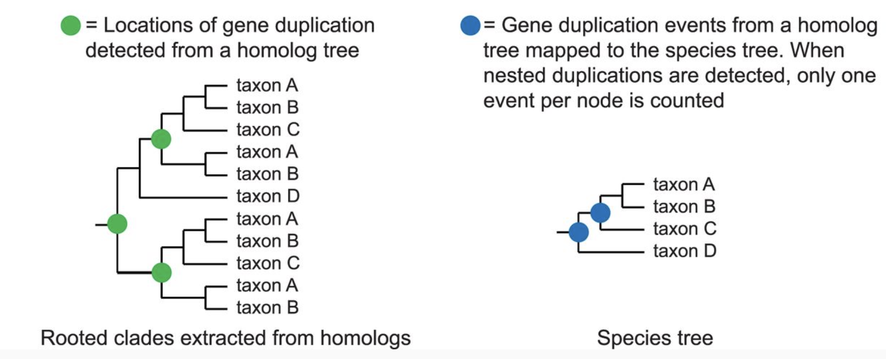

## Table of contents

* [Identifying Whole Genome Duplication](#WGD)

#### How to login to the workstation

	ssh -p 22110 USERNAME@10.153.134.10

### Every time you see `$USERNAME` in the example command you need to replace it with you own [USERNAME](https://github.com/dfmoralesb/MPE_tutorials/blob/main/README.md) 

* To avoid having to change the `$USERNAME` for every command you can set a variable to provide the name of it. ***Do this every time you connect to the workstation***

	For example for me Diego my user name is `mpemaster`
	
		USERNAME=mpemaster

## Identifying Whole Genome Duplication using a tree-based approach

* We are going to map gene duplications based on the method of Yang et al. 2015. For more details see [here](https://academic.oup.com/mbe/article/32/8/2001/2925547)

	To map polyploidy events in the reference tree, first extracted orthogroups are extracted from each homolog tree. When two or more taxa overlapped between the two daughter clades, a gene duplication event is recorded to the most recent common ancestor (MRCA) on the subclade species tree. In this procedure, each node on a species tree can be counted at most once per orthogroup to avoid nested gene duplications inflating the number of duplications scored. 

	
	

