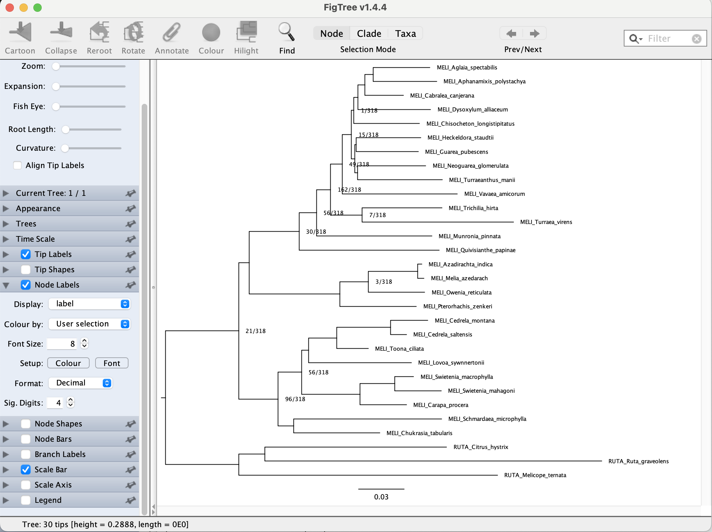
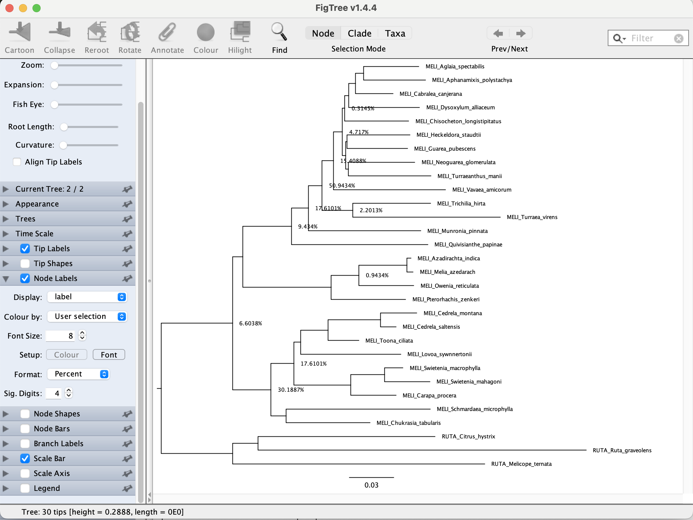
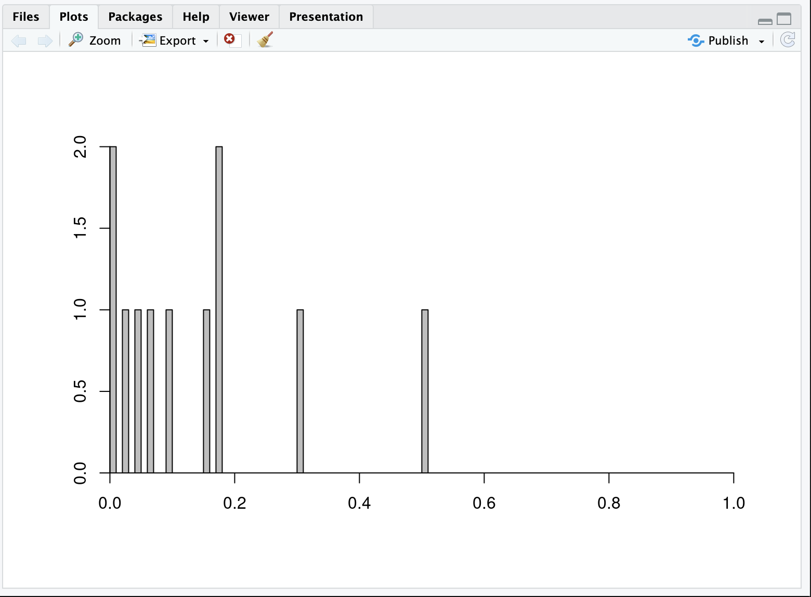
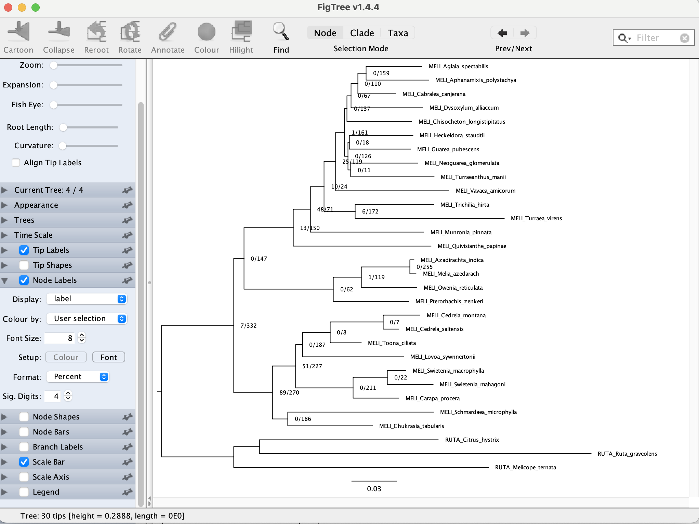
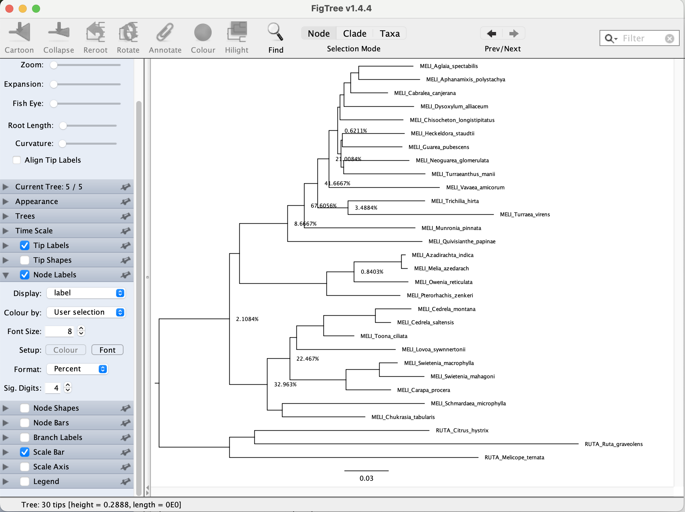
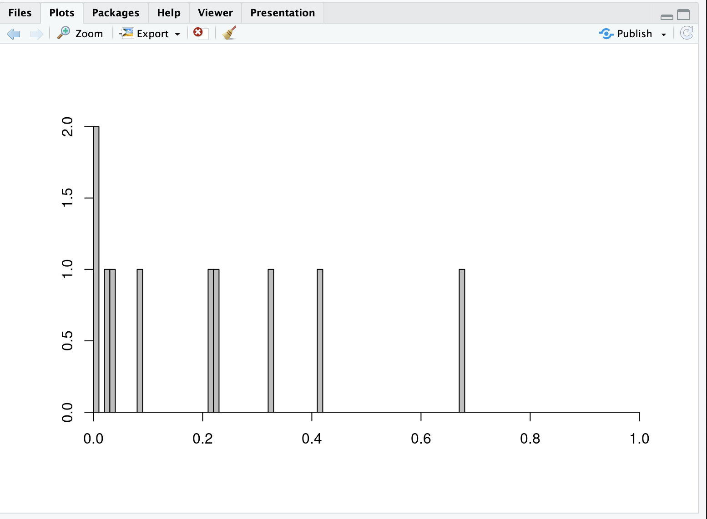

## Table of contents

* [Identifying Whole Genome Duplication](#WGD)
* [Extracting orthogroups](#ortho)
* [Mapping gene duplications - filter base on bootstrap](#mrca)
* [Mapping gene duplications - filter base on concordant clades](#concon)

#### How to login to the workstation

	ssh -p 22110 USERNAME@10.153.134.10

### Every time you see `$USERNAME` in the example command, you need to replace it with your own [USERNAME](https://github.com/dfmoralesb/MPE_tutorials/blob/main/README.md) 

* To avoid having to change the `$USERNAME` for every command, you can set a variable to provide the name of it. ***Do this every time you connect to the workstation***

	For example, for me, Diego, my user name is `mpemaster`
	
		USERNAME=mpemaster

## Identifying Whole Genome Duplication using a tree-based approach

* We are going to map gene duplications based on the method of Yang et al. 2015. For more details, see [here](https://academic.oup.com/mbe/article/32/8/2001/2925547)

	To map polyploidy events in the reference tree, first extracted orthogroups are extracted from each homolog tree. When two or more taxa overlap between the two daughter clades, a gene duplication event is recorded to the most recent common ancestor (MRCA) on the subclade species tree. In this procedure, each node on a species tree can be counted at most once per orthogroup to avoid nested gene duplications inflating the number of duplications scored. 

	
	

	

## Extracting orthogroups
	
* We first need to extract rooted orthogroups from homolog trees

	Orthogroups are rooted ingroup lineages separated by outgroups that include the complete set of genes in a lineage from a single copy in their common ancestor.

	We are going to use the final homolog trees from the Phylogenomics tutorial. This files are located in `/data_tmp/$USERNAME/output/04_analyses/07_final_homologs`
	
	The script to extract orthogroups is `/data_tmp/$USERNAME/script/extract_clades.py`
	
		python /data_tmp/$USERNAME/script/extract_clades.py

	You should see
	
		Usage:
		python extract_clades.py inDIR treefileending outDIR MIN_INGROUP_TAXA in_out output_name
		
	It requires the homolog trees directory, the file extension for the tree files, the minimum number of taxa (same as before; we can use 8 as we did for orthology inference), the table assigning taxa to the ingroup or outgroup (the same you use for orthology inference), and an output extension file.
	
	Let's make a new directory for the analyses and for the orthogroups
	
		cd /data_tmp/$USERNAME/data/07_phylogenomic_analyses
		
		mkdir -p 13_wdg/00_orthogroups
		
		cd 13_wdg/
		
	Now, let's extract the orthogroups
	
		python /data_tmp/$USERNAME/script/extract_clades.py /data_tmp/$USERNAME/output/04_analyses/07_final_homologs treefile 00_orthogroups 8 ../in_out_list.txt orthogroup
		
	You should see 
	
		27 ingroup taxa and 3 outgroup taxa read
		Ingroups: ['MELI_Aglaia_spectabilis', 'MELI_Aphanamixis_polystachya', 'MELI_Azadirachta_indica', 'MELI_Cabralea_canjerana', 'MELI_Carapa_procera', 'MELI_Cedrela_montana', 'MELI_Cedrela_saltensis', 'MELI_Chisocheton_longistipitatus', 'MELI_Chukrasia_tabularis', 'MELI_Dysoxylum_alliaceum', 'MELI_Guarea_pubescens', 'MELI_Heckeldora_staudtii', 'MELI_Lovoa_sywnnertonii', 'MELI_Melia_azedarach', 'MELI_Munronia_pinnata', 'MELI_Neoguarea_glomerulata', 'MELI_Owenia_reticulata', 'MELI_Pterorhachis_zenkeri', 'MELI_Quivisianthe_papinae', 'MELI_Schmardaea_microphylla', 'MELI_Swietenia_macrophylla', 'MELI_Swietenia_mahagoni', 'MELI_Toona_ciliata', 'MELI_Trichilia_hirta', 'MELI_Turraeanthus_manii', 'MELI_Turraea_virens', 'MELI_Vavaea_amicorum']
		Outgroups: ['RUTA_Citrus_hystrix', 'RUTA_Melicope_ternata', 'RUTA_Ruta_graveolens']
		5116.iqtree.treefile
		1 clades extracted
		5163.iqtree.treefile
		1 clades extracted
		6483.iqtree.treefile
		...
		
	Now you can count to see how many orthogroups you extracted
	
		ls 00_orthogroups/*.orthogroup | wc -l
		
	It should be `335`
	

## Mapping gene duplications - filter based on bootstrap support

	
* Now, you can map the orthogroups to the reference map. In this case, we will use the rooted concatenated tree from the previous tutorial (the one you rooted for Phyparts) `meliaceae_MO_500_8_concat_IQtree.treefile.rr`

	This script will filter orthogroups by requiring an average bootstrap percentage of each orthogroup to be at least 70% 

	The script you will use is `/data_tmp/$USERNAME/script/extract_clades.py/map_dups_mrca.py`
	
		python /data_tmp/$USERNAME/script/map_dups_mrca.py
		
	Now you will see
	
		Usage:
		python map_dups.py incladeDIR rooted_spTree min_taxa outname
		
	The script requires the directory with the orthogroups from the previous step, the rooted reference tree, the minimum number of taxa (same number as in the previous step), and an output name.
	
	Let's map the genome duplications now.
	
		python /data_tmp/$USERNAME/script/map_dups_mrca.py 00_orthogroups/ /data_tmp/$USERNAME/data/07_phylogenomic_analyses/12_phyparts/meliaceae_MO_500_8_concat_IQtree.treefile.rr 8 meliaceae_wgd_mrca
		
	You should start seeing:
	
		7313.iqtree.treefile.1.orthogroup
		Number of taxa: 24
		Average bootstrap support: 89.9230769231
		6056.iqtree.treefile.1.orthogroup
		Number of taxa: 9
		Average bootstrap support: 88.25
		7628.iqtree.treefile.1.orthogroup
		Number of taxa: 21
		Average bootstrap support: 87.7666666667
		...
		
	You will see there if any orthogroup fails the filter and the number of ingroup taxa in the orthogroup
	
		ls 
	
	You can see the output files `dup_count_filter70_global.meliaceae_wgd_mrca` and `dup_perc_filter70_global.meliaceae_wgd_mrca` The first will show the number of genes that are duplicated and the other the same but in percentage.
	
		cat  dup_count_filter70_global.meliaceae_wgd_mrca
		
	You will see
	
		((((((((((((MELI_Aglaia_spectabilis:0.0375885764,MELI_Aphanamixis_polystachya:0.0419670632):0.0056021936,MELI_Cabralea_canjerana:0.025582682):0.0046142662,MELI_Dysoxylum_alliaceum:0.0482585193):0.002629005,MELI_Chisocheton_longistipitatus:0.0434381144)1/318:0.0016593652,((MELI_Heckeldora_staudtii:0.0427502585,MELI_Guarea_pubescens:0.0411445158):0.0007827064,(MELI_Neoguarea_glomerulata:0.0451238849,MELI_Turraeanthus_manii:0.0560241287):0.0018363755):0.0023701151)15/318:0.0060012439,MELI_Vavaea_amicorum:0.0762391468)49/318:0.0077188462,(MELI_Trichilia_hirta:0.0527954546,MELI_Turraea_virens:0.1002290411)7/318:0.0208684956)162/318:0.0092840998,MELI_Munronia_pinnata:0.0763143712)56/318:0.0115924912,MELI_Quivisianthe_papinae:0.0927838334)30/318:0.0330980586,(((MELI_Azadirachta_indica:0.0028085964,MELI_Melia_azedarach:0.0042547263):0.0325065738,MELI_Owenia_reticulata:0.0372445257)3/318:0.0189203949,MELI_Pterorhachis_zenkeri:0.0506308134):0.0601215172):0.0068608865,((((MELI_Toona_ciliata:0.0209736796,(MELI_Cedrela_montana:0.0246820354,MELI_Cedrela_saltensis:0.0106038088):0.0356809672):0.0186519042,MELI_Lovoa_sywnnertonii:0.0681119901):0.0045679476,((MELI_Swietenia_macrophylla:0.0124428947,MELI_Swietenia_mahagoni:0.0307433133):0.0231644117,MELI_Carapa_procera:0.0308532123):0.0385898559)56/318:0.0154981841,(MELI_Schmardaea_microphylla:0.0977996692,MELI_Chukrasia_tabularis:0.0568456093):0.0103559063)96/318:0.0261171806)21/318:0.0484817959,(RUTA_Melicope_ternata:0.1713673116,(RUTA_Citrus_hystrix:0.1203095997,RUTA_Ruta_graveolens:0.2229865468):0.0173378156):0.0484817959):0;
	
	Plot the tree in Figtree and show the node labels.
	
	

	
	The same goes for the other tree. Show the node labels as percentages.
	
		cat dup_perc_filter70_global.meliaceae_wgd_mrca
	
	You will see
	
		((((((((((((MELI_Aglaia_spectabilis:0.0375885764,MELI_Aphanamixis_polystachya:0.0419670632):0.0056021936,MELI_Cabralea_canjerana:0.025582682):0.0046142662,MELI_Dysoxylum_alliaceum:0.0482585193):0.002629005,MELI_Chisocheton_longistipitatus:0.0434381144)0.00314465408805:0.0016593652,((MELI_Heckeldora_staudtii:0.0427502585,MELI_Guarea_pubescens:0.0411445158):0.0007827064,(MELI_Neoguarea_glomerulata:0.0451238849,MELI_Turraeanthus_manii:0.0560241287):0.0018363755):0.0023701151)0.0471698113208:0.0060012439,MELI_Vavaea_amicorum:0.0762391468)0.154088050314:0.0077188462,(MELI_Trichilia_hirta:0.0527954546,MELI_Turraea_virens:0.1002290411)0.0220125786164:0.0208684956)0.509433962264:0.0092840998,MELI_Munronia_pinnata:0.0763143712)0.176100628931:0.0115924912,MELI_Quivisianthe_papinae:0.0927838334)0.0943396226415:0.0330980586,(((MELI_Azadirachta_indica:0.0028085964,MELI_Melia_azedarach:0.0042547263):0.0325065738,MELI_Owenia_reticulata:0.0372445257)0.00943396226415:0.0189203949,MELI_Pterorhachis_zenkeri:0.0506308134):0.0601215172):0.0068608865,((((MELI_Toona_ciliata:0.0209736796,(MELI_Cedrela_montana:0.0246820354,MELI_Cedrela_saltensis:0.0106038088):0.0356809672):0.0186519042,MELI_Lovoa_sywnnertonii:0.0681119901):0.0045679476,((MELI_Swietenia_macrophylla:0.0124428947,MELI_Swietenia_mahagoni:0.0307433133):0.0231644117,MELI_Carapa_procera:0.0308532123):0.0385898559)0.176100628931:0.0154981841,(MELI_Schmardaea_microphylla:0.0977996692,MELI_Chukrasia_tabularis:0.0568456093):0.0103559063)0.301886792453:0.0261171806)0.0660377358491:0.0484817959,(RUTA_Melicope_ternata:0.1713673116,(RUTA_Citrus_hystrix:0.1203095997,RUTA_Ruta_graveolens:0.2229865468):0.0173378156):0.0484817959):0;

	

	
* Now, we will plot the gene duplication in the reference trees and identify an outlier that could be a WGD. An outlier can be considered a gene duplication percentage above 20% based on Yang et al. 2015

	For this, you will use the script `/data_tmp/$USERNAME/script/plot_branch_labels.py`
	
		python /data_tmp/$USERNAME/script/plot_branch_labels.py
		
	You will see
	
	Usage:
	python plot_branch_labels.py treefile
	
	It requires the output file with percentages `dup_perc_filter70_global.meliaceae_wgd_mrca`
	
		python /data_tmp/$USERNAME/script/plot_branch_labels.py dup_perc_filter70_global.meliaceae_wgd_mrca
		
	You should see
	
		0.00314465408805
		0.0471698113208
		0.154088050314
		0.0220125786164
		0.509433962264
		0.176100628931
		0.0943396226415
		0.00943396226415
		0.176100628931
		0.301886792453
		0.0660377358491
		output written to dup_perc_filter70_global.meliaceae_wgd_mrca.branch_labels
		
	`dup_perc_filter70_global.meliaceae_wgd_mrca.branch_labels` is the output file
		
	Now open RStudio, your internet browser, again by typing `10.153.134.10:8787` and log in with your workstation credentials.
	
	In the console (bottom) type
	
		setwd ("/data_tmp/$USERNAME/data/07_phylogenomic_analyses/13_wdg/")
		a=read.table('dup_perc_filter70_global.meliaceae_wgd_mrca.branch_labels')
		hist(a[,1],breaks=60,col='grey',xlab='',ylab='',main='',axes=FALSE,xlim=c(0,1))
		axis(1,pos=0)
		axis(2,pos=0)
		
	You should see
	
	

	

## Mapping gene duplications - filter based on concordant clades

* Alternatively, we can also map orthogroups by filtering them by concordant clades.

  	This is a local topology filter that only maps a gene duplication event when the sister clade of the gene duplication node in the orthogroup contained a subset of the taxa in the corresponding sister clade in the reference tree. For me detail about this see [Cannon et al. 2015](https://doi.org/10.1093/molbev/msu296) or [Li et al. 2015](https://doi.org/10.1126/sciadv.1501084)
  
  	The script for this mapping is `/data_tmp/$USERNAME/script/map_dups_concordant.py`
  
  		python /data_tmp/$USERNAME/script/map_dups_concordant.py
  	
 	 You should see
  
 	 	Usage:
 	 	python map_dups_concordant.py incladeDIR rooted_spTree outname
 	 	
 	 The script needs the same orthogroup directory as before, the reference tree, and the output name.
  
 	 Let's run the script.
  
 	 	python /data_tmp/$USERNAME/script/map_dups_concordant.py 00_orthogroups/ /data_tmp/$USERNAME/data/07_phylogenomic_analyses/12_phyparts/meliaceae_MO_500_8_concat_IQtree.treefile.rr meliaceae_wgd_concordant

	 You should start seeing
 
 		7313.iqtree.treefile.1.orthogroup
		14 nodes concordant, among which 2 duplications detected
		6056.iqtree.treefile.1.orthogroup
		1 nodes concordant, among which 0 duplications detected
		7628.iqtree.treefile.1.orthogroup
		9 nodes concordant, among which 1 duplications detected
		5933.iqtree.treefile.1.orthogroup
		13 nodes concordant, among which 1 duplications detected
		5977.iqtree.treefile.1.orthogroup
		12 nodes concordant, among which 0 duplications detected
		...

	In the screen, you can see how many concordant nodes have been mapped
	
	The output files are `dup_count_concord.meliaceae_wgd_concordant` and `dup_perc_concord.meliaceae_wgd_concordant`
	
	You can open and plot them as you did for the previous mapping.
	
		cat  dup_count_concord.meliaceae_wgd_concordant
		
	You will see
	
		((((((((((((MELI_Aglaia_spectabilis:0.0375885764,MELI_Aphanamixis_polystachya:0.0419670632)0/159:0.0056021936,MELI_Cabralea_canjerana:0.025582682)0/110:0.0046142662,MELI_Dysoxylum_alliaceum:0.0482585193)0/67:0.002629005,MELI_Chisocheton_longistipitatus:0.0434381144)0/137:0.0016593652,((MELI_Heckeldora_staudtii:0.0427502585,MELI_Guarea_pubescens:0.0411445158)0/18:0.0007827064,(MELI_Neoguarea_glomerulata:0.0451238849,MELI_Turraeanthus_manii:0.0560241287)0/11:0.0018363755)0/126:0.0023701151)1/161:0.0060012439,MELI_Vavaea_amicorum:0.0762391468)25/119:0.0077188462,(MELI_Trichilia_hirta:0.0527954546,MELI_Turraea_virens:0.1002290411)6/172:0.0208684956)10/24:0.0092840998,MELI_Munronia_pinnata:0.0763143712)48/71:0.0115924912,MELI_Quivisianthe_papinae:0.0927838334)13/150:0.0330980586,(((MELI_Azadirachta_indica:0.0028085964,MELI_Melia_azedarach:0.0042547263)0/255:0.0325065738,MELI_Owenia_reticulata:0.0372445257)1/119:0.0189203949,MELI_Pterorhachis_zenkeri:0.0506308134)0/62:0.0601215172)0/147:0.0068608865,((((MELI_Toona_ciliata:0.0209736796,(MELI_Cedrela_montana:0.0246820354,MELI_Cedrela_saltensis:0.0106038088)0/7:0.0356809672)0/8:0.0186519042,MELI_Lovoa_sywnnertonii:0.0681119901)0/187:0.0045679476,((MELI_Swietenia_macrophylla:0.0124428947,MELI_Swietenia_mahagoni:0.0307433133)0/22:0.0231644117,MELI_Carapa_procera:0.0308532123)0/211:0.0385898559)51/227:0.0154981841,(MELI_Schmardaea_microphylla:0.0977996692,MELI_Chukrasia_tabularis:0.0568456093)0/186:0.0103559063)89/270:0.0261171806)7/332:0.0484817959,(RUTA_Melicope_ternata:0.1713673116,(RUTA_Citrus_hystrix:0.1203095997,RUTA_Ruta_graveolens:0.2229865468):0.0173378156):0.0484817959):0;	
	
	Plot the tree in Figtree and show the node labels.
	
	

	
	The same goes for the other tree. Show the node labels as percentages.
	
		cat dup_perc_concord.meliaceae_wgd_concordant
	
	You will see
	
		((((((((((((MELI_Aglaia_spectabilis:0.0375885764,MELI_Aphanamixis_polystachya:0.0419670632):0.0056021936,MELI_Cabralea_canjerana:0.025582682):0.0046142662,MELI_Dysoxylum_alliaceum:0.0482585193):0.002629005,MELI_Chisocheton_longistipitatus:0.0434381144):0.0016593652,((MELI_Heckeldora_staudtii:0.0427502585,MELI_Guarea_pubescens:0.0411445158):0.0007827064,(MELI_Neoguarea_glomerulata:0.0451238849,MELI_Turraeanthus_manii:0.0560241287):0.0018363755):0.0023701151)0.00621118012422:0.0060012439,MELI_Vavaea_amicorum:0.0762391468)0.210084033613:0.0077188462,(MELI_Trichilia_hirta:0.0527954546,MELI_Turraea_virens:0.1002290411)0.0348837209302:0.0208684956)0.416666666667:0.0092840998,MELI_Munronia_pinnata:0.0763143712)0.676056338028:0.0115924912,MELI_Quivisianthe_papinae:0.0927838334)0.0866666666667:0.0330980586,(((MELI_Azadirachta_indica:0.0028085964,MELI_Melia_azedarach:0.0042547263):0.0325065738,MELI_Owenia_reticulata:0.0372445257)0.00840336134454:0.0189203949,MELI_Pterorhachis_zenkeri:0.0506308134):0.0601215172):0.0068608865,((((MELI_Toona_ciliata:0.0209736796,(MELI_Cedrela_montana:0.0246820354,MELI_Cedrela_saltensis:0.0106038088):0.0356809672):0.0186519042,MELI_Lovoa_sywnnertonii:0.0681119901):0.0045679476,((MELI_Swietenia_macrophylla:0.0124428947,MELI_Swietenia_mahagoni:0.0307433133):0.0231644117,MELI_Carapa_procera:0.0308532123):0.0385898559)0.224669603524:0.0154981841,(MELI_Schmardaea_microphylla:0.0977996692,MELI_Chukrasia_tabularis:0.0568456093):0.0103559063)0.32962962963:0.0261171806)0.0210843373494:0.0484817959,(RUTA_Melicope_ternata:0.1713673116,(RUTA_Citrus_hystrix:0.1203095997,RUTA_Ruta_graveolens:0.2229865468):0.0173378156):0.0484817959):0;
	
	

	
	As before, let's plot the WGD to see outliers.
	
		python /data_tmp/$USERNAME/script/plot_branch_labels.py dup_perc_concord.meliaceae_wgd_concordant

	You can see
	
		0.00621118012422
		0.210084033613
		0.0348837209302
		0.416666666667
		0.676056338028
		0.0866666666667
		0.00840336134454
		0.224669603524
		0.32962962963
		0.0210843373494
		output written to dup_perc_concord.meliaceae_wgd_concordant.branch_labels
		
	Now go back to RStudio and plot the percentages.
	
		b=read.table('dup_perc_concord.meliaceae_wgd_concordant.branch_labels')
		hist(b[,1],breaks=60,col='grey',xlab='',ylab='',main='',axes=FALSE,xlim=c(0,1))
		axis(1,pos=0)
		axis(2,pos=0)
		
	

	
	#### Compare both gene duplication results and see if there are any differences. 

		
	
		
	
	
	

	
	
	
